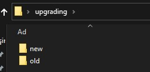
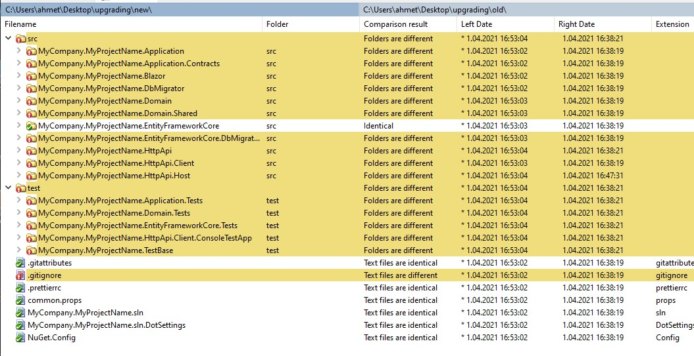
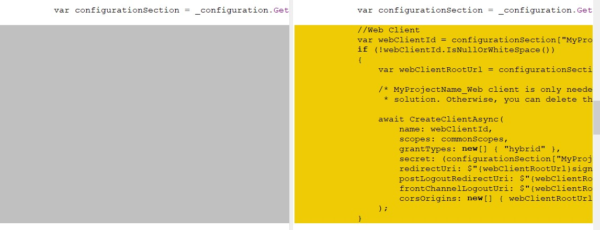

# How to find differences and update template

The application template may have changes with new versions. We explain all changes in the migration guides and how to apply them in your application.

However, you can find all changes easily with comparing two templates.

To compare two different template, you need a comparer tool, I will use [WinMerge](https://winmerge.org/) but you can use any alternative comparer tool.

## Creating Templates

To find differences between two version of templates, we need to create two templates.
You should create templates that has same options with your actual application.

For example, if your application is using `MongoDb`, you should create templates with `MongoDb` provider.
If your application is using Blazor for UI, you should create templates with Blazor UI.

In this scenario, I will upgrade my ABP Application with Blazor UI & Entity Framework from `4.2.0` to `4.3.0-rc.1`.

Create a new folder and open the directory with the command prompt.

- Create current version of template

  ```bash
  abp new MyCompany.MyProjectName -t app --ui blazor --version 4.2.0 -o old
  ```

  It will create same fresh template of my application in the `old` directory.

- Create new version of template

  ```bash
   abp new MyCompany.MyProjectName -t app --ui blazor --version 4.3.0-rc.1 -o new
  ```

  It will create same fresh template of my application in the `new` directory.

  

## Updating to new version

We've created two different templates, now we need to upgrade the old version template to newest version.

Open the `old` directory with the command promt.

Cast

```bash
abp update --version 4.3.0-rc.1
```

It will upgrade the old version template to my desired newest version.

## Finding differences

Now, I have two different project with the same version.
`Old` directory contains a fresh project that upgraded with `abp update`.
`New` directory contains a fresh project that downloaded.

Now, let's check other differences.

I select two different folder in my comparer tool and wait the comparision.

For this scenario, I have tons of differences between them.



First, you can see the `.gitignore` file is changed with the new template.

When I open the file, I can see following lines have been added.

```
src/MyCompany.MyProjectName.Blazor.Server/Logs/*
src/MyCompany.MyProjectName.Blazor.Server.Tiered/Logs/*
```

Another example is,
`MyCompany.MyProjectName.Domain\IdentityServer\IdentityServerDataSeedContributor.cs`
When I open the difference view, I can see easiliy the changes.



Here, `Web Client` is removed from `IdentityServerDataSeedContributor.cs` with the new version.

## Result

With that way, you can find all differences between templates with different versions. It will be easy to upgrade your solutions and inspecting changes locally.
