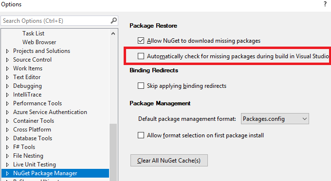

# ABP

This project is the next generation of the [ASP.NET Boilerplate](https://aspnetboilerplate.com/) web application framework. See [the announcement](https://abp.io/blog/abp/Abp-vNext-Announcement).

See the official [web site (abp.io)](https://abp.io/) for more information.

### Status

This project is in **very early preview** stage and it's not suggested to use it in a real project. 

### Documentation

See the <a href="https://abp.io/documents/" target="_blank">documentation</a>.

### How to Build

- Run the `build-all.ps1`. It will build all the solutions in this repository.

### Development

#### Pre Requirements

- Visual Studio 2017 15.9.0+

#### Framework

Framework solution is located under the `framework` folder. It has no external dependency. Just open `Volo.Abp.sln` by Visual Studio and start the development.

#### Modules/Templates

[Modules](modules/) and [Templates](templates/) have their own solutions and have **local references** to the framework. Unfortunately, Visual Studio has some problems with local references to projects those are out of the solution. As a workaround, you should follow the steps below in order to start developing a module/template:

- Disable "*Automatically check for missing packages during build in Visual Studio*" in the Visual Studio options.

- When you open a solution, first run `dotnet restore` in the root folder of the solution.
- When you change a dependency of a project (or any of the dependencies of your projects change their dependencies), run `dotnet restore` again.

### Contribution

ABP is an open source platform. Check [the contribution guide](docs/en/Contribution/Index.md) if you want to contribute to the project.
