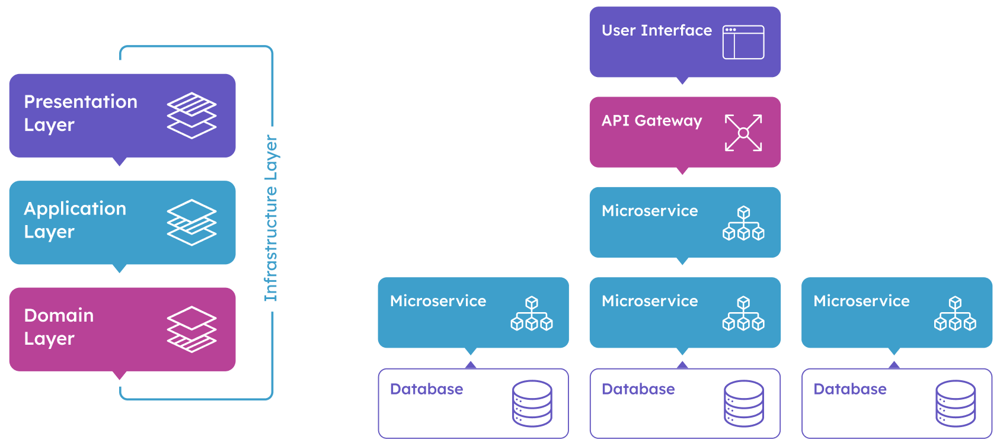

# ABP Framework


[](https://codecov.io/gh/abpframework/abp)
[](https://www.nuget.org/packages/Volo.Abp.Core)
[](https://www.nuget.org/packages/Volo.Abp.Core)
[](https://docs.abp.io/en/abp/latest/Nightly-Builds)
[](https://www.nuget.org/packages/Volo.Abp.Core)

ABP Framework is a complete **infrastructure** based on the **ASP.NET Core** to create **modern web applications** and **APIs** by following the software development **best practices** and the **latest technologies**.

## Getting Started

- [Quick Start](https://docs.abp.io/en/abp/latest/Tutorials/Todo/Index) is a single-part, quick-start tutorial to build a simple application with the ABP Framework. Start with this tutorial if you want to quickly understand how ABP works.
- [Getting Started guide](https://docs.abp.io/en/abp/latest/Getting-Started) can be used to create and run ABP based solutions with different options and details.
- [Web Application Development Tutorial](https://docs.abp.io/en/abp/latest/Tutorials/Part-1) is a complete tutorial to develop a full stack web application with all aspects of a real-life solution.

### Quick Start

Install the ABP CLI:

````bash
> dotnet tool install -g Volo.Abp.Cli
````

Create a new solution:

````bash
> abp new BookStore -u mvc -d ef
````

> See the [CLI documentation](https://docs.abp.io/en/abp/latest/CLI) for all available options.

### UI Framework Options


### Database Provider Options


## What ABP Provides?

ABP provides a **full stack developer experience**.

### Architecture



ABP offers a complete, **modular** and **layered** software architecture based on **[Domain Driven Design](https://docs.abp.io/en/abp/latest/Domain-Driven-Design)** principles and patterns. It also provides the necessary infrastructure and guiding to [implement this architecture](https://docs.abp.io/en/abp/latest/Domain-Driven-Design-Implementation-Guide).

ABP Framework is suitable for **[microservice solutions](https://docs.abp.io/en/abp/latest/Microservice-Architecture)** as well as monolithic applications.

### Infrastructure

There are a lot of features provided by the ABP Framework to achieve real world scenarios easier, like [Event Bus](https://docs.abp.io/en/abp/latest/Event-Bus), [Background Job System](https://docs.abp.io/en/abp/latest/Background-Jobs), [Audit Logging](https://docs.abp.io/en/abp/latest/Audit-Logging), [BLOB Storing](https://docs.abp.io/en/abp/latest/Blob-Storing), [Data Seeding](https://docs.abp.io/en/abp/latest/Data-Seeding), [Data Filtering](https://docs.abp.io/en/abp/latest/Data-Filtering), etc.

### Cross Cutting Concerns

ABP also simplifies (and even automates wherever possible) cross cutting concerns and common non-functional requirements like [Exception Handling](https://docs.abp.io/en/abp/latest/Exception-Handling), [Validation](https://docs.abp.io/en/abp/latest/Validation), [Authorization](https://docs.abp.io/en/abp/latest/Authorization), [Localization](https://docs.abp.io/en/abp/latest/Localization), [Caching](https://docs.abp.io/en/abp/latest/Caching), [Dependency Injection](https://docs.abp.io/en/abp/latest/Dependency-Injection), [Setting Management](https://docs.abp.io/en/abp/latest/Settings), etc.

### Application Modules

ABP is a modular framework and the Application Modules provide **pre-built application functionalities**;

- [**Account**](https://docs.abp.io/en/abp/latest/Modules/Account): Provides UI for the account management and allows user to login/register to the application.
- **[Identity](https://docs.abp.io/en/abp/latest/Modules/Identity)**: Manages organization units, roles, users and their permissions, based on the Microsoft Identity library.
- [**IdentityServer**](https://docs.abp.io/en/abp/latest/Modules/IdentityServer): Integrates to IdentityServer4.
- [**Tenant Management**](https://docs.abp.io/en/abp/latest/Modules/Tenant-Management): Manages tenants for a [multi-tenant](https://docs.abp.io/en/abp/latest/Multi-Tenancy) (SaaS) application.

See the [Application Modules](https://docs.abp.io/en/abp/latest/Modules/Index) document for all pre-built modules.

### Startup Templates

The [Startup templates](https://docs.abp.io/en/abp/latest/Startup-Templates/Index) are pre-built Visual Studio solution templates. You can create your own solution based on these templates to **immediately start your development**.

## ABP Community

### ABP Community Web Site

The [ABP Community](https://community.abp.io/) is a website to publish **articles** and share **knowledge** about the ABP Framework. You can also create content for the community!

### Blog

Follow the [ABP Blog](https://blog.abp.io/) to learn the latest happenings in the ABP Framework.

### Samples

See the [sample projects](https://docs.abp.io/en/abp/latest/Samples/Index) built with the ABP Framework.

### Want to Contribute?

ABP is a community-driven open source project. See [the contribution guide](https://docs.abp.io/en/abp/latest/Contribution/Index) if you want to be a part of this project.

## Official Links

* <a href="https://abp.io/" target="_blank">Main Web Site</a>
  * <a href="https://abp.io/get-started" target="_blank">Get Started</a>
  * <a href="https://abp.io/features" target="_blank">Features</a>
* <a href="https://docs.abp.io/" target="_blank">Documentation</a>
* <a href="https://docs.abp.io/en/abp/latest/Samples/Index" target="_blank">Samples</a>
* <a href="https://blog.abp.io/" target="_blank">Blog</a>
* <a href="https://community.abp.io/" target="_blank">Community</a>
* <a href="https://stackoverflow.com/questions/tagged/abp" target="_blank">Stack overflow</a>
* <a href="https://twitter.com/abpframework" target="_blank">Twitter</a>

## Support the ABP Framework

Love ABP Framework? **Please give a star** to this repository :star:

## Discord Channel

You can use this link to join the ABP Community Discord Server: https://discord.gg/abp

## ABP Commercial

See also [ABP Commercial](https://commercial.abp.io/) if you are looking for pre-built application modules, professional themes, code generation tooling and premium support for the ABP Framework.
