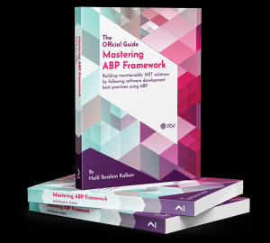

# ABP Framework

 🔹 [](https://codecov.io/gh/abpframework/abp) 🔹 [](https://www.nuget.org/packages/Volo.Abp.Core) 🔹 [](https://www.nuget.org/packages/Volo.Abp.Core) 🔹 [](https://abp.io/docs/latest/release-info/nightly-builds) 🔹 
[](https://www.nuget.org/packages/Volo.Abp.Core) 🔹 [](https://github.com/abpframework/abp/blob/dev/CODE_OF_CONDUCT.md) 🔹 [](https://cla-assistant.io/abpframework/abp) 🔹 [](https://discord.gg/abp)

ABP Framework is a complete **infrastructure** based on **ASP.NET Core** that creates **modern web applications** and **APIs** by following the software development **best practices** and the **latest technologies**.

[](https://abp.io) 

## Getting Started

- [Quick Start](https://abp.io/docs/latest/tutorials/todo) is a single-part, quick-start tutorial to build a simple application with the ABP Framework. Start with this tutorial if you want to understand how ABP works quickly.
- [Getting Started guide](https://abp.io/docs/latest/get-started) can be used to create and run ABP-based solutions with different options and details.
- [Web Application Development Tutorial](https://abp.io/docs/latest/tutorials/book-store) is a complete tutorial on developing a full-stack web application with all aspects of a real-life solution.

### Quick Start

Install the ABP CLI:

````bash
> dotnet tool install -g Volo.Abp.Cli
````

Create a new solution:

````bash
> abp new BookStore -u mvc -d ef
````

> See the [CLI documentation](https://abp.io/docs/latest/cli) for all available options.


### UI Framework Options


### Database Provider Options


## What ABP Provides?

ABP provides a **full stack developer experience**.


### Architecture


ABP offers a complete, **modular** and **layered** software architecture based on **[Domain Driven Design](https://abp.io/docs/latest/framework/architecture/domain-driven-design)** principles and patterns. It also provides the necessary infrastructure and guidance to [implement this architecture](https://abp.io/books/implementing-domain-driven-design).

ABP Framework is suitable for **[microservice solutions](https://abp.io/docs/latest/framework/architecture/microservices)** as well as monolithic applications.


### Infrastructure

There are a lot of features provided by the ABP Framework to achieve real-world scenarios easier, like [Event Bus](https://abp.io/docs/latest/framework/infrastructure/event-bus), [Background Job System](https://abp.io/docs/latest/framework/infrastructure/background-jobs), [Audit Logging](https://abp.io/docs/latest/framework/infrastructure/audit-logging), [BLOB Storing](https://abp.io/docs/latest/framework/infrastructure/blob-storing), [Data Seeding](https://abp.io/docs/latest/framework/infrastructure/data-seeding), [Data Filtering](https://abp.io/docs/latest/framework/infrastructure/data-filtering), etc.


### Cross-Cutting Concerns

ABP also simplifies (and even automates wherever possible) cross-cutting concerns and common non-functional requirements like [Exception Handling](https://abp.io/docs/latest/framework/fundamentals/exception-handling), [Validation](https://abp.io/docs/latest/framework/fundamentals/validation), [Authorization](https://abp.io/docs/latest/framework/fundamentals/authorizationn), [Localization](https://abp.io/docs/latest/framework/fundamentals/localization), [Caching](https://abp.io/docs/latest/framework/fundamentals/caching), [Dependency Injection](https://abp.io/docs/latest/framework/fundamentals/dependency-injection), [Setting Management](https://abp.io/docs/latest/framework/infrastructure/settings), etc.


### Application Modules

ABP is a modular framework and the Application Modules provide **pre-built application functionalities**;

- [**Account**](https://abp.io/docs/latest/modules/account): Provides UI for the account management and allows user to login/register to the application.
- **[Identity](https://abp.io/docs/latest/modules/identity)**: Manages organization units, roles, users and their permissions based on the Microsoft Identity library.
- [**OpenIddict**](https://abp.io/docs/latest/modules/openiddict): Integrates to OpenIddict.
- [**Tenant Management**](https://abp.io/docs/latest/modules/tenant-management): Manages tenants for a [multi-tenant](https://abp.io/docs/latest/framework/architecture/multi-tenancy) (SaaS) application.

See the [Application Modules](https://abp.io/docs/latest/modules) document for all pre-built modules.


### Startup Templates

The [Startup templates](https://abp.io/docs/latest/solution-templates) are pre-built Visual Studio solution templates. You can create your own solution based on these templates to **immediately start your development**.


## Mastering ABP Framework Book

This book will help you to gain a complete understanding of the ABP Framework and modern web application development techniques. It is written by the creator and team lead of the ABP Framework. You can buy from [Amazon](https://www.amazon.com/gp/product/B097Z2DM8Q) or [Packt Publishing](https://www.packtpub.com/product/mastering-abp-framework/9781801079242). Find further info about the book at [abp.io/books/mastering-abp-framework](https://abp.io/books/mastering-abp-framework).




## The Community

### ABP Community Web Site

The [ABP Community](https://abp.io/community) is a website to publish **articles** and share **knowledge** about the ABP Framework. You can also create content for the community!

### Blog

Follow the [ABP Blog](https://abp.io/blog) to learn the latest happenings in the ABP Framework.

### Samples

See the [sample projects](https://abp.io/docs/latest/samples) built with the ABP Framework.

### Want to Contribute?

ABP is a community-driven open-source project. See [the contribution guide](https://abp.io/docs/latest/contribution) if you want to participate in this project.


## Official Links

* [Home Website](https://abp.io)
  * [Get Started](https://abp.io/get-started)
  * [Features](https://abp.io/framework)
* [Documents](https://abp.io/docs/latest)
* [Samples](https://abp.io/docs/latest/samples)
* [Blog](https://abp.io/blog)
* [Community](https://abp.io/community)
* [Stackoverflow](https://stackoverflow.com/questions/tagged/abp)
* [Twitter](https://twitter.com/abpframework)


## Support ABP

GitHub repository stars are an important indicator of popularity and the size of the community. If you like ABP Framework, support us by clicking the star :star: on the repository.


## Discord Server

We have a Discord server where you can chat with other ABP users. Share your ideas, report technical issues, showcase your creations, share the tips that worked for you and catch up with the latest news and announcements about ABP Framework. Join 👉 https://discord.gg/abp.

