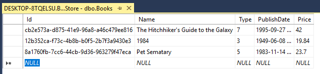
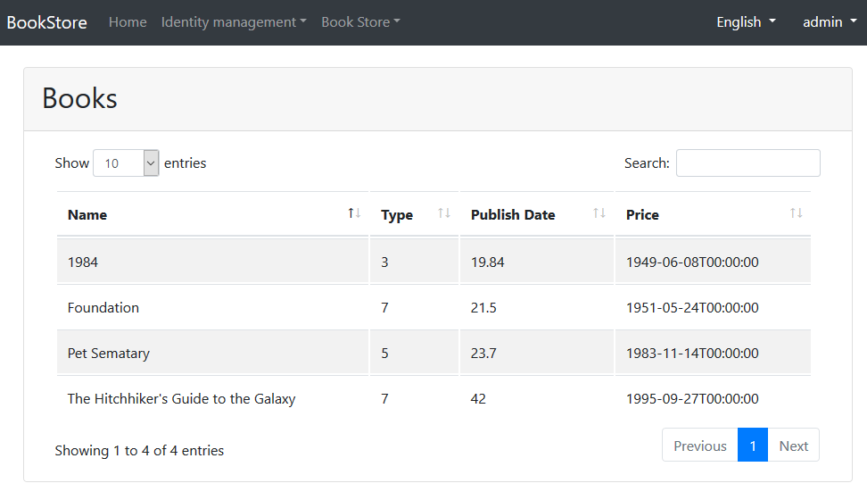

## ASP.NET Core MVC Tutorial - Part I

### About the Tutorial

In this tutorial series, you will build an application that is used to manage a list of books & their authors. **Entity Framework Core** (EF Core) will be used as the ORM provider (as it comes pre-configured with the startup template).

This is the second part of the tutorial series. See all parts:

- **Part I: Create the project and a book list page (this tutorial)**
- [Part II: Create, Update and Delete books](Part-II.md)
- [Part III: Integration Tests](Part-III.md)

You can download the **source code** of the application [from here](https://github.com/volosoft/abp/tree/master/samples/BookStore).

### Creating the Project

This tutorial assumes that you have created a new project, named `Acme.BookStore` from [the startup templates](https://abp.io/Templates).

### Solution Structure

This is the layered solution structure created from the startup template:


### Create the Book Entity

Define [entities](../../Entities.md) in the **domain layer** (`Acme.BookStore.Domain` project) of the solution. The main entity of the application is the `Book`:

````C#
using System;
using System.ComponentModel.DataAnnotations;
using System.ComponentModel.DataAnnotations.Schema;
using Volo.Abp.Domain.Entities;

namespace Acme.BookStore
{
    [Table("Books")]
    public class Book : AggregateRoot<Guid>
    {
        [Required]
        [StringLength(128)]
        public string Name { get; set; }

        public BookType Type { get; set; }

        public DateTime PublishDate { get; set; }

        public float Price { get; set; }
    }
}
````

* ABP has two fundamental base classes for entities: `AggregateRoot` and `Entity`. **Aggregate Roots** are one of the concepts of the **Domain Driven Design (DDD)**. See [entity document](../../Entities.md) for details and best practices.
* Used **data annotation attributes** in this code. You could use EF Core's [fluent mapping API](https://docs.microsoft.com/en-us/ef/core/modeling) instead.

#### BookType Enum

The `BookType` enum used above is defined as below:

````C#
namespace Acme.BookStore
{
    public enum BookType : byte
    {
        Undefined,
        Advanture,
        Biography,
        Dystopia,
        Fantastic,
        Horror,
        Science,
        ScienceFiction,
        Poetry
    }
}
````

#### Add Book Entity to Your DbContext

EF Core requires to relate entities with your DbContext. The easiest way is to add a `DbSet` property to the `BookStoreDbContext` as shown below:

````C#
public class BookStoreDbContext : AbpDbContext<BookStoreDbContext>
{
    public DbSet<Book> Book { get; set; }
    ...
}
````

* `BookStoreDbContext` is located in the `Acme.BookStore.EntityFrameworkCore` project.

#### Add new Migration & Update the Database

Startup template uses [EF Core Code First Migrations](https://docs.microsoft.com/en-us/ef/core/managing-schemas/migrations/) to create and maintain the database schema. Open the **Package Manager Console (PMC)**, select the `Acme.BookStore.EntityFrameworkCore` as the **default project** and execute the following command:


This will create a new migration class inside the `Migrations` folder. Then execute the `Update-Database` command to update the database schema:

````
PM> Update-Database
````

#### Add Sample Data

`Update-Database` command created the `Books` table in the database. Enter a few sample rows, so you can show them on the page:



### Create the Application Service

The next step is to create an [application service](../../Application-Services.md) to manage (create, list, update, delete...) books.

#### BookDto

Create a DTO class named `BookDto` into the `Acme.BookStore.Application` project:

````C#
using System;
using System.ComponentModel.DataAnnotations;
using Volo.Abp.Application.Dtos;

namespace Acme.BookStore
{
    public class BookDto : EntityDto<Guid>
    {
        [Required]
        [StringLength(128)]
        public string Name { get; set; }

        public BookType Type { get; set; }

        public DateTime PublishDate { get; set; }

        public float Price { get; set; }
    }
}
````

* **DTO** classes are used to transfer data between the presentation layer and the application layer. See the [Data Transfer Objects document](../../Data-Transfer-Objects.md) for details.

#### IBookAppService

First, define an interface named `IBookAppService` for the book application service:

````C#
using System;
using Volo.Abp.Application.Services;

namespace Acme.BookStore
{
    public interface IBookAppService : IAsyncCrudAppService<BookDto, Guid>
    {

    }
}
````

* Defining interfaces for application services is <u>not required</u> by the framework. However, it's suggested as a good practice.
* `IAsyncCrudAppService` defines common CRUD methods: `GetAsync`, `GetListAsync`, `CreateAsync`, `UpdateAsync` and `DeleteAsync`. It's not required to extend it. Instead you could inherit from the empty `IApplicationService` interface and define your own methods.
* There are some variations of the `IAsyncCrudAppService`. In this sample, the first generic parameter, `BookDto`, is the DTO used for service methods and the second parameter, `Guid`, is the type of the primary key of the entity.

#### BookAppService

Implement the `IBookAppService` as named `BookAppService`:

````C#
using System;
using Volo.Abp.Application.Services;
using Volo.Abp.Domain.Repositories;

namespace Acme.BookStore
{
    public class BookAppService : AsyncCrudAppService<Book, BookDto, Guid>, IBookAppService
    {
        public BookAppService(IRepository<Book, Guid> repository) 
            : base(repository)
        {

        }
    }
}
````

* `BookAppService` is derived from `AsyncCrudAppService<Book, BookDto, Guid>` which implements all CRUD methods defined above.
* `BookAppService` injects `IRepository<Book, Guid>` which is the default repository created for the `Book` entity. See the [repository document](../../Repositories.md).
* `BookAppService` uses `IObjectMapper` to convert `Book` objects to `BookDto` objects and vice verse. Startup template uses the [AutoMapper](http://automapper.org/) library as the mapping provider. Since you haven't defined any mapping configuration, AutoMapper's [inline mapping](http://automapper.readthedocs.io/en/latest/Inline-Mapping.html) feature is used to automatically configure the mapping. This works fine if both classes have identical properties, but may cause to problems if they not. See the [AutoMapper integration document](../../AutoMapper-Integration.md) for details.

### Auto API Controllers

You normally create **Controllers** to expose application services as **HTTP API** endpoints. Thus, browser or 3rd-party clients can call via AJAX.

ABP can automatically configures your application services as MVC API Controllers by convention.

#### Swagger UI

The startup template is configured to run the [swagger UI](https://swagger.io/tools/swagger-ui/) using the [Swashbuckle.AspNetCore](https://github.com/domaindrivendev/Swashbuckle.AspNetCore) library. Run the application and enter `http://localhost:53929/swagger/` as URL on your browser:


You will see some built-in service endpoints as well as the `Book` service and its REST-style service endpoints.

### Dynamic JavaScript Proxies

It's common to call HTTP API endpoints via AJAX from the **JavaScript** side. You can use `$.ajax` or another tool to call the endpoints. However, ABP offers a better way.

ABP **dynamically** creates JavaScript **proxies** for all API endpoints. So, you can use any **endpoint** just like calling a **JavaScript function**.

#### Testing in the Browser Developer Console

You can just test the JavaScript proxy using your Browser's Developer Console now. Open your browser's **developer tools** (shortcut: F12 key), switch to the **Console** tab, type the following code and press enter:

````js
acme.bookStore.book.getList({}).done(function (result) { console.log(result); });
````

* `acme.bookStore` is the namespace of the `BookAppService` converted to [camelCase](https://en.wikipedia.org/wiki/Camel_case).
* `book` is the conventional name for the `BookAppService` (removed AppService postfix and converted to camelCase).
* `getList` is the conventional name for the `GetListAsync` method defined in the `AsyncCrudAppService` base class (removed Async postfix and converted to camelCase).
* `{}` argument is used to send an empty object to the `GetListAsync` method which normally expects an object of type `PagedAndSortedResultRequestDto` which is used to send paging and sorting options to the server.
* `getList` function returns a `promise`. So, you can pass a callback to the `done` (or `then`) function to get the result from the server.

Running this code produces such an output:


You can see the **book list** returned from the server.

Let's **create a new book** using the `create` function:

````js
acme.bookStore.book.create({
    name: 'Foundation',
    type: 7,
    publishDate: '1951-05-24',
    price: 21.5
}).done(function (result) { 
    console.log('successfully created the book with id: ' + result.id); 
});
````

You should see a message in the console something like that:

````
successfully created the book with id: f3f03580-c1aa-d6a9-072d-39e75c69f5c7
````

Check the `books` table in the database to see the new book row. You can also try `get`, `update` and `delete` functions.

### Create the Books Page

It's time to create something visible! Instead of classic MVC, we will use the new [Razor Pages UI](https://docs.microsoft.com/en-us/aspnet/core/tutorials/razor-pages/razor-pages-start) approach which is recommended by Microsoft.

Create a new `Books` folder under the `Pages` folder of the `Acme.BookStore.Web` project and add a new Razor Page named `Index.html`:


Open the `Index.cshtml` and change the content as shown below:

````html
@page
@using Acme.BookStore.Pages.Books
@inherits Acme.BookStore.Pages.BookStorePageBase
@model IndexModel

<h2>Books</h2>
````

* This page inherits from the `BookStorePageBase` class which comes with the startup template and provides some shared properties/methods used by all pages.

#### Add Books Page to the Main Menu

Open the `BookStoreMenuContributor` class in the `Menus` folder and add the following code to the end of the `ConfigureMainMenuAsync` method:

````c#
context.Menu.AddItem(
    new ApplicationMenuItem("BooksStore", l["Menu:BookStore"])
        .AddItem(new ApplicationMenuItem("BooksStore.Books", l["Menu:Books"], url: "/Books"))
);
````

#### Localizing the Menu Items

Localization texts are located under the `Localization/BookStore` folder of the `Acme.BookStore.Domain` project:


Open the `en.json` file and add localization texts for `Menu:BookStore` and `Menu:Books`  keys:

````json
{
  "culture": "en",
  "texts": {
    //...
    "Menu:BookStore": "Book Store",
    "Menu:Books": "Books"
  }
}
````

* ABP's localization system is built on [ASP.NET Core's standard localization](https://docs.microsoft.com/en-us/aspnet/core/fundamentals/localization) system and extends it in many ways. See the [localization document](../../Localization.md) for details.
* Localization key names are arbitrary, you can set any name. We prefer to add `Menu` namespace for menu items to distinguish from other texts. If a text is not defined in the localization file, it **fallbacks** to the localization key (ASP.NET Core's standard behavior).

Run the application and see the menu items are added to the top bar:


When you click to the Books menu item, you are redirected to the new Books page.

#### Book List

We will use the [Datatables.net](https://datatables.net/) JQuery plugin to show list of tables on the page. Datatables completely works via AJAX, so it is fast and provides a good user experience. Datatables plugin is configured in the startup template, so you can directly use it.

##### Index.cshtml Changes

Change the `Pages/Books/Index.cshtml` as following:

````html
@page
@using Acme.BookStore.Pages.Books
@inherits Acme.BookStore.Pages.BookStorePageBase
@model IndexModel
@section scripts
{
    <abp-script src="/pages/books/index.js" />
}
<abp-card>
    <abp-card-header>
        <h2>@L["Books"]</h2>
    </abp-card-header>
    <abp-card-body>
        <abp-table striped-rows="true" id="BooksTable">
            <thead>
                <tr>
                    <th>@L["Name"]</th>
                    <th>@L["Type"]</th>
                    <th>@L["PublishDate"]</th>
                    <th>@L["Price"]</th>
                </tr>
            </thead>
        </abp-table>
    </abp-card-body>
</abp-card>
````

* `abp-script` [tag helper](https://docs.microsoft.com/en-us/aspnet/core/mvc/views/tag-helpers/intro) is used to add external **scripts** to the page. It has many additional features compared to standard `script` tag. It handles **minification** and **versioning** for example. See the [bundling & minification document](../../AspNetCore/Bundling-Minification.md) for details.
* `abp-card` and `abp-table` are **tag helpers** for Twitter Bootstrap's [card component](http://getbootstrap.com/docs/4.1/components/card/). There are many tag helpers in ABP to easily use most of the [bootstrap](https://getbootstrap.com/) components. You can use regular HTML tags instead of these tag helpers, but using tag helpers reduces HTML code and prevents errors by the help of the intellisense. See the [tag helpers document](../../AspNetCore/Tag-Helpers.md).
* You can **localize** the column names in the localization file as you did for the menu items above.

##### Add a Script File

Create `index.js` JavaScript file under the `wwwroot/pages/books/` folder:


`index.js` content is shown below:

````js
$(function() {
    var dataTable = $('#BooksTable').DataTable({
        ajax: abp.libs.datatables.createAjax(acme.bookStore.book.getList),
        columnDefs: [
            {
                targets: 0,
                data: "name"
            },
            {
                targets: 1,
                data: "type"
            },
            {
                targets: 2,
                data: "price"
            },
            {
                targets: 3,
                data: "publishDate"
            }
        ]
    });
});
````

* `abp.libs.datatables.createAjax` is a helper function to adapt ABP's dynamic JavaScript API proxies to Datatable's format.
* `acme.bookStore.book.getList` is the function to get list of books (you have seen it before).
* See [Datatable's documentation](https://datatables.net/manual/) for more configuration options.

The final UI is shown below:



### Next Part

See the [next part](Part-II.md) of this tutorial.