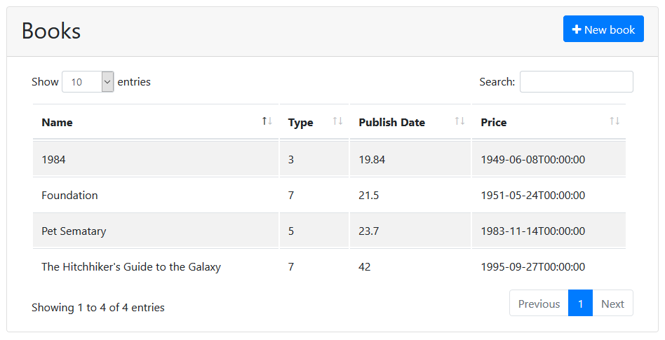

## ASP.NET Core MVC Tutorial - Part II

### About the Tutorial

In this tutorial series, you will build an application that is used to manage a list of books & their authors. **Entity Framework Core** (EF Core) will be used as the ORM provider (as it comes pre-configured with the startup template).

This is the second part of the tutorial series. See all parts:

* [Part I: Create the project and a book list page](Part-I.md)
* **Part II: Create, Update and Delete books (this tutorial)**
* [Part III: Integration Tests](Part-III.md)

You can download the **source code** of the application [from here](https://github.com/volosoft/abp/tree/master/samples/BookStore).

### Creating a New Book

In this section, you will learn how to create a new modal dialog form to create a new book. The result dialog will be like that:


#### Create the Modal Form

Create a new razor page, named `CreateModal.cshtml` under the `Pages/Books` folder of the `Acme.BookStore.Web` project:


##### CreateModal.cshtml.cs

Open the `CreateModal.cshtml.cs` file (`CreateModalModel` class) and replace with the following code:

````C#
using System.Threading.Tasks;
using Microsoft.AspNetCore.Mvc;
using Volo.Abp.AspNetCore.Mvc.UI.RazorPages;

namespace Acme.BookStore.Pages.Books
{
    public class CreateModalModel : BookStorePageModelBase
    {
        [BindProperty]
        public CreateUpdateBookDto Book { get; set; }

        private readonly IBookAppService _bookAppService;

        public CreateModalModel(IBookAppService bookAppService)
        {
            _bookAppService = bookAppService;
        }

        public async Task<IActionResult> OnPostAsync()
        {
            await _bookAppService.CreateAsync(Book);
            return NoContent();
        }
    }
}
````

* This class is derived from the `BookStorePageModelBase` instead of standard `PageModel`. `BookStorePageModelBase` inherits the `PageModel` and adds some common properties/methods those can be used in your page model classes.
* `[BindProperty]` attribute on the `Book` property binds post request data to this property.
* This class simply injects the `IBookAppService` in its constructor and calls the `CreateAsync` method in the `OnPostAsync` handler.

##### CreateModal.cshtml

Open the `CreateModal.cshtml` file and paste the code below:

````html
@page
@inherits Acme.BookStore.Pages.BookStorePageBase
@using Volo.Abp.AspNetCore.Mvc.UI.Bootstrap.TagHelpers.Modal
@model Acme.BookStore.Pages.Books.CreateModalModel
@{
    Layout = null;
}
<abp-dynamic-form abp-model="Book" data-ajaxForm="true" asp-page="/Books/CreateModal">
    <abp-modal>
        <abp-modal-header title="@L["NewBook"].Value"></abp-modal-header>
        <abp-modal-body>
            <abp-form-content />
        </abp-modal-body>
        <abp-modal-footer buttons="@(AbpModalButtons.Cancel|AbpModalButtons.Save)"></abp-modal-footer>
    </abp-modal>
</abp-dynamic-form>
````

* This modal uses `abp-dynamic-form` tag helper to automatically create the form from the `CreateBookViewModel` class.
  * `abp-model` attribute indicates the model object, the `Book` in this case.
  * `data-ajaxForm` attribute makes the form to submit via AJAX, instead of classic page post.
  * `abp-form-content` tag helper is a placeholder to render the form. This is optional and needed only if you added some other content in the `abp-dynamic-form` tag.

#### Add the "New book" Button

Open the `Pages/Books/Index.cshtml` and change the `abp-card-header` tag as shown below:

````html
<abp-card-header>
    <abp-row>
        <abp-column size-md="_6">
            <h2>@L["Books"]</h2>
        </abp-column>
        <abp-column size-md="_6" class="text-right">
            <abp-button id="NewBookButton"
                        text="@L["NewBook"].Value"
                        icon="plus"
                        button-type="Primary" />
        </abp-column>
    </abp-row>
</abp-card-header>
````

Just added a **New book** button to the **top right** of the table:



Open the `wwwroot/pages/books/index.js` and add the following code just after the datatable configuration:

````js
var createModal = new abp.ModalManager(abp.appPath + 'Books/CreateModal');

createModal.onResult(function () {
    dataTable.ajax.reload();
});

$('#NewBookButton').click(function (e) {
    e.preventDefault();
    createModal.open();
});
````

* `abp.ModalManager` is a helper class to open and manage modals in the client side. It internally uses Twitter Bootstrap's standard modal, but abstracts many details by providing a simple API.

Now, you can **run the application** and add new books using the new modal form.

### Updating An Existing Book

Create a new razor page, named `EditModal.cshtml` under the `Pages/Books` folder of the `Acme.BookStore.Web` project:


#### EditModal.cshtml.cs

Open the `EditModal.cshtml.cs` file (`EditModalModel` class) and replace with the following code:

````C#
using System;
using System.Threading.Tasks;
using Microsoft.AspNetCore.Mvc;

namespace Acme.BookStore.Pages.Books
{
    public class EditModalModel : BookStorePageModelBase
    {
        [HiddenInput]
        [BindProperty(SupportsGet = true)]
        public Guid Id { get; set; }

        [BindProperty]
        public CreateUpdateBookDto Book { get; set; }
        
        private readonly IBookAppService _bookAppService;

        public EditModalModel(IBookAppService bookAppService)
        {
            _bookAppService = bookAppService;
        }

        public async Task OnGetAsync()
        {
            var bookDto = await _bookAppService.GetAsync(Id);
            Book = ObjectMapper.Map<BookDto, CreateUpdateBookDto>(bookDto);
        }

        public async Task<IActionResult> OnPostAsync()
        {
            await _bookAppService.UpdateAsync(Id, Book);
            return NoContent();
        }
    }
}
````

* `HiddenInput` and `BindProperty` are standard ASP.NET Core MVC attributes. Used `SupportsGet` to be able to get Id value from query string parameter of the request.
* Mapped `BookDto` (received from the `BookAppService.GetAsync`) to `CreateUpdateBookDto` in the `GetAsync` method.
* The `OnPostAsync` simply uses `BookAppService.UpdateAsync` to update the entity.

#### CreateUpdateBookDto

In order to perform `BookDto` to `CreateUpdateBookDto` object mapping, change the `CreateUpdateBookDto` class as shown below:

````C#
using System;
using System.ComponentModel.DataAnnotations;
using Volo.Abp.AutoMapper;

namespace Acme.BookStore
{
    [AutoMapTo(typeof(Book))]
    [AutoMapFrom(typeof(BookDto))]
    public class CreateUpdateBookDto
    {
        [Required]
        [StringLength(128)]
        [Display(Name = "Name")]
        public string Name { get; set; }

        [Display(Name = "Type")]
        public BookType Type { get; set; } = BookType.Undefined;

        [Display(Name = "PublishDate")]
        public DateTime PublishDate { get; set; }

        [Display(Name = "Price")]
        public float Price { get; set; }
    }
}
````

* Just added the `[AutoMapFrom(typeof(BookDto))]` attribute to create the mapping.

#### EditModal.cshtml

Replace `EditModal.cshtml` content with the following content:

````html
@page
@inherits Acme.BookStore.Pages.BookStorePageBase
@using Acme.BookStore.Pages.Books
@using Volo.Abp.AspNetCore.Mvc.UI.Bootstrap.TagHelpers.Modal
@model EditModalModel
@{
    Layout = null;
}
<abp-dynamic-form abp-model="Book" data-ajaxForm="true" asp-page="/Books/EditModal">
    <abp-modal>
        <abp-modal-header title="@L["Update"].Value"></abp-modal-header>
        <abp-modal-body>
            <abp-input asp-for="Id" />
            <abp-form-content/>
        </abp-modal-body>
        <abp-modal-footer buttons="@(AbpModalButtons.Cancel|AbpModalButtons.Save)"></abp-modal-footer>
    </abp-modal>
</abp-dynamic-form>
````

This page is very similar to the `CreateModal.cshtml` except;

* It includes an `abp-input` for the `Id` property to store id of the editing book.
* It uses `Books/EditModal` as the post URL and *Update* text as the modal header.

#### Add "Actions" Dropdown to the Table

We will add a dropdown button ("Actions") for each row of the table. The final UI looks like this:


Open the `Pages/Books/Index.cshtml` page and change the table section as shown below:

````html
<abp-table striped-rows="true" id="BooksTable">
    <thead>
        <tr>
            <th>@L["Actions"]</th>
            <th>@L["Name"]</th>
            <th>@L["Type"]</th>
            <th>@L["PublishDate"]</th>
            <th>@L["Price"]</th>
            <th>@L["CreationTime"]</th>
        </tr>
    </thead>
</abp-table>
````

* Just added a new `th` tag for the "Actions" button.

Open the `wwwroot/pages/books/index.js` and replace the content as below:

````js
$(function () {

    var l = abp.localization.getResource('BookStore');

    var createModal = new abp.ModalManager(abp.appPath + 'Books/CreateModal');
    var editModal = new abp.ModalManager(abp.appPath + 'Books/EditModal');

    var dataTable = $('#BooksTable').DataTable({
        order: [[1, "asc"]],
        ajax: abp.libs.datatables.createAjax(acme.bookStore.book.getList),
        columnDefs: [
            {
                targets: 0,
                data: null,
                orderable: false,
                autoWidth: false,
                defaultContent: '',
                rowAction: {
                    text: '<i class="fa fa-cog"></i> ' + l('Actions') + 
                          ' <span class="caret"></span>',
                    items:
                        [
                            {
                                text: l('Edit'),
                                visible: function () { return true; },
                                action: function (data) {
                                    editModal.open({
                                        id: data.record.id
                                    });
                                }
                            },
                            {
                                text: l('Delete'),
                                visible: function () { return true; },
                                confirmMessage: function (data) {
                                    return l('BookDeletionConfirmationMessage',
                                             data.record.name);
                                },
                                action: function (data) {
                                    acme.bookStore.book
                                        .delete(data.record.id)
                                        .then(function () {
                                            abp.notify.info(l('SuccessfullyDeleted'));
                                            dataTable.ajax.reload();
                                        });
                                }
                            }
                        ]
                }
            },
            {
                targets: 1,
                data: "name"
            },
            {
                targets: 2,
                data: "type"
            },
            {
                targets: 3,
                data: "publishDate"
            },
            {
                targets: 4,
                data: "price"
            },
            {
                targets: 5,
                data: "creationTime"
            }
        ]
    });

    createModal.onResult(function () {
        dataTable.ajax.reload();
    });

    editModal.onResult(function () {
        dataTable.ajax.reload();
    });

    $('#NewBookButton').click(function (e) {
        e.preventDefault();
        createModal.open();
    });
});
````

* Added a new `ModalManager` named `editModal` to open the edit modal dialog.
* Added a new column at the beginning of the `columnDefs` section. This column is used for the "Actions" dropdown button.
* "Edit" action simply calls `editModal.open` to open the edit dialog.
* Also added a "Delete" button to delete the book.