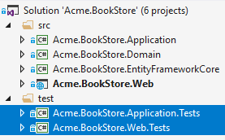

## ASP.NET Core MVC Tutorial - Part III

### About the Tutorial

In this tutorial series, you will build an application that is used to manage a list of books & their authors. **Entity Framework Core** (EF Core) will be used as the ORM provider (as it comes pre-configured with the startup template).

This is the third part of the tutorial series. See all parts:

- [Part I: Create the project and a book list page](Part-I.md)
- [Part II: Create, Update and Delete books](Part-II.md)
- **Part III: Integration Tests (this tutorial)**

You can download the **source code** of the application [from here](https://github.com/volosoft/abp/tree/master/samples/BookStore).

### Test Projects in the Solution

There are two test projects in the solution:



* `Acme.BookStore.Application.Tests` is for unit & integration test projects. You can write tests for application services those are integrated to the framework. It uses **EF Core SQLite in-memory** database.
* `Acme.BookStore.Web.Tests` is for full stack integration tests including the web layer. So, you can write tests for UI too.

Test projects uses the following libraries for testing:

* [xunit](https://xunit.github.io/) as the main test framework.
* [Shoudly](http://shouldly.readthedocs.io/en/latest/) as an assertion library.
* [NSubstitute](http://nsubstitute.github.io/) as a mocking library.

### Adding Test Data

Startup template contains the `BookStoreTestDataBuilder` class in the `Acme.BookStore.Application.Tests` project that creates some data to run tests on. It's shown below:

````C#
using System.Threading.Tasks;
using Volo.Abp.DependencyInjection;
using Volo.Abp.Identity;
using Volo.Abp.Threading;

namespace Acme.BookStore
{
    public class BookStoreTestDataBuilder : ITransientDependency
    {
        private readonly IIdentityDataSeeder _identityDataSeeder;

        public BookStoreTestDataBuilder(IIdentityDataSeeder identityDataSeeder)
        {
            _identityDataSeeder = identityDataSeeder;
        }

        public void Build()
        {
            AsyncHelper.RunSync(BuildInternalAsync);
        }

        public async Task BuildInternalAsync()
        {
            await _identityDataSeeder.SeedAsync("1q2w3E*");
        }
    }
}
````

* It simply uses `IIdentityDataSeeder` which is implemented by the identity module and creates an admin role and admin user. You can use them in the tests.

Change the `BookStoreTestDataBuilder` class as show below:

````C#
using System;
using System.Threading.Tasks;
using Volo.Abp.DependencyInjection;
using Volo.Abp.Domain.Repositories;
using Volo.Abp.Identity;
using Volo.Abp.Threading;

namespace Acme.BookStore
{
    public class BookStoreTestDataBuilder : ITransientDependency
    {
        private readonly IIdentityDataSeeder _identityDataSeeder;
        private readonly IRepository<Book, Guid> _bookRepository;

        public BookStoreTestDataBuilder(
            IIdentityDataSeeder identityDataSeeder,
            IRepository<Book, Guid> bookRepository)
        {
            _identityDataSeeder = identityDataSeeder;
            _bookRepository = bookRepository;
        }

        public void Build()
        {
            AsyncHelper.RunSync(BuildInternalAsync);
        }

        public async Task BuildInternalAsync()
        {
            await _identityDataSeeder.SeedAsync("1q2w3E*");

            await _bookRepository.InsertAsync(
                new Book
                {
                    Id = Guid.NewGuid(),
                    Name = "Test book 1",
                    Type = BookType.Fantastic,
                    PublishDate = new DateTime(2015, 05, 24),
                    Price = 21
                }
            );

            await _bookRepository.InsertAsync(
                new Book
                {
                    Id = Guid.NewGuid(),
                    Name = "Test book 2",
                    Type = BookType.Science,
                    PublishDate = new DateTime(2014, 02, 11),
                    Price = 15
                }
            );
        }
    }
}
````

* Injected `IRepository<Book, Guid>` and used it in the `BuildInternalAsync` to create 2 book entities.

### Testing the BookAppService

Create a test class named `BookAppService_Tests` in the `Acme.BookStore.Application.Tests` project:

````C#
using System.Threading.Tasks;
using Shouldly;
using Volo.Abp.Application.Dtos;
using Xunit;

namespace Acme.BookStore
{
    public class BookAppService_Tests : BookStoreApplicationTestBase
    {
        private readonly IBookAppService _bookAppService;

        public BookAppService_Tests()
        {
            _bookAppService = GetRequiredService<IBookAppService>();
        }

        [Fact]
        public async Task Should_Get_List_Of_Books()
        {
            //Act
            var result = await _bookAppService.GetListAsync(
                new PagedAndSortedResultRequestDto()
            );

            //Assert
            result.TotalCount.ShouldBeGreaterThan(0);
            result.Items.ShouldContain(b => b.Name == "Test book 1");
        }
    }
}
````

* `Should_Get_List_Of_Books` test simply uses `BookAppService.GetListAsync` method to get and check the list of users.

Add a new test that creates a valid new book:

````C#
[Fact]
public async Task Should_Create_A_Valid_Book()
{
    //Act
    var result = await _bookAppService.CreateAsync(
        new CreateUpdateBookDto
        {
            Name = "New test book 42",
            Price = 10,
            PublishDate = DateTime.Now,
            Type = BookType.ScienceFiction
        }
    );

    //Assert
    result.Id.ShouldNotBe(Guid.Empty);
    result.Name.ShouldBe("New test book 42");
}
````

Add a new test that tries to create an invalid book and fails:

````C#
[Fact]
public async Task Should_Not_Create_A_Book_Without_Name()
{
    var exception = await Assert.ThrowsAsync<AbpValidationException>(async () =>
    {
        await _bookAppService.CreateAsync(
            new CreateUpdateBookDto
            {
                Name = "",
                Price = 10,
                PublishDate = DateTime.Now,
                Type = BookType.ScienceFiction
            }
        );
    });

    exception.ValidationErrors
        .ShouldContain(err => err.MemberNames.Any(mem => mem == "Name"));
}
````

* Since the `Name` is set as empty, ABP throws an `AbpValidationException`.

### Testing Web Pages

TODO