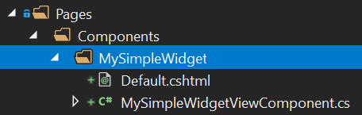

# Widgety

ABP poskytuje model a infastrukturu k vytváření **znovu použitelných widgetů**. Systém widgetů je rozšíření pro [ASP.NET Core pohledové komponenty](https://docs.microsoft.com/en-us/aspnet/core/mvc/views/view-components). Widgety jsou zvláště užitečné, když chcete;

* Mít závislosti na **skriptech & stylech** ve vašem widgetu.
* Vytvářet **řídící panely** za použítí widgetů.
* Definovat widgety v znovu použitelných **[modulech](../Module-Development-Basics.md)**.
* Spolupráci widgetů s **[authorizačními](../Authorization.md)** a **[svazovacími](Bundling-Minification.md)** systémy.

## Základní definice widgetu

### Tvorba pohledové komponenty

Jako první krok, vytvořte běžnou ASP.NET Core pohledovou komponentu:



**MySimpleWidgetViewComponent.cs**:

````csharp
using Microsoft.AspNetCore.Mvc;
using Volo.Abp.AspNetCore.Mvc;

namespace DashboardDemo.Web.Pages.Components.MySimpleWidget
{
    public class MySimpleWidgetViewComponent : AbpViewComponent
    {
        public IViewComponentResult Invoke()
        {
            return View();
        }
    }
}
````

Dědění z `AbpViewComponent` není vyžadováno. Můžete dědit ze standardního ASP.NET Core `ViewComponent`. `AbpViewComponent` pouze definuje pár základních a užitečných vlastnosti.

Můžete vložit službu a pomocí metody `Invoke` z ní získat některá data. Možná budete muset provést metodu Invoke jako asynchronní `public async Task<IViewComponentResult> InvokeAsync()`. Podívejte se na dokument [ASP.NET Core ViewComponents](https://docs.microsoft.com/en-us/aspnet/core/mvc/views/view-components) pro všechna další použítí. 

**Default.cshtml**:

```xml
<div class="my-simple-widget">
    <h2>My Simple Widget</h2>
    <p>This is a simple widget!</p>
</div>
```

### Definice widgetu

Přidejte atribut `Widget` k třídě `MySimpleWidgetViewComponent` pro označení této pohledové komponenty jako widgetu:

````csharp
using Microsoft.AspNetCore.Mvc;
using Volo.Abp.AspNetCore.Mvc;
using Volo.Abp.AspNetCore.Mvc.UI.Widgets;

namespace DashboardDemo.Web.Pages.Components.MySimpleWidget
{
    [Widget]
    public class MySimpleWidgetViewComponent : AbpViewComponent
    {
        public IViewComponentResult Invoke()
        {
            return View();
        }
    }
}
````

## Vykreslení widgetu

Vykreslení widgetu je vcelku standardní. Použijte metodu `Component.InvokeAsync` v razor pohledu/stránce jako s kteroukoliv jinou pohledovou komponentou. Příklady:

````xml
@await Component.InvokeAsync("MySimpleWidget")
@await Component.InvokeAsync(typeof(MySimpleWidgetViewComponent))
````

První přístup používá název widgetu, zatímco druhý používá typ pohledové komponenty.

### Widgety s argumenty

Systém ASP.NET Core pohledových komponent umožňuje přijímat argumenty pro pohledové komponenty. Níže uvedená pohledová komponenta přijímá `startDate` a `endDate` a používá tyto argumenty k získání dat ze služby.

````csharp
using System;
using System.Threading.Tasks;
using Microsoft.AspNetCore.Mvc;
using Volo.Abp.AspNetCore.Mvc;
using Volo.Abp.AspNetCore.Mvc.UI.Widgets;

namespace DashboardDemo.Web.Pages.Shared.Components.CountersWidget
{
    [Widget]
    public class CountersWidgetViewComponent : AbpViewComponent
    {
        private readonly IDashboardAppService _dashboardAppService;

        public CountersWidgetViewComponent(IDashboardAppService dashboardAppService)
        {
            _dashboardAppService = dashboardAppService;
        }

        public async Task<IViewComponentResult> InvokeAsync(
            DateTime startDate, DateTime endDate)
        {
            var result = await _dashboardAppService.GetCountersWidgetAsync(
                new CountersWidgetInputDto
                {
                    StartDate = startDate,
                    EndDate = endDate
                }
            );

            return View(result);
        }
    }
}
````

Nyní musíte předat anonymní objekt k předání argumentů tak jak je ukázáno níže:

````xml
@await Component.InvokeAsync("CountersWidget", new
{
    startDate = DateTime.Now.Subtract(TimeSpan.FromDays(7)),
    endDate = DateTime.Now
})
````

## Název widgetu

Výchozí název pohledových komponent je vypočítán na základě názvu typu pohledové komponenty. Pokud je typ pohledové komponenty `MySimpleWidgetViewComponent` potom název widgetu bude `MySimpleWidget` (odstraní se `ViewComponent` postfix). Takto ASP.NET Core vypočítává název pohledové komponenty.

Chcete-li přizpůsobit název widgetu, stačí použít standardní atribut `ViewComponent` z ASP.NET Core:

```csharp
using Microsoft.AspNetCore.Mvc;
using Volo.Abp.AspNetCore.Mvc;
using Volo.Abp.AspNetCore.Mvc.UI.Widgets;

namespace DashboardDemo.Web.Pages.Components.MySimpleWidget
{
    [Widget]
    [ViewComponent(Name = "MyCustomNamedWidget")]
    public class MySimpleWidgetViewComponent : AbpViewComponent
    {
        public IViewComponentResult Invoke()
        {
            return View("~/Pages/Components/MySimpleWidget/Default.cshtml");
        }
    }
}
```

ABP bude respektovat přizpůsobený název při zpracování widgetu.

> Pokud jsou názvy pohledové komponenty a složky, která pohledovou komponentu obsahuje rozdílné, pravděpodobně budete muset ručně uvést cestu pohledu tak jako je to provedeno v tomto příkladu.

### Zobrazovaný název

Můžete také definovat čitelný & lokalizovatelný zobrazovaný název pro widget. Tento zobrazovaný název může být využít na uživatelském rozhraní kdykoliv je to potřeba. Zobrazovaný název je nepovinný a lze ho definovat pomocí vlastností atributu `Widget`:

````csharp
using DashboardDemo.Localization;
using Microsoft.AspNetCore.Mvc;
using Volo.Abp.AspNetCore.Mvc;
using Volo.Abp.AspNetCore.Mvc.UI.Widgets;

namespace DashboardDemo.Web.Pages.Components.MySimpleWidget
{
    [Widget(
        DisplayName = "MySimpleWidgetDisplayName", // Lokalizační klíč
        DisplayNameResource = typeof(DashboardDemoResource) // Lokalizační zdroj
        )]
    public class MySimpleWidgetViewComponent : AbpViewComponent
    {
        public IViewComponentResult Invoke()
        {
            return View();
        }
    }
}
````

Podívejte se na [dokument lokalizace](../Localization.md) pro více informací o lokalizačních zdrojích a klíčích.

## Závislosti na stylech & skriptech

Problémy když má widget soubory skriptů a stylů;

* Každý stránka, která používá widget musí také přidat soubory **skriptů & stylů** tohoto widgetu.
* Stránka se také musí postarat o **závislé knihovny/soubory** widgetu.

ABP tyto problémy řeší, když správně propojíme zdroje s widgetem. O závislosti widgetu se při jeho používání nestaráme.

### Definování jednoduchých cest souborů

Níže uvedený příklad widgetu přidá stylové a skriptové soubory:

````csharp
using Microsoft.AspNetCore.Mvc;
using Volo.Abp.AspNetCore.Mvc;
using Volo.Abp.AspNetCore.Mvc.UI.Widgets;

namespace DashboardDemo.Web.Pages.Components.MySimpleWidget
{
    [Widget(
        StyleFiles = new[] { "/Pages/Components/MySimpleWidget/Default.css" },
        ScriptFiles = new[] { "/Pages/Components/MySimpleWidget/Default.js" }
        )]
    public class MySimpleWidgetViewComponent : AbpViewComponent
    {
        public IViewComponentResult Invoke()
        {
            return View();
        }
    }
}
````

ABP bere v úvahu tyto závislosti a správně je přidává do pohledu/stránky při použití widgetu. Stylové/skriptové soubory mohou být **fyzické nebo virtuální**. Plně integrováno do [virtuálního systému souborů](../Virtual-File-System.md).

### Definování přispěvatelů balíku

Všechny zdroje použité ve widgetech na stránce jsou přidány jako **svazek** (svázány & minifikovány v produkci pokud nenastavíte jinak). Kromě přidání jednoduchého souboru můžete využít plnou funkčnost přispěvatelů balíčků.

Níže uvedený ukázkový kód provádí totéž co výše uvedený kód, ale definuje a používá přispěvatele balíků:

````csharp
using System.Collections.Generic;
using Microsoft.AspNetCore.Mvc;
using Volo.Abp.AspNetCore.Mvc;
using Volo.Abp.AspNetCore.Mvc.UI.Bundling;
using Volo.Abp.AspNetCore.Mvc.UI.Widgets;

namespace DashboardDemo.Web.Pages.Components.MySimpleWidget
{
    [Widget(
        StyleTypes = new []{ typeof(MySimpleWidgetStyleBundleContributor) },
        ScriptTypes = new[]{ typeof(MySimpleWidgetScriptBundleContributor) }
        )]
    public class MySimpleWidgetViewComponent : AbpViewComponent
    {
        public IViewComponentResult Invoke()
        {
            return View();
        }
    }

    public class MySimpleWidgetStyleBundleContributor : BundleContributor
    {
        public override void ConfigureBundle(BundleConfigurationContext context)
        {
            context.Files
              .AddIfNotContains("/Pages/Components/MySimpleWidget/Default.css");
        }
    }

    public class MySimpleWidgetScriptBundleContributor : BundleContributor
    {
        public override void ConfigureBundle(BundleConfigurationContext context)
        {
            context.Files
              .AddIfNotContains("/Pages/Components/MySimpleWidget/Default.js");
        }
    }
}

````

Systém přispěvatelů balíků je velmi schopný. Pokud váš widget používá k vykreslení grafu JavaScript knihovnu, můžete ji deklarovat jako závislost, díky tomu se knihovna pokud nebyla dříve přidána automaticky přidá na stránku Tímto způsobem se stránka využívající váš widget nestará o závislosti.

Podívejte se na dokumentaci [svazování & minifikace](Bundling-Minification.md) pro více informací o tomto systému.

## RefreshUrl

Widget může navrhnout `RefreshUrl`, který se používá vždy, když je potřeba widget aktualizovat. Je-li definován, widget se při každé aktualizaci znovu vykreslí na straně serveru (viz refresh `methoda` u `WidgetManager` níže).

````csharp
[Widget(RefreshUrl = "Widgets/Counters")]
public class CountersWidgetViewComponent : AbpViewComponent
{
    
}
````

Jakmile pro svůj widget definujete `RefreshUrl`, musíte poskytnout koncový bod pro jeho vykreslení a vrátit ho:

````csharp
[Route("Widgets")]
public class CountersWidgetController : AbpController
{
    [HttpGet]
    [Route("Counters")]
    public IActionResult Counters(DateTime startDate, DateTime endDate)
    {
        return ViewComponent("CountersWidget", new {startDate, endDate});
    }
}
````

Trasa `Widgets/Counters` předchozímu `RefreshUrl`.

> Widget lze obnovit dvěma způsoby: Prvním způsobem je použití `RefreshUrl`, kdy se znovu vykreslí na serveru a nahradí HTML vrácené tím ze serveru. Druhým způsobem widget získá data (obvykle JSON objekt) ze serveru a obnoví se sám u klienta (viz refresh metoda v sekci Widget JavaScript API).

## JavaScript API

Možná bude potřeba vykreslit a obnovit widget na straně klienta. V takových případech můžete použít ABP `WidgetManager` a definovat API pro vaše widgety.

### WidgetManager

`WidgetManager` se používá k inicializaci a aktualizaci jednoho nebo více widgetů. Vytvořte nový `WidgetManager` jako je ukázáno níže:

````js
$(function() {
    var myWidgetManager = new abp.WidgetManager('#MyDashboardWidgetsArea');    
})
````

`MyDashboardWidgetsArea` může obsahovat jeden nebo více widgetů.

> Použíti `WidgetManager` uvnitř document.ready (jako nahoře) je dobrá praktika jelikož jeho funkce používají DOM a potřebují, aby byl DOM připraven.

#### WidgetManager.init()

`init` jednoduše inicializuje `WidgetManager` a volá metody `init` v souvisejících widgetech pokud je obsahují (podívejte se na sekci Widget JavaScript API section níže)

```js
myWidgetManager.init();
```

#### WidgetManager.refresh()

`refresh` metoda obnoví všechny widgety související s tímto `WidgetManager`:

````
myWidgetManager.refresh();
````

#### WidgetManager možnosti

WidgetManager má několik dalších možností.

##### Filtrační formulář

Pokud vaše widgety vyžadují parametry/filtry pak budete obvykle mít formulář pro filtrování widgetů. V takových případech můžete vytvořit formulář, který obsahuje prvky formuláře a oblast řídicího panelu s nějakými widgety uvnitř. Příklad:

````xml
<form method="get" id="MyDashboardFilterForm">
    ...prvky formuláře
</form>

<div id="MyDashboardWidgetsArea" data-widget-filter="#MyDashboardFilterForm">
   ...widgety
</div>
````

`data-widget-filter` atribut propojuje formulář s widgety. Kdykoli je formulář odeslán, všechny widgety jsou automaticky aktualizovány pomocí polí formuláře jako filtru.

Místo atributu `data-widget-filter`, můžete použít parametr `filterForm` v konstruktoru `WidgetManager`. Příklad:

````js
var myWidgetManager = new abp.WidgetManager({
    wrapper: '#MyDashboardWidgetsArea',
    filterForm: '#MyDashboardFilterForm'
});
````

##### Zpětné volání filtru

Možná budete chtít mít lepší kontrolu nad poskytováním filtrů při inicializaci a aktualizaci widgetů. V tomto případě můžete použít volbu `filterCallback`:

````js
var myWidgetManager = new abp.WidgetManager({
    wrapper: '#MyDashboardWidgetsArea',
    filterCallback: function() {
        return $('#MyDashboardFilterForm').serializeFormToObject();
    }
});
````

Tento příklad ukazuje výchozí implementaci `filterCallback`. Pomocí polí můžete vrátit jakýkoli JavaScript objekt. Příklad:

````js
filterCallback: function() {
    return {
        'startDate': $('#StartDateInput').val(),
        'endDate': $('#EndDateInput').val()
    };
}
````

Vrácené filtry jsou předávány všem widgetům na `init` a` refresh`.

### Widget JavaScript API

Widget může definovat rozhraní API jazyka JavaScript, které je v případě potřeby vyvoláno přes `WidgetManager`. Ukázku kódu níže lze použít k definování API pro widget.

````js
(function () {
    abp.widgets.NewUserStatisticWidget = function ($wrapper) {

        var getFilters = function () {
            return {
                ...
            };
        }

        var refresh = function (filters) {
            ...
        };

        var init = function (filters) {
            ...
        };

        return {
            getFilters: getFilters,
            init: init,
            refresh: refresh
        };
    };
})();
````

`NewUserStatisticWidget` je tady název widgetu. Měl by odpovídat názvu widgetu definovanému na straně serveru. Všechny funkce jsou volitelné.

#### getFilters

Pokud má widget vlastní interní filtry, měla by tato funkce vrátit objekt filtru. Příklad:

````js
var getFilters = function() {
    return {
        frequency: $wrapper.find('.frequency-filter option:selected').val()
    };
}
````

Tuto metodu používá `WidgetManager` při vytváření filtrů.

#### init

Slouží k inicializaci widgetu kdykoli je potřeba. Má argument filtru, který lze použít při získávání dat ze serveru. Metoda `init` je použita když je volána funkce `WidgetManager.init()`. Použita je i v případě že váš widget vyžaduje úplné obnovení při aktualizaci. Viz `RefreshUrl` v možnostech widgetu.

#### refresh

Slouží k aktualizaci widgetu kdykoli je potřeba. Má argument filtru, který lze použít při získávání dat ze serveru. Metoda `refresh` se používá kdykoliv je volána funkce `WidgetManager.refresh()`.

## Autorizace

Některé widgety budou pravděpodobně muset být dostupné pouze pro ověřené nebo autorizované uživatele. V tomto případě použijte následující vlastnosti atributu `Widget`:

* `RequiresAuthentication` (`bool`): Nastavte na true, aby byl tento widget použitelný pouze pro ověřené uživatele (uživatel je přihlášen do aplikace).
* `RequiredPolicies` (`List<string>`): Seznam názvů zásad k autorizaci uživatele. Další informace o zásadách naleznete v [dokumentu autorizace](../Authorization.md).

Příklad:

````csharp
using Microsoft.AspNetCore.Mvc;
using Volo.Abp.AspNetCore.Mvc;
using Volo.Abp.AspNetCore.Mvc.UI.Widgets;

namespace DashboardDemo.Web.Pages.Components.MySimpleWidget
{
    [Widget(RequiredPolicies = new[] { "MyPolicyName" })]
    public class MySimpleWidgetViewComponent : AbpViewComponent
    {
        public IViewComponentResult Invoke()
        {
            return View();
        }
    }
}
````

## WidgetOptions

Jako alternativu k atributu `Widget` můžete ke konfiguraci widgetů použít `AbpWidgetOptions`:

```csharp
Configure<AbpWidgetOptions>(options =>
{
    options.Widgets.Add<MySimpleWidgetViewComponent>();
});
```

Toto vepište do metody `ConfigureServices` vašeho [modulu](../Module-Development-Basics.md). Veškerá konfigurace udělaná přes atribut `Widget` je dostupná i za pomoci `AbpWidgetOptions`. Příklad konfigurace, která přidává styl pro widget:

````csharp
Configure<AbpWidgetOptions>(options =>
{
    options.Widgets
        .Add<MySimpleWidgetViewComponent>()
        .WithStyles("/Pages/Components/MySimpleWidget/Default.css");
});
````

> Tip: `AbpWidgetOptions` lze také použít k získání existujícího widgetu a ke změně jeho konfigurace. To je obzvláště užitečné, pokud chcete změnit konfiguraci widgetu uvnitř modulu používaného vaší aplikací. Použíjte `options.Widgets.Find` k získání existujícího `WidgetDefinition`.

## Podívejte se také na

* [Příklad projektu (zdrojový kód)](https://github.com/abpframework/abp-samples/tree/master/DashboardDemo).

