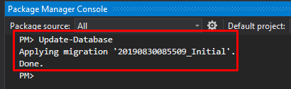

## Entity Framework Core PostgreSQL integrace

> Podívejte se na [Entity Framework Core integrační dokument](../Entity-Framework-Core.md) pro základy integrace EF Core.

### Aktualizace projektu EntityFrameworkCore

- V projektu `Acme.BookStore.EntityFrameworkCore` nahraďte balík `Volo.Abp.EntityFrameworkCore.SqlServer` za `Volo.Abp.EntityFrameworkCore.PostgreSql` 
- Aktualizace pro použití PostgreSQL v `BookStoreEntityFrameworkCoreModule`
  - Nahraďte `AbpEntityFrameworkCoreSqlServerModule` za `AbpEntityFrameworkCorePostgreSqlModule`
  - Nahraďte `options.UseSqlServer()` za `options.UsePostgreSql()`
- V jiných projektech aktualizujte PostgreSQL connection string v nezbytných `appsettings.json` souborech

#### Odstranění stávajících migrací

Smažte všechny stavající migrační soubory (včetně `DbContextModelSnapshot`)


#### Znovu vygenerujte počáteční migraci & aktualizujte databázi

Nastavte správný spouštěcí projekt (obvykle web projekt),
Otevřete **Package Manager Console** (Tools -> Nuget Package Manager -> Package Manager Console), zvolte `Acme.BookStore.EntityFrameworkCore.DbMigrations` jako **Default project** a proveďte následující příkaz:

Proveďte příkaz `Add-Migration`:
````
PM> Add-Migration Initial
````

Poté proveďte příkaz `Update-Database` k aktualizaci schématu databáze:

````
PM> Update-Database
````


