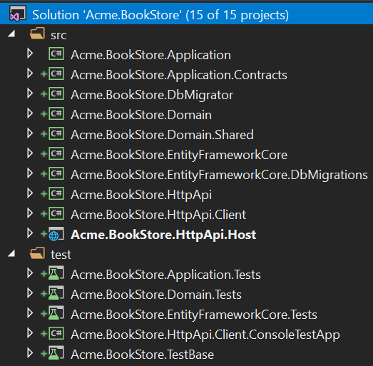
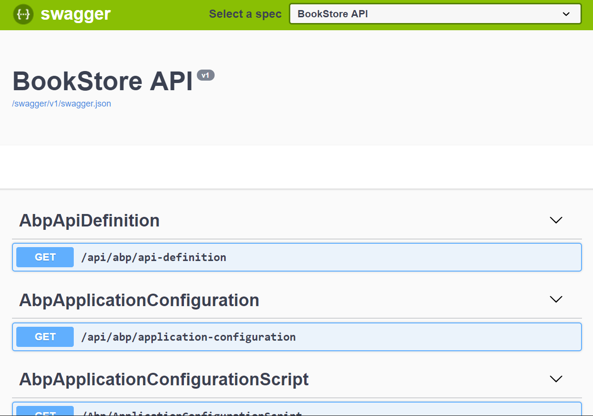

## Začínáme s Angular aplikační šablonou

Tento tutoriál vysvětluje, jak vytvořit novou Angular aplikaci pomocí spouštěcí šablony, jak ji nakonfigurovat a spustit.

### Tvorba nového projektu

Tento tutorial používá k vytvoření nového projektu **ABP CLI**. Podívejte se na stránku [začínáme](https://abp.io/get-started) pro více možností.

Pokud jste tak dosud neučinili, nainstalujte ABP CLI pomocí okna příkazového řádku:

````bash
dotnet tool install -g Volo.Abp.Cli
````

Použíjte příkaz `abp new` v prázdné složce k vytvoření Vašeho projektu:

````bash
abp new Acme.BookStore -u angular
````

> Můžete použít různé úrovně jmenných prostorů; např. BookStore, Acme.BookStore nebo Acme.Retail.BookStore.

`-u angular` volba specifikuje Angular jako UI framework. Výchozí poskytovatel databáze je EF Core. Podívejte se na [CLI dokumentaci](CLI.md) pro všechny dostupné možnosti.

#### Předběžné požadavky

Vytvořené řešení vyžaduje;

* [Visual Studio 2019 (v16.4.0+)](https://visualstudio.microsoft.com/vs/)
* [.NET Core 3.0+](https://www.microsoft.com/net/download/dotnet-core/)
* [Node v12+](https://nodejs.org)
* [Yarn v1.19+](https://classic.yarnpkg.com/)

### Struktura řešení

Otevřete řešení ve **Visual Studio**:



Řešení má vrstvenou strukturu (založenou na [domain driven designu](Domain-Driven-Design.md)) a obsahuje projekty testů jednotek a integrace správně nakonfigurované pro práci s **EF Core** & **SQLite in-memory** databází.

> Podívejte se na [dokument šablony aplikace](Startup-Templates/Application.md) k detailnímu pochopení struktury řešení.

### Databázový connection string

Zkontrolujte **connection string** v souboru `appsettings.json` u projektu `.HttpApi.Host`:

````json
{
  "ConnectionStrings": {
    "Default": "Server=localhost;Database=BookStore;Trusted_Connection=True"
  }
}
````

Řešení je nakonfigurováno pro použití **Entity Framework Core** s **MS SQL Server**. EF Core podporuje [různé](https://docs.microsoft.com/en-us/ef/core/providers/) poskytovatele databáze, takže pokud chcete můžete použít jiný DBMS. V případě potřeby změňte connection string.

### Tvorba databáze & aplikace migrací databáze

K vytvoření databáze máte dvě možnosti.

#### Použití aplikace DbMigrator

Řešení obsahuje konzolovou aplikaci (v tomto příkladu nazvanou `Acme.BookStore.DbMigrator`), která dokáže vytvořit databázi, aplikovat migrace a vložit počáteční data. Ta je užitečná jak pro vývojové tak pro produkční prostředí.

> `.DbMigrator` má vlastní `appsettings.json`. Pokud jste změnili connection string výše, měli byste změnit i tento.

Klikněte pravým na projekt `.DbMigrator` zvolte **Set as StartUp Project**:


Zmáčkněte F5 (nebo Ctrl+F5) ke spuštění aplikace. Výstup by měl být podobný vyobrazení níže:


#### Použití příkazu EF Core Update-Database

Ef Core máš příkaz `Update-Database`, který v případě potřeby vytvoří databázi a aplikuje čekající migrace. Klikněte pravým na projekt `.HttpApi.Host` a zvolte **Set as StartUp Project**:


Otevřete **Package Manager Console**, zvolte `.EntityFrameworkCore.DbMigrations` jako **Default Project** a proveďte příkaz `Update-Database`:


Tímto vytvoříte novou databáze podle nakonfigurovaného connection string.

> Je doporučeno užití nástroje `.DbMigrator`, protože zároveň vloží i počáteční data ke správnému běhu webové aplikace.

### Spuštění aplikace

#### Spuštění API Host (na straně serveru)

Ujistěte se že je projekt `.HttpApi.Host` nastaven jako startovací a spusťte aplikaci což otevře Swagger UI:



Tady můžete vidět API aplikace a zároveň je i otestovat. Získejte [více informací](https://swagger.io/tools/swagger-ui/) o Swagger UI.

##### Autorizace pro Swagger UI

Vetšina API aplikace vyžaduje autentizaci & autorizaci. Pokud chcete otestovat autorizované API, manuálně přejděte na stránku `/Account/Login`, vložte `admin` jako uživatelské jméno a `1q2w3E*` jako heslo k příhlášení do aplikace. Poté budete moci provádět autorizované požadavky API.

#### Spuštění Angular aplikace (na straně klienta)

Přejděte do složky `angular`, otevřete terminál příkazového řádku, proveďte příkaz `yarn` (doporučujeme používat správce balíků [yarn](https://yarnpkg.com), npm install bude v mnoha případech také fungovat):

````bash
yarn
````

Jakmile jsou načteny všechny node moduly, proveďte příkaz `yarn start` nebo `npm start`:

````bash
yarn start
````

Otevřete Váš oblíbený prohlížeč a přejděte na adresu `localhost:4200`. Počáteční uživatelské jméno je `admin` a heslo `1q2w3E*`.

Startovací šablona obsahuje moduly **správa identit** a **správa tenantů**. Jakmile se přihlásíte, zprístupní se administrační menu kde můžete spravovat **tenanty**, **role**, **uživatele** a jejich **oprávnění**.

> Doporučujeme [Visual Studio Code](https://code.visualstudio.com/) jako editor pro Angular projekt, ale klidně použijte Váš oblíbený editor.

### Co dále?

* [Tutoriál vývoje aplikace](Tutorials/Angular/Part-I.md)
