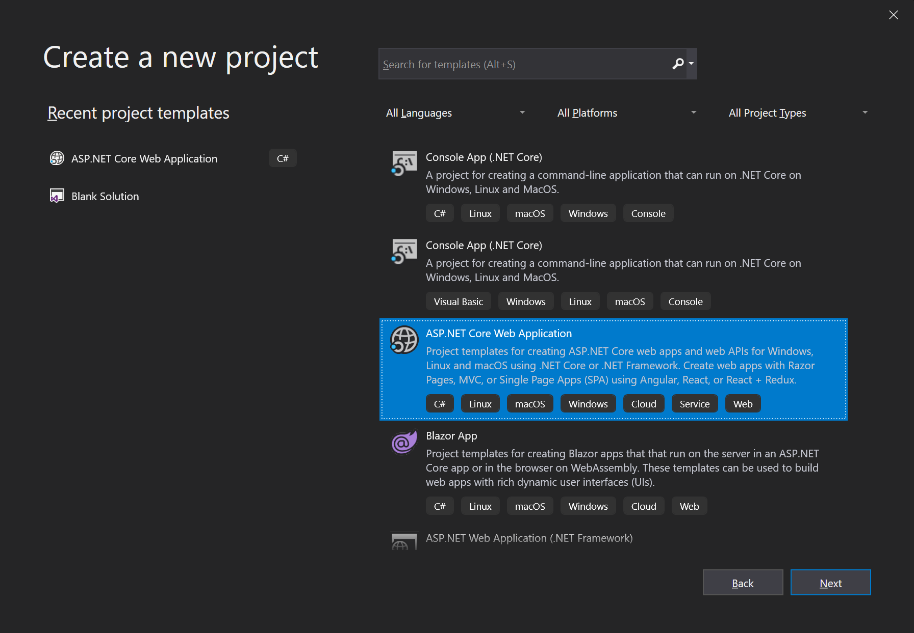
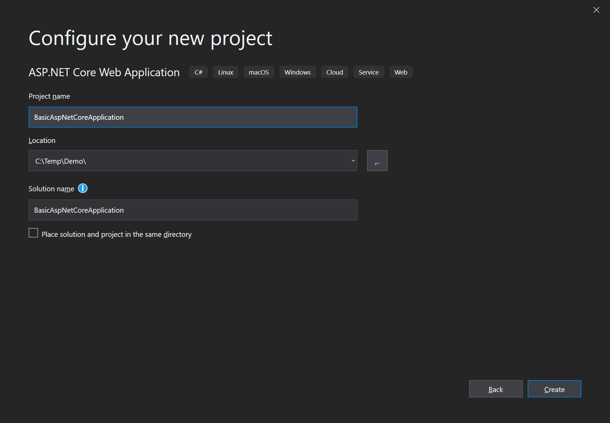
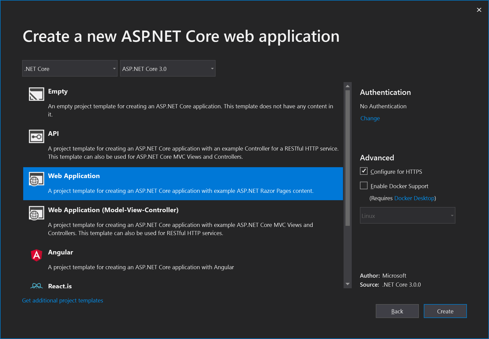

# Začínáme s ASP.NET Core MVC aplikací

Tento tutoriál vysvětluje jak začít s ABP z ničeho s minimem závislostí. Obvykle chcete začít se **[startovací šablonou](https://abp.io/Templates)**.

## Tvorba nového projektu

1. Vytvořte novou AspNet Core Web aplikaci ve Visual Studio 2019 (16.4.0+):



2. Nakonfigurujte váš nový projekt:



3. Potvrďte kliknutím na tlačítko vytvořit



## Instalace Volo.Abp.AspNetCore.Mvc balíku

Volo.Abp.AspNetCore.Mvc je AspNet Core MVC integrační balík pro ABP. Takže ho nainstalujeme do projektu:

````
Install-Package Volo.Abp.AspNetCore.Mvc
````

## Tvorba prvního ABP modulu

ABP je modulární framework a proto vyžaduje **spouštěcí (kořenový) modul** což je třída dědící z ``AbpModule``:

````C#
using Microsoft.AspNetCore.Builder;
using Microsoft.Extensions.Hosting;
using Volo.Abp;
using Volo.Abp.AspNetCore.Mvc;
using Volo.Abp.Modularity;

namespace BasicAspNetCoreApplication
{
    [DependsOn(typeof(AbpAspNetCoreMvcModule))]
    public class AppModule : AbpModule
    {
        public override void OnApplicationInitialization(
            ApplicationInitializationContext context)
        {
            var app = context.GetApplicationBuilder();
            var env = context.GetEnvironment();

            if (env.IsDevelopment())
            {
                app.UseDeveloperExceptionPage();
            }
            else
            {
                app.UseExceptionHandler("/Error");
            }

            app.UseStaticFiles();
            app.UseRouting();
            app.UseConfiguredEndpoints();
        }
    }
}
````

``AppModule`` je dobrý název pro spouštěcí modul aplikace.

ABP balíky definují modulové třídy a modul může mít závislost na jiném. V kódu výše, ``AppModule`` má závislost na ``AbpAspNetCoreMvcModule`` (definován v balíku [Volo.Abp.AspNetCore.Mvc](https://www.nuget.org/packages/Volo.Abp.AspNetCore.Mvc)). Je běžné přidat ``DependsOn`` atribute po instalaci nového ABP NuGet balíku.

Místo třídy Startup, konfigurujeme ASP.NET Core pipeline v této modulové třídě.

## Třída Startup

V dalším kroku upravíme Startup třídu k integraci ABP modulového systému:

````C#
using Microsoft.AspNetCore.Builder;
using Microsoft.Extensions.DependencyInjection;

namespace BasicAspNetCoreApplication
{
    public class Startup
    {
        public void ConfigureServices(IServiceCollection services)
        {
            services.AddApplication<AppModule>();
        }

        public void Configure(IApplicationBuilder app)
        {
            app.InitializeApplication();
        }
    }
}
````

``services.AddApplication<AppModule>()`` přidává všechny služby definované ve všech modulech počínaje od ``AppModule``.

``app.InitializeApplication()`` v metodě ``Configure`` inicializuje a spustí aplikaci.

## Spusťte aplikaci!

To je vše! Spusťte aplikaci, bude fungovat podle očekávání.

## Použití Autofac jako frameworku pro vkládání závislostí

Ačkoliv je AspNet Core systém pro vkládání závíslostí (DI) dostatečný pro základní požadavky, [Autofac](https://autofac.org/) poskytuje pokročilé funkce jako injekce vlastností nebo záchyt metod, které jsou v ABP užity k provádění pokročilých funkcí frameworku.

Nahrazení AspNet Core DI systému za Autofac a integrace s ABP je snadná.

1. Nainstalujeme [Volo.Abp.Autofac](https://www.nuget.org/packages/Volo.Abp.Autofac) balík

````
Install-Package Volo.Abp.Autofac
````

2. Přidáme ``AbpAutofacModule`` závislost

````C#
[DependsOn(typeof(AbpAspNetCoreMvcModule))]
[DependsOn(typeof(AbpAutofacModule))]  // Přidá závislost na AbpAutofacModule
public class AppModule : AbpModule
{
    ...
}
````

3. Upravíme `Program.cs` aby používal Autofac:

````csharp
using Microsoft.AspNetCore.Hosting;
using Microsoft.Extensions.Hosting;

namespace BasicAspNetCoreApplication
{
    public class Program
    {
        public static void Main(string[] args)
        {
            CreateHostBuilder(args).Build().Run();
        }

        public static IHostBuilder CreateHostBuilder(string[] args) =>
            Host.CreateDefaultBuilder(args)
                .ConfigureWebHostDefaults(webBuilder =>
                {
                    webBuilder.UseStartup<Startup>();
                })
                .UseAutofac(); // Přidejte tento řádek
    }
}
````

## Zdrojový kód

Získejte zdrojový kód vzorového projektu vytvořeného v tomto tutoriálů [z tohoto odkazu](https://github.com/abpframework/abp-samples/tree/master/BasicAspNetCoreApplication).

