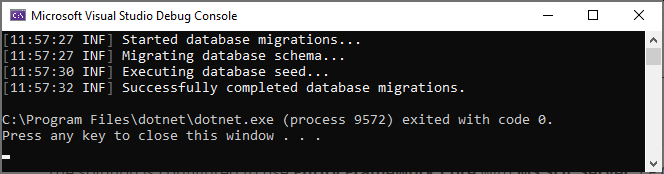
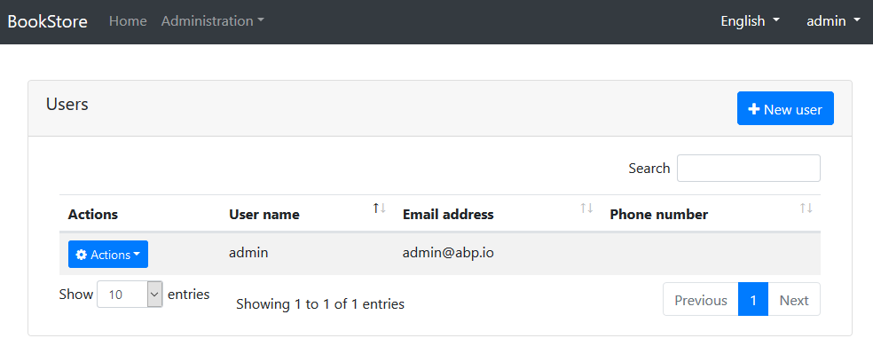

## Začínáme s ASP.NET Core MVC šablonou

Tento tutoriál vysvětluje, jak vytvořit novou ASP.NET Core MVC webovou aplikaci pomocí úvodní šablony, jak ji nakonfigurovat a spustit.

### Tvorba nového projektu

Tento tutoriál používá k tvorbě nového projektu **ABP CLI**. Podívejte se na stránku [Začínáme](https://abp.io/get-started) pro více možností.

Pokud ještě nemáte ABP CLI nainstalováno, učiňte tak pomocí okna příkazového řádku:

````bash
dotnet tool install -g Volo.Abp.Cli
````

K tvorbě vašeho projektu použijte příkaz `abp new` v prázdné složce:

````bash
abp new Acme.BookStore
````

> Můžete použít různé úrovně jmenných prostorů; např. BookStore, Acme.BookStore nebo Acme.Retail.BookStore.

Příkaz `new` vytvoří **vrstvenou MVC aplikaci** s **Entity Framework Core** jako databázovým poskytovatelem. Jsou zde však i jiné možnosti. Podívejte se na [CLI dokumnentaci](CLI.md) pro všechny další možností.

#### Požadavky

Vytvořené řešení vyžaduje;

* [Visual Studio 2019 (v16.3+)](https://visualstudio.microsoft.com/vs/)
* [.NET Core 3.0+](https://www.microsoft.com/net/download/dotnet-core/)
* [Node v12+](https://nodejs.org)
* [Yarn v1.19+](https://yarnpkg.com/)

### Struktura řešení

Otevřete řešení ve **Visual Studio**:


Řešení má vrstvenou strukturu (založenou na [Domain Driven Design](Domain-Driven-Design.md)) a obsahuje projekty jednotkovových a integračních testů předkonfigurované pro práci s **EF Core** & **SQLite in-memory** databází.

> Podívejte se na [dokument šablony aplikace](Startup-Templates/Application.md) k detailnímu pochopení struktury řešení.

### Connection string databáze

Zkontrolujte **connection string** v souboru `appsettings.json` v projektu `.Web`:

````json
{
  "ConnectionStrings": {
    "Default": "Server=localhost;Database=BookStore;Trusted_Connection=True"
  }
}
````

Řešení je nakonfigurováno k používání **Entity Framework Core** s **MS SQL Server**. EF Core podporuje [různé](https://docs.microsoft.com/en-us/ef/core/providers/) databázové poskytovatele, takže můžete použít i jiné DBMS. V případě potřeby změňte connection string.

### Tvorba databáze & aplikace databázových migrací

K vytvoření databáze máte dvě možnosti.

#### Použití DbMigrator aplikace

Řešení obsahuje konzolovou aplikaci (v tomto příkladu nazvanou `Acme.BookStore.DbMigrator`), která může vytvářet databáze, aplikovat migrace a vkládat seed data. Je užitečná jak pro vývojové, tak pro produkční prostředí.

> Projekt `.DbMigrator` má vlastní `appsettings.json`. Takže pokud jste změnili connection string uvedený výše, musíte změnit také tento.

Klikněte pravým na projekt `.DbMigrator` a vyberte **Set as StartUp Project**:


Zmáčkněte F5 (nebo Ctrl+F5) ke spuštění aplikace. Výstup bude vypadat následovně:



#### Použití EF Core Update-Database příkazu

Ef Core má `Update-Database` příkaz, který v případě potřeby vytvoří databázi a aplikuje čekající migrace. Klikněte pravým na projekt `.Web` a vyberte **Set as StartUp Project**:


Otevřete **Package Manager Console**, vyberte projekt `.EntityFrameworkCore.DbMigrations` jako **Default Project** and spusťte příkaz `Update-Database`:


Dojde k vytvoření nové databáze na základě nakonfigurovaného connection stringu.

> Použití nástroje `.Migrator` je doporučený způsob, jelikož zároveň vloží seed data nutné k správnému běhu webové aplikace.

### Spuštění aplikace

Ujistěte se že je projekt `.Web` nastaven jako startovací projekt. Spusťte aplikaci což následně otevře **úvodní** stránku ve vašem prohlížeči:


Klikněte na tlačítko **Přihlásit**, vložte `admin` jako uživatelské jméno a `1q2w3E*` jako heslo k přihlášení do aplikace.

Startovací šabloná obsahuje **identity management** a **tenant management** moduly. Jakmile se přihlásite, budete mít přístup do nabídky Administrace, kde můžete spravovat **tenanty**, **role**, **uživatele** a jejich **oprávnění**. Správa uživatelů vypadá takto:



### Co dále?

* [Tutoriál vývoje aplikace](Tutorials/AspNetCore-Mvc/Part-I.md)
