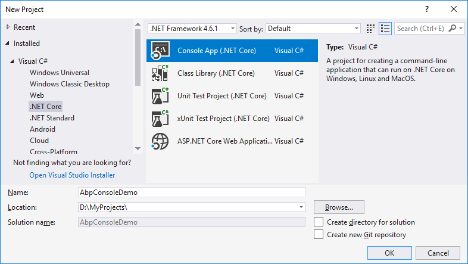

# Začínáme s konzolovou aplikací

Tento tutoriál vysvětluje jak začít s ABP z ničeho s minimem závislostí. Obvykle chcete začít se **[startovací šablonou](https://abp.io/Templates)**.

## Tvorba nového projektu

Vytvořte regulérní .NET Core konzolovou aplikaci z Visual Studio:



## Instalace Volo.Abp balíku

Volo.Abp.Core je základní NuGet balík k tvorbě aplikací založených na ABP. Takže ho nainstalujeme do projektu:

````
Install-Package Volo.Abp.Core
````

## Tvorba prvního ABP modulu

ABP je modulární framework a proto vyžaduje **spouštěcí (kořenový) modul** což je třída dědící z ``AbpModule``:

````C#
using Microsoft.Extensions.DependencyInjection;
using Volo.Abp.Modularity;

namespace AbpConsoleDemo
{
    public class AppModule : AbpModule
    {
        
    }
}
````

``AppModule`` je dobrý název pro spouštěcí modul aplikace.

## Inicializace aplikace

Dalším krokem je bootstrap aplikace pomocí spouštěcího modulu vytvořeného výše:

````C#
using System;
using Volo.Abp;

namespace AbpConsoleDemo
{
    class Program
    {
        static void Main(string[] args)
        {
            using (var application = AbpApplicationFactory.Create<AppModule>())
            {
                application.Initialize();

                Console.WriteLine("Press ENTER to stop application...");
                Console.ReadLine();
            }
        }
    }
}

````

``AbpApplicationFactory`` se používá k vytvoření aplikace a načtení všech modulů, s využitím ``AppModule`` jako spouštěcím modulem. ``Initialize()`` metoda spouští aplikaci.

## Ahoj světe!

Aplikace výše zatím nic nedělá. Pojďme proto vytvořit službu která už něco dělá:

````C#
using System;
using Volo.Abp.DependencyInjection;

namespace AbpConsoleDemo
{
    public class HelloWorldService : ITransientDependency
    {
        public void SayHello()
        {
            Console.WriteLine("Hello World!");
        }
    }
}

````

``ITransientDependency`` je speciální rozhraní ABP, které automaticky registruje službu jako přechodnou (více v [dokumentu vkládání závislostí](Dependency-Injection.md)).

Nyní můžeme vyřešit ``HelloWorldService`` a vypsat naše ahoj. Změníme Program.cs podle vyobrazení níže:

````C#
using System;
using Microsoft.Extensions.DependencyInjection;
using Volo.Abp;

namespace AbpConsoleDemo
{
    class Program
    {
        static void Main(string[] args)
        {
            using (var application = AbpApplicationFactory.Create<AppModule>())
            {
                application.Initialize();

                // Vyřeší službu a použije ji
                var helloWorldService = 
                    application.ServiceProvider.GetService<HelloWorldService>();
                helloWorldService.SayHello();

                Console.WriteLine("Press ENTER to stop application...");
                Console.ReadLine();
            }
        }
    }
}
````

I když je to dostačující pro tento jednoduchý príklad kódu, je vždy lepší v případě přímého řešení závislostí z ``IServiceProvider`` vytvořit rámce (více v [dokumentu vkládání závislostí](Dependency-Injection.md)).

## Využití Autofac jako frameworku pro vkládání závislostí

Ačkoliv je AspNet Core systém pro vkládání závíslostí (DI) skvělý pro základní požadavky, Autofac poskytuje pokročilé funkce jako injekce vlastností nebo záchyt metod, které jsou v ABP užity k provádění pokročilých funkcí frameworku.

Nahrazení AspNet Core DI systému za Autofac a integrace s ABP je snadná.

1. Nainstalujeme [Volo.Abp.Autofac](https://www.nuget.org/packages/Volo.Abp.Autofac) balík

```
Install-Package Volo.Abp.Autofac
```

1. Přidáme ``AbpAutofacModule`` závislost

```c#
[DependsOn(typeof(AbpAutofacModule))] // Přidá závislost na AbpAutofacModule
public class AppModule : AbpModule
{
    
}
```

1. Změníme soubor ``Program.cs`` podle vyobrazení níže:

```c#
using System;
using Microsoft.Extensions.DependencyInjection;
using Volo.Abp;

namespace AbpConsoleDemo
{
    class Program
    {
        static void Main(string[] args)
        {
            using (var application = AbpApplicationFactory.Create<AppModule>(options =>
            {
                options.UseAutofac(); // Autofac integrace
            }))
            {
                application.Initialize();

                // Vyřeší službu a použije ji
                var helloWorldService = 
                    application.ServiceProvider.GetService<HelloWorldService>();
                helloWorldService.SayHello();

                Console.WriteLine("Press ENTER to stop application...");
                Console.ReadLine();
            }
        }
    }
}
```

Stačí volat metodu `options.UseAutofac()` v možnostech `AbpApplicationFactory.Create`.

## Zdrojový kód

Získejte zdrojový kód vzorového projektu vytvořeného v tomto tutoriálů [z tohoto odkazu](https://github.com/abpframework/abp/tree/master/samples/BasicConsoleApplication).
