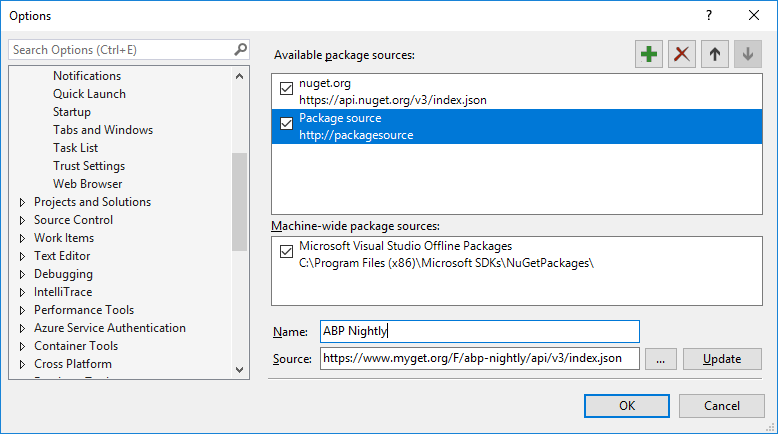

# Noční sestavení

Všechny balíky frameworku a modulů jsou každý večer nasazeny na MyGet. Takže můžete používat nebo testovat nejnovější kód bez čekání na další vydání.

## Konfigurace Visual Studia

> Vyžaduje Visual Studio 2017+

1. Přejděte do `Tools > Options > NuGet Package Manager > Package Source`.
2. Klikněte na zelenou ikonku `+`.
3. Nastavte `ABP Nightly` jako *Name* a `https://www.myget.org/F/abp-nightly/api/v3/index.json` jako *Source* podle vyobrazení níže:
   
4. Klikněte na `Update`.
5. Klikněte na `OK` k uložení změn.

## Instalace balíku

Nyní můžete instalovat náhledové / noční balíky do Vašeho projektu z NuGet prohlížeče nebo Package Manager Console.

1. V nuget prohlížeči, vyberte "Include prereleases".
2. Změňte zdroj balíků na "All".
3. Vyhledejte balík. Uvidíte prerelease balík formátovaný jako `(VERZE)-preview(DATUM)` (např *v0.16.0-preview20190401* jako v tomto vzorku).
4. Můžete kliknout na `Install` k přídání balíku do projektu.

