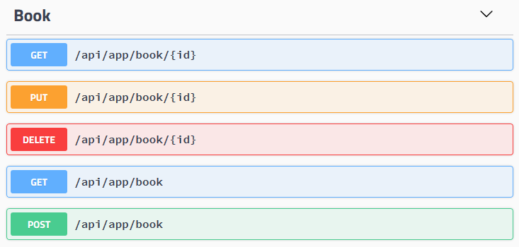

# Auto API Controllers

Once you create an [application service](../Application-Services.md), you generally want to create an API controller to expose this service as an HTTP (REST) API endpoint. A typical API controller does nothing but redirects method calls to the application service and configures the REST API using attributes like [HttpGet], [HttpPost], [Route]... etc.

ABP can **automagically** configure your application services as API Controllers by convention. Most of time you don't care about its detailed configuration, but it's possible to fully customize it.

## Configuration

Basic configuration is simple. Just configure `AbpAspNetCoreMvcOptions` and use `ConventionalControllers.Create` method as shown below:

````csharp
[DependsOn(BookStoreApplicationModule)]
public class BookStoreWebModule : AbpModule
{
    public override void ConfigureServices(ServiceConfigurationContext context)
    {
        Configure<AbpAspNetCoreMvcOptions>(options =>
        {
            options
                .ConventionalControllers
                .Create(typeof(BookStoreApplicationModule).Assembly);
        });
    }
}
````

This example code configures all the application services in the assembly containing the class `BookStoreApplicationModule`. The figure below shows the resulting API on the [Swagger UI](https://swagger.io/tools/swagger-ui/).



### Examples

Some example method names and the corresponding routes calculated by convention:

| Service Method Name                                   | HTTP Method | Route                      |
| ----------------------------------------------------- | ----------- | -------------------------- |
| GetAsync(Guid id)                                     | GET         | /api/app/book/{id}         |
| GetListAsync()                                        | GET         | /api/app/book              |
| CreateAsync(CreateBookDto input)                      | POST        | /api/app/book              |
| UpdateAsync(Guid id, UpdateBookDto input)             | PUT         | /api/app/book/{id}         |
| DeleteAsync(Guid id)                                  | DELETE      | /api/app/book/{id}         |
| GetEditorsAsync(Guid id)                              | GET         | /api/app/book/{id}/editors |
| CreateEditorAsync(Guid id, BookEditorCreateDto input) | POST        | /api/app/book/{id}/editor  |

### HTTP Method

ABP uses a naming convention while determining the HTTP method for a service method (action):

- **Get**: Used if the method name starts with 'GetList', 'GetAll' or 'Get'.
- **Put**: Used if the method name starts with 'Put' or 'Update'.
- **Delete**: Used if the method name starts with 'Delete' or 'Remove'.
- **Post**: Used if the method name starts with 'Create', 'Add', 'Insert' or 'Post'.
- **Patch**: Used if the method name starts with 'Patch'.
- Otherwise, **Post** is used **by default**.

If you need to customize HTTP method for a particular method, then you can use one of the standard ASP.NET Core attributes ([HttpPost], [HttpGet], [HttpPut]... etc.). This requires to add [Microsoft.AspNetCore.Mvc.Core](https://www.nuget.org/packages/Microsoft.AspNetCore.Mvc.Core) nuget package to your project that contains the service.

### Route

Route is calculated based on some conventions:

* It always starts with '**/api**'.
* Continues with a **route path**. Default value is '**/app**' and can be configured as like below:

````csharp
Configure<AbpAspNetCoreMvcOptions>(options =>
{
    options.ConventionalControllers
        .Create(typeof(BookStoreApplicationModule).Assembly, opts =>
            {
                opts.RootPath = "volosoft/book-store";
            });
});
````

Then the route for getting a book will be '**/api/volosoft/book-store/book/{id}**'. This sample uses two-level root path, but you generally use a single level depth.

* Continues with the **normalized controller/service name**. Normalization removes 'AppService', 'ApplicationService' and 'Service' postfixes and converts it to **kebab-case**. If your application service class name is 'ReadingBookAppService' then it becomes only '/reading-book'.
  * If you want to customize naming, then set the `UrlControllerNameNormalizer` option. It's a func delegate which allows you to determine the name per controller/service.
* If the method has an '**id**' parameter then it adds '**/{id}**' ro the route.
* Then it adds the action name if necessary. Action name is obtained from the method name on the service and normalized by;
  * Removing '**Async**' postfix. If the method name is 'GetPhonesAsync' then it becomes 'GetPhones'.
  * Removing **HTTP method prefix**. 'GetList', 'GetAll', 'Get', 'Put', 'Update', 'Delete', 'Remove', 'Create', 'Add', 'Insert', 'Post' and 'Patch' prefixes are removed based on the selected HTTP method. So, 'GetPhones' becomes 'Phones' since 'Get' prefix is a duplicate for a GET request.
  * Converting the result to **kebab-case**.
  * If the resulting action name is **empty** then it's not added to the route. If it's not empty, it's added to the route (like '/phones'). For 'GetAllAsync' method name it will be empty, for 'GetPhonesAsync' method name it will be 'phones'.
  * Normalization can be customized by setting the `UrlActionNameNormalizer` option. It's an action delegate that is called for every method.
* If there is another parameter with 'Id' postfix, then it's also added to the route as the final route segment (like '/phoneId').

#### Customizing the Route Calculation

`IConventionalRouteBuilder` is used to build the route. It is implemented by the `ConventionalRouteBuilder` by default and works as explained above. You can replace/override this service to customize the route calculation strategy.

#### Version 3.x Style Route Calculation

The route calculation was different before the version 4.0. It was using camelCase conventions, while the ABP Framework version 4.0+ uses kebab-case. If you use the old route calculation strategy, follow one of the approaches;

* Set `UseV3UrlStyle` to `true` in the options of the `options.ConventionalControllers.Create(...)` method. Example:

````csharp
options.ConventionalControllers
    .Create(typeof(BookStoreApplicationModule).Assembly, opts =>
        {
            opts.UseV3UrlStyle = true;
        });
````

This approach effects only the controllers for the `BookStoreApplicationModule`.

* Set `UseV3UrlStyle` to `true` for the `AbpConventionalControllerOptions` to set it globally. Example:

```csharp
Configure<AbpConventionalControllerOptions>(options =>
{
    options.UseV3UrlStyle = true;
});
```

Setting it globally effects all the modules in a modular application.

## Service Selection

Creating conventional HTTP API controllers are not unique to application services actually.

### IRemoteService Interface

If a class implements the `IRemoteService` interface then it's automatically selected to be a conventional API controller. Since application services inherently implement it, they are considered as natural API controllers.

### RemoteService Attribute

`RemoteService` attribute can be used to mark a class as a remote service or disable for a particular class that inherently implements the `IRemoteService` interface. Example:

````csharp
[RemoteService(IsEnabled = false)] //or simply [RemoteService(false)]
public class PersonAppService : ApplicationService
{

}
````

### TypePredicate Option

You can further filter classes to become an API controller by providing the `TypePredicate` option:

````csharp
services.Configure<AbpAspNetCoreMvcOptions>(options =>
{
    options.ConventionalControllers
        .Create(typeof(BookStoreApplicationModule).Assembly, opts =>
            {
                opts.TypePredicate = type => { return true; };
            });
});
````

Instead of returning `true` for every type, you can check it and return `false` if you don't want to expose this type as an API controller.

## API Explorer

API Exploring a service that makes possible to investigate API structure by the clients. Swagger uses it to create a documentation and test UI for an endpoint.

API Explorer is automatically enabled for conventional HTTP API controllers by default. Use `RemoteService` attribute to control it per class or method level. Example:

````csharp
[RemoteService(IsMetadataEnabled = false)]
public class PersonAppService : ApplicationService
{

}
````

Disabled `IsMetadataEnabled` which hides this service from API explorer and it will not be discoverable. However, it still can be usable for the clients know the exact API path/route.
