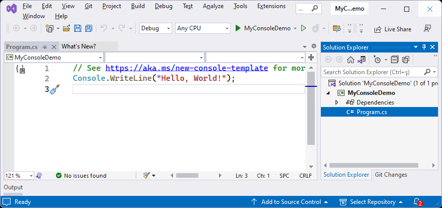

## ABP Application Startup

You typically use the [ABP CLI](CLI.md)'s `abp new` command to [get started](Getting-Started.md) with one of the pre-built [startup solution templates](Startup-Templates/Index.md). When you do that, you generally don't need to know the details of how the ABP Framework is integrated with your application, how it is configured and initialized. The startup template comes with many fundamental ABP packages and [application modules](Modules/Index) are pre-installed and configured for you.

> It is always suggested to [get started with a startup template](Getting-Started.md) and modify it for your requirements.

While the ABP Framework has a lot of features and integrations, it is built as a lightweight and modular framework. It consists of hundreds of NuGet and NMP packages, so you can use only the features you need to. If you follow the [Getting Started with an Empty ASP.NET Core MVC / Razor Pages Application](Getting-Started-AspNetCore-Application.md) document, you see how easy to install the ABP Framework into an empty ASP.NET Core project from scratch. You only install a single NuGet package and make a few small changes.

This document is for who want to better understand how the ABP Framework is initialized and configured on startup.

## Installing to a Console Application

A .NET Console application is the minimalist .NET application. So, it is best to show installing the ABP Framework to a console application as a minimalist example.

If you [create a new console application with Visual Studio](https://learn.microsoft.com/en-us/dotnet/core/tutorials/with-visual-studio) (for .NET 7.0 or later), you will see the following solution structure:

That solution template uses .NET's top level statements...