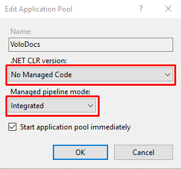
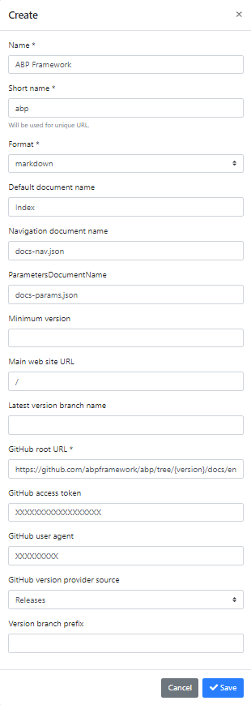
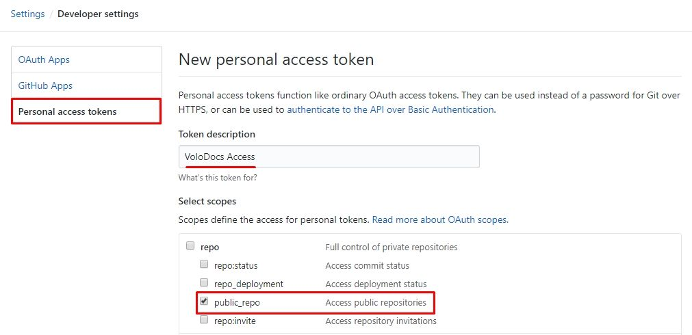
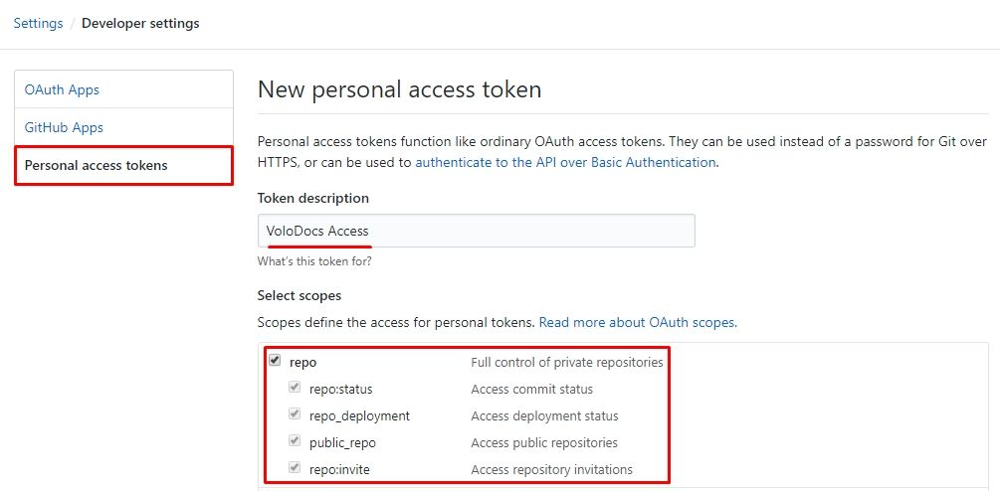
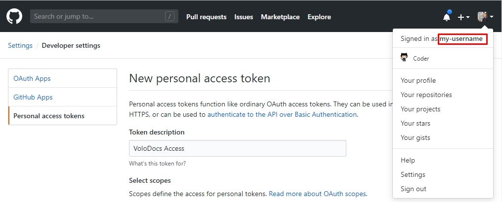

# VoloDocs 

## What is VoloDocs?

VoloDocs is a cross-platform web application that allows you to easily create beautiful documentation and build developer communities. It simplifies software documentation with the help of GitHub integration. You use the power of GitHub for versioning, hosting of your docs. You let your users to edit a document.

## Main Features

- Serves documents from your GitHub repository.
- Supports Markdown / HTML document formatting.
- Supports versioning (integrated to GitHub releases).
- Supports multiple projects.
- Allows users to edit a document on GitHub.
- Cross-platform; deployable to Windows / Linux / macOS.

## GitHub Repository

It's free & open-source. You can browse VoloDocs source-code and contribute on GitHub:

https://github.com/abpframework/abp/tree/master/modules/docs

## Download

You can download the VoloDocs release from the following links:

http://apps.abp.io/VoloDocs/VoloDocs.win-x64.zip - **Windows 64 bit**

http://apps.abp.io/VoloDocs/VoloDocs.win-x86.zip - **Windows 32 bit**

http://apps.abp.io/VoloDocs/VoloDocs.osx-x64.zip - **MacOS**

http://apps.abp.io/VoloDocs/VoloDocs.linux-x64.zip - **Linux**

Notice that, all installations are self-contained deployments. It means all the required third-party dependencies along with the version of .NET Core is included. So you don't need to install any .NET Core SDK / Runtime.

## Folder Structure

When you extract the `VoloDocs.*.zip` file, you will see a `Web` folder and a `Migrator` folder. The `Web` folder contains the website files and `Migrator` contains the application to build your database. Before publishing your website, you need to create a new database or update your existing database to the latest. If this is the first time you install VoloDocs, `Migrator` will create a new database for you, otherwise it updates to the latest version. The only setting you need to configure, is the `ConnectionString` which is located in the `appsettings.json` file. See the next section to learn how to configure your VoloDocs application.

## Steps by Step Deployment

- ### Database Migration

   To update your existing database or create your initial database, go to `Migrator` folder in your VoloDocs directory. 

   Open `appsettings.json` in your text editor and set your database connection string. If you don't know how to write the connection string for your database system, you can check out https://www.connectionstrings.com/.

   After you set your connection string, run `Migrate.bat` for Windows platform and `VoloDocs.Migrator` for other operating systems. That's it now configure your website.

- ### Configuring Website

   Go to `Web` folder in your VoloDocs directory. Open `appsettings.json` in your text editor. Set your connection string (same as in the `Migrator`'s  `appsettings.json`). That's it! Now you can publish your website.

   If you want to run 

- ### Deploying Website

   In the previous step, you created or updated your database. Ensure that your database exists on the specified connection string. 

   - #### Deploying to IIS 

      - Move `Web`  folder to your `wwwroot ` folder.
      - Rename `Web` folder to `VoloDocs`  (Now you have `C:\inetpub\wwwroot\VoloDocs`).
      - The `VoloDocs` application pool is being created automatically. Open **Application Pools**  and double click `VoloDocs` application pool and set 
        - **.NET CLR version**: `No Managed Code`
        - **Managed pipeline mode**: `Integrated`

      

      

      - If you get the below error, it means don't have the hosting bundle installed on the server. See [this document](https://docs.microsoft.com/aspnet/core/host-and-deploy/iis/#install-the-net-core-hosting-bundle) to learn how to install it or [download Hosting Bundle](https://www.microsoft.com/net/permalink/dotnetcore-current-windows-runtime-bundle-installer) and run on your server.

        ```
        Handler "aspNetCore" has a bad module "AspNetCoreModuleV2" in its module list using IIS       
        ```

      - Further information about hosting VoloDocs check out [Microsoft's official document for hosting ASP.NET Core application on IIS](https://docs.microsoft.com/en-us/aspnet/core/host-and-deploy/iis).

   - #### Deploying to Azure

      Microsoft has a good document on how to deploy your ASP.NET Core web app to Azure App Service. We recommend you to read this document https://docs.microsoft.com/en-us/azure/app-service/app-service-web-get-started-dotnet.

    - #### Running the Application From Command Line 

      Alternatively you can run the application from command line, navigate to `VoloDocs\Web` folder and run `VoloDocs.Web.exe` for Windows or `VoloDocs.Web` for MacOS / Linux.

- ### First Run

   To start the website, navigate to your address (as configured in the previous section).

   When you first open the website, you need to create a project.

   #### Creating a Project

   Go to the following address to create project

   - `http://<yourwebsite>/Account/Login?returnUrl=/Docs/Admin/Projects`

   ##### Default credentials

   To login the admin side, use the following credentials:

   * **Username**: `admin`

   * **Password**: `1q2w3E*`

   ##### An example project definition

   Here's a sample project information that uses GitHub source.

   We will configure the VoloDocs to show ABP Framework's documentation that's stored in GitHub.

   Here's the link to ABP Framework GitHub docs folder:

   https://github.com/abpframework/abp/tree/master/docs/en

   

   * **Name**: `ABP Framework`

   * **Short name**: `abp`

   * **Format**: `markdown`

   * **Default document name**: `Index`

   * **Navigation document name**: `docs-nav.json` ([see the sample navigation](https://github.com/abpframework/abp/blob/master/docs/en/docs-nav.json))

   * **Parameters Document Name**: `docs-params.json` ([see the sample parameters](https://github.com/abpframework/abp/blob/dev/docs/en/docs-params.json))

   * **Minimum version**: *leave empty* *(hides the previous versions)*

   * **Main web site URL**: `/`

   * **Latest version branch name**: leave empty ()

   * **GitHub root URL**: `https://github.com/abpframework/abp/tree/{version}/docs/en/`

   * **GitHub access token**: [see how to retrieve GitHub access token](#retrieving-github-access-token)

   * **GitHub user agent**: [see how to learn your GitHub username](#learn-your-github-username)

   * **GitHub version provider source**: `Releases` (other option is `Branches`)

   * **Version branch prefix**: leave empty ()

     

   ##### Retrieving GitHub Access Token

   To create a personal access token in GitHub, you need to visit the **Settings** of the user account and under **Developer settings** you will find **Personal access tokens**. Select **Generate new token**, enter in a name as the Token description and enable the repo checkbox. Alternatively, to enter generate new token, browse to https://github.com/settings/tokens/new.

   ###### Generate Token for Public Repositories

   To access public repositories, check `public_repo` under the `repo` section. This will enable VoloDocs to access your public GitHub repositories. Click `Generate Token` button on the bottom of the page.

   

   ###### Generate Token for Private Repositories

   To access public repositories, check all items under the `repo` section. This will enable VoloDocs to access your private GitHub repositories. Click `Generate Token` button on the bottom of the page.

   

   ###### Learn Your GitHub Username

   To learn your GitHub username, click on your profile picture on the top-right corner of the GitHub page. You will see your username right after the text "Signed in as ..."

   


After you save the project, go to root website address and you will see your documentation.

`http://<yourwebsite>/documents`

### Any Issues?

If you encounter any problem or issues about installation, usage or report a bug, follow the link:

https://github.com/abpframework/abp/issues/new

