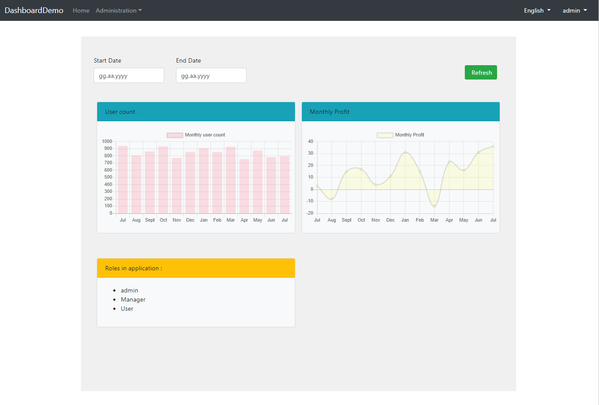

# Dashboard & Widget System

Dashboard & Widget System allows you to create reusable widgets and dashboards.



You can see a sample dashboard, build with that system, in the screenshot above. Top section, where the filters and refresh button is placed is global filter section and each card below is a widget. Both widgets and global filters are reusable components. Also dashboard layout is reusable too.

Now we will see how those are defined, used in an application.

## Dashboard Component

Firstly, we will define a dashboard in our application (you can download a new application template from [abp.io/get-started](https://abp.io/get-started). To keep it simple, Please don't use tiered option).

In *.Web project, we create **DashboardNames.cs** and **DashboardDefinitionProvider.cs** classes:

```c#
    public static class DashboardNames
    {
        public const string MyDashboard = "MyDashboard";

        public static string[] GetAll()
        {
            return ReflectionHelper.GetPublicConstantsRecursively(typeof(DashboardNames));
        }
    }
```

```c#
    public static class DashboardDefinitionProvider
    {
        public static List<DashboardDefinition> GetDefinitions()
        {
            var myDashboard = new DashboardDefinition(
                DashboardNames.MyDashboard,
                LocalizableString.Create<DashboardDemoResource>("MyDashboard")
                );

            return new List<DashboardDefinition>
            {
                myDashboard
            };
        }
    }
```

We need to add that definition to **DashboardOptions** in **ConfigureServices** method of ***WebModule.cs** file:

```c#
using Volo.Abp.AspNetCore.Mvc.UI.Dashboards;
//...
    public class DashboardDemoWebModule : AbpModule
    {
        public override void ConfigureServices(ServiceConfigurationContext context)
        {            
            //other codes..
            Configure<DashboardOptions>(options =>
            {
                options.Dashboards.AddRange(DashboardDefinitionProvider.GetDefinitions());
            })
            //other codes..
        }
        //other codes..
     }
```

Then we can create the view file that the dashboard we have defined will be rendered, **Pages/MyDashboard.cshtml**:

```html
@page
@using DashboardDemo.Dashboards
@using Microsoft.Extensions.Localization
@using Volo.Abp.AspNetCore.Mvc.UI.Dashboards
@using Volo.Abp.AspNetCore.Mvc.UI.Widgets
@inject IWidgetRenderer WidgetRenderer
@inject IDashboardRenderer DashboardRenderer
@inject IStringLocalizerFactory localizer
@model DashboardDemo.Pages.MyDashboardModel
@{
}
@section styles {
    <abp-style-bundle name="@DashboardNames.MyDashboard" />
}
@section scripts {
    <abp-script-bundle name="@DashboardNames.MyDashboard" />
}

    @await DashboardRenderer.RenderAsync(Component, new { dashboardName = DashboardNames.MyDashboard })


```

**DashboardRenderer.RenderAsync** method renders the dashboard we have defined. Now we have to define the script and style bundles that you can see their usage in the code above:

```c#
    [DependsOn(typeof(AbpBasicDashboardStyleContributor))]
    public class MyDashboardStyleBundleContributor : BundleContributor
    {
        public override void ConfigureBundle(BundleConfigurationContext context)
        {

        }
    }
```

```c#
    [DependsOn(typeof(AbpBasicDashboardScriptContributor))]
    public class MyDashboardScriptBundleContributor : BundleContributor
    {
        public override void ConfigureBundle(BundleConfigurationContext context)
        {

        }
    }
```

The dashboard system uses [Bundling & Minification](../Bundling-Minification.md) for scripts and styles. Dashboard contributors will be dependent on their widget and global filter contributors, and widget and global filters will be dependent on the other contributors they need. This guarantees that more than one widget can request a javascript library and it won't be duplicated.

We need to add those contributors to bundling options in **ConfigureServices** method of ***WebModule.cs** file:

```c#
            Configure<BundlingOptions>(options =>
            {
                options.ScriptBundles.Add(DashboardNames.MyDashboard, configuration =>
                    {
                      configuration.AddContributors(typeof(MyDashboardScriptBundleContributor));
                    });
               
                options.StyleBundles.Add(DashboardNames.MyDashboard, configuration =>
                    {
                      configuration.AddContributors(typeof(MyDashboardStyleBundleContributor));
                    });
            });
```

Now we can start to create widgets.

## Widgets

Widgets are view components those are rendered in order when you add them to a dashboard. They also can be rendered anywhere you like.

We will see how to create a widget and add it to the dashboard we created. We will create the "Monthly profit" widget in the screenshot at the beginning of this tutorial.

Before creating our widget, we need a application service to return dummy data for our widget.

```c#
namespace DashboardDemo
{
   public interface IDemoStatisticAppService : IApplicationService
    {
        Task<GetMonthlyUserStatisticDto> GetMonthlyUserStatistic(FilterDto filter);

        Task<MonthlyProfitStatisticDto> GetMonthlyProfitStatistic(FilterDto filter);
    }
    
    public class DemoStatisticAppService : ApplicationService, IDemoStatisticAppService
    {
        public async Task<MonthlyProfitStatisticDto> GetMonthlyProfitStatistic(FilterDto filter)
        {
            var monthCount = GetLabels(filter, out var monthList);

            var data = Enumerable
                .Repeat(0, monthCount)
                .Select(i => new Random().Next(-20, 40))
                .ToArray();

            return new MonthlyProfitStatisticDto { Labels = monthList.ToArray(), Data = data };
        }

        private static int GetLabels(FilterDto filter, out List<string> monthList)
        {
            DateTime endDate = filter.EndDate ?? DateTime.Now;
            DateTime startDate = filter.StartDate ?? DateTime.Now.AddYears(-1);

            if (filter.StartDate > filter.EndDate)
            {
                throw new BusinessException("Start date can not be greater than end date.");
            }

            var months = new[] {"Jan", "Feb", "Mar", "Apr", "May", "Jun", "Jul", "Aug", "Sept", "Oct", "Nov", "Dec"};
            var monthCount = (endDate.Year - startDate.Year) * 12 + endDate.Month - startDate.Month +1;
            monthList = new List<string>();

            for (int i = 0; i < monthCount; i++)
            {
                monthList.Add(months[endDate.Month-1]);
                endDate = endDate.AddMonths(-1);
            }

            monthList.Reverse();

            return monthCount;
        }
    }
    
    public class MonthlyProfitStatisticDto
    {
        public string[] Labels { get; set; }

        public int[] Data { get; set; }
    }
    
    public class FilterDto
    {
        public DateTime? StartDate { get; set; }

        public DateTime? EndDate { get; set; }
    }
}
```

We will use **FilterDto** in **Global Filters** section.

Now we can start to work on our widget.


You can see the files that we will create our widget. (If your widget won't need css or javascript, you don't need to create them and contributors as well.)

First we create the **MonthlyProfitWidgetViewComponent**:

```html
@inject IHtmlLocalizer<DashboardDemoResource> L
@using DashboardDemo.Localization.DashboardDemo
@using Microsoft.AspNetCore.Mvc.Localization
@model DashboardDemo.Pages.widgets.MonthlyProfitWidgetViewComponent
@{
}
<div id="MonthlyProfitWidgetContainer">
    <abp-card background="Light">
        <abp-card-header background="Info">@L["Monthly Profit"]</abp-card-header>
        <abp-card-body>
            <div class="row margin-bottom-5">
                <canvas  id="MonthlyProfitStatistics"></canvas>
            </div>
        </abp-card-body>
    </abp-card>
</div>

```

```c#
    public class MonthlyProfitWidgetViewComponent : AbpViewComponent
    {
        public const string Name = "MonthlyProfitWidget";
        
        public const string DisplayName = "Monthly Profit Widget";

        public IViewComponentResult Invoke()
        {
            return View("/Pages/widgets/MonthlyProfitWidget/MonthlyProfitWidgetViewComponent.cshtml", new MonthlyProfitWidgetViewComponent());
        }
    }
```

We will use [chart.js library](https://www.chartjs.org/) to create the chart. To add this library to our project, we add the package dependency to **package.json**:

```json
  "dependencies": {
    //other dependencies...
    "chart.js": "^2.8.0"
  }
```

Then add the mapping **abp.resourcemappings.js**: (see [related doc](/AspNetCore/Client-Side-Package-Management#resource-mapping-definition-file))

```js
    mappings: {
        //other mappings...
        "@node_modules/chart.js/dist/*.*": "@libs/chart.js/"
    }
```

Now we have chart.js library in our application. In order to use it, we will create it's contributors:

```c#
    public class ChartjsScriptContributor : BundleContributor
    {
        public override void ConfigureBundle(BundleConfigurationContext context)
        {
            context.Files.Add("/libs/chart.js/Chart.js");
        }
    }
    
    public class ChartjsStyleContributor : BundleContributor
    {
        public override void ConfigureBundle(BundleConfigurationContext context)
        {
            context.Files.Add("/libs/chart.js/Chart.css");
        }
    }
```

Well. Now we create the contributors for our widget files and make them dependent on chart.js:

```c#
    [DependsOn(typeof(JQueryScriptContributor))]
    [DependsOn(typeof(ChartjsScriptContributor))]
    public class MonthlyProfitWidgetScriptBundleContributor : BundleContributor
    {
        public override void ConfigureBundle(BundleConfigurationContext context)
        {
            context.Files.Add("/Pages/widgets/MonthlyProfitWidget/MonthlyProfitWidget.js");
        }
    }
    
    [DependsOn(typeof(BootstrapStyleContributor))]
    [DependsOn(typeof(ChartjsStyleContributor))]
    public class MonthlyProfitWidgetStyleBundleContributor : BundleContributor
    {
        public override void ConfigureBundle(BundleConfigurationContext context)
        {
            context.Files.Add("/Pages/widgets/MonthlyProfitWidget/MonthlyProfitWidget.css");
        }
    }
```

**MonthlyProfitWidget.css** is empty for our widget.

**MonthlyProfitWidget.js** content is below:

```js
(function ($) {
    var $container = $('#MonthlyProfitWidgetContainer');
    if ($container.length > 0) {
        var chart = {};

        var createChart = function () {
            dashboardDemo.demoStatistic.getMonthlyProfitStatistic({}).then(function (result) {
                chart = new Chart($container.find('#MonthlyProfitStatistics'), {
                    type: 'line',
                    data: {
                        labels: result.labels,
                        datasets: [{
                            label: 'Monthly Profit',
                            data: result.data,
                            backgroundColor: 'rgba(255, 255, 132, 0.2)'
                        }]
                    },
                    options: {
                        scales: {
                            yAxes: [{
                                ticks: {
                                    beginAtZero: true
                                }
                            }]
                        }
                    }
                });
            });
        };

        createChart();
    }
})(jQuery);

```

We have created our widget. There is one last thing before adding it to dashboard; we need to define it:

```c#
    public static class WidgetDefinitionProvider
    {
        public static List<WidgetDefinition> GetDefinitions()
        {
            //other widgets...

            var monthlyProfitWidget = new WidgetDefinition(
                    MonthlyProfitWidgetViewComponent.Name,
                    LocalizableString.Create<DashboardDemoResource>(MonthlyProfitWidgetViewComponent.DisplayName),
                    typeof(MonthlyProfitWidgetViewComponent)
                )
                .SetDefaultDimension(6, 4)
                .AddRequiredPermission(IdentityPermissions.Users.Default);

            return new List<WidgetDefinition>
            {
                //other widgets...
                monthlyProfitWidget
            };
        }
    }
```

**.SetDefaultDimension(int x, int y):** Sets the dimensions of the widget. This will be used when rendering it in dashboard. X is for column width in bootstrap, can be between 1 and 12. Y is height in pixels, will be multiplied by 100. 

**AddRequiredPermission(string permissionName)**: Sets the permission for widget. So a user that doesn't have this permission will not see this widget.

We need to add the widget definitions to **WidgetOptions** in **ConfigureServices** method of ***WebModule.cs** file as well:

```c#
            Configure<WidgetOptions>(options =>
            {
                options.Widgets.AddRange(WidgetDefinitionProvider.GetDefinitions());
            });
```

Now our widget is ready to use. We will use **WithWidget** method to add it to our dashboard in **DashboardDefinitionProvider.cs**:

```c#
            var myDashboard = new DashboardDefinition(
                DashboardNames.MyDashboard,
                LocalizableString.Create<DashboardDemoResource>("MyDashboard"))
               .WithWidget(MonthlyProfitWidgetViewComponent.Name); 
```

And add the javascript and contributor dependencies to dashboard:

```c#
    [DependsOn(typeof(MonthlyProfitWidgetScriptBundleContributor))] // <<<<<<
    [DependsOn(typeof(AbpBasicDashboardScriptContributor))] 
    public class MyDashboardScriptBundleContributor : BundleContributor
    {
        public override void ConfigureBundle(BundleConfigurationContext context)
        {

        }
    }
    
    [DependsOn(typeof(MonthlyProfitWidgetStyleBundleContributor))] // <<<<<<
    [DependsOn(typeof(AbpBasicDashboardStyleContributor))] 
    public class MyDashboardStyleBundleContributor : BundleContributor
    {
        public override void ConfigureBundle(BundleConfigurationContext context)
        {

        }
    }
```

Now start your application and go to **/MyDashboard** page.

## Global Filters

Global filters are used for filtering all widgets with same input. If you add a global filter to a dashboard, a refresh button will appear for refreshing widgets with new filter values. When this button is clicked, it serializes filters to object and fires an event with that object as parameter. 

Let's implement a **date range** global filter.

First, we need to create **DateRangeGlobalFilterViewComponent.cshtml**:

```html
@inject IHtmlLocalizer<DashboardDemoResource> L
@using DashboardDemo.Localization.DashboardDemo
@using Microsoft.AspNetCore.Mvc.Localization
@model DashboardDemo.Pages.widgets.Filters.DateRangeGlobalFilterViewComponent
@{
}
<div id="DateRangeGlobalFilterContainer">
    <div class="row">
        <div class="col-md-6 mb-3">
            <label for="DateFilterStartDateInput">@L["Start Date"].Value</label>
            <input class="form-control" type="date" name="StartDate" id="DateFilterStartDateInput">
        </div>
        <div class="col-md-6 mb-3">
            <label for="DateFilterEndDateInput">@L["End Date"].Value</label>
            <input class="form-control" type="date" name="EndDate" id="EndDateStartDateInput">
        </div>
    </div>
</div>


```

```c#
namespace DashboardDemo.Pages.widgets.Filters
{
    [ViewComponent]
    public class DateRangeGlobalFilterViewComponent : ViewComponent
    {
        public const string Name = "DateRangeGlobalFilter";

        public const string DisplayName = "Date Range Filter";

        public IViewComponentResult Invoke()
        {
            return View("/Pages/widgets/Filters/DateRangeGlobalFilterViewComponent.cshtml", new DateRangeGlobalFilterViewComponent());
        }
    }
}
```

You can add javascript and css files in the same way you add them to widgets, but in this example they are not needed.

We will add the global filter definitions to **GlobalFilterOptions** in **ConfigureServices** method of ***WebModule.cs** file as well:

```c#
            Configure<GlobalFilterOptions>(options =>
            {
                options.GlobalFilters.AddRange(GlobalFilterDefinitionProvider.GetDefinitions());
            });
```

And add it to our dashboard in **DashboardDefinitionProvider.cs** using **WithGlobalFilter** method:

```c#
            var myDashboard = new DashboardDefinition(
                DashboardNames.MyDashboard,
                LocalizableString.Create<DashboardDemoResource>("MyDashboard"))
                .WithWidget(MonthlyProfitWidgetViewComponent.Name)
                .WithGlobalFilter(DateRangeGlobalFilterViewComponent.Name);
```

That's it! Now let's catch the refresh event in our widget:

```js
(function ($) {
    var $container = $('#MonthlyProfitWidgetContainer');
    if ($container.length > 0) {
        var chart = {};

        var createChart = function () {
            dashboardDemo.demoStatistic.getMonthlyProfitStatistic({}).then(function (result) {
                chart = new Chart($container.find('#MonthlyProfitStatistics'), {
                    type: 'line',
                    data: {
                        labels: result.labels,
                        datasets: [{
                            label: 'Monthly Profit',
                            data: result.data,
                            backgroundColor: 'rgba(255, 255, 132, 0.2)'
                        }]
                    },
                    options: {
                        scales: {
                            yAxes: [{
                                ticks: {
                                    beginAtZero: true
                                }
                            }]
                        }
                    }
                });
            });
        };

        $(document).on('RefreshWidgets',
            function (event, filters) {
                dashboardDemo.demoStatistic.getMonthlyProfitStatistic({ startDate: filters.startDate, endDate: filters.endDate }).then(function (result) {
                    chart.data = {
                        labels: result.labels,
                            datasets: [{
                            label: 'Monthly Profit',
                            data: result.data,
                            backgroundColor: 'rgba(255, 255, 132, 0.2)'
                        }]
                    },
                    chart.update();
                });
            });

        createChart();
    }
})(jQuery);

```

## Source Code

You can see a sample application for dashboard at [Github](https://github.com/abpframework/abp/tree/dev/samples/DashboardDemo). 
