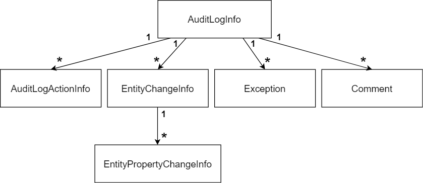

# Audit Logging

[Wikipedia](https://en.wikipedia.org/wiki/Audit_trail): "*An audit trail (also called **audit log**) is a security-relevant chronological record, set of records, and/or destination and source of records that provide documentary evidence of the sequence of activities that have affected at any time a specific operation, procedure, or event*".

ABP Framework provides an **extensible audit logging system** that automates the audit logging by **convention** and provides **configuration** points to control the level of the audit logs.

An **audit log object** (see the Audit Log Object section below) is typically created & saved per web request. It includes;

* **Request & response details** (like URL, Http method, Browser info, HTTP status code... etc.).
* **Performed actions** (controller actions and application service method calls with their parameters).
* **Entity changes** occurred in the web request.
* **Exception** information (if there was an error while executing the request).
* **Request duration** (to measure the performance of the application).

> [Startup templates](Startup-Templates/Index.md) are configured for the audit logging system which is suitable for most of the applications. Use this document for a detailed control over the audit log system.

### Database Provider Support

* Fully supported by the [Entity Framework Core](Entity-Framework-Core.md) provider.
* Entity change logging is not supported by the [MongoDB](MongoDB.md) provider. Other features work as expected.

## UseAuditing()

`UseAuditing()` middleware should be added to the ASP.NET Core request pipeline in order to create and save the audit logs. If you've created your applications using [the startup templates](Startup-Templates/Index.md), it is already added.

## AbpAuditingOptions

`AbpAuditingOptions` is the main [options object](Options.md) to configure the audit log system. You can configure it in the `ConfigureServices` method of your [module](Module-Development-Basics.md):

````csharp
Configure<AbpAuditingOptions>(options =>
{
    options.IsEnabled = false; //Disables the auditing system
});
````

Here, a list of the options you can configure:

* `IsEnabled` (default: `true`): A root switch to enable or disable the auditing system. Other options is not used if this value is `false`.
* `HideErrors` (default: `true`): Audit log system hides and write regular [logs](Logging.md) if any error occurs while saving the audit log objects. If saving the audit logs is critical for your system, set this to `false` to throw exception in case of hiding the errors.
* `IsEnabledForAnonymousUsers` (default: `true`): If you want to write audit logs only for the authenticated users, set this to `false`. If you save audit logs for anonymous users, you will see `null` for `UserId` values for these users.
* `AlwaysLogOnException` (default: `true`): If you set to true, it always saves the audit log on an exception/error case without checking other options (except `IsEnabled`, which completely disables the audit logging).
* `IsEnabledForGetRequests` (default: `false`): HTTP GET requests should not make any change in the database normally and audit log system doesn't save audit log objects for GET request. Set this to `true` to enable it also for the GET requests.
* `ApplicationName`: If multiple applications saving audit logs into a single database, set this property to your application name, so you can distinguish the logs of different applications.
* `IgnoredTypes`: A list of `Type`s to be ignored for audit logging. If this is an entity type, changes for this type of entities will not be saved. This list is also used while serializing the action parameters.
* `EntityHistorySelectors`: A list of selectors those are used to determine if an entity type is selected for saving the entity change. See the section below for details.
* `Contributors`: A list of `AuditLogContributor` implementations. A contributor is a way of extending the audit log system. See the "Audit Log Contributors" section below.

### Entity History Selectors

Saving all changes of all your entities would require a lot of database space. For this reason, **audit log system doesn't save any change for the entities unless you explicitly configure it**.

To save all changes of all entities, simply use the `AddAllEntities()` extension method.

````csharp
Configure<AbpAuditingOptions>(options =>
{
    options.EntityHistorySelectors.AddAllEntities();
});
````

`options.EntityHistorySelectors` actually a list of type predicate. You can write a lambda expression to define your filter.

The example selector below does the same of the `AddAllEntities()` extension method defined above:

````csharp
Configure<AbpAuditingOptions>(options =>
{
    options.EntityHistorySelectors.Add(
        new NamedTypeSelector(
            "MySelectorName",
            type =>
            {
                if (typeof(IEntity).IsAssignableFrom(type))
                {
                    return true;
                }
                else
                {
                    return false;
                }
            }
        )
    );
});
````

The condition `typeof(IEntity).IsAssignableFrom(type)` will be `true` for any class implements the `IEntity` interface (this is technically all the entities in your application). You can conditionally check and return `true` or `false` based on your preference.

`options.EntityHistorySelectors` is a flexible and dynamic way of selecting the entities for audit logging. Another way is to use the `Audited` and `DisableAuditing` attributes per entity.

## Enabling/Disabling Audit Logging for Services

### Enable/Disable for Controllers & Actions

All the controller actions are logged by default (see `IsEnabledForGetRequests` above for GET requests). 

You can use the `[DisableAuditing]` to disable it for a specific controller type:

````csharp
[DisableAuditing]
public class HomeController : AbpController
{
    //...
}
````

Use `[DisableAuditing]` for any action to control it in the action level:

````csharp
public class HomeController : AbpController
{
    [DisableAuditing]
    public async Task<ActionResult> Home()
    {
        //...
    }

    public async Task<ActionResult> OtherActionLogged()
    {
        //...
    }
}
````

### Enable/Disable for Application Services & Methods

[Application service](Application-Services.md) method calls also included into the audit log by default. You can use the `[DisableAuditing]` in service or method level.

#### Enable/Disable for Other Services

Action audit logging can be enabled for any type of class (registered to and resolved from the [dependency injection](Dependency-Injection.md)) while it is only enabled for the controllers and the application services by default.

Use `[Audited]` and `[DisableAuditing]` for any class or method that need to be audit logged. In addition, your class can (directly or inherently) implement the `IAuditingEnabled` interface to enable the audit logging for that class by default.

### Enable/Disable for Entities & Properties

An entity is ignored on entity change audit logging in the following cases;

* If you add an entity type to the `AbpAuditingOptions.IgnoredTypes` (as explained before), it is completely ignored in the audit logging system.
* If the object is not an [entity](Entities.md) (not implements `IEntity` directly or inherently - All entities implement this interface by default).
* If entity type is not public.

Otherwise, you can use `Audited` to enable entity change audit logging for an entity:

````csharp
[Audited]
public class MyEntity : Entity<Guid>
{
    //...
}
````

Or disable it for an entity:

````csharp
[DisableAuditing]
public class MyEntity : Entity<Guid>
{
    //...
}
````

Disabling audit logging can be necessary only if the entity is being selected by the `AbpAuditingOptions.EntityHistorySelectors` that explained before.

You can disable auditing only some properties of your entities for a detailed control over the audit logging:

````csharp
[Audited]
public class MyUser : Entity<Guid>
{
    public string Name { get; set; }
        
    public string Email { get; set; }

    [DisableAuditing] //Ignore the Passoword on audit logging
    public string Password { get; set; }
}
````

Audit log system will save changes for the `MyUser` entity while it ignores the `Password` property which can be dangerous to save for security purposes.

In some cases, you may want to save a few properties but ignore all others. Writing `[DisableAuditing]` for all the other properties would be tedious. In such cases, use `[Audited]` only for the desired properties and mark the entity with the `[DisableAuditing]` attribute:

````csharp
[DisableAuditing]
public class MyUser : Entity<Guid>
{
    [Audited] //Only log the Name change
    public string Name { get; set; }

    public string Email { get; set; }

    public string Password { get; set; }
}
````

## IAuditingStore

`IAuditingStore` is an interface that is used to save the audit log objects (explained below) by the ABP Framework. If you need to save the audit log objects to a custom data store, you can implement the `IAuditingStore` in your own application and replace using the [dependency injection system](Dependency-Injection.md).

`SimpleLogAuditingStore` is used if no audit store was registered. It simply writes the audit object to the standard [logging system](Logging.md).

[The Audit Logging Module](Modules/Audit-Logging.md) has been configured in [the startup templates](Startup-Templates/Index.md) saves audit log objects to a database (it supports multiple database providers). So, most of the times you don't care about how `IAuditingStore` was implemented and used.

## Audit Log Object

An **audit log object** is created for each **web request** by default. An audit log object can be represented by the following relation diagram:



* **AuditLogInfo**: The root object with the following properties:
  * `ApplicationName`: When you save audit logs of different applications to the same database, this property is used to distinguish the logs of the applications.
  * `UserId`: Id of the current user, if the user has logged in.
  * `UserName`: User name of the current user, if the user has logged in (this value is here to not depend on the identity module/system for lookup).
  * `TenantId`: Id of the current tenant, for a multi-tenant application.
  * `TenantName`: Name of the current tenant, for a multi-tenant application.
  * `ExecutionTime`: The time when this audit log object has been created.
  * `ExecutionDuration`: Total execution duration of the request, in milliseconds. This can be used to observe the performance of the application.
  * `ClientId`: Id of the current client, if the client has been authenticated. A client is generally a 3rd-party application using the system over an HTTP API.
  * `ClientName`: Name of the current client, if available.
  * `ClientIpAddress`: IP address of the client/user device.
  * `CorrelationId`: Current [Correlation Id](CorrelationId.md). Correlation Id is used to relate the audit logs written by different applications (or microservices) in a single logical operation.
  * `BrowserInfo`: Browser name/version info of the current user, if available.
  * `HttpMethod`: HTTP method of the current request (GET, POST, PUT, DELETE... etc.).
  * `HttpStatusCode`: HTTP response status code for this request.
  * `Url`: URL of the request.
* **AuditLogActionInfo**: An audit log action is typically a controller action or an [application service](Application-Services.md) method call during the web request. One audit log may contain multiple actions. An action object has the following properties:
  * `ServiceName`: Name of the executed controller/service.
  * `MethodName`: Name of the executed method of the controller/service.
  * `Parameters`: A JSON formatted text representing the parameters passed to the method.
  * `ExecutionTime`: The time when this method was executed.
  * `ExecutionDuration`: Duration of the method execution, in milliseconds. This can be used to observe the performance of the method.
* **EntityChangeInfo**: Represents a change of an entity in this web request. An audit log may contain zero or more entity changes. An entity change has the following properties:
  * `ChangeTime`: The time when the entity was changed.
  * `ChangeType`: An enum with the following fields: `Created` (0), `Updated` (1) and `Deleted` (2).
  * `EntityId`: Id of the entity that was changed.
  * `EntityTenantId`: Id of the tenant this entity belongs to.
  * `EntityTypeFullName`: Type (class) name of the entity with full namespace (like *Acme.BookStore.Book* for the Book entity).
* **EntityPropertyChangeInfo**: Represents a change of a property of an entity. An entity change info (explained above) may contain one or more property change with the following properties:
  * `NewValue`: New value of the property. It is `null` if the entity was deleted.
  * `OriginalValue`: Old/original value before the change. It is `null` if the entity was newly created.
  * `PropertyName`: The name of the property on the entity class.
  * `PropertyTypeFullName`: Type (class) name of the property with full namespace.
* **Exception**: An audit log object may contain zero or more exception. In this way, you can get a report of the failed requests.
* **Comment**: An arbitrary string value to add custom messages to the audit log entry. An audit log object may contain zero or more comments.

In addition to the standard properties explained above, `AuditLogInfo`, `AuditLogActionInfo` and `EntityChangeInfo` objects implement the `IHasExtraProperties` interface, so you can add custom properties to these objects.

## Audit Log Contributors

You can extend the auditing system by creating a class that is derived from the `AuditLogContributor` class which defines the `PreContribute` and the `PostContribute` methods.

The only pre-built contributor is the `AspNetCoreAuditLogContributor` class which sets the related properties for an HTTP request.

A contributor can set properties and collections of the `AuditLogInfo` class to add more information.

Example:

````csharp
public class MyAuditLogContributor : AuditLogContributor
{
    public override void PreContribute(AuditLogContributionContext context)
    {
        var currentUser = context.ServiceProvider.GetRequiredService<ICurrentUser>();
        context.AuditInfo.SetProperty(
            "MyCustomClaimValue",
            currentUser.FindClaimValue("MyCustomClaim")
        );
    }

    public override void PostContribute(AuditLogContributionContext context)
    {
        context.AuditInfo.Comments.Add("Some comment...");
    }
}
````

* `context.ServiceProvider` can be used to resolve services from the [dependency injection](Dependency-Injection.md).
* `context.AuditInfo` can be used to access to the current audit log object to manipulate it.

After creating such a contributor, you must add it to the `AbpAuditingOptions.Contributors` list:

````csharp
Configure<AbpAuditingOptions>(options =>
{
    options.Contributors.Add(new MyAuditLogContributor());
});
````

## IAuditLogScope & IAuditingManager

This section explains the `IAuditLogScope` & `IAuditingManager` services for advanced use cases.

An **audit log scope** is an [ambient scope](Ambient-Context-Pattern.md) that **builds** and **saves** an audit log object (explained before). By default, an audit log scope is created for a web request by the Audit Log Middleware (see `UseAuditing()` section above).

### Access to the Current Audit Log Scope

Audit log contributors, was explained above, is a global way of manipulating the audit log object. It is good if you can get a value from a service.

If you need to manipulate the audit log object in an arbitrary point of your application, you can access to the current audit log scope and get the current audit log object (independent of how the scope is managed). Example:

````csharp
public class MyService : ITransientDependency
{
    private readonly IAuditingManager _auditingManager;

    public MyService(IAuditingManager auditingManager)
    {
        _auditingManager = auditingManager;
    }

    public async Task DoItAsync()
    {
        var currentAuditLogScope = _auditingManager.Current;
        if (currentAuditLogScope != null)
        {
            currentAuditLogScope.Log.Comments.Add(
                "Executed the MyService.DoItAsync method :)"
            );
            
            currentAuditLogScope.Log.SetProperty("MyCustomProperty", 42);
        }
    }
}
````

Always check if `_auditingManager.Current` is null or not, because it is controlled in an outer scope and you can't know if an audit log scope was created before calling your method.

### Manually Create an Audit Log Scope

You rarely need to create a manual audit log scope, but if you need, you can create an audit log scope using the `IAuditingManager` as like in the following example:

````csharp
public class MyService : ITransientDependency
{
    private readonly IAuditingManager _auditingManager;

    public MyService(IAuditingManager auditingManager)
    {
        _auditingManager = auditingManager;
    }

    public async Task DoItAsync()
    {
        using (var auditingScope = _auditingManager.BeginScope())
        {
            try
            {
                //Call other services...
            }
            catch (Exception ex)
            {
                //Add exceptions
                _auditingManager.Current.Log.Exceptions.Add(ex);
            }
            finally
            {
                //Always save the log
                await auditingScope.SaveAsync();
            }
        }
    }
}
````

You can call other services, they may call others, they may change entities and so on. All these interactions are saved as a single audit log object in the finally block.

## The Audit Logging Module

The Audit Logging Module basically implements the `IAuditingStore` to save the audit log objects to a database. It supports multiple database providers. This module is added to the startup templates by default.

See [the Audit Logging Module document](Modules/Audit-Logging.md) for more about it.
