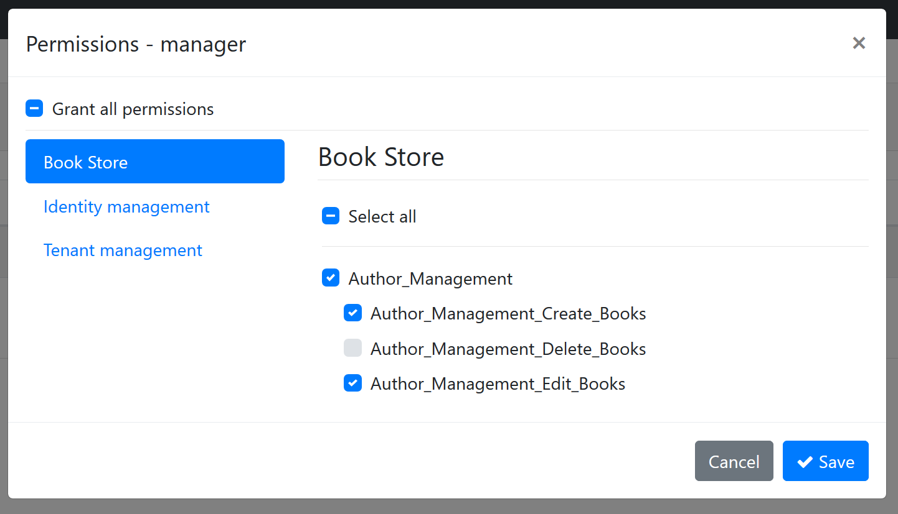

# Authorization

Authorization is used to check if a user is allowed to perform some specific operation in the application. 

ABP extends [ASP.NET Core's Authorization system](https://docs.microsoft.com/en-us/aspnet/core/security/authorization/introduction) by adding **permissions** as auto [policies](https://docs.microsoft.com/en-us/aspnet/core/security/authorization/policies) and allowing authorization system to be usable in the **[application services](Application-Services.md)** too.

So, all the ASP.NET Core authorization features and the documentation are valid in an ABP based application. This document focuses on the features added on top of them.

## Authorize Attribute

ASP.NET Core defines the [**Authorize**](https://docs.microsoft.com/en-us/aspnet/core/security/authorization/simple) attribute that can be used for an action, a controller or a page. ABP allows you to use the same attribute for an [application service](Application-Services.md) too.

Example:

````csharp
using System;
using System.Collections.Generic;
using System.Threading.Tasks;
using Microsoft.AspNetCore.Authorization;
using Volo.Abp.Application.Services;

namespace Acme.BookStore
{
    [Authorize]
    public class AuthorAppService : ApplicationService, IAuthorAppService
    {
        public Task<List<AuthorDto>> GetListAsync()
        {
            ...
        }

        [AllowAnonymous]
        public Task<AuthorDto> GetAsync(Guid id)
        {
            ...
        }

        [Authorize("BookStore_Author_Create")]
        public Task CreateAsync(CreateAuthorDto input)
        {
            ...
        }
    }
}

````

* `Authorize` attribute forces user to login to the application in order to use the `AuthorAppService` methods. So, `GetListAsync` method is only available to authenticated users.
* `AllowAnonymous` suppress the authentication. So, `GetAsync` method is available to everyone including unauthorized users.
* `[Authorize("BookStore_Author_Create")]` defines a policy (see [policy based authorization](https://docs.microsoft.com/en-us/aspnet/core/security/authorization/policies)) that is checked to authorize the current user.

"BookStore_Author_Create" is an arbitrary policy name. If you declare an attribute like that, ASP.NET Core authorization system expects a policy defined before.

You can of course implement your policies as stated in the ASP.NET Core documentation. But for simple true/false cases (that means a policy was granted a user or not), ABP defines the permission system explained in the next section.

## Permission System

A permission is a simple policy where it is granted or prohibited for a particular user, role or client.

### Defining Permissions

To define permissions, create a class inheriting from the `PermissionDefinitionProvider` as shown below:

````csharp
using Volo.Abp.Authorization.Permissions;

namespace Acme.BookStore.Permissions
{
    public class BookStorePermissionDefinitionProvider : PermissionDefinitionProvider
    {
        public override void Define(IPermissionDefinitionContext context)
        {
            var myGroup = context.AddGroup("BookStore");

            myGroup.AddPermission("BookStore_Author_Create");
        }
    }
}
````

> ABP will automatically discover this class. No additional configuration required.

In the `Define` method, you first need to add a **permission group** (or get an existing group) then add **permissions** to this group.

When you define a permission, it becomes usable in the ASP.NET Core authorization system as a **policy** name. It also becomes visible in the UI. See permissions dialog for a role:


* The "BookStore" group is shown as a new tab on the left side.
* "BookStore_Author_Create" on the right side is the permission name. You can grant or prohibit it for the role.

When you save the dialog, it is saved to the database and used in the authorization system.

> The screen above is available when you have installed the identity module, which is basically used for user and role management. Startup templates come with the identity module pre-installed.

#### Localizing the Permission Name

"BookStore_Author_Create" is not a good permission name on the UI. Fortunately, `AddPermission` and `AddGroup` methods can take `LocalizableString` as second parameters:

````csharp
var myGroup = context.AddGroup(
    "BookStore",
    LocalizableString.Create<BookStoreResource>("BookStore")
);

myGroup.AddPermission(
    "BookStore_Author_Create",
    LocalizableString.Create<BookStoreResource>("Permission:BookStore_Author_Create")
);
````

Then you can define texts for "BookStore" and "Permission:BookStore_Author_Create" keys in the localization file:

````json
"BookStore": "Book Store",
"Permission:BookStore_Author_Create": "Creating a new author"
````

> See the [localization document](Localization.md) for more details on the localization system.

The localized UI will be like that:


#### Multi-Tenancy

ABP supports [multi-tenancy](Multi-Tenancy.md) as a first class citizen. You can define multi-tenancy side option while defining a new permission. It gets one of the three values defined below:

* **Host**: The permission is available only for the host side.
* **Tenant**: The permission is available only for the tenant side.
* **Both** (default): The permission is available both for tenant and host sides.

> If your application is not multi-tenant, you can ignore this option.

To set the multi-tenancy side option, pass to the third parameter of the `AddPermission` method:

````csharp
myGroup.AddPermission(
    "BookStore_Author_Create",
    LocalizableString.Create<BookStoreResource>("Permission:BookStore_Author_Create"),
    multiTenancySide: MultiTenancySides.Tenant //set multi-tenancy side!
);
````

#### Child Permissions

A permission may have child permissions. It is especially useful when you want to create a hierarchical permission tree where a permission may have additional sub permissions which are available only if the parent permission has been granted.

Example definition:

````csharp
var authorManagement = myGroup.AddPermission("Author_Management");
authorManagement.AddChild("Author_Management_Create_Books");
authorManagement.AddChild("Author_Management_Edit_Books");
authorManagement.AddChild("Author_Management_Delete_Books");
````

The result on the UI is shown below (you probably want to localize permissions for your application):



For the example code, it is assumed that a role/user with "Author_Management" permission granted may have additional permissions. Then a typical application service that checks permissions can be defined as shown below:

````csharp
[Authorize("Author_Management")]
public class AuthorAppService : ApplicationService, IAuthorAppService
{
    public Task<List<AuthorDto>> GetListAsync()
    {
        ...
    }

    public Task<AuthorDto> GetAsync(Guid id)
    {
        ...
    }

    [Authorize("Author_Management_Create_Books")]
    public Task CreateAsync(CreateAuthorDto input)
    {
        ...
    }

    [Authorize("Author_Management_Edit_Books")]
    public Task UpdateAsync(CreateAuthorDto input)
    {
        ...
    }

    [Authorize("Author_Management_Delete_Books")]
    public Task DeleteAsync(CreateAuthorDto input)
    {
        ...
    }
}
````

* `GetListAsync` and `GetAsync` will be available to users if they have `Author_Management` permission granted.
* Other methods require additional permissions.

## IAuthorizationService

ASP.NET Core provides the `IAuthorizationService` that can be used to check for authorization. Once you inject, you can use it in your code to conditionally control the authorization.

Example:

````csharp
public async Task CreateAsync(CreateAuthorDto input)
{
    var result = await AuthorizationService
        .AuthorizeAsync("Author_Management_Create_Books");
    if (result.Succeeded == false)
    {
        //throw exception
        throw new AbpAuthorizationException("...");
    }

    //continue to the normal flow...
}
````

> `AuthorizationService` is available as a property when you derive from ABP's `ApplicationService` base class. Since it is widely used in application services, `ApplicationService` pre-injects it for you. Otherwise, you can directly [inject](Dependency-Injection.md) it into your class.

Since this is a typical code block, ABP provides extension methods to simplify it.

Example:

````csharp
public async Task CreateAsync(CreateAuthorDto input)
{
    await AuthorizationService.CheckAsync("Author_Management_Create_Books");

    //continue to the normal flow...
}
````

`CheckAsync` extension method throws `AbpAuthorizationException` if current user/client has not granted for the given permission. There is also `IsGrantedAsync` extension method that returns `true` or `false`.

> Tip: Prefer to use the `Authorize` attribute wherever possible, since it is declarative & simple. Use `IAuthorizationService` if you need to conditionally check a permission and run a business code based on the permission check.