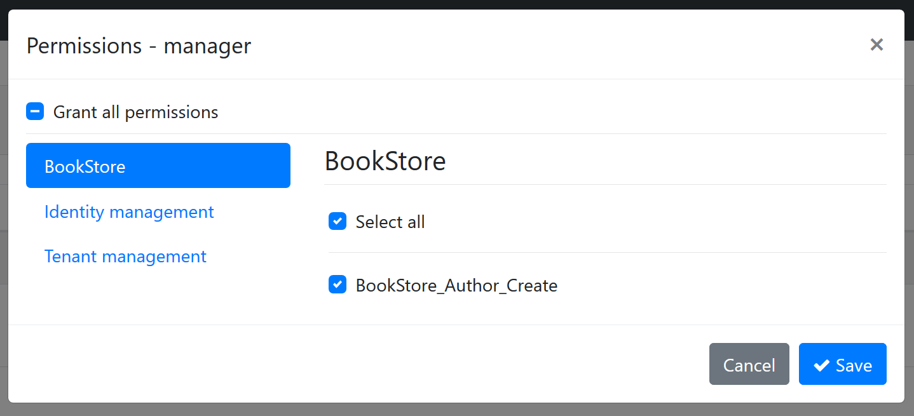
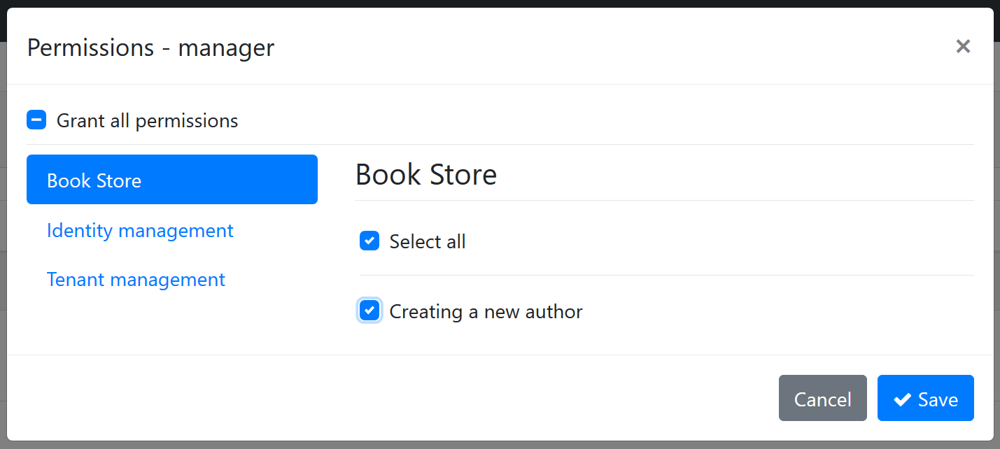

# Authorization

Authorization is used to check if a user is allowed to perform some specific operations in the application.

ABP extends [ASP.NET Core Authorization](https://docs.microsoft.com/en-us/aspnet/core/security/authorization/introduction) by adding **permissions** as auto [policies](https://docs.microsoft.com/en-us/aspnet/core/security/authorization/policies) and allowing authorization system to be usable in the **[application services](Application-Services.md)** too.

So, all the ASP.NET Core authorization features and the documentation are valid in an ABP based application. This document focuses on the features that added on top of ASP.NET Core authorization features.

## Authorize Attribute

ASP.NET Core defines the [**Authorize**](https://docs.microsoft.com/en-us/aspnet/core/security/authorization/simple) attribute that can be used for an action, a controller or a page. ABP allows you to use the same attribute for an [application service](Application-Services.md) too.

Example:

```csharp
using System;
using System.Collections.Generic;
using System.Threading.Tasks;
using Microsoft.AspNetCore.Authorization;
using Volo.Abp.Application.Services;

namespace Acme.BookStore
{
    [Authorize]
    public class AuthorAppService : ApplicationService, IAuthorAppService
    {
        public Task<List<AuthorDto>> GetListAsync()
        {
            ...
        }

        [AllowAnonymous]
        public Task<AuthorDto> GetAsync(Guid id)
        {
            ...
        }

        [Authorize("BookStore_Author_Create")]
        public Task CreateAsync(CreateAuthorDto input)
        {
            ...
        }
    }
}

```

- `Authorize` attribute forces the user to login into the application in order to use the `AuthorAppService` methods. So, `GetListAsync` method is only available to the authenticated users.
- `AllowAnonymous` suppresses the authentication. So, `GetAsync` method is available to everyone including unauthorized users.
- `[Authorize("BookStore_Author_Create")]` defines a policy (see [policy based authorization](https://docs.microsoft.com/en-us/aspnet/core/security/authorization/policies)) that is checked to authorize the current user.

"BookStore_Author_Create" is an arbitrary policy name. If you declare an attribute like that, ASP.NET Core authorization system expects a policy to be defined before.

You can, of course, implement your policies as stated in the ASP.NET Core documentation. But for simple true/false conditions like a policy was granted to a user or not, ABP defines the permission system which will be explained in the next section.

## Permission System

A permission is a simple policy that is granted or prohibited for a particular user, role or client.

### Defining Permissions

To define permissions, create a class inheriting from the `PermissionDefinitionProvider` as shown below:

```csharp
using Volo.Abp.Authorization.Permissions;

namespace Acme.BookStore.Permissions
{
    public class BookStorePermissionDefinitionProvider : PermissionDefinitionProvider
    {
        public override void Define(IPermissionDefinitionContext context)
        {
            var myGroup = context.AddGroup("BookStore");

            myGroup.AddPermission("BookStore_Author_Create");
        }
    }
}
```

> ABP automatically discovers this class. No additional configuration required!

> You typically define this class inside the `Application.Contracts` project of your [application](Startup-Templates/Application.md). The startup template already comes with an empty class named *YourProjectNamePermissionDefinitionProvider* that you can start with.

In the `Define` method, you first need to add a **permission group** or get an existing group then add **permissions** to this group.

When you define a permission, it becomes usable in the ASP.NET Core authorization system as a **policy** name. It also becomes visible in the UI. See permissions dialog for a role:



- The "BookStore" group is shown as a new tab on the left side.
- "BookStore_Author_Create" on the right side is the permission name. You can grant or prohibit it for the role.

When you save the dialog, it is saved to the database and used in the authorization system.

> The screen above is available when you have installed the identity module, which is basically used for user and role management. Startup templates come with the identity module pre-installed.

#### Localizing the Permission Name

"BookStore_Author_Create" is not a good permission name for the UI. Fortunately, `AddPermission` and `AddGroup` methods can take `LocalizableString` as second parameters:

```csharp
var myGroup = context.AddGroup(
    "BookStore",
    LocalizableString.Create<BookStoreResource>("BookStore")
);

myGroup.AddPermission(
    "BookStore_Author_Create",
    LocalizableString.Create<BookStoreResource>("Permission:BookStore_Author_Create")
);
```

Then you can define texts for "BookStore" and "Permission:BookStore_Author_Create" keys in the localization file:

```json
"BookStore": "Book Store",
"Permission:BookStore_Author_Create": "Creating a new author"
```

> For more information, see the [localization document](Localization.md) on the localization system.

The localized UI will be as seen below:



#### Multi-Tenancy

ABP supports [multi-tenancy](Multi-Tenancy.md) as a first class citizen. You can define multi-tenancy side option while defining a new permission. It gets one of the three values defined below:

- **Host**: The permission is available only for the host side.
- **Tenant**: The permission is available only for the tenant side.
- **Both** (default): The permission is available both for tenant and host sides.

> If your application is not multi-tenant, you can ignore this option.

To set the multi-tenancy side option, pass to the third parameter of the `AddPermission` method:

```csharp
myGroup.AddPermission(
    "BookStore_Author_Create",
    LocalizableString.Create<BookStoreResource>("Permission:BookStore_Author_Create"),
    multiTenancySide: MultiTenancySides.Tenant //set multi-tenancy side!
);
```

#### Enable/Disable Permissions

A permission is enabled by default. It is possible to disable a permission. A disabled permission will be prohibited for everyone. You can still check for the permission, but it will always return prohibited.

Example definition:

````csharp
myGroup.AddPermission("Author_Management", isEnabled: false);
````

You normally don't need to define a disabled permission (unless you temporary want disable a feature of your application). However, you may want to disable a permission defined in a depended module. In this way you can disable the related application functionality. See the "*Changing Permission Definitions of a Depended Module*" section below for an example usage.

> Note: Checking an undefined permission will throw an exception while a disabled permission check simply returns prohibited (false).

#### Child Permissions

A permission may have child permissions. It is especially useful when you want to create a hierarchical permission tree where a permission may have additional sub permissions which are available only if the parent permission has been granted.

Example definition:

```csharp
var authorManagement = myGroup.AddPermission("Author_Management");
authorManagement.AddChild("Author_Management_Create_Books");
authorManagement.AddChild("Author_Management_Edit_Books");
authorManagement.AddChild("Author_Management_Delete_Books");
```

The result on the UI is shown below (you probably want to localize permissions for your application):


For the example code, it is assumed that a role/user with "Author_Management" permission granted may have additional permissions. Then a typical application service that checks permissions can be defined as shown below:

```csharp
[Authorize("Author_Management")]
public class AuthorAppService : ApplicationService, IAuthorAppService
{
    public Task<List<AuthorDto>> GetListAsync()
    {
        ...
    }

    public Task<AuthorDto> GetAsync(Guid id)
    {
        ...
    }

    [Authorize("Author_Management_Create_Books")]
    public Task CreateAsync(CreateAuthorDto input)
    {
        ...
    }

    [Authorize("Author_Management_Edit_Books")]
    public Task UpdateAsync(CreateAuthorDto input)
    {
        ...
    }

    [Authorize("Author_Management_Delete_Books")]
    public Task DeleteAsync(CreateAuthorDto input)
    {
        ...
    }
}
```

- `GetListAsync` and `GetAsync` will be available to users if they have `Author_Management` permission is granted.
- Other methods require additional permissions.

### Overriding a Permission by a Custom Policy

If you define and register a policy to the ASP.NET Core authorization system with the same name of a permission, your policy will override the existing permission. This is a powerful way to extend the authorization for a pre-built module that you are using in your application.

See [policy based authorization](https://docs.microsoft.com/en-us/aspnet/core/security/authorization/policies) document to learn how to define a custom policy.

### Changing Permission Definitions of a Depended Module

A class deriving from the `PermissionDefinitionProvider` (just like the example above) can also get existing permission definitions (defined by the depended [modules](Module-Development-Basics.md)) and change their definitions.

Example:

````csharp
context
    .GetPermissionOrNull(IdentityPermissions.Roles.Delete)
    .IsEnabled = false;
````

When you write this code inside your permission definition provider, it finds the "role deletion" permission of the [Identity Module](Modules/Identity.md) and disabled the permission, so no one can delete a role on the application.

> Tip: It is better to check the value returned by the `GetPermissionOrNull` method since it may return null if the given permission was not defined.

### Permission Depending on a Condition

You may want to disable a permission based on a condition. Disabled permissions are not visible on the UI and always returns `prohibited` when you check them. There are two built-in conditional dependencies for a permission definition;

* A permission can be automatically disabled if a [Feature](Features.md) was disabled.
* A permission can be automatically disabled if a [Global Feature](Global-Features.md) was disabled.

In addition, you can create your custom extensions.

#### Depending on a Features

Use the `RequireFeatures` extension method on your permission definition to make the permission available only if a given feature is enabled:

````csharp
myGroup.AddPermission("Book_Creation")
    .RequireFeatures("BookManagement");
````

#### Depending on a Global Feature

Use the `RequireFeatures` extension method on your permission definition to make the permission available only if a given feature is enabled:

````csharp
myGroup.AddPermission("Book_Creation")
    .RequireGlobalFeatures("BookManagement");
````

#### Creating a Custom Permission Dependency

`PermissionDefinition` supports state check, Please refer to [Simple State Checker's documentation](SimpleStateChecker.md) 

## IAuthorizationService

ASP.NET Core provides the `IAuthorizationService` that can be used to check for authorization. Once you inject, you can use it in your code to conditionally control the authorization.

Example:

```csharp
public async Task CreateAsync(CreateAuthorDto input)
{
    var result = await AuthorizationService
        .AuthorizeAsync("Author_Management_Create_Books");
    if (result.Succeeded == false)
    {
        //throw exception
        throw new AbpAuthorizationException("...");
    }

    //continue to the normal flow...
}
```

> `AuthorizationService` is available as a property when you derive from ABP's `ApplicationService` base class. Since it is widely used in application services, `ApplicationService` pre-injects it for you. Otherwise, you can directly [inject](Dependency-Injection.md) it into your class.

Since this is a typical code block, ABP provides extension methods to simplify it.

Example:

```csharp
public async Task CreateAsync(CreateAuthorDto input)
{
    await AuthorizationService.CheckAsync("Author_Management_Create_Books");

    //continue to the normal flow...
}
```

`CheckAsync` extension method throws `AbpAuthorizationException` if the current user/client is not granted for the given permission. There is also `IsGrantedAsync` extension method that returns `true` or `false`.

`IAuthorizationService` has some overloads for the `AuthorizeAsync` method. These are explained in the [ASP.NET Core authorization documentation](https://docs.microsoft.com/en-us/aspnet/core/security/authorization/introduction).

> Tip: Prefer to use the `Authorize` attribute wherever possible, since it is declarative & simple. Use `IAuthorizationService` if you need to conditionally check a permission and run a business code based on the permission check.

## Check a Permission in JavaScript

See the following documents to learn how to re-use the authorization system on the client side:

* [ASP.NET Core MVC / Razor Pages UI: Authorization](UI/AspNetCore/JavaScript-API/Auth.md)
* [Angular UI Authorization](UI/Angular/Permission-Management.md)
* [Blazor UI Authorization](UI/Blazor/Authorization.md)

## Permission Management

Permission management is normally done by an admin user using the permission management modal:


If you need to manage permissions by code, inject the `IPermissionManager` and use as shown below:

```csharp
public class MyService : ITransientDependency
{
    private readonly IPermissionManager _permissionManager;

    public MyService(IPermissionManager permissionManager)
    {
        _permissionManager = permissionManager;
    }

    public async Task GrantPermissionForUserAsync(Guid userId, string permissionName)
    {
        await _permissionManager.SetForUserAsync(userId, permissionName, true);
    }

    public async Task ProhibitPermissionForUserAsync(Guid userId, string permissionName)
    {
        await _permissionManager.SetForUserAsync(userId, permissionName, false);
    }
}
```

`SetForUserAsync` sets the value (true/false) for a permission of a user. There are more extension methods like `SetForRoleAsync` and `SetForClientAsync`.

`IPermissionManager` is defined by the permission management module. See the [permission management module documentation](Modules/Permission-Management.md) for more information.

## Advanced Topics

### Permission Value Providers

Permission checking system is extensible. Any class derived from `PermissionValueProvider` (or implements `IPermissionValueProvider`) can contribute to the permission check. There are three pre-defined value providers:

- `UserPermissionValueProvider` checks if the current user is granted for the given permission. It gets user id from the current claims. User claim name is defined with the `AbpClaimTypes.UserId` static property.
- `RolePermissionValueProvider` checks if any of the roles of the current user is granted for the given permission. It gets role names from the current claims. Role claims name is defined with the `AbpClaimTypes.Role` static property.
- `ClientPermissionValueProvider` checks if the current client is granted for the given permission. This is especially useful on a machine to machine interaction where there is no current user. It gets the client id from the current claims. Client claim name is defined with the `AbpClaimTypes.ClientId` static property.

You can extend the permission checking system by defining your own permission value provider.

Example:

```csharp
public class SystemAdminPermissionValueProvider : PermissionValueProvider
{
    public SystemAdminPermissionValueProvider(IPermissionStore permissionStore)
        : base(permissionStore)
    {
    }

    public override string Name => "SystemAdmin";

    public async override Task<PermissionGrantResult>
           CheckAsync(PermissionValueCheckContext context)
    {
        if (context.Principal?.FindFirst("User_Type")?.Value == "SystemAdmin")
        {
            return PermissionGrantResult.Granted;
        }

        return PermissionGrantResult.Undefined;
    }
}
```

This provider allows for all permissions to a user with a `User_Type` claim that has `SystemAdmin` value. It is common to use current claims and `IPermissionStore` in a permission value provider.

A permission value provider should return one of the following values from the `CheckAsync` method:

- `PermissionGrantResult.Granted` is returned to grant the user for the permission. If any of the providers return `Granted`, the result will be `Granted`, if no other provider returns `Prohibited`.
- `PermissionGrantResult.Prohibited` is returned to prohibit the user for the permission. If any of the providers return `Prohibited`, the result will always be `Prohibited`. Doesn't matter what other providers return.
- `PermissionGrantResult.Undefined` is returned if this value provider could not decide about the permission value. Return this to let other providers check the permission.

Once a provider is defined, it should be added to the `AbpPermissionOptions` as shown below:

```csharp
Configure<AbpPermissionOptions>(options =>
{
    options.ValueProviders.Add<SystemAdminPermissionValueProvider>();
});
```

### Permission Store

`IPermissionStore` is the only interface that needs to be implemented to read the value of permissions from a persistence source, generally a database system. The Permission Management module implements it  and pre-installed in the application startup template. See the [permission management module documentation](Modules/Permission-Management.md) for more information

### AlwaysAllowAuthorizationService

`AlwaysAllowAuthorizationService` is a class that is used to bypass the authorization service. It is generally used in integration tests where you may want to disable the authorization system.

Use `IServiceCollection.AddAlwaysAllowAuthorization()` extension method to register the `AlwaysAllowAuthorizationService` to the [dependency injection](Dependency-Injection.md) system:

```csharp
public override void ConfigureServices(ServiceConfigurationContext context)
{
    context.Services.AddAlwaysAllowAuthorization();
}
```

This is already done for the startup template integration tests.

### Claims Principal Factory

Claims are important elements of authentication and authorization. ABP uses the `IAbpClaimsPrincipalFactory` service to create claims on authentication. This service was designed as extensible. If you need to add your custom claims to the authentication ticket, you can implement the `IAbpClaimsPrincipalContributor` in your application.

**Example: Add a `SocialSecurityNumber` claim:**

```csharp
public class SocialSecurityNumberClaimsPrincipalContributor : IAbpClaimsPrincipalContributor, ITransientDependency
{
    public async Task ContributeAsync(AbpClaimsPrincipalContributorContext context)
    {
        var identity = context.ClaimsPrincipal.Identities.FirstOrDefault();
        var userId = identity?.FindUserId();
        if (userId.HasValue)
        {
            var userService = context.ServiceProvider.GetRequiredService<IUserService>(); //Your custom service
            var socialSecurityNumber = await userService.GetSocialSecurityNumberAsync(userId.Value);
            if (socialSecurityNumber != null)
            {
                identity.AddClaim(new Claim("SocialSecurityNumber", socialSecurityNumber));
            }
        }
    }
}
```

## See Also

* [Permission Management Module](Modules/Permission-Management.md)
* [ASP.NET Core MVC / Razor Pages JavaScript Auth API](UI/AspNetCore/JavaScript-API/Auth.md)
* [Permission Management in Angular UI](UI/Angular/Permission-Management.md)
