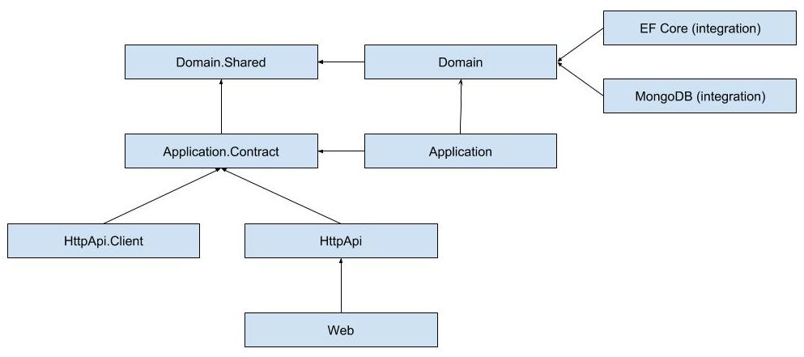

## Module Architecture Best Practices & Conventions

### Solution Structure

* **Do** create a separated Visual Studio solution for every module.
* **Do** name the solution as *CompanyName.ModuleName* (for core ABP modules, it's *Volo.Abp.ModuleName*).
* **Do** develop the module as layered, so it has several packages (projects) those are related to each other.
  * Every package has its own module definition file and explicitly declares the dependencies for the depended packages/modules.

### Layers & Packages

The following diagram shows the packages of a well-layered module and dependencies of those packages between them:

The ultimate goal is to allow an application to use the module in a flexible manner. Example applications:

* **A)** A **monolithic** application;
  * Adds references to the **Web** and the **Application** packages.
  * Adds a reference to one of the **EF Core** or the **MongoDB** packages based on the preference.
  * The result;
    * The application **can show UI** of the module.
    * It hosts the **application** and **domain** layers in the **same process** (that's why it needs to have a reference to a database integration package).
    * This application also **serves** the module's **HTTP API** (since it includes the HttpApi package through the Web package).
* **B)** An application that just serves the module as a **microservice**;
  * Adds a reference to **HttpApi** and **Application** packages.
  * Adds a reference to one of the **EF Core** or the **MongoDB** packages based on the preference.
  * The result;
    * The application **can not show UI** of the module since it does not have a reference to the Web package.
    * It hosts the **application** and **domain** layers in the **same process** (that's why it needs to have a reference to a database integration package).
    * This application **serves** the module's **HTTP API** (as the main goal of the application).
* **C)** An application that shows the module **UI** but does not host the application (just uses it as a remote service that is hosted by the application A or B);
  * Adds a reference to the **Web** and the **HttpApi.Client** packages.
  * Configures the remote endpoint for the HttpApi.Client package.
  * The result;
    * The application **can show UI** of the module.
    * It does not host the application and domain layers of the module in the same process. Instead, uses it as a **remote service**.
    * This application also **serves** the module's **HTTP API** (since it includes the HttpApi package through the Web package).
* **D)** A **client** application (or microservice) that just uses the module as a remote service (that is hosted by the application A, B or C);
  * Adds a reference to the **HttpApi.Client** package.
  * Configures the remote endpoint for the HttpApi.Client package.
  * The result;
    * The application can use all the functionality of the module as a **remote client**.
    * The application is just a client and **can not serve** the **HTTP API** of the module.
    * The application is just a client and **can not show** the **UI** of the module.
* **E**) A proxy application that hosts the HTTP API of the module but just forwards all requests to another application (that is hosted by the application A, B or C);
  * Adds a reference to the **HttpApi** and **HttpApi.Client** packages.
  * Configures the remote endpoint for the HttpApi.Client package.
  * The result;
    * The application can use all the functionality of the module as a **remote client**.
    * This application also **serves** the module's **HTTP API**, but actually works just like a proxy by redirecting all requests (for the module) to another remote server.

Next section describes the packages in more details.

#### Domain Layer

* **Do** divide the domain layer into two projects:
  * **Domain.Shared** package, named as *CompanyName.ModuleName.Domain.Shared*, that contains constants, enums and other types those can be safely shared with the all layers of the module. This package can also be shared to 3rd-party clients. It can not contain entities, repositories, domain services or any other business objects.
  * **Domain** package, named as *CompanyName.ModuleName.Domain*, that contains entities, repository interfaces, domain service interfaces and their implementations and other domain objects.
    * Domain package depends on the **Domain.Shared** package.

#### Application Layer

* **Do** divide the application layer into two projects:
  * **Application.Contracts** package, named as *CompanyName.ModuleName.Application.Contracts*, that contains application service interfaces and related data transfer objects.
    * Application contract package depends on the **Domain.Shared** package.
  * **Application** package, named as *CompanyName.ModuleName.Application*, that contains application service implementations.
    * Application package depends on the **Domain** and the **Application.Contracts** packages.

#### Infrastructure Layer

* **Do** create a separated integration package for each ORM/database integration like Entity Framework Core and MongoDB.
  * **Do**, for instance, create a *CompanyName.ModuleName.EntityFrameworkCore* package that abstracts the Entity Framework Core integration. ORM integration packages depend on the **Domain** package.
  * **Do not** depend on other layers from the ORM/database integration package.
* **Do** create a separated integration package for each major library that is planned to be replaceable by another library without effecting the other packages.

#### HTTP Layer

* **Do** create an **HTTP API** package, named as *CompanyName.ModuleName.HttpApi*, to develop a REST style HTTP API for the module.
  * HTTP API package only depends on the **Application.Contracts** package. It does not depend on the Application package.
  * **Do** create a Controller for each application service (generally by implementing their interfaces). These controllers uses the application service interfaces to delegate the actions. It just configures routes, HTTP methods and other web related stuffs if needed.
* **Do** create an **HTTP API Client** package, named as *CompanyName.ModuleName.HttpApi.Client*, to provide client services for the HTTP API package. Those client services implement application interfaces as clients to a remote endpoint.
  * HTTP API Client package only depends on the **Application.Contracts** package.
  * **Do** use dynamic HTTP C# client proxy feature of the ABP framework.

#### Web Layer

* **Do** create a **Web** package, named as *CompanyName.ModuleName.Web*, that contains pages, views, scripts, styles, images and other UI components.
  * Web package only depends on the **HttpApi** package.