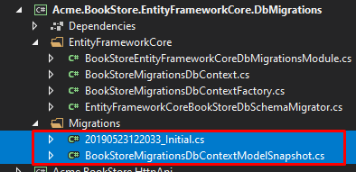
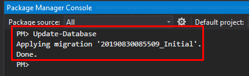

## Entity Framework Core PostgreSQL Integration

> See [Entity Framework Core Integration document](../Entity-Framework-Core.md) for the basics of the EF Core integration.

### EntityFrameworkCore Project Update

- In `Acme.BookStore.EntityFrameworkCore` project replace package `Volo.Abp.EntityFrameworkCore.SqlServer` with `Volo.Abp.EntityFrameworkCore.PostgreSql` 
- Update to use PostgreSQL in `BookStoreEntityFrameworkCoreModule`
  - Replace the `AbpEntityFrameworkCoreSqlServerModule` with the `AbpEntityFrameworkCorePostgreSqlModule`
  - Replace the `options.UseSqlServer()` with the `options.UsePostgreSql()`
- In other projects update the PostgreSQL connection string in necessary `appsettings.json` files
  - more info of [PostgreSQL connection strings](https://www.connectionstrings.com/postgresql/),You need to pay attention to `Npgsql` in this document

###  EntityFrameworkCore.DbMigrations Project Update
- Update to use PostgreSQL in `XXXMigrationsDbContextFactory`
  - Replace the `new DbContextOptionsBuilder<XXXMigrationsDbContext>().UseSqlServer()` with the `new DbContextOptionsBuilder<XXXMigrationsDbContext>().UseNpgsql()`

### Delete Existing Migrations

Delete all existing migration files (including `DbContextModelSnapshot`)



### Regenerate Initial Migration

Set the correct startup project (usually a web project)


Open the **Package Manager Console** (Tools -> Nuget Package Manager -> Package Manager Console), select the `.EntityFrameworkCore.DbMigrations` as the **Default project** and execute the following command:

Run `Add-Migration` command.
````
PM> Add-Migration Initial
````

### Update the Database

You have two options to create the database.

#### Using the DbMigrator Application

The solution contains a console application (named `Acme.BookStore.DbMigrator` in this sample) that can create database, apply migrations and seed initial data. It is useful on development as well as on production environment.

> `.DbMigrator` project has its own `appsettings.json`. So, if you have changed the connection string above, you should also change this one.

Right click to the `.DbMigrator` project and select **Set as StartUp Project**:


Hit F5 (or Ctrl+F5) to run the application. It will have an output like shown below:


#### Using EF Core Update-Database Command

Ef Core has `Update-Database` command which creates database if necessary and applies pending migrations.

Set the correct startup project (usually a web project)


Open the **Package Manager Console** (Tools -> Nuget Package Manager -> Package Manager Console), select the `.EntityFrameworkCore.DbMigrations` as the **Default project** and execute the following command:

````
PM> Update-Database
````

This will create a new database based on the configured connection string.



> Using the `.DbMigrator` tool is the suggested way, because it also seeds the initial data to be able to properly run the web application.
