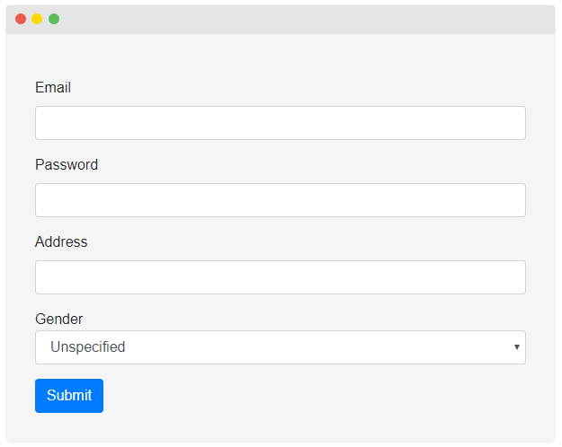

### Introduction
For a while, we were working to design a new major version of the ASP.NET Boilerplate framework. Now, it’s time to share it with the community. We are too excited and we believe that you are too.

#### Naming
The name of the framework remains same, except we will call it only as “ABP” instead of “ASP.NET Boilerplate”. Because, the “boilerplate” word leads to misunderstandings and does not reflect that it is a framework (instead of some boilerplate code). We continue to use the “ABP” name since it’s the successor of the current ASP.NET Boilerplate framework, except it’s a rewrite.

### How To Start

We have created a startup template. You can just create a new project from https://abp.io/Templates and start your development. For more information, visit [abp.io](https://abp.io).

### Why A Complete Rewrite?
Why we spent our valuable time to rewrite it from scratch instead of incremental changes and improvements. Why?

#### ASP.NET Core
When we first introduced the ABP framework, it was 2013 (5 years ago)! There was no .Net Core & ASP.NET Core and there was no Angular2+. They were all developed from scratch after ABP’s release.

ASP.NET Core introduced many built-in solutions (extension libraries) for dependency injection, logging, caching, localization, configuration and so on. These are actually independent from the ASP.NET Core and usable for any type of application.

We were using 3rd-party libraries and our own solutions for these requirements. We immediately integrated to ASP.NET Core features once they were released. But that was an integration, instead of building the ABP framework on top of these extension libraries. For instance, current ASP.NET Boilerplate still depends on Castle Windsor for dependency injection even it’s integrated to ASP.NET Core’s DI system.

We wanted to depend on these new extension libraries instead of 3rd-party and custom solutions and this changes fundamental structures of the framework.

#### Self Modularization
While current ABP is already modular itself and consists of dozens of packages, we still wanted to split the functionalities to more fine grained nuget packages.

For example, the core Abp package contains many features like DDD classes, auditing, authorization, background jobs, event bus, json serialization, localization, multi-tenancy, threading, timing and so on… We wanted to split all these functionality into their own packages and make them optional.

#### Dropping Support for Legacy Technologies
Yes, the new ABP framework will not support ASP.NET MVC 5.x, Entity Framework 6.x and other legacy technologies.

These legacy technologies are maintained by Microsoft but no new feature is being added. So, if you are still using these technologies, you can continue with the current ASP.NET Boilerplate framework. We will continue to maintain it, fix bugs and will add new features.

Dropping support for these legacy libraries will improve our development speed (since we currently duplicate our work for some features) and concentrate on the .Net Core & ASP.NET Core.

The new ABP framework will be based on .net standard. So, it’s still possible to use full .net framework or .net core with the new ABP framework.

### Goals
We have learnt much from the community and had experience of developing the current ASP.NET Boilerplate framework. New ABP framework has significant and exciting goals.

#### Application Modularity
The first goal is to provide a good infrastructure to develop application modules. We think a module as a set of application features with its own database, its own entities, services, APIs, UI pages, components and so on.

We will create a module market which will contain free & paid application modules. You will also be able to publish your own modules on the market. More information will be coming soon.

#### Microservices
We are designing the new ABP framework to be ready to develop microservices and communicate them to each other.

We are designing application modules so that they can be separately deployable as microservices or they can be embedded into a monolithic application.

We are creating a [specification / best practice documentation](https://github.com/abpframework/abp/blob/master/docs/Best-Practices/Index.md) for that.

#### Theming and UI Composition
The new ABP framework will provide a theming infrastructure based on the latest Twitter Bootstrap 4.x. We developed a basic theme that only uses the plain Bootstrap 4.x styling. It’s free and open source. We are also developing premium & paid themes.

UI Composition is one of the main goals. For this purpose, theme system will provide menus, toolbars and other extensible areas to allow other modules to contribute.

#### ORM/Database Independence & MongoDB Integration
While current ASP.NET Boilerplate framework has implemented the repository pattern for ORM/Database independence, identity integration module (Abp.Zero* packages) has never worked well with ORMs other than EF.

With the new ABP framework, the ultimate goal is completely abstract underlying data store system and develop modules EF Core independent.

We embrace the MongoDB as a first-class citizen database and designing entities and repositories without any relational database or ORM assumption.

#### More Extensibility
New ABP framework provides more extensibility points and overriding capabilities for built-in services.

### Some Features
In this section, I will introduce some exciting new features of the new ABP framework.

#### Bootstrap Tag Helpers
We are creating a library to wrap twitter bootstrap 4.x elements/components into tag helpers. Example:

````C#
<abp-card>
    
    <abp-card-body>
        <abp-card-title>Card title</abp-card-title>
        <abp-card-text>
            <p>
                This is a sample card component built by ABP bootstrap
                card tag helper. ABP has tag helper wrappers for most of
                the bootstrap components.
            </p>
        </abp-card-text>
        <a abp-button="Primary" href="#">Go somewhere &rarr;</a>
    </abp-card-body>
</abp-card>
````

"abp-*" tags are ABP tag helpers to simplify writing HTML for Bootstrap 4.x.

#### Dynamic Forms
Dynamic forms tag helper allows you to dynamically create forms for given model classes. Example:

````C#
<abp-dynamic-form abp-model="@Model.PersonInput" submit-button="true" />
````

Output:



It currently supports most used input types and more in the development.

#### Virtual File System
Virtual File System allows you to embed views, pages, components, javascript, css, json and other type of files into your module assembly/package (dll) and use your assembly in any application. Your virtual files behave just like physical files in the containing application with complete ASP.NET Core Integration.

Read more [about the Virtual File System](https://medium.com/volosoft/designing-modularity-on-asp-net-core-virtual-file-system-2dd2cc2078bd) and see [its documentation](https://github.com/abpframework/abp/blob/master/docs/Virtual-File-System.md).

#### Dynamic Bundling & Minification System
Dynamic bundling & minification system works on the virtual file system and allows modules to create, modify and contribute to bundles in a modular, dynamic and powerful way. An example:

````C#
<abp-style-bundle>
    <abp-style type="@typeof(BootstrapStyleContributor)" />
    <abp-style src="/libs/font-awesome/css/font-awesome.css" />
    <abp-style src="/libs/toastr/toastr.css" />
</abp-style-bundle>
````

This code creates a new style bundle on the fly by including bootstrap (and its dependencies if there are) and two more css files. These files are bundled & minified on production environment, but will be added individually on the development environment.

See [the documentation](https://github.com/abpframework/abp/blob/master/docs/UI/AspNetCore/Bundling-Minification.md) for more.

#### Distributed Event Bus
In current ABP, there is an IEventBus service to trigger and handle events inside the application. In addition to this local event bus, we are creating a distributed event bus abstraction (and RabbitMQ integration) to implement distributed messaging patterns.

#### Dynamic C# HTTP Client Proxies
ABP was already creating dynamic javascript proxies for all HTTP APIs. This feature does also exists in the new ABP framework. In addition, it now can create dynamic C# proxies for all HTTP APIs.

### Future Works
All the stuffs mentioned above are already in development. However, we haven’t started some concepts yet.

#### Single Page Applications
We designed the new framework SPAs in mind. However, we haven’t tried it with any SPA framework and we haven’t prepared a startup template for it yet.

### What About ASP.NET Boilerplate (Current Version) and ASP.NET Zero?

We have dedicated development & support teams actively working on the [ASP.NET Boilerplate](https://aspnetboilerplate.com/) and [ASP.NET Zero](https://aspnetzero.com/) projects. These projects have a big community and we are also getting contributions from the community.

We will continue to make enhancements, add new features and fix bugs for these projects for a long time. So, you can safely continue to use them.

### Is New ABP Production Ready?
No, not yet. Our first goal is to make fundamental features stable then incrementally complete other features.

We will frequently release new versions and every new version will probably have breaking changes. We will write breaking changes on the release notes.

We currently define it experimental. But we hope that this will not continue for a long time. We can not declare a date yet, follow our releases.

### Packages & Versioning
New ABP framework will start with v1.0 instead of following current ASP.NET Boilerplate's version to reflect the fact that it’s a rewrite.

We will frequently [release](https://github.com/abpframework/abp/releases) it. You can expect many breaking changes until v1.0. Starting with the v1.0, we will pay attention to not introduce breaking changes in 1.x releases.

Current ABP’s package names start with [Abp](https://www.nuget.org/packages/Abp) prefix (like Abp.EntityFrameworkCore). New package names start with [Volo.Abp](https://www.nuget.org/packages/Volo.Abp.Core) prefix (like Volo.Abp.EntityFrameworkCore).

### Which One Should I Start With?
If you are creating a new project, we suggest to continue with the current ASP.NET Boilerplate framework since it’s very mature, feature rich and production ready.

If you are open to breaking changes and want to have experience on the new framework, you can start with the new ABP. We don’t suggest it yet for projects with close deadlines and go to the production in a short term.

### Contribution
Just like the current ABP framework, the new framework is available for your contribution.

* You can send pull requests for code or documentation.
* You can write blog posts or tutorials about it.
* You can try it and share your experiences.
* You can create enhancement and feature requests.
* You can report bugs and other issues.

### Communication / Links
* **Official web site**: [abp.io](https://abp.io)
* **Github**: [github.com/abpframework](https://github.com/abpframework)
* **Twitter**: [@abpframework](https://twitter.com/abpframework)