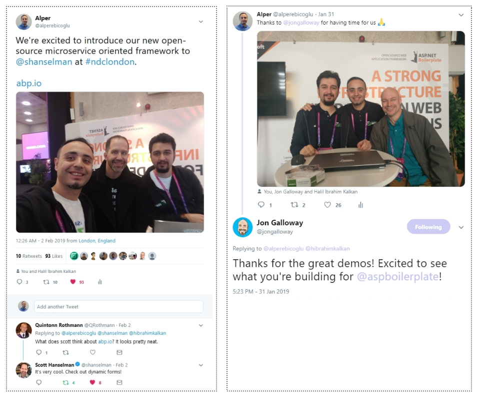

# Microservice Demo, Projects Status and Road Map

After [the first announcement](https://blog.abp.io/Abp-vNext-Announcement) on the ABP vNext, we have a lot of improvements on the codebase (1100+ commits on the [GitHub repository](https://github.com/abpframework/abp)). We've created features, samples, documentation and much more. In this post, I want to inform you about some news and the status of the project.

## Microservice Demo Solution

One of the major goals of the ABP framework is to provide a [convenient infrastructure to create microservice solutions](https://abp.io/documents/abp/latest/Microservice-Architecture).

We've been working to develop a microservice solution demo. Initial version was completed and [documented](https://abp.io/documents/abp/latest/Samples/Microservice-Demo). This sample solution aims to demonstrate a simple yet complete microservice solution;

- Has multiple, independent, self-deployable **microservices**.
- Multiple **web applications**, each uses a different API gateway.
- Has multiple **gateways** / BFFs (Backend for Frontends) developed using the [Ocelot](https://github.com/ThreeMammals/Ocelot) library.
- Has an **authentication service** developed using the [IdentityServer](https://identityserver.io/) framework. It's also a SSO (Single Sign On) application with necessary UIs.
- Has **multiple databases**. Some microservices has their own database while some services/applications shares a database (to demonstrate different use cases).
- Has different types of databases: **SQL Server** (with **Entity Framework Core** ORM) and **MongoDB**.
- Has a **console application** to show the simplest way of using a service by authenticating.
- Uses [Redis](https://redis.io/) for **distributed caching**.
- Uses [RabbitMQ](https://www.rabbitmq.com/) for service-to-service **messaging**.
- Uses [Docker](https://www.docker.com/) & [Kubernates](https://kubernetes.io/) to **deploy** & run all services and applications.
- Uses [Elasticsearch](https://www.elastic.co/products/elasticsearch) & [Kibana](https://www.elastic.co/products/kibana) to store and visualize the logs (written using [Serilog](https://serilog.net/)).

See [its documentation](https://abp.io/documents/abp/latest/Samples/Microservice-Demo) for a detailed explanation of the solution. 

## Improvements/Features

We've worked on so many features including **distributed event bus** (with RabbitMQ integration), **IdentityServer4 integration** and enhancements for almost all features. We are continuously refactoring and adding tests to make the framework more stable and production ready. It is [rapidly growing](https://github.com/abpframework/abp/graphs/contributors).

## Road Map

There are still too much work to be done before the first stable release (v1.0). You can see [prioritized backlog items](https://github.com/abpframework/abp/issues?q=is%3Aopen+is%3Aissue+milestone%3ABacklog) on the GitHub repo.

According to our estimation, we have planned to release v1.0 in Q2 of 2019 (probably in May or June). So, not too much time to wait. We are also very excited for the first stable release.

We will also work on [the documentation](https://abp.io/documents/abp/latest) since it is far from complete now.

First release may not include a SPA template. However, we want to prepare a simple one if it can be possible. Haven't decided yet about the SPA framework. Alternatives: **Angular, React and Blazor**. Please write your thought as a comment to this post.

## Chinese Web Site

There is a big ABP community in China. They have created a Chinese version of the abp.io web site: https://abp.io/ They are keeping it up to date. Thanks to the Chinese developers and especially to [Liming Ma](https://github.com/maliming).

## NDC {London} 2019

It was a pleasure to be in [NDC {London}](https://ndc-london.com/) 2019 as a partner. We've talked to many developers about the current ASP.NET Boilerplate and the ABP vNext and we got good feedbacks.

We also had a chance to talk with [Scott Hanselman](https://twitter.com/shanselman) and [Jon Galloway](https://twitter.com/jongalloway). They visited our booth and we talked about the ideas for ABP vNext. They liked features, approaches and the goal of new ABP framework. See some photos and comments on twitter: 

## Follow It

* You can star and follow the **GitHub** repository: https://github.com/abpframework/abp
* You can follow the official **Twitter** account for news: https://twitter.com/abpframework