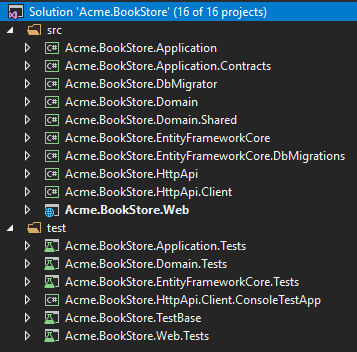

# ABP CLI, New Templates & Other Features with the v0.18 Release

ABP v0.18 has been released with 70+ issues resolved and 500+ commits pushed.

## Web Site Changes

The [abp.io](https://abp.io) web site is **completely renewed**. Documents & blog URLs are also changed:

- `abp.io/documents` changed to `docs.abp.io`
- `abp.io/blog` changed to `blog.abp.io`

## ABP CLI

ABP CLI (Command Line Interface) is a command line tool to perform some common operations for ABP based solutions. Main functions are;

* Creating a new application or module project.
* Adding a new module to an application.
* Updating all ABP related packages in a solution.

ABP CLI is now the preferred way to create a new project, while you can still download a new project from the [get started](https://abp.io/get-started) page.

### Usage

Install the ABP CLI using a command line window:

````bash
dotnet tool install -g Volo.Abp.Cli
````

Create a new application:

````bash
abp new Acme.BookStore
````

Add a module to an application:

````bash
abp add-module Volo.Blogging
````

Update all ABP related packages in a solution:

````bash
abp update
````

See [ABP CLI documentation](https://docs.abp.io/en/abp/latest/CLI) for details.

## New Templates

In this release, we've renewed all startup templates. The main goal is to provide better startup templates based on Domain Driven Design layers those also allow to create tiered solutions (where Web and API layers can be physically separated). It also includes unit & integration test projects separated for different layers.

The image below shows the new startup project for an MVC application.



See the [startup templates document](https://docs.abp.io/en/abp/latest/Startup-Templates/Index) for details.

## Change Logs

Here are some new features and important enhancements come with this release:

* New data seed system with `IDataSeeder` service & `IDataSeedContributor` interface to allow a modular initial data seed system.
* New [Volo.Abp.Specifications](https://www.nuget.org/packages/Volo.Abp.Specifications) package.
* Improved MemoryDB implementation to serialize/deserialize objects stored in memory, so it provides more realistic infrastructure for mocking database in unit/integration tests.
* Added multi-language support for the docs module. Used it for the [ABP documentation](https://docs.abp.ip).

See the [GitHub Release Notes](https://github.com/abpframework/abp/releases/tag/0.18.0) for all features, enhancements & bugfixes in this release.