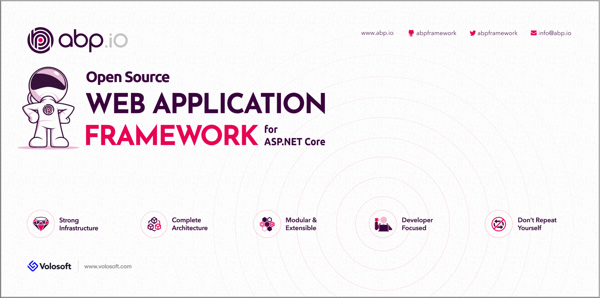

# ABP v0.21 Has Been Released based on the ASP.NET Core 3.0

Just one hour after Microsoft released it, ABP v0.21 [has been released](https://twitter.com/abpframework/status/1176185493119258624) based on the ASP.NET Core 3.0.

v0.21 has no new feature. It just upgrades to the stable ASP.NET Core 3.0. Check [v0.20 release notes](https://github.com/abpframework/abp/releases/tag/0.20.0) for new features, enhancements and bug fixes.

## About v1.0

ABP framework is getting closer to v1.0. We intent to release it in the middle of this October. In this time, we will test and document more.

## .NET Conf 2019

Microsoft has lunched ASP.NET Core 3.0 in the .NET Conf 2019, a 3-days virtual conference. ABP's lead developer [Halil ibrahim Kalkan](https://twitter.com/hibrahimkalkan) has also talked in the conference to introduce the ABP framework. It was great to be a part of this important event.

## Techorama Netherlands 2019

[Techorama NL](https://techorama.nl/) is one of the biggest conferences in Europe. This year, Volosoft is a sponsor of the conference and will have a booth to talk to software developers about the ABP framework and software development. Our booth wall will look like shown below:

If you are in the conference, come to out booth to talk about the ABP framework. We will also have nice swags for you :)