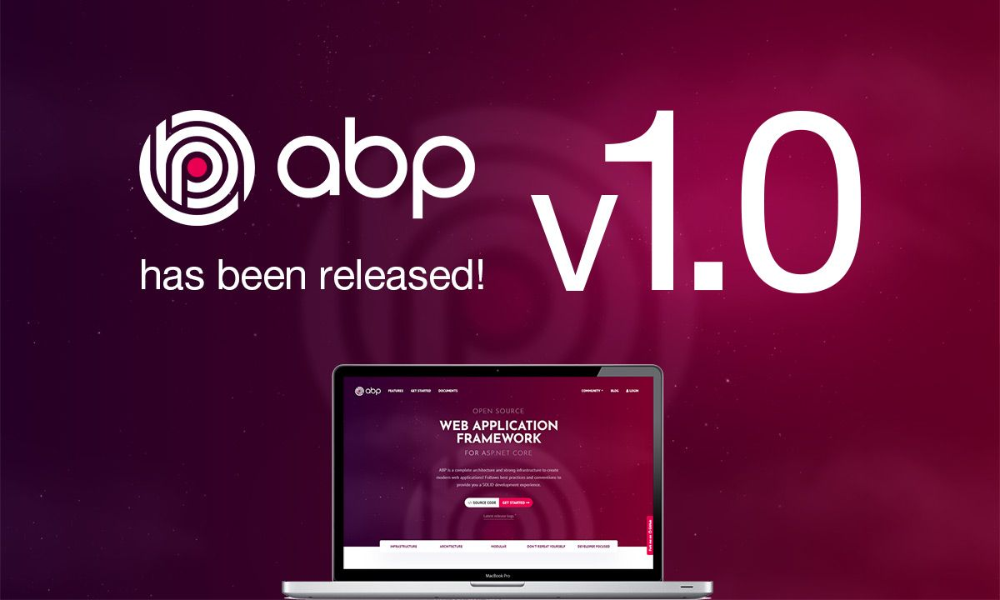

# ABP v1.0 Has Been Finally Released!

Today is the big day! After ~3 years of continuous development, first stable ABP release, 1.0, has been released. Thanks to everyone contributed to the project or tried it so far.

Start playing with the new ABP framework now:  [abp.io/get-started](https://abp.io/get-started) 

Here, a few GitHub & NuGet statistics about the project:

* 2,360 stars.
* 5,917 commits.
* 72 contributors.
* 1,136 issues were closed, 276 open.
* 566 PRs were closed, 5 open.
* 39 releases.
* 122,795 downloads on NuGet.

There was an excellent demand even before the first release.

## Road Map

The first priority is to complete the documentation, since there are still a lot of missing documents for the framework features & the modules. Then we will continue to work on the issues on GitHub, based on the labeled priorities.

See the [GitHub milestone items](https://github.com/abpframework/abp/milestones).

ABP is a community-driven project. So, we are prioritizing the issues mostly based on the community feedback and demand.