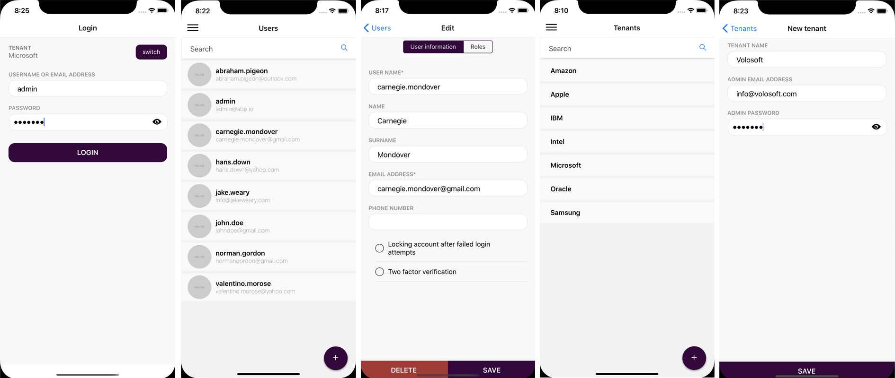

# ABP Framework v2.3.0 Has Been Released!

In the days of **coronavirus**, we have released **ABP Framework v2.3** and this post will explain **what's new** with this release and **what we've done** in the last two weeks.

## About the Coronavirus & Our Team

**We are very sad** about the coronavirus case. As [Volosoft](https://volosoft.com/) team, we have **remote workers** working in their home in different countries. Beginning from the last week, we've **completely started to work remotely** from home including our main office employees.

We believe in and pray for that the humanity will overcome this issue in a short time.

## About the Release Cycle

Beginning from the ABP v2.1.0, we have started to release feature versions once **in two weeks**, on Thursdays. This is the 3rd release after that decision and we see that it works fine for now and improved our agility.

We will continue to release **feature versions** (like v2.4, v2.5) in every two weeks. In addition, we may release **hotfix versions** (like v2.3.1, v2.3.2) whenever needed.

## What's New in ABP Framework v2.3.0

We've completed & merged **[104](https://github.com/abpframework/abp/milestone/30?closed=1) issues and pull requests** with **393 commits** in this two weeks development period.

I will introduce some new features and enhancements introduced with this release.

### React Native Mobile Application

We have finally completed the **react native mobile application**. It currently allows you to **login**, manage your **users** and **tenants**. It utilizes the same setting, authorization and localization systems of the ABP Framework.

A few screenshots from the application:



It doesn't have much functionality but it is a **perfect starting point** for your own mobile application since it is completely integrated to the backend and supports multi-tenancy.

### Angular TypeScript Proxy Generator

It is common to call a REST endpoint in the server from our Angular applications. In this case, we generally create **services** (those have methods for each service method on he server side) and **model objects** (matches to [DTOs](https://docs.abp.io/en/abp/latest/Data-Transfer-Objects) in the server side).

In addition to manually creating such server-interacting services, we could use tools like [NSWAG](https://github.com/RicoSuter/NSwag) to generate service proxies for us. But NSWAG has the following problems we've experienced:

* It generates a **big, single** .ts file which has some problems;
  * It get **too large** when your application grows.
  * It doesn't fit into the **[modular](https://docs.abp.io/en/abp/latest/Module-Development-Basics) approach** of the ABP framework.
* It creates a bit **ugly code**. We want to have a clean code (just like if we write manually).
* It can not generate the same **method signature** declared in the server side (because swagger.json doesn't exactly reflect the method signature of the backend service). We've created an endpoint that exposes server side method contacts to allow clients generate a better aligned client proxies.

So, we've decided to create an ABP CLI command to automatically generate the typescript client proxies ([#2222](https://github.com/abpframework/abp/issues/2222)) for your REST API developed with the ABP Framework.

It is easy to use. Just run the following command in the **root folder** of the angular application:

````bash
abp generate-proxy
````

It only creates proxies only for your own application's services. It doesn't create proxies for the services of the application modules you're using (by default). There are several options. See the [CLI documentation](https://docs.abp.io/en/abp/latest/CLI).

### CRUD Application Services for Entities with Composite Keys

` CrudAppService ` is a useful base class to create CRUD application services for your entities. But it doesn't support entities with **composite primary keys**. `AbstractKeyCrudAppService` is the new base class that is developed to support entities with composite primary keys. See [the documentation](https://docs.abp.io/en/abp/latest/Application-Services#abstractkeycrudappservice) for more.

### Add Source Code of the Modules

The application startup template comes with some [application modules](https://docs.abp.io/en/abp/latest/Modules/Index) **pre-installed** as **NuGet & NPM packages**. This have a few important advantages:

* You can **easily [upgrade](https://docs.abp.io/en/abp/latest/CLI#update)** these modules when a new version is available.
* Your solution becomes **cleaner**, so you can focus on your own code.

However, when you need to make **major customizations** for a depended module, it is not easy as its source code is in your applications. To solve this problem, we've introduces a new command to the [ABP CLI](https://docs.abp.io/en/abp/latest/CLI) that **replaces** NuGet packages with their **source code** in your solution. The usage is simple:

````bash
abp add-module --with-source-code
````

This command adds a module with source code or replaces with its source code if it is already added as package references.

> It is suggested to **save your changes** to your source control system before using this command since it makes a lot of changes in your source code.

In addition, we've documented how to customize depended modules without changing their source code (see the section below). It is suggested to use modules as packages to easily upgrade them in the future.

> Source code of the free modules are licensed under **MIT**, so you can freely change them and add into your solution.

### Switch to Preview

ABP Framework is rapidly evolving and we are frequently releasing new versions. However, if you want to follow it closer, you can use the **daily preview packages**.

We've created an ABP CLI command to easily **update to the latest preview packages** for your solution. Run the following command in the root folder of your solution:

````bash
abp switch-to-preview
````

It will change the versions of all ABP related NuGet and NPM packages. You can **switch back to the latest stable** when you want:

````bash
abp switch-to-stable
````

See the [ABP CLI document](https://docs.abp.io/en/abp/latest/CLI#switch-to-preview) fore more.

### Documentation Improvements

#### Extending/Customizing Depended Application Modules

We've created a huge documentation that explains how to customize a depended module without changing its source code. See [the documentation](https://docs.abp.io/en/abp/latest/Customizing-Application-Modules-Guide).

In addition to the documentation, we've revised all the modules ([#3166](https://github.com/abpframework/abp/issues/3166)) to make their services easily extensible & customizable.

#### EF Core Migration Guide

We've recently created a guide to explain the migration system that is used by the ABP startup templates. [This guide](https://docs.abp.io/en/abp/latest/Entity-Framework-Core-Migrations) also explains how to customize the migration structure, split your modules across multiple databases, reusing a module's table and son on.

#### Migration from the ASP.NET Boilerplate

If you have a solution built on the ASP.NET Boilerplate, we've [created a guide](https://docs.abp.io/en/abp/latest/AspNet-Boilerplate-Migration-Guide) that tries to help you if you want to migrate your solution to the new ABP Framework.

### Some Other Features

#### The Framework

* Add `IRepository.GetAsync` and `IRepository.FindAsync` methods ([#3184](https://github.com/abpframework/abp/issues/3148)).

#### Modules

* Get password & email address of the admin while creating a new tenant, for the tenant management module ([#3088](https://github.com/abpframework/abp/issues/3088)).
* Elastic search integrated full text search for the docs module ([#2901](https://github.com/abpframework/abp/pull/2901)).
* New Quartz background worker module ([#2762](https://github.com/abpframework/abp/issues/2762))

#### Samples

*  Add multi-tenancy support to the microservice demo ([#3032](https://github.com/abpframework/abp/pull/3032)).

See [the release notes](https://github.com/abpframework/abp/releases/tag/2.3.0) for all feature, enhancement and bugfixes.

## What's Next?

We have the following goals for the next few months:

* Complete the **documentation and samples**, write more tutorials.
* Make the framework and existing modules more **customizable and extensible**.
* Integrate to **gRPC** & implement gRPC endpoint for pre-built modules ([#2882](https://github.com/abpframework/abp/issues/2882)).
* Create a **Blazor UI** for the ABP Framework & implement it for all the modules and startup templates ([#394](https://github.com/abpframework/abp/issues/394)).
* Add **new features** to pre-built modules and create new modules for the [ABP Commercial](https://commercial.abp.io/).

See [the GitHub milestones](https://github.com/abpframework/abp/milestones) for details.