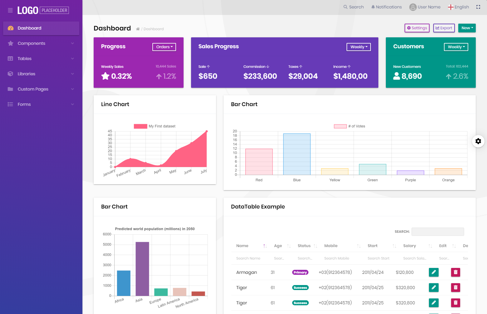

# ABP v2.8.0 Releases & Road Maps

The **ABP Framework** & and the **ABP Commercial** v2.8 have been released. This post will cover **what's new** with these releases and the **middle-term road maps** for the projects.

## What's New in the ABP Framework 2.8?

You can see all the changes on the [GitHub release notes](https://github.com/abpframework/abp/releases/tag/2.8.0). This post will only cover the important features/changes.

### SignalR Integration Package

We've published [a new package](https://www.nuget.org/packages/Volo.Abp.AspNetCore.SignalR) to integrate SignalR to ABP framework based applications.

> It is already possible to follow [the standard Microsoft tutorial](https://docs.microsoft.com/en-us/aspnet/core/tutorials/signalr) to add [SignalR](https://docs.microsoft.com/en-us/aspnet/core/signalr/introduction) to your application. However, ABP provides a SignalR integration packages those simplify the integration and usage. 

See the [SignalR Integration document](https://docs.abp.io/en/abp/latest/SignalR-Integration) to start with the SignalR.

#### SignalR Demo Application

We've also created a simple chat application to demonstrate how to use it.


See [the source code of the application.](https://github.com/abpframework/abp-samples/tree/master/SignalRDemo)

### Console Application Startup Template

The new console application template can be used to create a new console application that has the ABP Framework integrated.

Use ABP CLI to create a new console application, specifying the `console` as the `-t` (template) option:

````bash
abp new MyApp -t console
````

Thanks to the contribution of [@liangshiw](https://github.com/liangshiw) for this template.

### RTL Support for the MVC UI & Arabic Localization

[@kgamalseif](https://github.com/kgamalseif) has contributed a RTL implementation for the MVC UI which looks pretty fine:


He also localized all the framework and module resources. Thanks to him for this great contribution.

### Others

Some other highlights from this release:

* Converted HttpApi.Client packages of the modules to .netstandard 2.0 to be compatible with other kind of applications.
* Improved the object extensibility system to better handle UI, localization and validation.
* Implemented disabling background job execution for HangFire & Quartz intergrations.
* New JsTree integration package for the MVC UI.
* Moved all samples to the new [abp-samples](https://github.com/abpframework/abp-samples) repository and created an [index page](https://docs.abp.io/en/abp/latest/Samples/Index) to see all.

### Deprecations

* Deprecated the `app.UseMvcWithDefaultRouteAndArea()` and introduced the `app.UseConfiguredEndpoints()` (see [#3880](https://github.com/abpframework/abp/issues/3880)).
* Deprecated the `UsePostgreSql()` and introduced the `UseNpgsql()` for the [Volo.Abp.EntityFrameworkCore.PostgreSql](http://nuget.org/packages/Volo.Abp.EntityFrameworkCore.PostgreSql) package. Switch to `UseNpgsql()` if you are using PostgreSQL.

Old methods are marked as `Obsolete` and will be removed in the next major versions.

## What's New in the ABP Commercial 2.8?

### The New Lepton Theme

We've completely revised [the lepton theme](https://commercial.abp.io/themes). A screenshot from the Material Style:



We've adapted it to the ABP Commercial. Example screenshots from the language management page of the ABP Commercial


(default style)


(material style)

[Create a demo](https://commercial.abp.io/demo) to test all the styles in live. You can change the style from the settings page.

### The New Chat Module

TODO

### Others

* Implemented [module entity extension](https://docs.abp.io/en/commercial/latest/guides/module-entity-extensions) system for the Angular UI. Also improved the system to better handle float/double/decimal, date, datetime, enum and boolean properties.
* Managing product groups on a tree view for the [EasyCRM sample application](https://docs.abp.io/en/commercial/latest/samples/easy-crm).