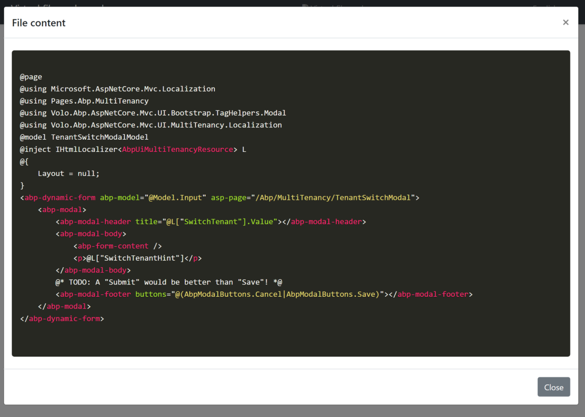
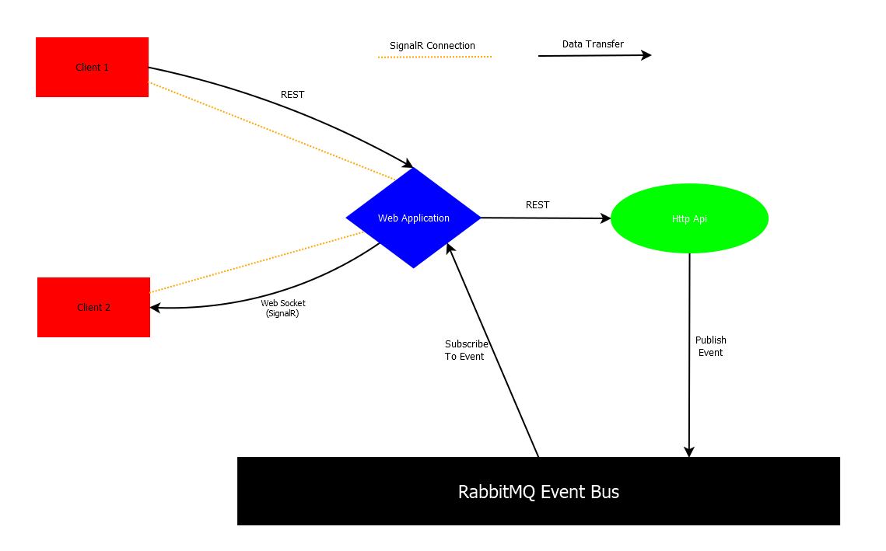
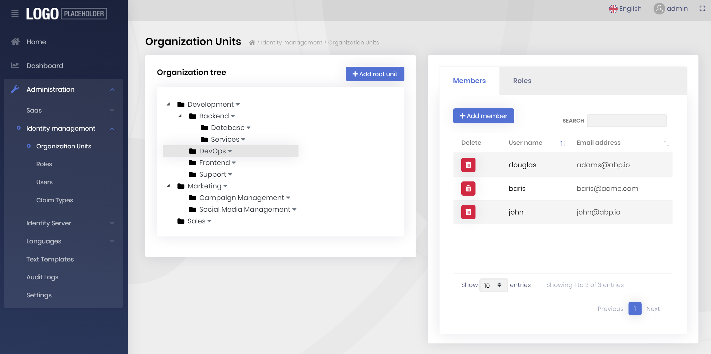
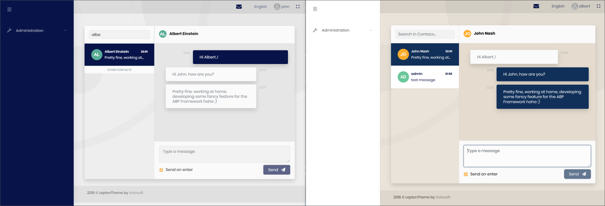
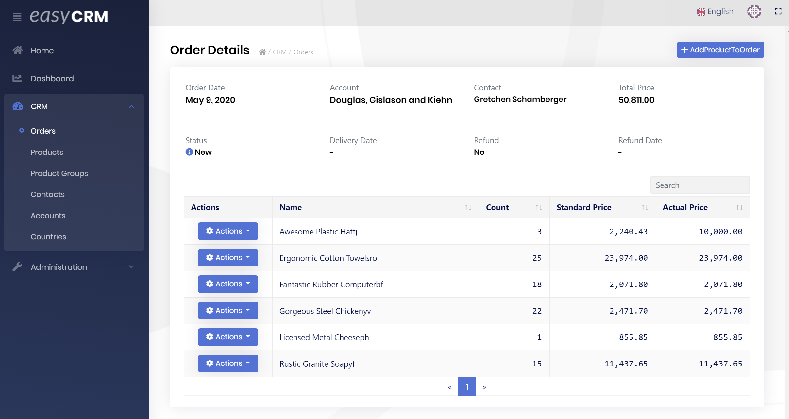
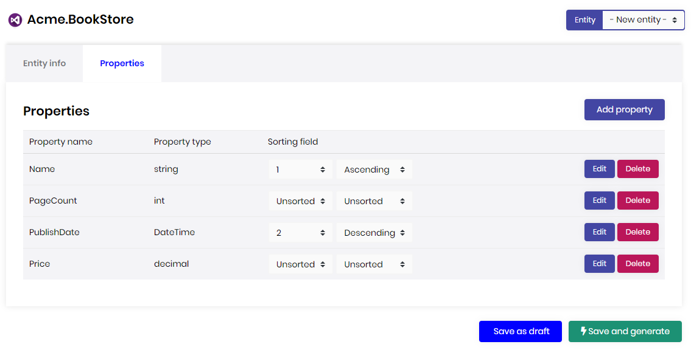
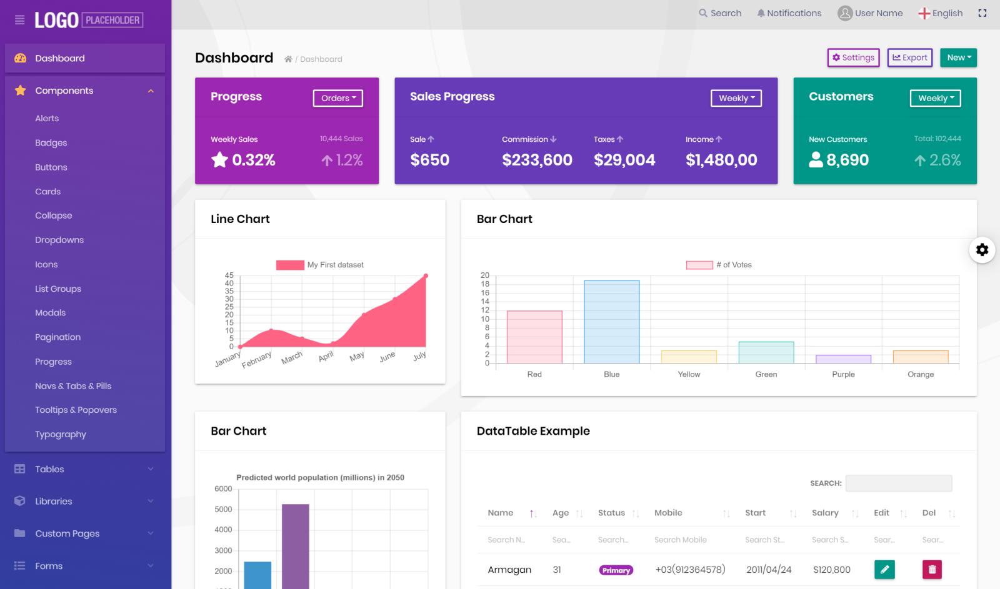

# ABP Framework v2.9 Has Been Released

The **ABP Framework** & and the **ABP Commercial** version 2.9 have been released, which are the last versions before v3.0! This post will cover **what's new** with these this release.

## What's New with the ABP Framework 2.9?

You can see all the changes on the [GitHub release notes](https://github.com/abpframework/abp/releases/tag/2.9.0). This post will only cover the important features/changes.

### Pre-Compiling Razor Pages

Pre-built pages (for [the application modules](https://docs.abp.io/en/abp/latest/Modules/Index)) and view components were compiling on runtime until this version. Now, they are pre-compiled and we've measured that the application startup time (especially for the MVC UI) has been reduced more than 50%. In other words, it is **two-times faster** than the previous version. The speed change also effects when you visit a page for the first time.

Here, a test result for the startup application template with v2.8 and v.2.9:

````
### v2.8

2020-06-04 22:59:04.891 +08:00 [INF] Starting web host.
2020-06-04 22:59:07.662 +08:00 [INF] Now listening on: https://localhost:44391
2020-06-04 22:59:17.315 +08:00 [INF] Request finished in 7756.6218ms 200 text/html; 

Total: 12.42s

### v2.9

2020-06-04 22:59:13.720 +08:00 [INF] Starting web host.
2020-06-04 22:59:16.639 +08:00 [INF] Now listening on: https://localhost:44369
2020-06-04 22:59:18.957 +08:00 [INF] Request finished in 1780.5461ms 200 text/html; 

Total: 5.24s
````

You do nothing to get the benefit of the new approach. [Overriding UI pages/components](https://docs.abp.io/en/abp/latest/UI/AspNetCore/Customization-User-Interface) are also just working as before. We will be working on more performance improvements in the v3.0.

### Organization Unit System

[The Identity Module](https://docs.abp.io/en/abp/latest/Modules/Identity) now has the most requested feature: Organization Units!

Organization unit system is used to create a hierarchical organization tree in your application. You can then use this organization tree to authorize data and functionality in your application.

The documentation will come soon...

### New Blob Storing Package

We've created a new [Blob Storing package](https://www.nuget.org/packages/Volo.Abp.BlobStoring) to store arbitrary binary objects. It is generally used to store the content of the files in your application. This package provides an abstraction, so any application or [module](https://docs.abp.io/en/abp/latest/Module-Development-Basics) can save and retrieve files independent from the actual storing provider.

There are two storage provider currently implemented:

* [Volo.Abp.BlobStoring.FileSystem](https://www.nuget.org/packages/Volo.Abp.BlobStoring.FileSystem) package stores objects/files in the local file system.
* [Volo.Abp.BlobStoring.Database](https://github.com/abpframework/abp/tree/dev/modules/blob-storing-database) module stores objects/files in a database. It currently supports [Entity Framework Core](https://docs.abp.io/en/abp/latest/Entity-Framework-Core) (so, you can use [any relational DBMS](https://docs.abp.io/en/abp/latest/Entity-Framework-Core-Other-DBMS)) and [MongoDB](https://docs.abp.io/en/abp/latest/MongoDB).

[Azure BLOB provider](https://github.com/abpframework/abp/issues/4098) will be available with v3.0. You can request other cloud providers or contribute yourself on the [GitHub repository](https://github.com/abpframework/abp/issues/new).

One of the benefits of the blob storing system is that it allows you to create multiple containers (each container is a blob storage) and use different storage providers for each container.

**Example: Use the default container to save and get a byte array**

````csharp
public class MyService : ITransientDependency
{
    private readonly IBlobContainer _container;

    public MyService(IBlobContainer container)
    {
        _container = container;
    }

    public async Task FooAsync()
    {
        //Save a BLOB
        byte[] bytes = GetBytesFromSomeWhere();
        await _container.SaveAsync("my-unique-blob-name", bytes);
        
        //Retrieve a BLOB
        bytes = await _container.GetAllBytesAsync("my-unique-blob-name");
    }
}
````

It can work with `byte[]` and `Stream` objects.

**Example: Use a typed (named) container to save and get a stream**

````csharp
public class MyService : ITransientDependency
{
    private readonly IBlobContainer<TestContainer> _container;

    public MyService(IBlobContainer<TestContainer> container)
    {
        _container = container;
    }

    public async Task FooAsync()
    {
        //Save a BLOB
        Stream stream = GetStreamFromSomeWhere();
        await _container.SaveAsync("my-unique-blob-name", stream);
        
        //Retrieve a BLOB
        stream = await _container.GetAsync("my-unique-blob-name");
    }
}
````

`TestContainer` is an empty class that has no purpose than identifying the container:

````csharp
[BlobContainerName("test")] //specifies the name of the container
public class TestContainer
{

}
````

A typed (named) container can be configured to use a different storing provider than the default one. It is a good practice to always use a typed container while developing re-usable modules, so the final application can configure provider for this container without effecting the other containers.

**Example: Configure the File System provider for the `TestContainer`**

````csharp
Configure<AbpBlobStoringOptions>(options =>
{
    options.Containers.Configure<TestContainer>(configuration =>
    {
        configuration.UseFileSystem(fileSystem =>
        {
            fileSystem.BasePath = "C:\\MyStorageFolder";
        });
    });
});
````

See the [blob storing documentation](https://docs.abp.io/en/abp/latest/Blob-Storing) for more information.

### Oracle Integration Package for Entity Framework Core

We've created an [integration package for Oracle](https://www.nuget.org/packages/Volo.Abp.EntityFrameworkCore.Oracle.Devart), so you can easily switch to the Oracle for the EF Core. It is tested for the framework and pre-built modules.

[See the documentation](https://docs.abp.io/en/abp/latest/Entity-Framework-Core-Oracle) to start using the Oracle integration package.

### Automatically Determining the Database Provider

When you develop a **reusable application module** with EF Core integration, you generally want to develop your module **DBMS independent**. However, there are minor (sometimes major) differences between different DBMSs. If you perform a custom mapping based on the DBMS, you can now use `ModelBuilder.IsUsingXXX()` extension methods:

````csharp
protected override void OnModelCreating(ModelBuilder modelBuilder)
{
    base.OnModelCreating(modelBuilder);

    modelBuilder.Entity<Phone>(b =>
    {
        //...
        if (modelBuilder.IsUsingPostgreSql()) //Check if using PostgreSQL!
        {
            b.Property(x => x.Number).HasMaxLength(20);
        }
        else
        {
            b.Property(x => x.Number).HasMaxLength(32);
        }
    });
}
````

Beside the stupid example above, you can configure your mapping however you need!

### ABP CLI: Translate Command

`abp translate` is a new command that simplifies to translate [localization](https://docs.abp.io/en/abp/latest/Localization) files when you have multiple JSON localization files in a source control repository.

The main purpose of this command is to **translate the ABP Framework** localization files (since the [abp repository](https://github.com/abpframework/abp) has tens of localization files to be translated in different folders).

It is appreciated if you use this command to translate the framework resources **for your mother language**.

See [the documentation](https://docs.abp.io/en/abp/latest/CLI#translate) to learn how to use it. Also see [the contribution guide](https://docs.abp.io/en/abp/latest/Contribution/Index).

### The New Virtual File System Explorer Module

Thanks to [@liangshiw](https://github.com/liangshiw) created and contributed a new module to explore files in the [Virtual File System](https://docs.abp.io/en/abp/latest/Virtual-File-System). It works for MVC UI and shows all the virtual files in the application. Example screenshots:




[See the documentation](https://docs.abp.io/en/abp/latest/Modules/Virtual-File-Explorer) to learn how to use it.

### Sample Application: SignalR with Tiered Architecture

Implementing SignalR in a distributed/tiered architecture can be challenging. We've created a sample application that demonstrate how to implement it using the [SignalR integration](https://docs.abp.io/en/abp/latest/SignalR-Integration) and the [distributed event bus](https://docs.abp.io/en/abp/latest/Distributed-Event-Bus) system easily.

See [the source code](https://github.com/abpframework/abp-samples/tree/master/SignalRTieredDemo) of the sample solution.

**An article is on the road** that will deeply explain the solution. Follow the [@abpframework](https://twitter.com/abpframework) Twitter account.



*A picture from the article that shows the communication diagram of the solution*

### About gRPC

We've created a sample application to show how to create and consume gRPC endpoints in your ABP based applications.

See [the source code](https://github.com/abpframework/abp-samples/tree/master/GrpcDemo) on GitHub.

We were planning to create gRPC endpoints for all the pre-built application modules, but we see that ASP.NET Core gRPC integration is not mature enough and doesn't support some common deployment scenarios yet. So, deferring this to the next versions ([see this comment](https://github.com/abpframework/abp/issues/2882#issuecomment-633080242) for more). However, it is pretty standard if you want to use gRPC in your applications. ABP Framework has no issue with gRPC. Just check the [sample application](https://github.com/abpframework/abp-samples/tree/master/GrpcDemo).

### Others

* [Time zone system](https://github.com/abpframework/abp/pull/3933) to support different time zones for an application.
* Support for [virtual path deployment](https://github.com/abpframework/abp/issues/4089) on IIS.
* RTL support for the Angular UI.

See the [GitHub release notes](https://github.com/abpframework/abp/releases/tag/2.9.0) for others updates.

## What's New with the ABP Commercial 2.9

In addition to all the features coming with the ABP Framework, the ABP Commercial has additional features with this release, as always. This section covers the [ABP Commercial](https://commercial.abp.io/) highlights in the version 2.9.

### Organization Unit Management UI

We've created the UI for manage organization units, their members and roles for the ABP Commercial [Identity Module](https://commercial.abp.io/modules/Volo.Identity.Pro):



OU management is available for both of the MVC (Razor Pages) and the Angular user interfaces.

> See [this entry](https://support.abp.io/QA/Questions/222/Bugs--Problems-v290#answer-3cf5eba3-0bf1-2aa1-cc5e-39f5a0750329) if you're upgrading your solution from an earlier version.

### Chat Module Angular UI

We had introduced a new [chat module](https://commercial.abp.io/modules/Volo.Chat) in the previous version, which was only supporting the ASP.NET Core MVC / Razor Pages UI. Now, it has also an Angular UI option.



*A screenshot from the chat module - two users are sending messages to each other*

### Easy CRM Angular UI

Easy CRM is a sample application that is built on the ABP Commercial to provide a relatively complex application to the ABP Commercial customers. In the version 2.7, we have lunched it with MVC / Razor Pages UI. With the 2.9 version, we are releasing the Angular UI for the Easy CRM application.



*A screenshot from the "Order Details" page of the Easy CRM application.*

See the [Easy CRM document](https://docs.abp.io/en/commercial/latest/samples/easy-crm) to learn how to download and run it.

### Module Code Generation for the ABP Suite

[ABP Suite](https://commercial.abp.io/tools/suite) is a tool that's main feature is to [generate code](https://docs.abp.io/en/commercial/latest/abp-suite/generating-crud-page) for complete CRUD functionality for an entity, from database to the UI layer.



*A screenshot from the ABP Suite: Define the properties of a new entity and let it to create the application code for you!*

It was working only for [the application template](https://docs.abp.io/en/commercial/latest/startup-templates/application/index) until this release. Now, it supports to generate code for the [module projects](https://docs.abp.io/en/commercial/latest/startup-templates/module/index) too. That's a great way to create reusable application modules by taking the power of the code generation.

In addition to this main feature, we added many minor enhancements on the ABP Suite in this release.

> Notice: Generating code for the module template is currently in beta. Please inform us if you find any bug.

### Lepton Theme

[Lepton Theme](https://commercial.abp.io/themes) is the commercial theme we've developed for the ABP Commercial;

*  It is 100% bootstrap compatible - so you don't write theme specific HTML!
* Provides different kind of styles - you see the material style in the picture below.
* Provides different kind of layouts (side/top menu, fluid/boxed layout...).
* It is lightweight, responsive and modern.
* And... it is upgradeable with no cost! You just update a NuGet/NPM package to get the new features.

We've create its own web site: [http://leptontheme.com/](http://leptontheme.com/)

You can view all the components together, independent from an application:



This web site is currently in a very early stage. We will be documenting and improving this web site to be a reference for your development and explore the features of the theme.

### Coming Soon: The File management Module

Based on the new blob storing system (introduced above), we've started to build a file management module that is used to manage (navigate/upload/download) a hierarchical file system on your application and share the files between your users and with your customers.

We plan to release the initial version with the ABP Commercial v3.0 and continue to improve it with the subsequent releases.

## About the Next Version: 3.0

We have added many new features with the [v2.8](https://blog.abp.io/abp/ABP-v2.8.0-Releases-%26-Road-Map) and v2.9. In the next version, we will completely focus on the **documentation, performance improvements** and and other enhancements as well as bug fixes.

For a long time, we were releasing a new feature version in every 2 weeks. We will continue to this approach after v3.0. But, as an exception to the v3.0, the development cycle will be ~4 weeks. **The planned release date for the v3.0 is the July 1, 2020**.

## Bonus: Articles!

Beside developing our products, our team are constantly writing articles/tutorials on various topics. You may want to check the latest articles:

* [ASP.NET Core 3.1 WebHook Implementation Using Pub/Sub](https://volosoft.com/blog/ASP.NET-CORE-3.1-Webhook-Implementation-Using-Pub-Sub)
* [Using Azure Key Vault with ASP.NET Core](https://volosoft.com/blog/Using-Azure-Key-Vault-with-ASP.NET-Core)