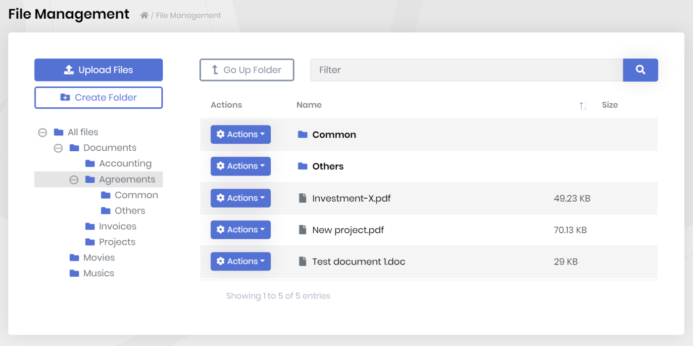

# ABP Framework v3.0 Has Been Released

We are excited to announce that the **ABP Framework** & and the **ABP Commercial** version 3.0 have been released. As different than the regular release lifecycle, which is 2-weeks, this version has taken 4-weeks with **119 [issues](https://github.com/abpframework/abp/issues?q=is%3Aopen+is%3Aissue+milestone%3A3.0)** closed, **89 [pull requests](https://github.com/abpframework/abp/pulls?q=is%3Aopen+is%3Apr+milestone%3A3.0)** merged and **798 commits** done in the main framework [repository](https://github.com/abpframework/abp).

Since this is a **major version**, it also includes some **breaking changes**. Don't panic, the changes are easy to adapt and will be explained below.

> See the [GitHub release notes](https://github.com/abpframework/abp/releases/tag/3.0.0) for a detailed change log.

## What's New with the ABP Framework 3.0?

This post will only cover the important features/changes. You can see all the changes on the [GitHub release notes](https://github.com/abpframework/abp/releases/tag/2.9.0).

### Angular 10!

Angular version 10 has just been [released](https://blog.angular.io/version-10-of-angular-now-available-78960babd41) and we've immediately migrated the [startup templates](https://docs.abp.io/en/abp/latest/Startup-Templates/Application) to Angular 10! So, when you [create a new solution](https://abp.io/get-started) with the Angular UI, you will take the advantage of the new Angular.

We've prepared a [migration guide](https://github.com/abpframework/abp/blob/dev/docs/en/UI/Angular/Migration-Guide-v3.md) for the projects created an older version and want to migrate to Angular 10.

### The Oracle Integration Package

We had created [an integration package](https://www.nuget.org/packages/Volo.Abp.EntityFrameworkCore.Oracle.Devart) for the Oracle for EF Core based applications using the Devart's library since the official Oracle EF Core package was not supporting the EF Core 3.1. It now supports as a [beta release](https://www.nuget.org/packages/Oracle.EntityFrameworkCore/3.19.0-beta1). While it is in beta, we've created [the integration package](https://www.nuget.org/packages/Volo.Abp.EntityFrameworkCore.Oracle), so you can use it in your application.

See [the documentation](https://docs.abp.io/en/abp/latest/Entity-Framework-Core-Oracle) for details.

### Azure BLOB Storage Provider

We had created a [BLOB storing system](https://docs.abp.io/en/abp/latest/Blob-Storing) in the previous version with a file system and database storage provider. This release introduces the Azure BLOB Storage provider. See [the documentation](https://docs.abp.io/en/abp/latest/Blob-Storing-Azure).

### Distributed Cache Bulk Operations & the New Redis Cache Package

The [standard IDistributeCache](https://docs.microsoft.com/en-us/aspnet/core/performance/caching/distributed) interface of the ASP.NET Core doesn't contain **bulk operations**, like setting multiple items with a single method/server call. ABP Framework introduces new methods those can be used for bulk operations on the ABP's `IDistributedCache<T>` interface:

* GetManyAsync / GetMany
* SetManyAsync / SetMany

Then we needed to implement these new methods for Redis cache and [had to create](https://github.com/abpframework/abp/issues/4483) a Redis integration package which extends the Microsoft's implementation.

These methods are also used by the ABP Framework to cache settings, features and permissions for a user/role/tenant and brings a **significant performance improvement**.

See the [caching document](https://docs.abp.io/en/abp/latest/Caching) for details.

### Embedded Files Manifest Support for the Virtual File System

Virtual File System now supports to use `GenerateEmbeddedFilesManifest` in your projects to add the **real file/directory structure** of your embedded resources in the compiled assembly. So, you can now access to the files without any file name restriction (previously, some special chars like `.` in the directory names was a problem in some cases)

See [the documentation](https://docs.abp.io/en/abp/latest/Virtual-File-System) to learn how to take the advantage of new system.

### New Samples

Based on the requests from the community, we've prepared two new sample applications:

* [StoredProcedureDemo](https://github.com/abpframework/abp-samples/tree/master/StoredProcedureDemo) demonstrates how to call stored procedures, views and functions inside a custom repository.
* [OrganizationUnitSample](https://github.com/abpframework/abp-samples/tree/master/OrganizationUnitSample) shows how to use the organization unit system of the [Identity module](https://docs.abp.io/en/abp/latest/Modules/Identity) for your entities.

### DynamicStringLength & DynamicMaxLength Attributes

The standard `StringLength` and `MaxLength` data annotation attributes is useful to validate properties of a class when the class is used as a Model or [DTO](https://docs.abp.io/en/abp/latest/Data-Transfer-Objects). However, just like any other attribute, the length values should be literal (constant) values known at **compile time**.

**Example: Using the `StringLength`**

````csharp
public class CreateBookDto
{
    public const int MaxNameLength = 128; //CONSTANT!
    
    [StringLength(MaxNameLength)]
    public string Name { get; set; }
}
````

ABP Framework now has the `DynamicStringLength` & `DynamicMaxLength` properties to allow to determine the lengths at **runtime**. 

**Example: Using the `DynamicStringLength`**

````csharp
public class CreateBookDto
{
    public static int MaxNameLength { get; set; } = 128;
    
    [DynamicStringLength(typeof(CreateBookDto), nameof(MaxNameLength))]
    public string Name { get; set; }
}
````

`DynamicStringLength` gets a class **type** and the **name** of a static property on this class to read the max length (there is also a minimum length option just like the `StringLength`).

This allows you to get the max value from a configuration and set on the application startup (generally, in the `PreConfigureServices` method of your [module](https://docs.abp.io/en/abp/latest/Module-Development-Basics)):

````csharp
CreateBookDto.MaxNameLength = 200;
````

This feature is used by the [pre-built application modules](https://docs.abp.io/en/abp/latest/Modules/Index), so you can now override the max lengths of the properties defined in these modules.

### Auto Distributed Events

ABP can **automatically publish distributed events** for all entities on their create, update and delete events. That's pretty useful since you commonly interest in these basic events in a distributed system.

This feature is **mature and [documented](https://docs.abp.io/en/abp/latest/Distributed-Event-Bus#pre-defined-events)** with the v3.0. You can easily configure some or all the entities to be published.

### IAsyncQueryableExecuter

When you work with LINQ extension methods, you need to call `ToListAsync()`, `FirstOrDefaultAsync()`... methods on your queries. Unfortunately, these methods are **not standard** LINQ extension methods. They are defined in the [Microsoft.EntityFrameworkCore](https://www.nuget.org/packages/Microsoft.EntityFrameworkCore) package (or in the [MongoDB.Driver](https://www.nuget.org/packages/MongoDB.Driver/) package if you are using the MongoDB).

So, you need to depend on this package if you want to use the async extension methods. That breaks the layering and makes your application or domain layer depends on the EF Core / MongoDB package.

`IAsyncQueryableExecuter` is a service defined by the ABP Framework to **execute queries asynchronously without depending the specific provider** (EF Core / MongoDB) package.

See [the documentation](https://docs.abp.io/en/abp/latest/Repositories#iqueryable-async-operations) to read the details and learn our recommendations.

### API documentation

We are now publishing [API documents](https://docs.abp.io/api-docs/abp/2.9/api/index.html) for the ABP Framework and modules in every release. So, you can explore the ABP Framework classes much more easier than before. Click the the **API Documentation** link on the navigation menu of the [documentation](https://docs.abp.io/en/abp/latest/).

### Package List

We have [created a page](http://abp.io/packages) to list all the ABP-related official NuGet and NPM packages.

### Others

* Implemented front-channel server-side clients [sign out](https://identityserver4.readthedocs.io/en/latest/topics/signout.html) for the identity server.
* `abp.currentUser` (`CurrentUser` service in the Angular UI) now has a `roles` array that contains role names of the current user.
* Upgraded all the NuGet and NPM package dependencies.
* Introduced `ReadOnlyAppService` base class (which has only the get operations) in addition to the `CrudAppService` base class (which has get, create, update and delete operations).

See the [GitHub release notes](https://github.com/abpframework/abp/releases/tag/3.0.0) for others updates.

## What's New with the ABP Commercial 3.0?

In addition to all the features coming with the ABP Framework, the ABP Commercial has additional features with this release, as always. This section covers the [ABP Commercial](https://commercial.abp.io/) highlights in the version 2.9.

### New File Management Module

We've created a new module that is used to store and manage files in your application. This new module is based on the [BLOB Storing system](https://docs.abp.io/en/abp/latest/Blob-Storing), so it can use different storage providers to store the file contents.

**Example screenshot**



You can upload, download and organize files in a hierarchical folder structure. It is also compatible to multi-tenancy and you can determine total size limit for your tenants. In the next versions, we will be working on a "share" system to share files between users in a more controlled way or share your files with your customers with a public link.

> File Management module is currently available only for the MVC / Razor Pages UI. We are working on the Angular UI and it will be released in the next versions.

## Breaking Changes

Since this is a major version, we've redesigned some APIs and introduced a few "easy to fix" breaking changes.

### ABP Framework

* Changed some **consts** in the pre-built application modules to static properties that is possible to change by your code. If you've used these consts on an attribute, then use the `DynamicStringLength` as explained above.
* Changed `ConcurrencyStamp` max length to 40. You need to **add a database migration** and update your database after upgrading the ABP Framework.
* Using `~` instead of `^` for NPM package dependencies anymore, to be more stable.

### ABP Commercial

* Changed file names for the application logos. Previously, it was using separate logo files for each theme, like `theme1.png`, `theme1-reverse.png`, `theme2.png`, `theme2-reverse.png` (... `6`). Now, we have only two logo files: `logo-light.png` and `logo-dark.png`. So, rename your logo in the `wwwroot/images/logo/` folder for the MVC UI and `/src/assets/images/logo/` folder for the Angular UI.
* We've added the [API documentation](https://docs.abp.io/api-docs/commercial/2.9/api/index.html) for the ABP Commercial too.

> **Also, see the [migration guide](https://github.com/abpframework/abp/blob/dev/docs/en/UI/Angular/Migration-Guide-v3.md) for Angular UI**.

## Known Issues

* 3.0.0 version has a problem with tiered architecture. See [this issue](https://github.com/abpframework/abp/pull/4564) to fix it for your application until we release the v3.0.1.

## About the Next Versions

We will continue to release a new minor/feature version in every two weeks. So, the next expected release date is **2020-07-16** for the version **3.1**.

In the next few versions, we will be focused on the **Blazor UI**, as promised on [the road map](https://docs.abp.io/en/abp/latest/Road-Map). We will continue to improve the documentation, create samples, add other new features and enhancements. Follow the [ABP Framework Twitter account](https://twitter.com/abpframework) for the latest news...

## Bonus: Articles!

Beside developing our products, our team are constantly writing articles/tutorials on various topics. You may want to check the latest articles:

* [What is New in Angular 10?](https://volosoft.com/blog/what-is-new-in-angular-10)
* [Real-Time Messaging In A Distributed Architecture Using ABP, SignalR & RabbitMQ](https://volosoft.com/blog/RealTime-Messaging-Distributed-Architecture-Abp-SingalR-RabbitMQ)
* [How to Use Attribute Directives to Avoid Repetition in Angular Templates](https://volosoft.com/blog/attribute-directives-to-avoid-repetition-in-angular-templates)
