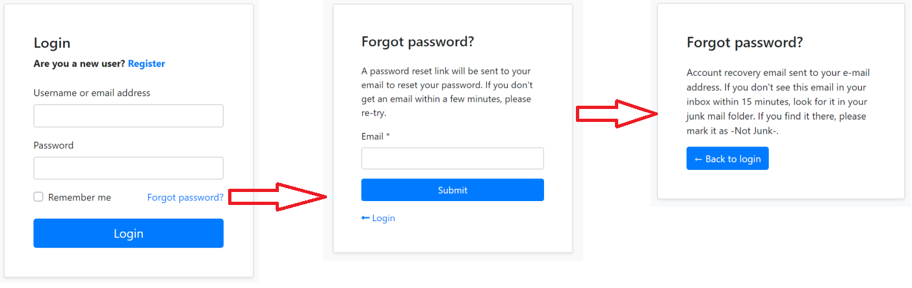
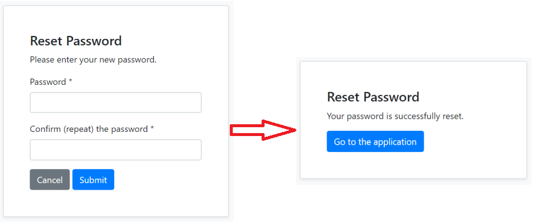
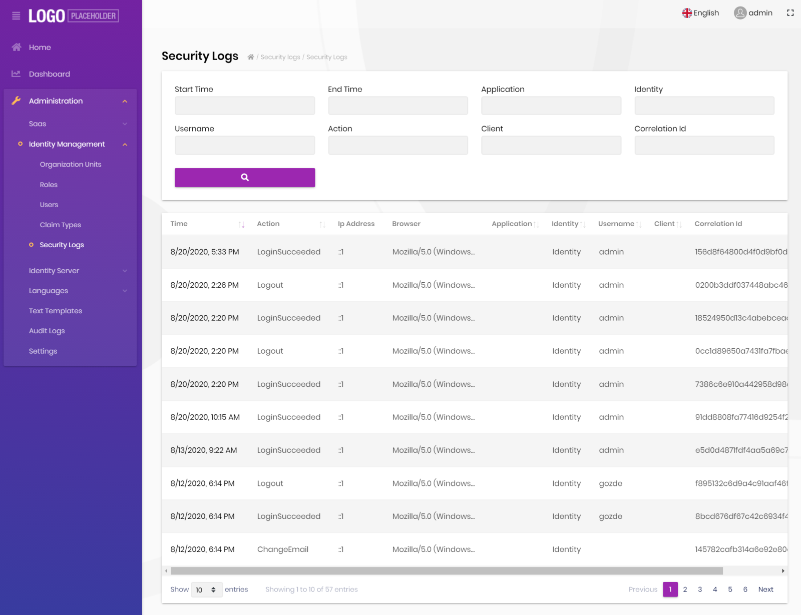
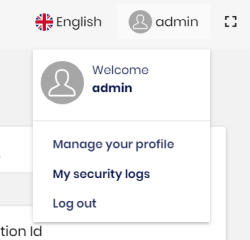
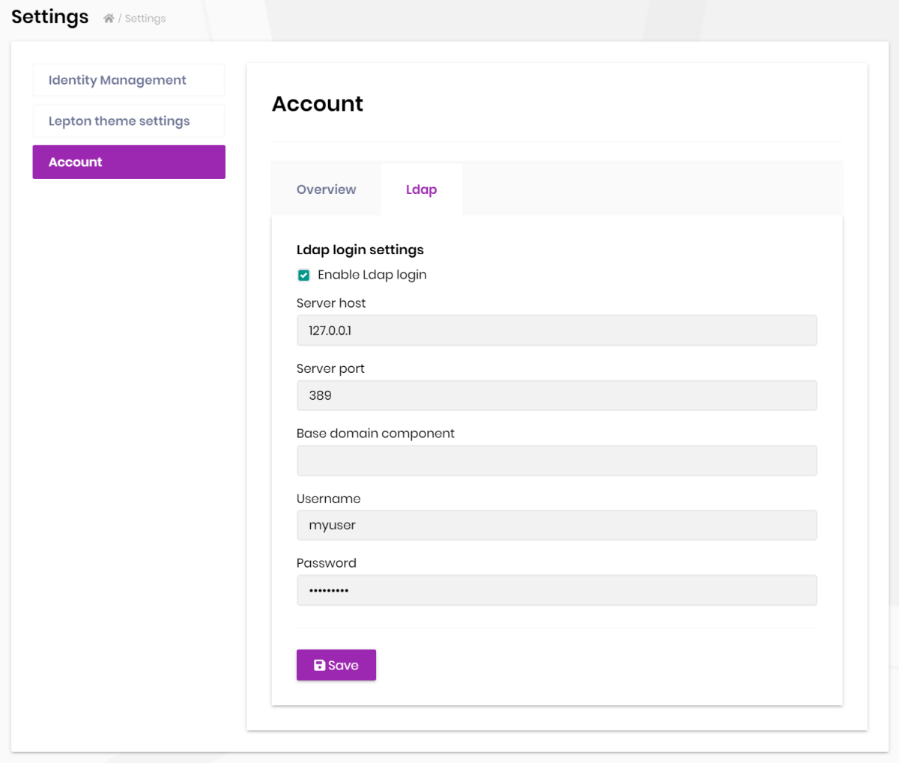
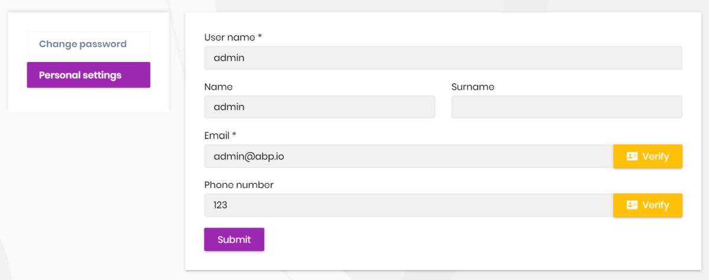
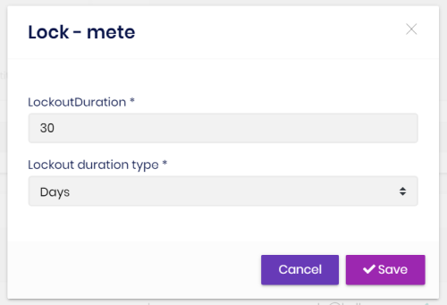

# ABP Framework v3.1 RC Has Been Released

Today, we are releasing the **ABP Framework version 3.1 Release Candidate** (RC). The development cycle for this version was **~7 weeks**. It was the longest development cycle for a feature version release ever. We have completed **~150 issues**, merged **~150 PRs** and made **~1,000 commits** only in the main [abp repository](https://github.com/abpframework/abp). See the related [milestone](https://github.com/abpframework/abp/milestone/38?closed=1) on GitHub.

There were two main reasons of this long development cycle;

* We've switched to **4-weeks** release cycle (was discussed in [this issue](https://github.com/abpframework/abp/issues/4692)).
* We've [re-written](https://github.com/abpframework/abp/issues/4881) the Angular service proxy generation system using the Angular schematics to make it more stable. There were some problems with the previous implementation.

This long development cycle brings a lot of new features, improvements and bug fixes. I will highlight the fundamental features and changes in this blog post.

## About the Preview/Stable Version Cycle

As mentioned above, it is planned to release a new stable feature version (like 3.1, 3.2, 3.3...) in every 4-weeks.

In addition, we are starting to deploy a **preview version** 2-weeks before the stable versions for every feature/major releases.

Today, we've released `3.1.0-rc.1` as the first preview version. We may release more previews if it is needed until the stable 3.1.0 version.

**The stable `3.1.0` version will be released on September 3, 2020.** Next RC version, `3.2.0-rc.1`, is planned for September 17, 2020 (2 weeks after the stable 3.1.0 and 2 weeks before the stable 3.2.0).

We **won't add new features** to a version after publishing the preview version. We only will make **bug fixes** until the stable version. The new features being developed in this period will be available in the next version.

> We will use `-rc.x` suffix (like `3.1.0-rc.1` and `3.1.0-rc.2`) for preview releases. However, we may also publish with `-preview.x` suffix before RC (Release Candidate) releases, especially for major versions (like 4.0, 5.0...).

### About the Nightly Builds

Don't confuse preview versions vs nightly builds. When we say preview, we are mentioning the preview system explained above.

We will continue to publish **nightly builds** for all the [ABP Framework packages](https://abp.io/packages). Nightly pages are built from the development branch. You can refer to [this document](https://docs.abp.io/en/abp/latest/Nightly-Builds) to learn how to use the nightly packages.

## Get Started with the RC Versions

Please try the preview versions and provide feedback to us to release more stable versions. Please open an  issue on the [GitHub repository](https://github.com/abpframework/abp/issues/new) if you find a bug or want to give feedback.

### Update the ABP CLI to the 3.1.0-rc.1

Since this is the first preview version, you need to upgrade the [ABP CLI](https://docs.abp.io/en/abp/latest/CLI) to the `3.1.0-rc.1` to be able to use the preview features:

````bash
dotnet tool update Volo.Abp.Cli -g --version 3.1.0-rc.1
````

### New Solutions

The [ABP.IO](https://abp.io/) platform and the [ABP CLI](https://docs.abp.io/en/abp/latest/CLI) are compatible with the RC system. You can select the "preview" option on the [download page](https://abp.io/get-started) or use the "**--preview**" parameter with the ABP CLI [new](https://docs.abp.io/en/abp/latest/CLI?_ga=2.106435654.411298747.1597771169-1910388957.1594128976#new) command:

````bash
abp new Acme.BookStore --preview
````

This command will create a new project with the latest RC/Preview version. Whenever the stable version is released, you can switch to the stable version for your solution using the `abp switch-to-stable` command in the root folder of your solution.

### Existing Solutions

If you already have a solution and want to use/test the latest RC/Preview version, use the `abp switch-to-preview` command in the root folder of your solution. You can return back to the latest stable using the `abp switch-to-stable ` command later.

> Note that the `abp switch-to-preview` command was being used to switch to nightly builds before the v3.1. Now, you should use the `abp switch-to-nightly` for [nightly builds](https://docs.abp.io/en/abp/latest/Nightly-Builds).

## Breaking Changes / Special Notes

### ABP & ABP Commercial

* If you are using **EF Core**, you may need to **add a new migration** after upgrading the packages. Just run the standard "Add-Migration" command, check the generated migration code and execute the "Update-Database" command to apply changes to the database.
* If you have implemented **social/external logins** for your MVC / Razor Page UI application before, you may want to check [this issue](https://github.com/abpframework/abp/issues/4981). We made some improvements and changes that you may want to take action for your application. Beginning from v3.1, the users created their accounts via social login can still set a local password to login with local username/email & password.

### ABP Commercial Only

* We've **moved favicons** into `/wwwroot/images/favicon/` folder for the ASP.NET Core **MVC / Razor Page UI** applications. There are 10 favicon related files (including the `favicon.ico`) under this directory to better work with different browser and cases. You can create a new application to check this folder and copy the files into your own application. Then you can customize the icons for your own brand (hint: you can use a tool [like that](https://realfavicongenerator.net/) to create the favicons with various formats).
* Removed direct **Twitter & Facebook social login integrations** from the [account module](https://commercial.abp.io/modules/Volo.Account.Pro), for **MVC / Razor Pages UI**. Follow [this documentation](https://github.com/abpframework/abp/blob/dev/docs/en/Authentication/Social-External-Logins.md) to easily add social logins to your applications if you need. The account module provides all the infrastructure to handle social/external logins, you just need to configure it.

## What's New with the ABP Framework 3.1 RC.1

### Angular Service Proxies

ABP provides a system to generate Angular service proxies (with TypeScript) to consume the HTTP APIs of your application. Service proxy generation system **has been completely re-written** with the ABP Framework 3.1. The main goal was to build more stable and feature rich system that is better aligned with other ABP Framework features (like [modularity](https://docs.abp.io/en/abp/latest/Module-Development-Basics)).

[See the documentation](https://docs.abp.io/en/abp/latest/UI/Angular/Service-Proxies) to learn more about the service proxy generation for Angular applications.

### Authorization Code Flow for the Angular UI

We were using the **resource owner password authentication** flow for the Angular UI login page. We've implemented **Authorization Code Flow** for the Angular account module and made it **default for new projects**. With this change, the Angular application now redirects to the login page of the MVC UI which was implemented using the Identity Server 4. We also removed the client secret from the Angular side with this change.

Old behavior remains exist. If you want to switch to the new flow (which is recommended), follow the steps below:

1) Add `authorization_code` to the `IdentityServerClientGrantTypes` table in the database, for the client used by the Angular UI (the `ClientId` is `YourProjectName_App` by default, in the `IdentityServerClients` table).

2) Add `http://localhost:4200` to `IdentityServerClientRedirectUris` and `IdentityServerClientPostLogoutRedirectUris` tables for the same client.

3) Set `RequireClientSecret` to `false` in the `IdentityServerClients` table for the same client.

> [ABP Commercial](https://commercial.abp.io/) users can make these changes on the [Identity Server Management UI](https://commercial.abp.io/modules/Volo.Identityserver.Ui).

4) Change the `oAuthConfig` section in the `src/environments/environment.ts` file of the Angular application.

You can take [this new configuration](https://gist.github.com/hikalkan/e7f6ae7f507b201783682dccaeadc5e3) as a reference. Main changes are;

* Added `responseType` as `code`.
* Added `redirectUri`
* Added `offline_access` to the `scope`.
* Removed `oidc: false` option.
* Removed the client secret option.

### Global Feature System

The new "Global Features" system allows to **enable/disable features of an application or a module** in a central point. It is especially useful if you want to use a module but don't want to bring all its features into your application. If the module was so designed, you can enable only the features you need. 

When you disable a feature;

* The **database tables** related to that feature should not be created in the database.
* The **HTTP APIs** related to that feature should not be exposed. They returns 404 if they are directly requested.

So, the goal is that; when you disable a feature, it should behave like that feature doesn't exists in your system at all.

There is **no way to enable/disable a global feature on runtime**. You should decide it in the development time (remember, even database tables are not being created for disabled global features, so you can't enable it on runtime).

> "Global Features" system is different than [SaaS/multi-tenancy features](https://docs.abp.io/en/abp/latest/Features), where you can enable/disable features for your tenants on runtime.

Assume that you are using the [CMS Kit module](https://github.com/abpframework/abp/tree/dev/modules/cms-kit) (this module is in a very early stage) where you only want to enable the comment feature:

````csharp
GlobalFeatureManager.Instance.Modules.CmsKit().Comments.Enable();
````

You can check if a feature was enabled:

```csharp
GlobalFeatureManager.Instance.IsEnabled<CommentsFeature>();
```

Or you can add `[RequiresGlobalFeature(...)]` attribute to a controller/page to disable it if the related feature was disabled:

```csharp
//...
[RequiresGlobalFeature(typeof(CommentsFeature))]
public class CommentController :  AbpController
{
    //...
}
```

See the issue [#5061](https://github.com/abpframework/abp/issues/5061) until this is fully documented.

### Social/External Logins

Implemented the infrastructure for social/external logins in the account module. So, now you can easily configure your application to support social/external logins by [following the documentation](https://github.com/abpframework/abp/blob/dev/docs/en/Authentication/Social-External-Logins.md). Once you configure a provider, a button will appear on the login page to use this provider.

The social logins will work as expected even if you are using the Angular UI, since the Angular UI uses the MVC login using the authorization code flow implemented with this new version (as explained above).

### Forgot/Reset Password

Implemented forgot password / password reset for the account module.

You can now enter your email address to get an email containing a **password reset link**:



When you click to the link, you are redirected to a password reset page to determine your new password:



### External Login System

The standard Social/External Login system (like Facebook login) works via OpenID Connect. That means the user is redirected to the login provider, logins there and redirected to your application.

While this is pretty nice for most scenarios, sometimes you want a simpler external login mechanism: User enters username & password in your own application's login form and you check the username & password from another source, not from your own database.

ABP v3.1 introduces an External Login System to check username & password from any source (from an external database, a REST service or from an LDAP / Active Directory server).

You can check the [issue #4977](https://github.com/abpframework/abp/issues/4977#issuecomment-670006297) until it is fully documented.

We've implemented LDAP authentication for the ABP Commercial, using this new login extension system (see the ABP Commercial section below).

### User Security Logs

The new [Security Log System](https://github.com/abpframework/abp/issues/4492) (of the Identity module) automatically logs all authentication related operations (login, logout, change password...) to a `AbpSecurityLogs` table in the database.

### New BLOB Storage Providers

Implemented [AWS](https://github.com/abpframework/abp/blob/dev/docs/en/Blob-Storing-Aws.md) and [Aliyun](https://github.com/abpframework/abp/blob/dev/docs/en/Blob-Storing-Aliyun.md) providers for the [BLOB storing](https://docs.abp.io/en/abp/latest/Blob-Storing) system with this version.

### Module Entity Extensibility

We had introduced a entity extension system that allows to add new properties to existing entities of depended modules by a simple configuration. When you add a new property, it appears on the create, edit and list views on the UI and created a new field in the related database table. We've implemented this system for the identity and tenant management modules, so you can extend entities of these modules. See [the documentation](https://github.com/abpframework/abp/blob/dev/docs/en/Module-Entity-Extensions.md).

### Other Features / Highlights

Here, some other highlights from this release;

* UOW level caching system [#4796](https://github.com/abpframework/abp/issues/4796)
* Refactored the console application template to better integrate to the host builder [#5006](https://github.com/abpframework/abp/issues/5006)
* [Volo.Abp.Ldap](https://www.nuget.org/packages/Volo.Abp.Ldap) package now supports multi-tenancy.
* Introduce `BasicAggregateRoot` base class [#4808](https://github.com/abpframework/abp/issues/4808)
* Sets GUID Id in the `InsertAsync` method of the EF Core repository if it was not set by the developer [#4634](https://github.com/abpframework/abp/pull/4634)
* Added `GetPagedListAsync` methods to the repository to simplify paging [#4617](https://github.com/abpframework/abp/pull/4617)
* Configured [Prettier](https://prettier.io/) for the startup template [#4318](https://github.com/abpframework/abp/issues/4318)
* Defined new layout hooks for the MVC UI: before page content & after page content [#4008](https://github.com/abpframework/abp/issues/4008)
* Allow to put static resources (js, css... files) under the Components folder for ASP.NET Core MVC UI.
* Upgraded to AutoMapper 10 and Quartz 3.1 for the related integration packages.

## What's New with the ABP Commercial v3.1 RC.1

### Security Logs UI

We've created a UI to report user security logs for authentication related operations, under the Identity Management menu:



Also, every user can see his/her own security logs by selecting the "My security logs" under the user menu:




### LDAP Authentication

We've implemented LDAP authentication using the new external login system explained above. Also, created a UI to configure the server settings:



In this way, you can simply check passwords of the users from LDAP in the login page. If given username / password doesn't exists on LDAP, then it fallbacks to the local database, just like before.

Since it supports **multi-tenancy**, you can enable, disable and configure it for your tenants.

### Email / Phone Number Verification

User profile management page now supports to Email & Phone Number verification flow:



When user clicks to the **verify** button, a verification email/SMS (that has a verification code) sent to the user and the UI waits to submit this code.

### User Lock

Implemented to **lock a user** for a given period of time. Locked users can not login to the application for the given period of time:



### ABP Suite: Angular UI Code Generation Revisited

Angular UI code generation has been re-written using the Angular Schematics for the ABP Suite. It is now more stable and produces a better application code.

ABP Suite also supports code generation on module development.

### Others

* **Social logins** and **authorization code flow** are also implemented for the ABP Commercial, just as described above.
* Added breadcrumb and file icons for the **file management module**.

## The ABP Community

We've lunched the [community.abp.io](https://community.abp.io/) ~two weeks ago with its initial version. It only has "Article submission" system for now. We are developing new exciting features. There will be an update in a few days and we'll publish a new blog post for it.

## Conclusion

The main goals of the 3.1 version were;

* Complete the missing **authentication features** (like social logins, LDAP authentication, authorization code flow for the Angular UI...) for the ABP Framework & ABP Commercial.
* Re-write a stable and feature complete **Angular service proxy generation** system for the ABP Framework and CRUD UI generation system for the ABP Commercial.
* Develop a system to lunch **preview versions** of the platform. `3.1.0-rc.1` is the first preview version that has been published with this new system.
* Complete the fundamental **documentation & tutorials** (we've even created a [video tutorial series](https://www.youtube.com/watch?v=cJzyIFfAlp8&list=PLsNclT2aHJcPNaCf7Io3DbMN6yAk_DgWJ)).

ABP.IO platform will be more mature & stable with the v3.1. Enjoy Coding!
