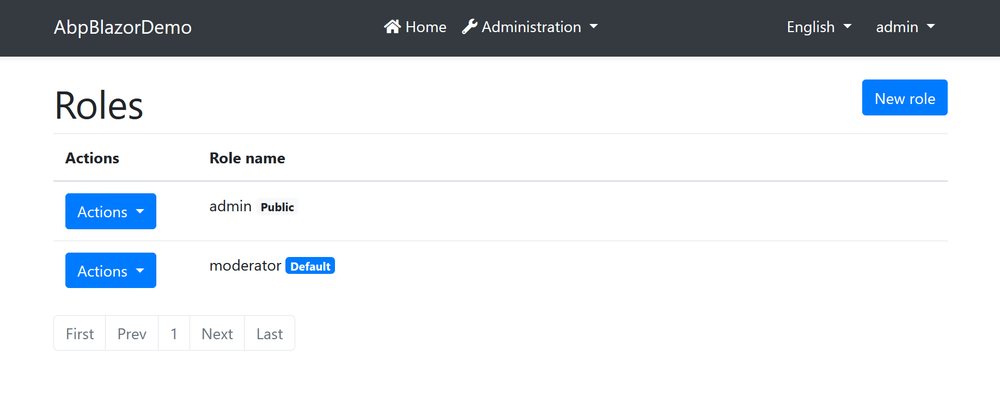

# ABP Framework & ABP Commercial 3.2 RC With The New Blazor UI

We are extremely excited today to release the [ABP Framework](https://abp.io/) Release Candidate (and the [ABP Commercial](https://commercial.abp.io/), as always). This release includes an early preview version of the **Blazor UI** for the ABP.IO Platform.

## The Blazor UI

While the Blazor UI **should be considered as experimental** for now, it is possible to start to develop your application today.

### Fundamental Services

Currently, implemented some important framework features;

* **Authentication** through the MVC backend using the OpenId Connect authorization code flow. So, all the current login options (login, register, forgot password, external/social logins...) are supported.
* **Authorization**, using the ABP Framework **permissions** as well as the standard authorization system.
* **Localization** just works like the MVC UI.
* **Basic Theme** with top main menu.
* **Dynamic C# HTTP API proxies**, so you can directly consume your backend API by injecting the application service interfaces.
* Some other **fundamental services** like `ISettingProvider`, `IFeatureChecker`, `ICurrentUser`...

Also, the standard .net services are already available, like caching, logging, validation and much more. Since the ABP Framework is layered itself, all the non MVC UI related features are already usable for the Blazor UI.

### Pre-Built Modules

Some modules have been implemented;

* **Identity** module is pre-installed and provides **user, role and permission management**.
* **Profile management** page is implemented to allow to change password and personal settings.

### About the Blazorise Library

We've selected the [Blazorise](https://blazorise.com/) as a fundamental UI library for the Blazor UI. It already supports different HTML/CSS frameworks (like Bootstrap, Bulma, Ant Design...) and significantly increases the developer productivity.


We also have a good news: **[Mladen Macanović](https://github.com/stsrki)**, the creator of the Blazorise, is **joining to the core ABP Framework team** in the next weeks. We are excited to work with him to bring the power of these two successful projects together.

### The Tutorial

We've **updated** the [web application development tutorial](https://docs.abp.io/en/abp/3.2/Tutorials/Part-1?UI=Blazor) for the **Blazor UI**. You can start to develop applications today! The **source code** of the BookStore application developed with this tutorial is [here](https://github.com/abpframework/abp-samples/tree/master/BookStore-Blazor-EfCore).

### Get started with the Blazor UI

If you want to try the Blazor UI today, follow the instructions below.

#### Upgrade the ABP CLI

Install the latest [ABP CLI](https://docs.abp.io/en/abp/3.2/CLI) preview version:

````bash
dotnet tool update Volo.Abp.Cli -g --version 3.2.0-rc.2
````

#### Create a new Solution

Then you can create a new solution using the *abp new* command:

````bash
abp new AbpBlazorDemo -u blazor --preview
````

Also specify the `-t app-pro` parameter if you are an ABP Commercial user.

> See the ABP CLI documentation for the additional options, like MongoDB database or separated authentication server.

#### Open the Solution

Open the generated solution using the latest Visual Studio 2019. You will see a solution structure like the picture below:


#### Run the Application

* Run the `DbMigrator` project to create the database and seed the initial data.
* Run the `HttpApi.Host` project for the server side.
* Run the `Blazor` project to start the Blazor UI.

Use `admin` as the username and `1q2w3E*` as the password to login to the application.

Here, a screenshot from the role management page of the Blazor UI:



## What's New with the ABP Framework 3.2

Beside the Blazor UI, there are a lot of issues have been closed with [the milestone 3.2](https://github.com/abpframework/abp/milestone/39?closed=1). I will highlight some of the major features and changes released with this version.

### MongoDB ACID Transactions

[MongoDB integration](https://docs.abp.io/en/abp/3.2/MongoDB) now supports multi-document transactions that comes with the MongoDB 4.x.

We've **disabled transactions** for solutions use the MongoDB, inside the `YourProjectMongoDbModule.cs` file in the MongoDB project. If your MongoDB server **supports transactions**, you should manually enable it in this class:

```csharp
Configure<AbpUnitOfWorkDefaultOptions>(options =>
{
    options.TransactionBehavior = UnitOfWorkTransactionBehavior.Auto;
});
```

> Or you can delete this code since this is already the default behavior.

#### Upgrade Notes

If you are upgrading an existing solution and your MongoDB server doesn't support transactions, please disable it:

```csharp
Configure<AbpUnitOfWorkDefaultOptions>(options =>
{
    options.TransactionBehavior = UnitOfWorkTransactionBehavior.Disabled;
});
```

See the [Unit Of Work document](https://docs.abp.io/en/abp/3.2/Unit-Of-Work) to learn more about UOW and transactions.

Also, add [this file](https://github.com/abpframework/abp/blob/rel-3.2/templates/app/aspnet-core/src/MyCompanyName.MyProjectName.MongoDB/MongoDb/MongoDbMyProjectNameDbSchemaMigrator.cs) into your MongoDB project (remember to change `MongoDbMyProjectNameDbSchemaMigrator` and `IMyProjectNameDbSchemaMigrator` with your own project name).

#### Integration Tests

> Transactions are also **disabled for automated integration tests** coming with the application startup template, since the [Mongo2Go](https://github.com/Mongo2Go/Mongo2Go) library (we use in the test projects) has a problem with the transactions. We've sent a [Pull Request](https://github.com/Mongo2Go/Mongo2Go/pull/101) to fix it and will enable the transactions again when they merge & release it.
>
> If you are upgrading an existing solution and using MongoDB, please disable transactions for the test projects just as described above.

### Kafka Integration for the Distributed Event Bus

ABP Framework's [distributed event system](https://docs.abp.io/en/abp/3.2/Distributed-Event-Bus) has been [integrated to RabbitMQ](https://docs.abp.io/en/abp/3.2/Distributed-Event-Bus-RabbitMQ-Integration) before. By the version 3.2, it has a Kafka integration package, named [Volo.Abp.EventBus.Kafka](https://www.nuget.org/packages/Volo.Abp.EventBus.Kafka).

See the [Kafka integration documentation](https://docs.abp.io/en/abp/3.2/Distributed-Event-Bus-Kafka-Integration) to learn how to install and configure it.

### Host Features

[ABP Feature System](https://docs.abp.io/en/abp/3.2/Features) allows you to define features in your application. Then you can enable/disable a feature dynamically on the runtime. It is generally used in a [multi-tenant](https://docs.abp.io/en/abp/3.2/Multi-Tenancy) system to restrict features for tenants, so you can charge extra money for some features in a SaaS application.

In some cases, you may want to use the same features in the host side (host is you as you are managing the tenants). For this case, we've added a "**Manage Host Features**" button to the Tenant Management page so you can open a modal dialog to select the features for the host side.


### AbpHttpClientBuilderOptions

ABP Framework provides a system to dynamically create C# proxies to consume HTTP APIs from your client applications. `AbpHttpClientBuilderOptions` is a new option class to configure the `HttpClient`s used by the proxy system.

**Example: Use the [Polly](https://github.com/App-vNext/Polly) library to retry up to 3 times for a failed HTTP request**

````csharp
public override void PreConfigureServices(ServiceConfigurationContext context)
{
    PreConfigure<AbpHttpClientBuilderOptions>(options =>
    {
        options.ProxyClientBuildActions.Add((remoteServiceName, clientBuilder) =>
        {
            clientBuilder.AddTransientHttpErrorPolicy(policyBuilder =>
                policyBuilder.WaitAndRetryAsync(
                    3,
                    i => TimeSpan.FromSeconds(Math.Pow(2, i))
                )
            );
        });
    });
}
````

See the issue [#5304](https://github.com/abpframework/abp/issues/5304) for the details.

### ABP Build Command

We are using **mono repository** approach and the [abp repository](https://github.com/abpframework/abp) has tens of solutions and hundreds of projects (the framework, modules, tooling, templates...) with all of them are referencing to each other.

It gets a significant time to build the whole repository for every Git push. To **optimize** this process, we've created the **abp build** command in the [ABP CLI](https://docs.abp.io/en/abp/3.2/CLI):

````bash
abp build
````

We will use this command to build the abp repository or a solution inside it. However it is available to everyone in case of need.

> **Most of the people will not need it**. If you need it, see the [ABP CLI](https://docs.abp.io/en/abp/3.2/CLI) document to learn all the details and options.

### Other Features, Improvements and Changes

* Introduced the `DynamicRangeAttribute` that can be used to determine the range values on runtime, just like the `DynamicStringLengthAttribute` was introduced before.
* Improved the feature management modal for multi-tenant applications to group features on the UI and show hierarchically.
* Added `--skip-cli-version-check` option to ABP CLI to improve the performance by bypassing the online version check.
* Angular UI now redirect to MVC UI (the authentication server side) for profile management page, if the authorization code flow is used (which is the default).
* Account module profile management page is now extensible. You can implement the `IProfileManagementPageContributor` interface and register it using the `ProfileManagementPageOptions` class.
* Improvements and optimizations for the [Angular service proxy generation](https://blog.abp.io/abp/Introducing-the-Angular-Service-Proxy-Generation).

And a lot of minor improvements and bug fixes. You can see [the milestone 3.2](https://github.com/abpframework/abp/milestone/39?closed=1) for all issues & PRs closed with this version.

## What's New with the ABP Commercial 3.2

### Breaking Changes

The new *profile picture management* feature uses the [BLOB storing](https://docs.abp.io/en/abp/3.2/Blob-Storing) system, so it needs a Storage Provider. The new **startup template comes with the [Database BLOB Provider](https://docs.abp.io/en/abp/3.2/Blob-Storing-Database) pre-installed**. You can change it if you want to use another BLOB provider (like Azure, AWS or a simple file system).

**Existing solutions must configure a BLOB provider** after upgrading to the version 3.2. Follow the [BLOB Storing document](https://docs.abp.io/en/abp/3.2/Blob-Storing#blob-storage-providers) to configure the provider yourself.

### The Blazor UI

The **experimental** Blazor UI is also available for the ABP Commercial. The [Lepton Theme](https://commercial.abp.io/themes) hasn't been implemented with this initial preview, however we are working on it with the highest priority.

You can use the [ABP Suite](https://docs.abp.io/en/commercial/latest/abp-suite/index) or the following ABP CLI command to create a new solution with the Blazor UI:

````bash
abp new AbpBlazorDemo -u blazor -t app-pro --preview
````

Please try it and provide feedback to us. Thanks in advance.

> See the instructions in the *Get started with the Blazor UI* section above to properly create and run your application.

### File Management Angular UI

Angular UI for the [File Management](https://commercial.abp.io/modules/Volo.FileManagement) module is available with the version 3.2. You can add it to your solution using the ABP Suite.


### Profile Picture Management

We've added profile picture management for the account module, so a user can select one of the options below for her profile picture;

* Use the default placeholder as the avatar.
* Use [Gravatar](https://gravatar.com/) service to get the picture matching the email address of the user.
* Upload a file as the profile picture.


### Two Factor Authentication Features

Created [features](https://docs.abp.io/en/abp/3.2/Features) and [settings](https://docs.abp.io/en/abp/3.2/Settings) to disable, enable or force to use 2FA on login for the tenants and users.

### Upgrading the ABP Suite

You can use the following command to upgrade the ABP Suite to the latest preview version:

````
abp suite update --preview
````

## Other News

### The ABP Community

**ABP Community** web site is constantly being improved and new articles are added. We will add "**commenting**" and "**rating**" features to the articles soon to increase the interactivity between the people.


If you have something to share with the ABP community or want to follow the project progress, please check the **[community.abp.io](https://community.abp.io/)**!

### CMS Kit Project

We are silently working on a project, named [CMS Kit](https://github.com/abpframework/abp/tree/dev/modules/cms-kit), for a few months. CMS Kit is a set of reusable CMS (Content Management System) components based on the ABP Framework. Some of the components currently being developed:

* **Comments**; Allows users to comment under something (a blog post, a document, an image... etc).
* **Reactions**; Allows users to give reactions to something (a comment, a picture... etc.) using simple emoji icons.
* **Rating**; Allows users to rate some content from 1 to 5.
* **Newsletter**; Allows you to put a newsletter box to your web site to collect emails from users.
* **Contact**; Put a form to get message from the web site visitors.

There are more planned components like articles, tags, votes, favorites, portfolio, image gallery, FAQ... etc. We will document and deploy these components when they get matured and ready to use. Some of them will be open source & free while some of them are paid (included in the [ABP Commercial](https://commercial.abp.io/) license).

## Feedback

Please try the ABP Framework 3.2.0 RC and [provide feedback](https://github.com/abpframework/abp/issues/new) to help us to release a more stable version. The planned release date for the [3.2.0 final](https://github.com/abpframework/abp/milestone/43) version is October 01.