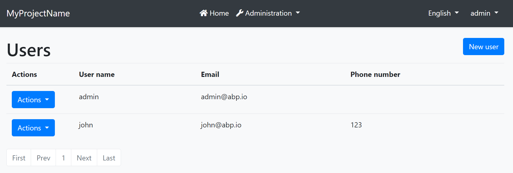
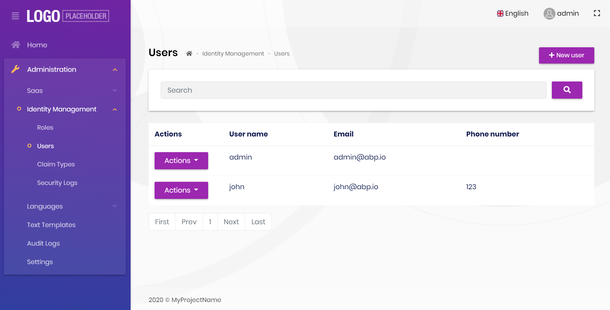
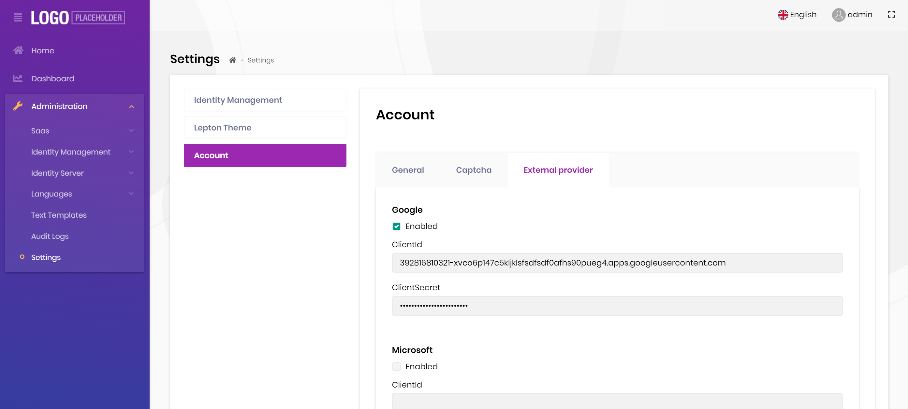
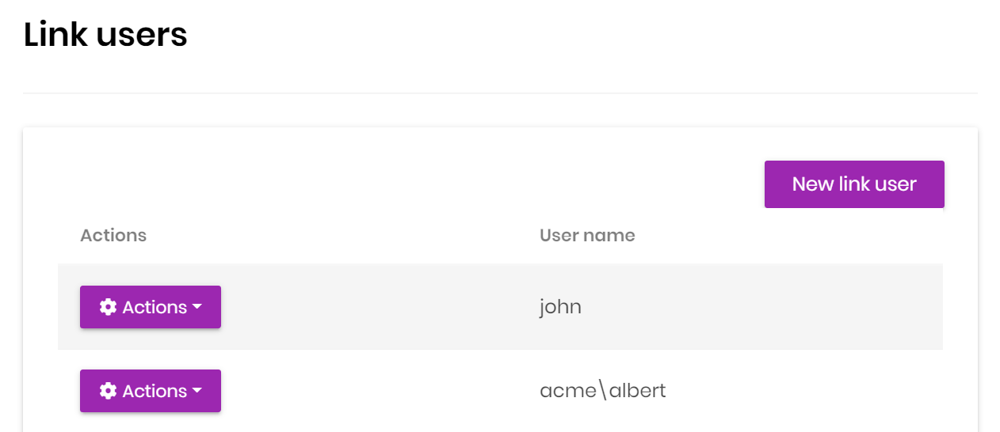

# ABP Framework 3.3 RC Has Been Published

We have released the [ABP Framework](https://abp.io/) (and the [ABP Commercial](https://commercial.abp.io/)) `3.3.0-rc.1` today. This blog post introduces the new features and important changes in the new version.

## Get Started with the 3.3 RC.1

If you want to try the version `3.3.0-rc.1` today, follow the steps below;

1) **Upgrade** the ABP CLI to the version `3.3.0-rc.1` using a command line terminal:

````bash
dotnet tool update Volo.Abp.Cli -g --version 3.3.0-rc.1
````

**or install** if you haven't installed before:

````bash
dotnet tool install Volo.Abp.Cli -g --version 3.3.0-rc.1
````

2) Create a **new application** with the `--preview` option:

````bash
abp new BookStore --preview
````

See the [ABP CLI documentation](https://docs.abp.io/en/abp/3.3/CLI) for all the available options.

> You can also use the *Direct Download* tab on the [Get Started](https://abp.io/get-started) page by selecting the Preview checkbox.

## What's new with the ABP Framework 3.3

### The Blazor UI

We had released an experimental early preview version of the Blazor UI with the [previous version](https://blog.abp.io/abp/ABP-Framework-ABP-Commercial-3.2-RC-With-The-New-Blazor-UI). In this version, we've completed most of the fundamental infrastructure features and the application modules (like identity and tenant management).

It currently has almost the same functionalities as the other UI types (Angular & MVC / Razor Pages).

**Example screenshot**: User management page of the Blazor UI



> We've adapted the [Lepton Theme](https://commercial.abp.io/themes) for the ABP Commercial, see the related section below.

We are still working on the fundamentals. So, the next version may introduce breaking changes of the Blazor UI. We will work hard to keep them with the minimal effect on your application code.

#### Breaking Changes on the Blazor UI

There are some breaking changes with the Blazor UI. If you've built an application and upgrade it, your application might not properly work. See [the migration guide](https://docs.abp.io/en/abp/3.3/Migration-Guides/BlazorUI-3_3) for the changes you need to do after upgrading your application.

### Automatic Validation for AntiForgery Token for HTTP APIs

Starting with the version 3.3, all your HTTP API endpoints are **automatically protected** against CSRF attacks, unless you disable it for your application. So, no configuration needed, just upgrade the ABP Framework.

[See the documentation](https://docs.abp.io/en/abp/3.3/CSRF-Anti-Forgery) to if you want to understand why you need it and how ABP Framework solves the problem.

### Rebus Integration Package for the Distributed Event Bus

[Rebus](https://github.com/rebus-org/Rebus) describes itself as "Simple and lean service bus implementation for .NET". There are a lot of integration packages like RabbitMQ and Azure Service Bus for the Rebus. The new [Volo.Abp.EventBus.Rebus](https://www.nuget.org/packages/Volo.Abp.EventBus.Rebus) package allows you to use the Rebus as the [distributed event bus](https://docs.abp.io/en/abp/latest/Distributed-Event-Bus) for the ABP Framework.

See [the documentation](https://docs.abp.io/en/abp/3.3/Distributed-Event-Bus-Rebus-Integration) to learn how to use Rebus with the ABP Framework.

### Async Repository LINQ Extension Methods

You have a problem when you want to use **Async LINQ Extension Methods** (e.g. `FirstOrDefaultAsync(...)`) in your **domain** and **application** layers. These async methods are **not included in the standard LINQ extension methods**. Those are defined by the [Microsoft.EntityFrameworkCore](https://www.nuget.org/packages/Microsoft.EntityFrameworkCore) NuGet package (see [the code](https://github.com/dotnet/efcore/blob/main/src/EFCore/Extensions/EntityFrameworkQueryableExtensions.cs)). To be able to use these `async` methods, you need to reference to the `Microsoft.EntityFrameworkCore` package.

If you don't want to depend on the EF Core in your business layer, then ABP Framework provides the `IAsyncQueryableExecuter` service to execute your queries asynchronously without depending on the EF Core package. You can see [the documentation](https://docs.abp.io/en/abp/latest/Repositories#option-3-iasyncqueryableexecuter) to get more information about this service.

ABP Framework version 3.3 takes this one step further and allows you to directly execute the async LINQ extension methods on the `IRepository` interface.

**Example: Use `CountAsync` and `FirstOrDefaultAsync` methods on the repositories**

````csharp
using System;
using System.Threading.Tasks;
using Volo.Abp.Application.Services;
using Volo.Abp.Domain.Repositories;

namespace MyCompanyName.MyProjectName
{
    public class BookAppService : ApplicationService, IBookAppService
    {
        private readonly IRepository<Book, Guid> _bookRepository;

        public BookAppService(IRepository<Book, Guid> bookRepository)
        {
            _bookRepository = bookRepository;
        }

        public async Task DemoAsync()
        {
            var countAll = await _bookRepository
                .CountAsync();

            var count = await _bookRepository
                .CountAsync(x => x.Name.Contains("A"));

            var book1984 = await _bookRepository
                .FirstOrDefaultAsync(x => x.Name == "1984");            
        }
    }
}
````

All the standard LINQ methods are supported: *AllAsync, AnyAsync, AverageAsync, ContainsAsync, CountAsync, FirstAsync, FirstOrDefaultAsync, LastAsync, LastOrDefaultAsync, LongCountAsync, MaxAsync, MinAsync, SingleAsync, SingleOrDefaultAsync, SumAsync, ToArrayAsync, ToListAsync*.

This approach still has a limitation. You need to execute the extension method directly on the repository object. For example, the below usage is **not supported**:

````csharp
var count = await _bookRepository.Where(x => x.Name.Contains("A")).CountAsync();
````

This is because the object returned from the `Where` method is not a repository object, it is a standard `IQueryable`. In such cases, you can still use the `IAsyncQueryableExecuter`:

````csharp
var count = await AsyncExecuter.CountAsync(
    _bookRepository.Where(x => x.Name.Contains("A"))
);
````

`AsyncExecuter` has all the standard extension methods, so you don't have any restriction here. See [the repository documentation](https://docs.abp.io/en/abp/latest/Repositories#iqueryable-async-operations) for all the options you have.

> ABP Framework does its best to not depend on the EF Core and still be able to use the async LINQ extension methods. However, there is no problem to depend on the EF Core for your application, you can add the `Microsoft.EntityFrameworkCore` NuGet package and use the native methods.

### Stream Support for the Application Service Methods

[Application services](https://docs.abp.io/en/abp/latest/Application-Services) are consumed by clients and the parameters and return values (typically [Data Transfer Objects](https://docs.abp.io/en/abp/latest/Data-Transfer-Objects)). In case of the client is a remote application, then these objects should be serialized & deserialized.

Until the version 3.3, we hadn't suggest to use the `Stream` in the application service contracts, since it is not serializable/deserializable. However, with the version 3.3, ABP Framework properly supports this scenario by introducing the new `IRemoteStreamContent` interface.

Example: An application service that can get or return streams

````csharp
using System;
using System.Threading.Tasks;
using Volo.Abp.Application.Services;
using Volo.Abp.Content;

namespace MyProject.Test
{
    public interface ITestAppService : IApplicationService
    {
        Task Upload(Guid id, IRemoteStreamContent streamContent);
        Task<IRemoteStreamContent> Download(Guid id);
    }
}
````

The implementation can be as shown below:

````csharp
using System;
using System.IO;
using System.Threading.Tasks;
using Volo.Abp;
using Volo.Abp.Application.Services;
using Volo.Abp.Content;

namespace MyProject.Test
{
    public class TestAppService : ApplicationService, ITestAppService
    {
        public Task<IRemoteStreamContent> Download(Guid id)
        {
            var fs = new FileStream("C:\\Temp\\" + id + ".blob", FileMode.OpenOrCreate);
            return Task.FromResult(
                (IRemoteStreamContent) new RemoteStreamContent(fs) {
                    ContentType = "application/octet-stream" 
                }
            );
        }

        public async Task Upload(Guid id, IRemoteStreamContent streamContent)
        {
            using (var fs = new FileStream("C:\\Temp\\" + id + ".blob", FileMode.Create))
            {
                await streamContent.GetStream().CopyToAsync(fs);
                await fs.FlushAsync();
            }
        }
    }
}
````

> This is just a demo code. Do it better in your production code :)

Thanks to [@alexandru-bagu](https://github.com/alexandru-bagu) for the great contribution!

### Other Changes

* Upgraded all the .NET Core / ASP.NET Core related packages to the version 3.1.8. If you have additional dependencies to the .NET Core / ASP.NET Core related packages, we suggest you to updates your packages to the version 3.1.8 to have the latest bug and security fixes published by Microsoft.
* The blogging module now uses the [BLOB Storing](https://docs.abp.io/en/abp/latest/Blob-Storing) system to store images & files of the blog posts. If you are using this module, then you need to manually migrate the local files to the BLOB Storing system after the upgrade.
* The Angular UI is now redirecting to the profile management page of the MVC UI instead of using its own UI, if you've configured the authorization code flow (which is default since the version 3.2.0).

## What's new with the ABP Commercial 3.3

### The Blazor UI

We have good news for the ABP Commercial Blazor UI too. We have implemented the [Lepton Theme](https://commercial.abp.io/themes) integration, so it is now available with the Blazor UI. Also, implemented most of the fundamental [modules](https://commercial.abp.io/modules).

**A screenshot from the ABP Commercial startup template with the Blazor UI**



There are still missing features and modules. However, we are working on it to have a more complete version in the next release.

#### Breaking Changes on the Blazor UI

There are some breaking changes with the Blazor UI. If you've built an application and upgrade it, your application might not properly work. See the [ABP Commercial Blazor UI v 3.3 Migration Guide](https://docs.abp.io/en/commercial/3.3/migration-guides/blazor-ui-3_3) for the changes you need to do after upgrading your application.

#### Known Issues

When you create a new project, profile management doesn't work, you get an exception because it can't find the `/libs/cropperjs/css/cropper.min.css` file. To fix the issue;

* Add `"@volo/account": "^3.3.0-rc.1"` to the `package.json` in the `.Host` project.
* Run `yarn` (or `npm install`), then `abp install-libs` on a command line terminal in the root folder of the `.Host` project.

### Multi-Tenant Social Logins

[Account module](https://commercial.abp.io/modules/Volo.Account.Pro) now supports to manage the social/external logins in the UI. You can **enable/disable** and **set options** in the settings page. It also supports to use **different credentials for the tenants** and it is also **configured on the runtime**.



### Linked Accounts

Linked user system allows you to link other accounts (including account in a different tenant) with your account, so you can switch between different accounts with a single-click. It is practical since you no longer need to logout and login again with entering the credentials of the target account.

To manage the linked accounts, go to the profile management page from the user menu;



### Paypal & Stripe Integrations

The [Payment Module](https://commercial.abp.io/modules/Volo.Payment) was supporting PayU and 2Checkout providers until the version 3.3. It's now integrated to PayPal and Stripe. See the [technical documentation](https://docs.abp.io/en/commercial/latest/modules/payment) to learn how to use it.

### ABP Suite Improvements

We've done a lot of small improvements for the [ABP Suite](https://commercial.abp.io/tools/suite). Some of the enhancements are;

* Show the previously installed modules as *installed* on the module list.
* Switch between the latest stable, the latest [preview](https://docs.abp.io/en/abp/latest/Previews) and the latest [nightly build](https://docs.abp.io/en/abp/latest/Nightly-Builds) versions of the ABP related packages.
* Moved the file that stores the *previously created entities* into the solution folder to allow you to store it in your source control system.

### Others

* Added an option to the Account Module to show reCAPTCHA on the login & the registration forms.

Besides the new features introduced in this post, we've done a lot of small other enhancements and bug fixes to provide a better development experience and increase the developer productivity.

## New Articles

The core ABP Framework team & the community continue to publish new articles on the [ABP Community](https://community.abp.io/) web site. The recently published articles are;

* [Replacing Email Templates and Sending Emails](https://community.abp.io/articles/replacing-email-templates-and-sending-emails-jkeb8zzh) (by [@EngincanV](https://community.abp.io/members/EngincanV))
* [How to Add Custom Properties to the User Entity](https://community.abp.io/articles/how-to-add-custom-property-to-the-user-entity-6ggxiddr) (by [@berkansasmaz](https://community.abp.io/members/berkansasmaz))
* [Using the AdminLTE Theme with the ABP Framework MVC / Razor Pages UI](https://community.abp.io/articles/using-the-adminlte-theme-with-the-abp-framework-mvc-razor-pages-ui-gssbhb7m) (by [@mucahiddanis](https://community.abp.io/members/mucahiddanis))
* [Using DevExtreme Angular Components With the ABP Framework](https://community.abp.io/articles/using-devextreme-angular-components-with-the-abp-framework-x5nyvj3i) (by [@bunyamin](https://community.abp.io/members/bunyamin))

It is appreciated if you want to [submit an article](https://community.abp.io/articles/submit) related to the ABP Framework.

## About the Next Release

The next version will be `4.0.0`. We are releasing a major version, since we will move the ABP Framework to .NET 5.0. We see that for most of the applications this will not be a breaking change and we hope you easily upgrade to it.

The planned 4.0.0-rc.1 (Release Candidate) version date is **November 11**, just after the Microsoft releases the .NET 5.0 final. The planned 4.0.0 final release date is **November 26**.

Follow the [GitHub milestones](https://github.com/abpframework/abp/milestones) for all the planned ABP Framework version release dates.

## Feedback

Please check out the ABP Framework 3.3.0 RC and [provide feedback](https://github.com/abpframework/abp/issues/new) to help us to release a more stable version. The planned release date for the [3.3.0 final](https://github.com/abpframework/abp/milestone/44) version is October 27th.
