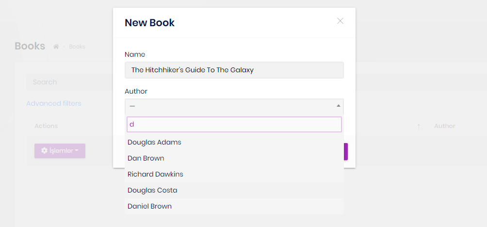

# ABP Framework 4.0 RC Has Been Published based on .NET 5.0!

Today, we have released the [ABP Framework](https://abp.io/) (and the [ABP Commercial](https://commercial.abp.io/)) 4.0.0 RC that is based on the **.NET 5.0**. This blog post introduces the new features and important changes in the new version.

> **The planned release date for the [4.0.0 final](https://github.com/abpframework/abp/milestone/45) version is November 26, 2020**.

## Get Started with the 4.0 RC

If you want to try the version `4.0.0` today, follow the steps below;

1) **Upgrade** the ABP CLI to the version `4.0.0-rc.3` using a command line terminal:

````bash
dotnet tool update Volo.Abp.Cli -g --version 4.0.0-rc.3
````

**or install** if you haven't installed before:

````bash
dotnet tool install Volo.Abp.Cli -g --version 4.0.0-rc.3
````

2) Create a **new application** with the `--preview` option:

````bash
abp new BookStore --preview
````

See the [ABP CLI documentation](https://docs.abp.io/en/abp/3.3/CLI) for all the available options.

> You can also use the *Direct Download* tab on the [Get Started](https://abp.io/get-started) page by selecting the **Preview checkbox**.

## Migrating From 3.x to 4.0

The version 4.0 comes with some major changes including the **migration from .NET Core 3.1 to .NET 5.0**.

We've prepared a **detailed [migration document](https://docs.abp.io/en/abp/4.0/Migration-Guides/Abp-4_0)** to explain all the changes and the actions you need to take while upgrading your existing solutions.

## What's new with the ABP Framework 4.0

### The Blazor UI

The Blazor UI is now stable and officially supported. The [web application development tutorial](https://docs.abp.io/en/abp/4.0/Tutorials/Part-1?UI=Blazor) has been updated based on the version 4.0.

#### abp bundle command

Introducing the `abp bundle` CLI command to manage static JavaScript & CSS file dependencies of a Blazor application. This command is currently used to add the dependencies to the `index.html` file in the dependency order by respecting to modularity. In the next version it will automatically unify & minify the files. The documentation is being prepared.

#### Removed the JQuery & Bootstrap JavaScript

Removed JQuery & Bootstrap JavaScript dependencies for the Blazor UI.

>There are some other changes in the startup template and some public APIs. Follow the [Migration Guide](https://docs.abp.io/en/abp/4.0/Migration-Guides/Abp-4_0) to apply changes for existing solutions that you're upgrading from the version 3.3. While we will continue to make improvements add new features, we no longer make breaking changes on the existing APIs until the version 5.0.

#### Others

A lot of minor and major improvements have been done for the Blazor UI. Some of them are listed below:

* Implemented `IComponentActivator` to resolve the component from the `IServiceProvider`. So, you can now inject dependencies into the constructor of your razor component.
* Introduced the `AbpComponentBase` base class that you derive your components from. It has useful base properties that you can use in your pages/components.
* Introduced `IUiNotificationService` service to show toast notifications on the UI.
* Improved the `IUiMessageService` to show message & confirmation dialogs.

### System.Text.Json

ABP Framework 4.0 uses the System.Text.Json by default as the JSON serialization library. It, actually, using a hybrid approach: Continues to use the Newtonsoft.Json when it needs to use the features not supported by the System.Text.Json.

Follow the [Migration Guide](https://docs.abp.io/en/abp/4.0/Migration-Guides/Abp-4_0) to learn how to configure to use the Newtonsoft.Json for some specific types or switch back to the Newtonsoft.Json as the default JSON serializer.

### Identity Server 4 Upgrade

ABP Framework upgrades the [IdentityServer4](https://www.nuget.org/packages/IdentityServer4) library from 3.x to 4.1.1 with the ABP Framework version 4.0. IdentityServer 4.x has a lot of changes. Some of them are **breaking changes in the data structure**.

Follow the [Migration Guide](https://docs.abp.io/en/abp/4.0/Migration-Guides/Abp-4_0) to upgrade existing solutions.

### Creating a New Module Inside the Application

ABP CLI has now a command to create a new module and add it to an existing solution. In this way, you can create modular applications easier than before.

Example: Create a *ProductManagement* module into your solution.

````bash
abp add-module ProductManagement --new --add-to-solution-file
````

Execute this command in a terminal in the root folder of your solution. If you don't specify the `--add-to-solution-file` option, then the module projects will not be added to the main solution, but the project references still be added. In this case, you need to open the module's solution to develop the module.

See the [CLI document](https://docs.abp.io/en/abp/4.0/CLI) for other options.

### WPF Startup Template

Introducing the WPF startup template for the ABP Framework. Use the ABP CLI new command to create a new WPF application:

````bash
abp new MyWpfApp -t wpf
````

This is a minimalist, empty project template that is integrated to the ABP Framework.

### New Languages

**Thanks to the contributors** from the ABP Community, the framework modules and the startup template have been localized to **German** language by [Alexander Pilhar](https://github.com/alexanderpilhar) & [Nico Lachmuth](https://github.com/tntwist).

### Other Notes

* Upgraded to Angular 11.
* Since [Mongo2Go](https://github.com/Mongo2Go/Mongo2Go) library not supports transactions, you can use transactions in unit tests for MongoDB.

## What's new with the ABP Commercial 4.0

### The Blazor UI

The Blazor UI for the ABP Commercial is also becomes stable and feature rich with the version 4.0;

* [ABP Suite](https://commercial.abp.io/tools/suite) now supports to generate CRUD pages for the Blazor UI.
* Completed the [Lepton Theme](https://commercial.abp.io/themes) for the Blazor UI.
* Implemented the [File Management](https://commercial.abp.io/modules/Volo.FileManagement) module for the Blazor UI.

### The ABP Suite

While creating create/edit modals with a navigation property, we had two options: A dropdown to select the target entity and a modal to select the entity by searching with a data table.

Dropdown option now supports **lazy load, search and auto-complete**. In this way, selecting a navigation property becomes much easier and supports large data sets on the dropdown.

**Example: Select an author while creating a new book**



With the new version, you can **disable backend code generation** on CRUD page generation. This is especially useful if you want to regenerate the page with a different UI framework, but don't want to regenerate the server side code.

### Identity Server Management UI Revised

Completely revised the Identity Server Management UI based on the IDS 4.x changes.

## About the Next Release

The next feature version, `4.1.0`, will mostly focus on completing the missing documents, fixing bugs, performance optimizations and improving the Blazor UI features. The planned preview release date for the version `4.1.0` is December 10 and the final (stable) version release date is December 24.

Follow the [GitHub milestones](https://github.com/abpframework/abp/milestones) for all the planned ABP Framework version release dates.

## Feedback

Please check out the ABP Framework 4.0.0 RC and [provide feedback](https://github.com/abpframework/abp/issues/new) to help us to release a more stable version. **The planned release date for the [4.0.0 final](https://github.com/abpframework/abp/milestone/45) version is November 26**.
