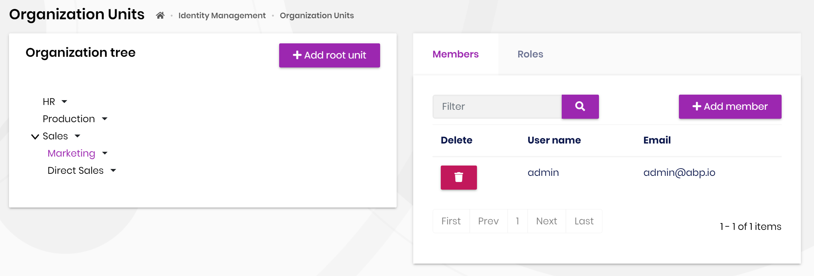
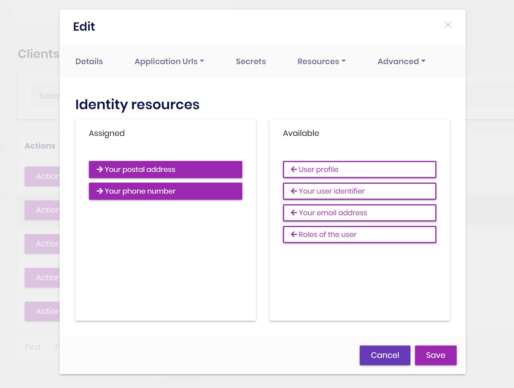
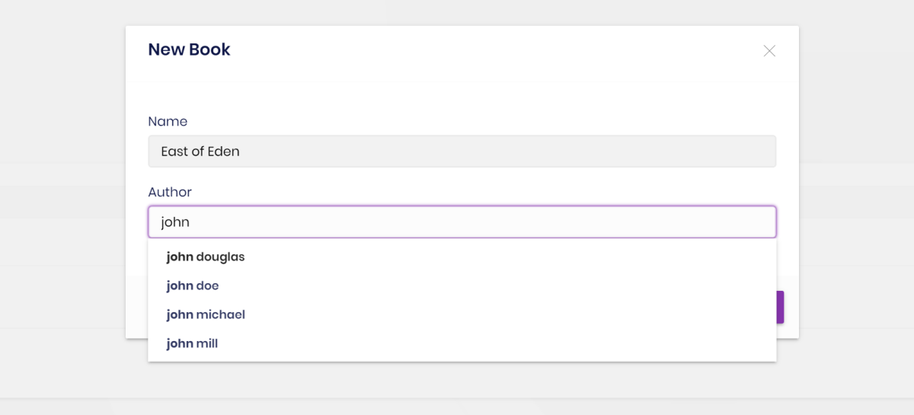
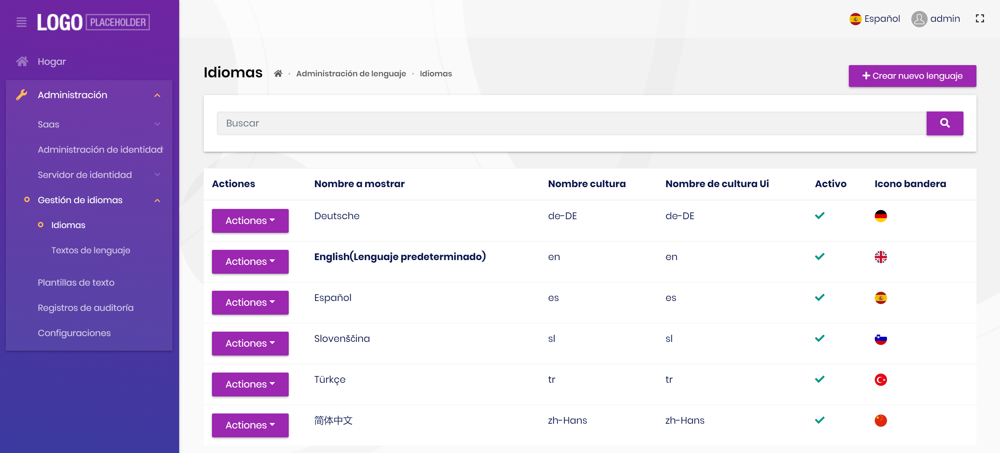
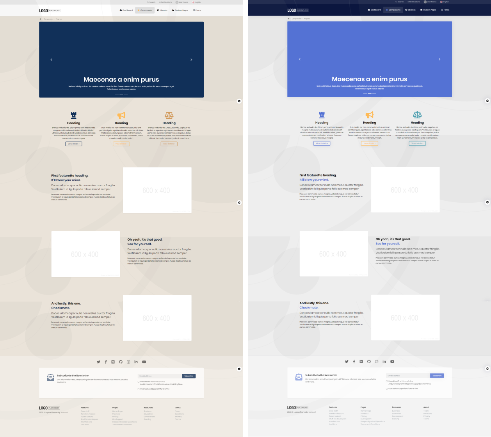
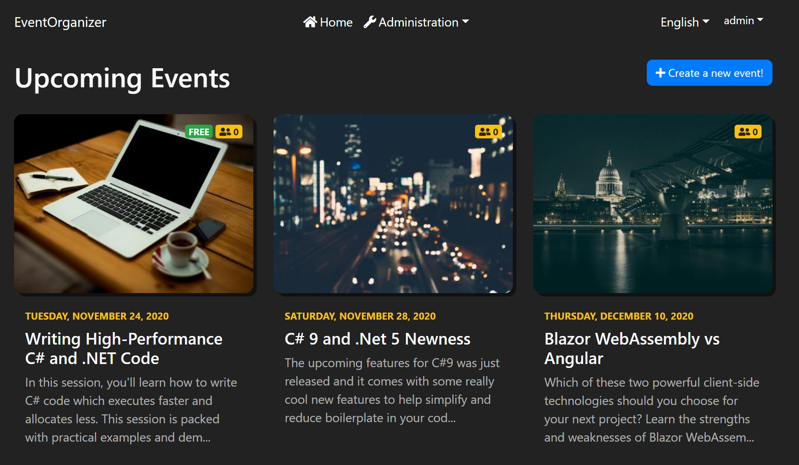

# ABP Framework 4.1 RC Has Been Published

Today, we have released the [ABP Framework](https://abp.io/) (and the [ABP Commercial](https://commercial.abp.io/)) 4.1.0 RC. This blog post introduces the new features and important changes in this new version.

> **The planned release date for the [4.1.0 final](https://github.com/abpframework/abp/milestone/47) version is January 4, 2021**.

## Get Started with the 4.1 RC

If you want to try the version `4.1.0` today, follow the steps below;

1) **Upgrade** the ABP CLI to the version `4.1.0-rc.1` using a command line terminal:

````bash
dotnet tool update Volo.Abp.Cli -g --version 4.1.0-rc.1
````

**or install** if you haven't installed before:

````bash
dotnet tool install Volo.Abp.Cli -g --version 4.1.0-rc.1
````

2) Create a **new application** with the `--preview` option:

````bash
abp new BookStore --preview
````

See the [ABP CLI documentation](https://docs.abp.io/en/abp/latest/CLI) for all the available options.

> You can also use the *Direct Download* tab on the [Get Started](https://abp.io/get-started) page by selecting the **Preview checkbox**.

## Breaking Changes

This version has a minor breaking change if you'd injected a repository by class. This is not a problem for 99% of the applications. However, see [#6677](https://github.com/abpframework/abp/issues/6677) for the solution if that's a breaking change for you.

## What's new with the ABP Framework 4.1

### Module Entity Extensions

Module Entity Extension system provides a simple way of adding new properties to an existing entity defined by a module that is used by your application. This feature is now available also for the open source modules (identity and tenant-management). [The documentation](https://docs.abp.io/en/abp/latest/Module-Entity-Extensions) has been moved into the ABP Framework's documentation.

**Example: Add "SocialSecurityNumber" property to the `IdentityUser` entity**

````csharp
ObjectExtensionManager.Instance.Modules()
    .ConfigureIdentity(identity =>
    {
        identity.ConfigureUser(user =>
        {
            user.AddOrUpdateProperty<string>( //property type: string
                "SocialSecurityNumber", //property name
                property =>
                {
                    //validation rules
                    property.Attributes.Add(new RequiredAttribute());
                    property.Attributes.Add(
                        new StringLengthAttribute(64) {
                            MinimumLength = 4
                        }
                    );

                    //...other configurations for this property
                }
            );
        });
    });
````

The new property becomes available on the UI, API and the database. You can even define navigation properties. This provides an easy way to extend existing modules while using them as NuGet packages. See [the document](https://docs.abp.io/en/abp/latest/Module-Entity-Extensions) for details.

### Blazor UI Improvements

Since the Blazor UI is relatively new in the ABP Framework, we continue to add features and make enhancements to fill the gap between other supported UI types.

#### Bundling & Minification

In the version 4.1, we had introduced the `abp bundle` command for the Blazor UI to add global script and style files of the depended modules into the `index.html`. It was a preparation for a real bundling & minification system. With the version 4.2, this command has been completed.

Whenever you add a new module to your Blazor application, just type the `abp bundle` command in a command line terminal;

* It finds all the global script/style files in your application and the modules your application directly or indirectly depends on, ordered by the module dependencies.
* Bundles all the scripts into a single file and minified the file (same for the styles).
* Add the single bundle file to the `index.html` file.

Added a configuration into the `appsettings.json` file in the Blazor application in the application startup template to control the bundling mode:

````js
{
  "AbpCli": {
    "Bundle": {
      "Mode": "BundleAndMinify"
    }
  }
}
````

Possible values are;

* `BundleAndMinify`: Bundle all the files into a single file and minify the content.
* `Bundle`: Bundle all files into a single file, but not minify.
* `None`: Add files individually, do not bundle.

See the [Global Scripts & Styles](https://docs.abp.io/en/abp/4.1/UI/Blazor/Global-Scripts-Styles) document for details.

#### SubmitButton

`SubmitButton` is a new component that simplifies to save a form:

````html
<SubmitButton Clicked="UpdateEntityAsync" />
````

The main advantages of using this component instead of a standard `Button` with submit type is; It automatically blocks the submit button until the save operation has fully completed. This prevents multiple clicks by user. And it is shorter than doing all manually. See the [document](https://docs.abp.io/en/abp/4.1/UI/Blazor/SubmitButton).

#### Other Blazor UI highlights

* Implemented some **animations** (like opening/closing modals and dropdowns).
* Automatically **focus** to the first input when you open a modal form.

Module extensibility system (mentioned above) for the Blazor UI is under development and not available yet.

## What's new with the ABP Commercial 4.1

### Blazor UI Improvements

We continue to complete missing modules and functionalities for the Blazor UI.

#### Organization Unit Management

Organization Management UI has been implemented for the Blazor UI. Example screenshot:



#### IdentityServer UI

IdentityServer Management UI is also available for the Blazor UI now:



### Suite: Navigation Property Selection with Typeahead

We had introduced auto-complete select style navigation property selection. With this release, it is fully supported by all the UI options. So, when you create an CRUD page with ABP Suite for entity that has 1 to Many relation to another entity, you can simply select the target entity with a typeahead style select component. Example screenshot:



### Spanish Language Translation

We continue to add new language supports for the UI. In this version, translated the UI to **Spanish** language.



### Coming: Public Website with Integrated CMS Features

In the next version, the application startup template will come with a public website application option. CMS Kit module will be installed in the website by default, that means newsletter, contact form, comments and some other new features will be directly usable in your applications.

An early screenshot from the public website application home page:



## Other News

### ABP Community Contents

A lot of new contents have been published in the ABP Community Web Site in the last two weeks:

* [How to Integrate the Telerik Blazor Components to the ABP Blazor UI](https://community.abp.io/articles/how-to-integrate-the-telerik-blazor-components-to-the-abp-blazor-ui-q8g31abb) by [EngincanV](https://github.com/EngincanV)
* [Using DevExpress Blazor UI Components With the ABP Framework](https://community.abp.io/articles/using-devexpress-blazor-ui-components-with-the-abp-framework-wrpoa8rw) by [@berkansasmaz](https://github.com/berkansasmaz)
* [Creating a new UI theme by copying the Basic Theme (for MVC UI)](https://community.abp.io/articles/creating-a-new-ui-theme-by-copying-the-basic-theme-for-mvc-ui-yt9b18io) by [@ebubekirdinc](https://github.com/ebubekirdinc)
* [Using Angular Material Components With the ABP Framework](https://community.abp.io/members/muhammedaltug) by [@muhammedaltug](https://github.com/muhammedaltug)
* [How to export Excel files from the ABP framework](https://community.abp.io/articles/how-to-export-excel-files-from-the-abp-framework-wm7nnw3n) by [bartvanhoey](https://github.com/bartvanhoey)
* [Creating an Event Organizer Application with the ABP Framework & Blazor UI](https://community.abp.io/articles/creating-an-event-organizer-application-with-the-blazor-ui-wbe0sf2z) by [@hikalkan](https://github.com/hikalkan)

Thanks to all of the contributors. We are waiting for your contributions too. If you want to create content for the ABP Community, please visit [community.abp.io](https://community.abp.io/) website and submit your article.

#### Be a Superhero on Day 1 with ABP.IO

Thanks to [@lprichar](http://github.com/lprichar) prepared an awesome introduction video for the ABP.IO Platform: "[Be a Superhero on Day 1 with ABP.IO](https://www.youtube.com/watch?v=ea0Zx9DLcGA)".

#### New Sample Application: Event Organizer

This is a new example application developed using the ABP Framework and the Blazor UI. See [this article](https://community.abp.io/articles/creating-an-event-organizer-application-with-the-blazor-ui-wbe0sf2z) for a step by step implementation guide.



### Github Discussions

We enabled the [GitHub Discussions for the abp repository](https://github.com/abpframework/abp/discussions) as another place to discuss ideas or get help for the ABP Framework. The ABP core team is spending time participating in discussions and answering to questions as much as possible.

## About the Next Release(s)

Beginning from the next version (4.2.0), we are starting to spend more effort on the **CMS Kit module**. The purpose of this module is to provide CMS primitives (e.g. **comments, tags, reactions, contents**...) and features (e.g. **blog, pages, surveys**) as pre-built and reusable components. Current blog module will be a part of the CMS Kit module.

We will continue to prepare documents, guides, tutorials and examples. And surely, we will continue to make enhancements and optimizations on the current features.

> The planned preview release date for the version 4.2.0 is January 14, 2021 and the final (stable) version release date is January 28, 2021.

Follow the [GitHub milestones](https://github.com/abpframework/abp/milestones) for all the planned ABP Framework version release dates.

## Feedback

Please check out the ABP Framework 4.1.0 RC and [provide feedback](https://github.com/abpframework/abp/issues/new) to help us to release a more stable version. **The planned release date for the [4.1.0 final](https://github.com/abpframework/abp/milestone/45) version is January 4, 2021**.
