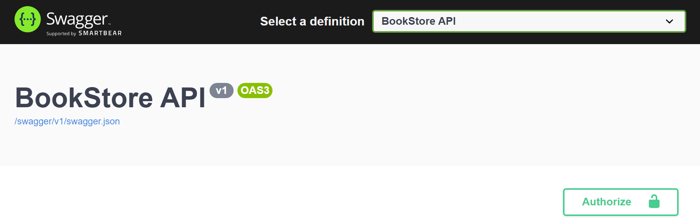
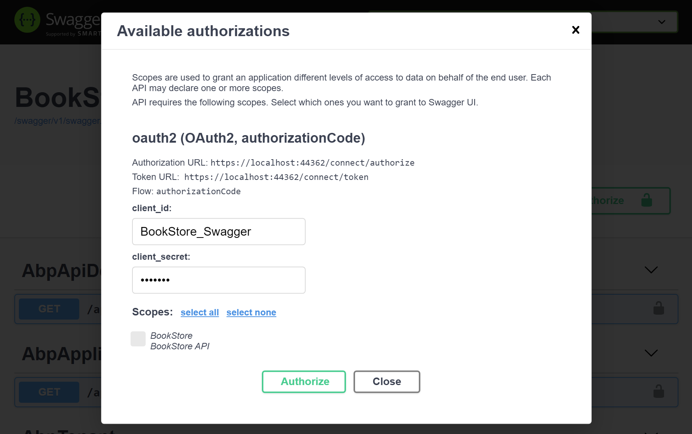
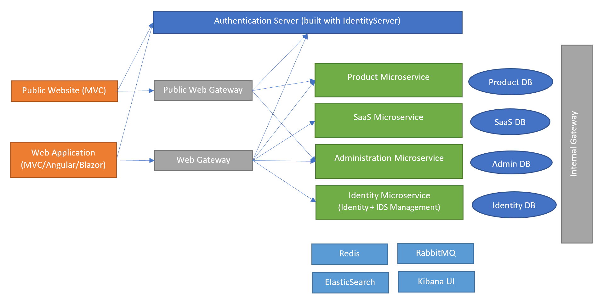
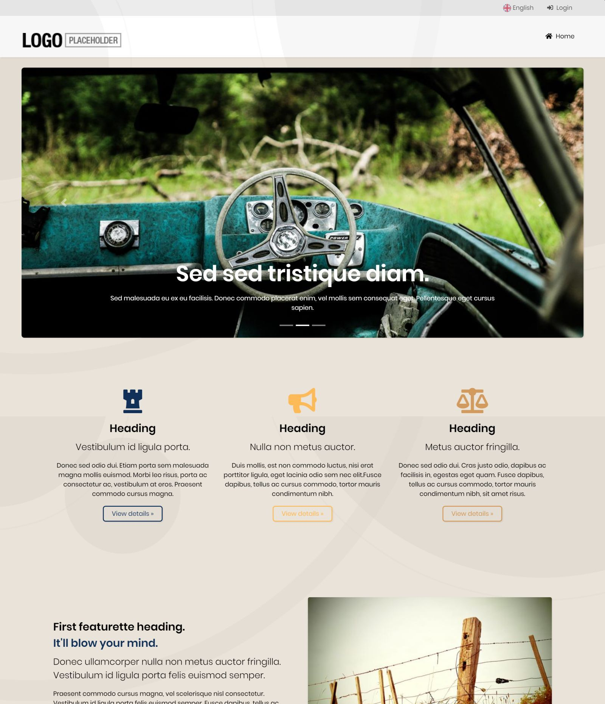
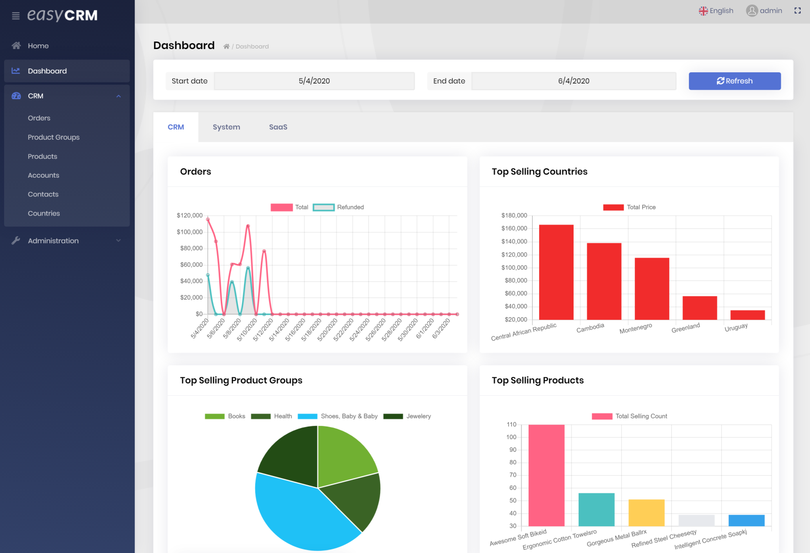

# ABP Framework 4.2 RC Has Been Published

Today, we have released the [ABP Framework](https://abp.io/) and the [ABP Commercial](https://commercial.abp.io/) 4.2.0 RC (Release Candidate). This blog post introduces the new features and important changes in this new version.

> **The planned release date for the [4.2.0 final](https://github.com/abpframework/abp/milestone/48) version is January 28, 2021**.

## Get Started with the 4.2 RC

If you want to try the version `4.2.0` today, follow the steps below;

1) **Upgrade** the ABP CLI to the version `4.2.0-rc.2` using a command line terminal:

````bash
dotnet tool update Volo.Abp.Cli -g --version 4.2.0-rc.2
````

**or install** if you haven't installed before:

````bash
dotnet tool install Volo.Abp.Cli -g --version 4.2.0-rc.2
````

2) Create a **new application** with the `--preview` option:

````bash
abp new BookStore --preview
````

See the [ABP CLI documentation](https://docs.abp.io/en/abp/latest/CLI) for all the available options.

> You can also use the *Direct Download* tab on the [Get Started](https://abp.io/get-started) page by selecting the **Preview checkbox**.

## What's new with the ABP Framework 4.2

## IRepository.GetQueryableAsync()

> **This version comes with an important change about using `IQueryable` features over the [repositories](https://docs.abp.io/en/abp/4.2/Repositories). It is suggested to read this section carefully and apply in your applications.**

`IRepository` interface inherits `IQueryable`, so you can directly use the standard LINQ extension methods, like `Where`, `OrderBy`, `First`, `Sum`... etc.

**Example: Using LINQ directly over the repository object**

````csharp
public class BookAppService : ApplicationService, IBookAppService
{
    private readonly IRepository<Book, Guid> _bookRepository;

    public BookAppService(IRepository<Book, Guid> bookRepository)
    {
        _bookRepository = bookRepository;
    }

    public async Task DoItInOldWayAsync()
    {
        //Apply any standard LINQ extension method
        var query = _bookRepository
            .Where(x => x.Price > 10)
            .OrderBy(x => x.Name);

        //Execute the query asynchronously
        var books = await AsyncExecuter.ToListAsync(query);
    }
}
````

*See [the documentation](https://docs.abp.io/en/abp/4.2/Repositories#iqueryable-async-operations) if you wonder what is the `AsyncExecuter`.*

Beginning from the version 4.2, the recommended way is using `IRepository.GetQueryableAsync()` to obtain an `IQueryable`, then use the LINQ extension methods over it.

**Example: Using the new GetQueryableAsync method**

````csharp
public async Task DoItInNewWayAsync()
{
    //Use GetQueryableAsync to obtain the IQueryable<Book> first
    var queryable = await _bookRepository.GetQueryableAsync();

    //Then apply any standard LINQ extension method
    var query = queryable
        .Where(x => x.Price > 10)
        .OrderBy(x => x.Name);

    //Finally, execute the query asynchronously
    var books = await AsyncExecuter.ToListAsync(query);
}
````

ABP may start a database transaction when you get an `IQueryable` (If current [Unit Of Work](https://docs.abp.io/en/abp/latest/Unit-Of-Work) is transactional). In this new way, it is possible to **start the database transaction in an asynchronous way**. Previously, we could not get the advantage of asynchronous while starting the transactions.

> **The new way has a significant performance and scalability gain. The old usage (directly using LINQ over the repositories) will be removed in the next major version.** You have a lot of time for the change, but we recommend to immediately take the action since the old usage has a big scalability problem.

#### About IRepository Async Extension Methods

Using IRepository Async Extension Methods has no such a problem. The examples below are pretty fine:

````csharp
var countAll = await _personRepository
    .CountAsync();

var count = await _personRepository
    .CountAsync(x => x.Name.StartsWith("A"));

var book1984 = await _bookRepository
    .FirstOrDefaultAsync(x => x.Name == "John");   
````

See the [repository documentation](https://docs.abp.io/en/abp/4.2/Repositories#iqueryable-async-operations) to understand the relation between `IQueryable` and asynchronous operations.

### Repository Bulk Operations

This version adds the following methods to the repositories:

* `InsertManyAsync`
* `UpdateManyAsync`
* `DeleteManyAsync`

The purpose of these methods to insert, update or delete many entities in one call with a better performance.

Currently, **MongoDB** provider implements these methods as a single bulk operation since MongoDB API natively supports. But current **Entity Framework Core** implementation is not a real bulk operation. Instead, it does its best with the native API of the EF Core. If you want to implement in a more performant way, you can [customize the bulk operations](https://docs.abp.io/en/abp/4.2/Entity-Framework-Core#customize-bulk-operations) with your own implementation or by using a library. We could find a good open source library for EF Core 5.0 to implement it.

### Selecting DBMS on Template Creation

[ABP CLI](https://docs.abp.io/en/abp/4.2/CLI#new) now has an option to specify the DBMS when you use EF Core as the database provider.

**Example: Select MySQL as the DBMS**

````bash
abp new BookStore -dbms mysql --preview
````

Available options: `SqlServer` (default), `MySQL`, `SQLite`, `Oracle-Devart`, `PostgreSQL`. See the [documentation](https://docs.abp.io/en/abp/latest/Entity-Framework-Core-Other-DBMS) to use any other DBMS or switch the DBMS later.

One change related to this feature is that: Now, the startup template doesn't come with an **initial migration** file. This is because the database migrations are different based on your DBMS preference and should be re-created. However, when you first run the `.DbMigrator` application, it will create the initial migration and create the database just like before.

> See The Initial Migration section in the [Getting Started](https://docs.abp.io/en/abp/4.2/Getting-Started-Running-Solution?DB=EF#database-migrations) document if you have problems on running the `.DbMigrator` application first time.

### Swagger UI Login / Authorization

Testing the swagger UI was requiring some additional work, especially your authentication server is separated from the application that hosts the Swagger UI.

With the version 4.2, the startup templates come with the authorization pre-configured for you. An Authorize button is available when you open the Swagger UI:



When you click, it opens a modal to authorize:



When you click to the Authorize button here, you are redirected to the login page to login with your username and password (default username is `admin` and password is `1q2w3E*`).

> Remember to select the Scopes (typically **select all**) you want to use before clicking to the Authorize button.

### Angular Unit Testing

We've improved the modules and the startup template to setup and write unit tests easier with the Angular UI. See the [Angular Unit Testing document](https://docs.abp.io/en/abp/4.2/UI/Angular/Testing) for details.

### Other News

* Improved HTTP **request-response performance** by resolving dependencies in a deferred way in the action/page filters, interceptors and some other services.
* Removed `MultipleActiveResultSets` from connection strings for new templates for SQL Server, since the new EF Core gives a warning when using it. If you want to use it, you need to change the connection string yourself.
* Added `HardDeleteAsync` extension method that takes a predicate to delete multiple entities. This extension method is available if the entity [Soft Delete](https://docs.abp.io/en/abp/latest/Data-Filtering).
* Implemented the [Page Alerts](https://docs.abp.io/en/abp/4.2/UI/Angular/Page-Alerts) for the **Angular UI**.
* Implemented [Page Progress](https://docs.abp.io/en/abp/4.2/UI/Blazor/Page-Progress) for the **Blazor UI**. It automatically shows an undetermined progress bar on top of the page while performing an AJAX request. It also proves an API to you if you need to show/hide the progress bar in your code.

## What's new with the ABP Commercial 4.2

### Microservice Startup Template

The new [Microservice Startup Template](https://docs.abp.io/en/commercial/4.2/startup-templates/microservice/index) is a generic solution to start a new microservice solution.

While we accept that every microservice solution will be different and every system has its own design requirements and trade-offs, we believe such a startup solution is a very useful starting point for most of the solutions, and a useful example for others.



*Figure: A simplified overall diagram of the microservice solution.*

You can [follow the documentation](https://docs.abp.io/en/commercial/4.2/startup-templates/microservice/index) to get started with this startup template. **This template should be considered as an early release**. We will improve it and write a lot of guides.

If you want to use the ABP Suite to create your solution, then you need to first upgrade it:

````bash
abp suite update
````

If you want, you can directly create a new solution from the command line:

````bash
abp new Volosoft.MyMicroserviceSystem -t microservice-pro --preview
````

Company Name is optional. Solution name could be *MyMicroserviceSystem* for this example.

### Public Website in the Startup Templates

As mentioned in the previous release post, we've added a *Public Website* application to the startup templates. It is configured to authenticate through the IdentityServer with a single sign-on system.

You can use this application to create a landing page for your actual application or a corporate website for your business. An example screenshot:



It uses the same *Lepton Theme*, so you can apply [all the styles](https://commercial.abp.io/themes). The Public Website has a different layout and also has a different setting for the styling (that can be configured in the *Settings / Lepton Theme* page of the main web application).

> *Public Website* is optional and you need to select the "Public Website" option while creating a new solution using the ABP Suite, or use the `--with-public-website` option while using the `abp new` CLI command.

### Easy CRM Blazor UI

[Easy CRM](https://docs.abp.io/en/commercial/latest/samples/easy-crm) is an example application built with the ABP Commercial. MVC (Razor Pages) and Angular UI implementations were already provided. With the version 4.2, we are providing the Blazor UI implementation for this application.



### Other News

* Implemented Iyzico as a payment gateway provider for the [payment module](https://commercial.abp.io/modules/Volo.Payment) in addition to Paypal, Stripe, 2Checkout and Payu providers.
* ABP Suite supports the new microservice template creation, public website and DBMS selection options.
* Swagger authorization and other features mentioned in the ABP Framework section are already implemented for the ABP Commercial too.

## ABP Community News

### Sharing Video Contents

[community.abp.io](https://community.abp.io/) is a place to share ABP related contents. It started with publishing articles. Now, it supports to publish video contents. [See this example](https://community.abp.io/articles/be-a-superhero-on-day-1-with-abp.io-wvifcy9s). All you need to do is to create a video and upload to YouTube. Then you can [submit](https://community.abp.io/articles/submit) the YouTube link to the ABP Community website.

### Multi-language support

We planned ABP Community to publish English-only contents. However, we see that people want to share contents in other languages too. Now, **it is possible to submit a content in any language**. Just select the Language option while submitting your content.

**When you submit a non-English content, it is not visible to all the visitors by default**. Visitors can see a non-English content only if their browser language or the selected language matches to the content language (there is a language selection at the end of the website).

### External Contents

If you want to publish your content anywhere else, but want to post a link of your content, you can select *External Content* option while submitting the post. For example, [this article](https://community.abp.io/articles/aspnet-boilerplate-to-abp-framework-xml-to-json-localization-conversion-0mxyjrzj) is an external article and also written in Chinese language.

## About the Next Release

The next feature version will be 4.3.0. It is planned to release the 4.3 RC (Release Candidate) on March 11 and the final version on March 25, 2021.

We decided to slow down the feature development for the [next milestone](https://github.com/abpframework/abp/milestone/49). We will continue to improve the existing features and introduce new ones, sure, but wanted to have more time for the planning, documentation, creating guides and improving the development experience.

## Feedback

Please check out the ABP Framework 4.2.0 RC and [provide feedback](https://github.com/abpframework/abp/issues/new) to help us to release a more stable version. **The planned release date for the [4.2.0 final](https://github.com/abpframework/abp/milestone/48) version is January 28, 2021**.
