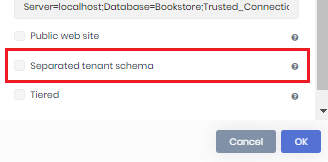

# ABP Commercial 4.3 RC Has Been Published

ABP Commercial version 4.3 RC (Release Candidate) has been published alongside ABP Framework 4.3. RC (TODO: link). I will introduce the new features in this blog post. Here, a list of highlights for this release;

* The **microservice starter template** is getting more mature. We've also added a **service template** to easily add new microservices to the solution.
* New option for the application starter template to have a **separate database schema for tenant databases**.
* New **Forms** module to create surveys
* **Enable/disable modules** per edition/tenant.
* **Lepton theme** and **Account module**'s source codes are available with the Team License too.

Here, some other features already covered in the ABP Framework announcement, but worth to mention here since they are also implemented for the ABP Commercial;

* **Blazor UI server-side** support

* **Email setting** management UI
* **Module extensibility** system is now available for the **Blazor UI** too.

> This post doesn't cover the features and changes done on the ABP Framework side. Please also see the **ABP Framework 4.3. RC blog post** (TODO: link).

## The Migration Guide

**This upgrade requires some manual work documented in [the migration guide](https://docs.abp.io/en/commercial/4.3/migration-guides/v4_3).** Please read the guide carefully. Even if your application doesn't break on upgrade, you should apply the changes to not have problems with the future releases.

## What's New With The ABP Commercial 4.3

### The Microservice Starter Template

We'd introduced an initial version of the [microservice starter template](https://docs.abp.io/en/commercial/4.3/startup-templates/microservice/index) in the [previous version](https://blog.abp.io/abp/ABP-IO-Platform-v4-2-RC-Has-Been-Released). It is getting more mature with this release. We've done a lot of improvements and changes including;

* New **"service" template** to add new microservices for the solution. Still requires some manual work to integrate to other services and gateways, however it makes the progress very easy and straightforward.
* Added [Tye](https://github.com/dotnet/tye) configuration to develop and test the solution easier.
* Added [Prometheus](https://prometheus.io/), [Grafana](https://grafana.com/) integrations for monitoring the solution.
* **Automatic database migrations**. Every microservice automatically checks and migrates/seeds its own database on startup (concurrency issues are resolved for multiple instance case). For multi-tenant systems, tenant databases are also upgraded by queue.
* For multi-tenant systems, **databases are created on the fly** for new tenants those have separate connection strings.
* Created **separate solution (`.sln`) file** for each microservice, gateway and application. In this way, you can focus on what you are working on. The main (roof) solution file only includes the executable projects in these solutions.
* All microservices are converted to the standard **layered module structure** which makes easier to align with ABP application development practices.

After this release, we will be preparing microservice development guides based on this startup solution.

### Separate Tenant Schema

ABP's multi-tenancy system allows to create dedicated databases for tenants. However, the application startup solution comes with a single database migration path, hence it has a single database schema. As a result, tenant databases have some host-related tables. These tables are not used for tenants, they are always empty. However, their existence may disturb us as a clean developer.

With this release, the application startup template provides an option to address this problem. So, if you want, you can have a separate migration path for tenant databases. Of course, this has a cost; You will have two DbContexts for migration purposes, which brings additional complexity to your solution. We've done our best to reduce this complexity and also added a README file into the migration assembly. If you prefer this approach, please check that README file.

You can specify the new `--separate-tenant-schema` parameter while you are creating a new solution using the [ABP CLI](https://docs.abp.io/en/abp/4.3/CLI):

````bash
abp new Acme.BookStore --separate-tenant-schema
````

If you prefer the [ABP Suite](https://docs.abp.io/en/commercial/latest/abp-suite/create-solution) to create solutions, you can check the *Separated tenant schema* option.



### Forms Module

*Forms* is a new module that is being introduced with this version. It looks like the Google Forms application; You dynamically create forms on the UI and send it to people to answer. Then you can get statistics/report and export answers to a CSV file.

Forms module currently supports the following question types;

* **Free text**
* Selecting a **single option** from a **dropdown** list or a **radio button** list
* **Multiple choice**: Selecting multiple options from a checkbox list

**Screenshot: editing form and questions - view responses**


**Screenshot: answering to the form**


### Team License Source Code for Modules

Team License users can't access the source code of modules and themes as a license restriction. You have to buy Business or Enterprise license to be able to download full source code of any module/theme.

However, we got many feedbacks from Team License customers that they need to source code of the account module and the lepton theme. We see that customization of these two modules is highly necessary for most of our customers.

With this version, we decided to allow Team License holders to download the source code of the **Account Module** and the **Lepton Theme**, so they can freely customize them based on their requirements.

Remember that; when you include the source code in your own solution, it is your responsibility if you want to upgrade them when we release new versions (while you don't have to upgrade them).

### Lepton Theme Public Website Layout

We'd added a public website application in the application starter template in previous versions. It was using the public website layout of the Lepton Theme. We realized that the layout of this application is customized or completely changed in most of the solutions. So, with this version, the layout is included inside the application in the downloaded solution. You can freely change it. Before, you had to download it separately and include into your solution manually.

### Other Features/Changes

* ABP Suite now supports to define *required* navigation properties on code generation.

## Feedback

Please check out the ABP Commercial 4.3 RC to help us to release a more stable version. **The planned release date for the 4.3.0 final version is April 15, 2021**.

