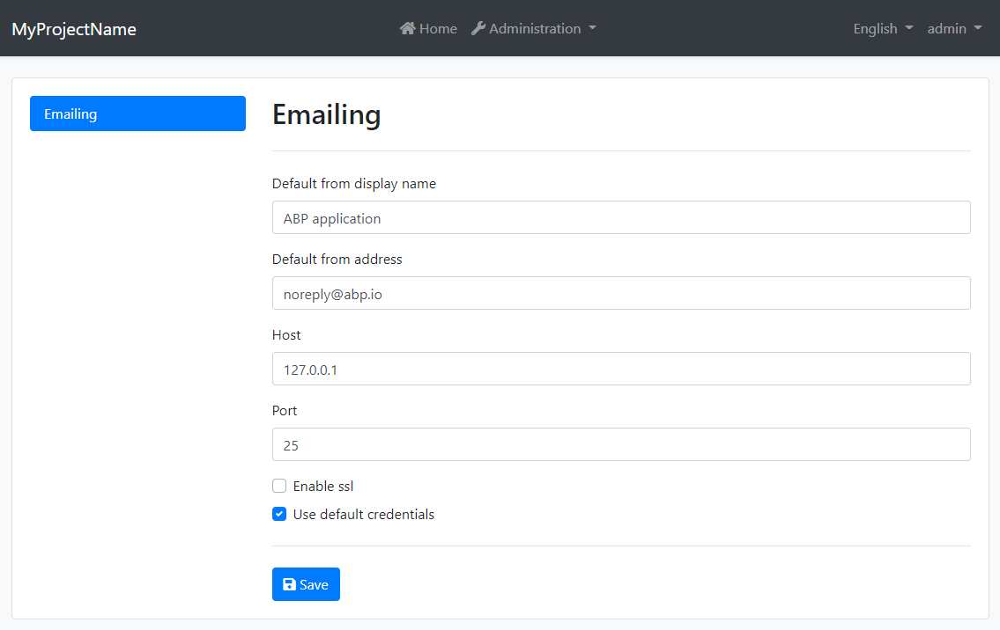

# ABP Framework 4.3 RC Has Been Published

We are super excited to announce the ABP Framework 4.3 RC (Release Candidate). Here, a list of highlights of this release;

* **CMS Kit** module initial release.
* **Blazor UI server-side** support.
* **Module extensibility** system for the Blazor UI.
* Angular UI **resource owner password** flow comes back.
* **Volo.Abp.EntityFrameworkCore.Oracle** package is now compatible with .NET 5.
* CLI support to easily add the **Basic Theme** into the solution.
* New **IInitLogger** service to write logs before dependency injection phase completed.

Besides the new features above, we've done many performance improvements, enhancements and bug fixes on the current features. See the [4.3 milestone](https://github.com/abpframework/abp/milestone/49?closed=1) on GitHub for all changes made on this version.

This version was a big development journey for us; [~160 issues](https://github.com/abpframework/abp/issues?q=is%3Aissue+milestone%3A4.3-preview+is%3Aclosed) resolved, [~300 PRs](https://github.com/abpframework/abp/issues?q=is%3Apr+milestone%3A4.3-preview+is%3Aclosed) merged and **~1,700 commits** done only in the [main framework repository](https://github.com/abpframework/abp). **Thanks to the ABP Framework team and all the contributors.**

> ABP Commercial 4.3 RC has also been published. Check out [the commercial blog post](https://blog.abp.io/abp/ABP-Commercial-4.3-RC-Has-Been-Published).

## The Migration Guide

We normally don't make breaking changes in feature versions. However, this version has some small **breaking changes** mostly related to Blazor UI WebAssembly & Server separation. **Please check the [migration guide](https://docs.abp.io/en/abp/4.3/Migration-Guides/Abp-4_3) while upgrading to version 4.3**.

## Known Issues

Some minor issues will be fixed in the stable release. You can see the known issues [here](https://github.com/abpframework/abp/issues?q=is%3Aopen+is%3Aissue+milestone%3A4.3-final).

## Get Started With The 4.3 RC

If you want to try version 4.3 today, follow the steps below;

1) **Upgrade** the ABP CLI to the version `4.3.0-rc.1` using a command-line terminal:

````bash
dotnet tool update Volo.Abp.Cli -g --version 4.3.0-rc.1
````

**or install** if you haven't installed before:

````bash
dotnet tool install Volo.Abp.Cli -g --version 4.3.0-rc.1
````

2) Create a **new application** with the `--preview` option:

````bash
abp new BookStore --preview
````

See the [ABP CLI documentation](https://docs.abp.io/en/abp/4.3/CLI) for all the available options.

> You can also use the *Direct Download* tab on the [Get Started](https://abp.io/get-started) page by selecting the **Preview checkbox**.

## What's New With The ABP Framework 4.3

### CMS Kit

CMS (Content Management System) Kit was a module we worked on for the last couple of months. It is usable now, and we are releasing the initial version with this release. We are considering this module as pre-mature. It will be improved in the next versions. The goal to provide a flexible and extensible CMS infrastructure to .NET community. It currently has the following features;

* **Pages**: Used to create UI pages with a Markdown + WYSIWYG editor. Once you create a page, it becomes available via URL like `/pages/my-page-url`.
* **Blog**: A built-in blog system that supports multiple blogs with blog posts.
* **Comments**: Allows users to write comments under contents. It is used for blog posts.
* **Tags**: To add tag feature to any content/entity. It is used for blog posts.
* **Reactions**: Allows users to react to content via emojis, like a smile, upvote, downvote, etc.
* **Rating**: This component is used to rate content by users.

All features are separately usable. For example, you can create an image gallery and reuse the Comments and Tags features for the images. You can enable/disable features individually using the [Global Features System](https://docs.abp.io/en/abp/4.3/Global-Features).

> We will create a separate blog post for the CMS Kit module, so I keep it short.

### Blazor Server Side

We'd implemented Blazor WebAssembly before. With version 4.3, we have the Blazor Server-Side option too. All the current functionalities are available to the Blazor Server.

You can select Blazor Server as the UI type while creating a new solution.

**Example:**

````bash
abp new Acme.BookStore -u blazor-server
````

If you write `blazor` as the UI type, it will create Blazor WebAssembly just as before.

> You can also select the Blazor Server on the [get started](https://abp.io/get-started) page.

Blazor Server applications are mixed applications; You can mix the server-side MVC / Razor Pages with the Blazor SPA. This brings an interesting opportunity: MVC / Razor Pages modules can work seamlessly in the Blazor Server applications. For example, the CMS Kit module has no Blazor UI yet, but you can use its MVC UI inside your Blazor Server application.

> Blazor Server UI has a `--tiered` option just [like](https://docs.abp.io/en/abp/latest/Startup-Templates/Application#tiered-structure) the MVC / Razor Pages UI. This can be used to separate the HTTP API server from the UI server (UI application doesn't directly connect to the database).

### Blazor UI Module Extensibility

Module Entity Extensions and some other extensibility features was not supported by the Blazor UI. With this version, we've implemented that system for Blazor UI.

For anyone wondering what the module entity extensions is, please check [the document](https://docs.abp.io/en/abp/4.3/Module-Entity-Extensions) or [this community video](https://community.abp.io/articles/overview-of-abp-framework-4.1-module-extensions-part-1-n04f7bhf).

### Email Setting Management UI

With this release, a new item is added to the main menu to navigate to the setting management page. This page contains the email setting management UI, as shown below:



The setting page is provided by the [setting management module](https://docs.abp.io/en/abp/4.3/Modules/Setting-Management), and it is extensible; You can add your tabs to this page for your application settings.

### Angular UI Resource Owner Password Flow

The login page was removed from the Angular UI in previous versions because Authorization Code flow is the recommended approach for SPAs. However, it requires redirecting the user to the authentication server, logging there, and returning to the application. We got a lot of feedback because this brings overhead for simple applications.

With version 4.3, Angular UI can use its login page with resource owner password flow. Please refer to [the documentation](https://github.com/abpframework/abp/blob/dev/docs/en/UI/Angular/Account-Module.md) to learn how to make it work.

### Volo.Abp.EntityFrameworkCore.Oracle Package

We couldn't update the [Oracle.EntityFrameworkCore](https://www.nuget.org/packages/Oracle.EntityFrameworkCore/) package on .NET 5.0 upgrade since it was not supporting .NET 5.0 at that time. Now, it supports .NET 5.0 and we've upgraded the package.

See [the documentation](https://docs.abp.io/en/abp/4.3/Entity-Framework-Core-Oracle-Official) to learn how to switch to this package for the Oracle database.

### Add Basic Theme Into Your Solution

ABP Framework provides a strong theming system. However, the default theme, named the Basic Theme, has a non-styled, base Bootstrap UI. It is expected that you override the styles and UI components of that theme in a serious application.

There are some articles (see for [mvc](https://community.abp.io/articles/creating-a-new-ui-theme-by-copying-the-basic-theme-for-mvc-ui-yt9b18io) & [blazor](https://community.abp.io/articles/creating-a-new-ui-theme-by-copying-the-basic-theme-for-blazor-ui-qaf5ho1b)) to explain how to include the Basic Theme's source code into your solution to modify it fully. However, it still requires some manual work.

With this version, ABP CLI providing a command to add the Basic Theme's source code into your solution. Run the following command in a command-line terminal inside the root directory of your solution:

**MVC UI**

````bash
abp add-package Volo.Abp.AspNetCore.Mvc.UI.Theme.Basic --with-source-code --add-to-solution
````

**Blazor Web Assembly UI**

````bash
abp add-package Volo.Abp.AspNetCore.Components.WebAssembly.BasicTheme --with-source-code --add-to-solution
abp add-package Volo.Abp.AspNetCore.Components.Web.BasicTheme --with-source-code --add-to-solution
````

**Blazor Server UI**

````bash
abp add-package Volo.Abp.AspNetCore.Components.Server.BasicTheme --with-source-code --add-to-solution
abp add-package Volo.Abp.AspNetCore.Components.Web.BasicTheme --with-source-code --add-to-solution
````

As you see, Blazor UI developers should add two packages. The Basic Theme consists of two packages for the Blazor UI: one for wasm/server and one shared.

**Angular UI**

Execute the following command in a terminal inside the `angular` folder of your solution:

````bash
abp add-package @abp/ng.theme.basic --with-source-code
````

### IInitLogger

In ASP.NET Core, logging is not possible before the dependency injection phase is completed. For example, you can't write log in `ConfigureServices` method. However, we sometimes need to write logs in this stage.

We are introducing the `IInitLogger` service, which allows writing logs inside the `ConfigureServices` method.

**Example:**

````csharp
public class MyModule : AbpModule
{
    public override void ConfigureServices(ServiceConfigurationContext context)
    {
        var logger = context.Services.GetInitLogger<MyModule>();
        logger.LogInformation("Some log...");
    }
}
````

Logs are written once the service registration phase is completed. It stores the written logs in memory and then writes logs to the actual `ILogger` when ready.

> Notice: Startup templates come with [Serilog](https://serilog.net/) pre-installed. So, you can write logs everywhere by directly using its static API (ex: `Log.Information("...");`). The `InitLogger` is a way to write pre-initialization logs without depending on a particular logging library. So, it makes it very handy to write logs inside reusable modules.

### Other Features/Changes

* [#7423](https://github.com/abpframework/abp/issues/7423) MongoDB repository base aggregation API.
* [#8163](https://github.com/abpframework/abp/issues/8163) Ignoring given files on minification for MVC UI.
* [#7799](https://github.com/abpframework/abp/pull/7799) Added `RequiredPermissionName` to `ApplicationMenuItem` for MVC & Blazor UI to easily show/hide menu items based on user permissions. Also added `RequiredPermissionName` to `ToolbarItem` for the MVC UI for the same purpose. 
* [#7523](https://github.com/abpframework/abp/pull/7523) Add more bundle methods to the distributed cache.
* [#8013](https://github.com/abpframework/abp/pull/8013) Handle `JsonProperty` attribute on Angular proxy generation.

See the [4.3 milestone](https://github.com/abpframework/abp/milestone/49) on GitHub for all changes made on this version.

## Feedback

Please check out the ABP Framework 4.3 RC and [provide feedback](https://github.com/abpframework/abp/issues/new) to help us release a more stable version. **The planned release date for the [4.3.0 final](https://github.com/abpframework/abp/milestone/50) version is April 15, 2021**.
