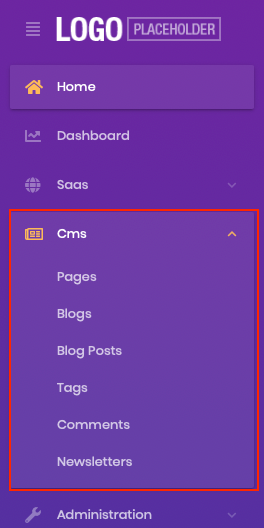

# Introducing The CMS-Kit Module

One of the most exciting announcements of the ABP Framework 4.3 release was releasing the initial version of the CMS Kit module. The team had been working hard to release the initial version for months. For those who didn't read the [ABP Framework 4.3 release post](https://blog.abp.io/abp/ABP-Framework-4.3-RC-Has-Been-Published), the CMS Kit module adds CMS(Content Management System) capabilities to your application. Some of the CMS Kit features are open source and free, while others are only included in the Pro version included in the ABP Commercial. 

List of free and pro features in the CMS Kit module;

- Free
  - Page System: Provides a **page** management system to manage dynamic pages.
  - Blog System: Provides a **blog** system to create blogs and publish posts.
  - Tag System: Provides a **tag** system to tag any kind of resources, such as blog posts.
  - Comment System: Provides a **comment** system to add comments feature to any type of resource, such as blog posts, products, etc.
  - Reaction System: Provides a **reaction** system to add reactions to any type of resource, such as blog posts or comments, etc.
  - Rating System: Provides a **rating** system to add ratings feature to any type of resource, such as comments, products, etc.
- Pro
  - Newsletter System: Provides a **newsletter** system to allow users to subscribe to newsletters.
  - Contact Form System: Provides a **contact form** system to allow users to write a message to you on public websites.

## Installation

CMS Kit module comes installed with commercial templates when you create the solution with the public website option. You can run the following command and create a solution with a public website. 

```bash
abp new Acme --with-public-website
```

If you're using the open-source version or adding the module to an existing project, the ABP CLI allows adding a module to a solution using `add-module` command.

You can run the following command to add the module to an open-source solution. 

```bash
abp add-module Volo.CmsKit --skip-db-migrations true
```

If you're a commercial user, run the following command to install the pro version of the module. 

```bash
abp add-module Volo.CmsKit.Pro --skip-db-migrations true
```

After adding the module to the solution, you need to configure features. The CMS Kit module uses the [global feature](https://docs.abp.io/en/abp/latest/Global-Features) system for all features. To enable the features in the CMS Kit module, open the `GlobalFeatureConfigurator` class in the `Domain.Shared` project and place the following code to the `Configure` method to enable all features in the CMS kit module.

 ```csharp
GlobalFeatureManager.Instance.Modules.CmsKit(cmsKit =>
{
    cmsKit.EnableAll();
});
 ```

If you're a commercial user, you need to enable CMS Kit Pro features as well.

```csharp
GlobalFeatureManager.Instance.Modules.CmsKitPro(cmsKitPro =>
{
    cmsKitPro.EnableAll();
});
```

> If you are using Entity Framework Core, do not forget to add a new migration and update your database after configuring the features.

We've completed the installation step. Run the project, and you will see the CMS menu item in the menu. 



> CMS Kit's initial release only supports the MVC UI. We're planning to add Angular and Blazor support in upcoming releases.

## Package Structures

CMS Kit is designed for various usage scenarios. When you visit [nuget.org](https://www.nuget.org/packages?q=Volo.CmsKit) or [abp.io](https://abp.io/packages?moduleName=Volo.CmsKit.Pro) to see the available CMS Kit packages, you will find out that packages have admin, public and unified versions.

For example,

  - `Volo.CmsKit.Admin.Application`: Contains functionality required by admin websites.
  - `Volo.CmsKit.Public.Application`: Contains functionality required by public websites.
  - `Volo.CmsKit.Application` : Unified package dependent on both public and admin packages.

 If you want to separate admin and public website codes, you can use the admin and public packages. However, if you want to keep admin and public website codes in a shared project, you can use the unified packages to include admin and public packages. 

> It is recommended to use the unified packages instead of adding both admin and public packages.


We've covered the initial features, installation and configuration steps in this post. You can read the [open-source](https://docs.abp.io/en/abp/latest/Modules/Cms-Kit) and [commercial](https://docs.abp.io/en/commercial/latest/modules/CMS-Kit) documentation to get further information about features and the CMS Kit module. CMS Kit's initial version contains lots of features that you can easily integrate and use in your applications. We're planning to improve the existing features, fixing bugs and adding new features in upcoming releases. If you want to give some feedback or have a feature request, please reach out to us from [GitHub](https://github.com/abpframework/abp) or [support.abp.io](https://support.abp.io). We will be happy to plan the CMS Kit module's future together.

Thank you!

