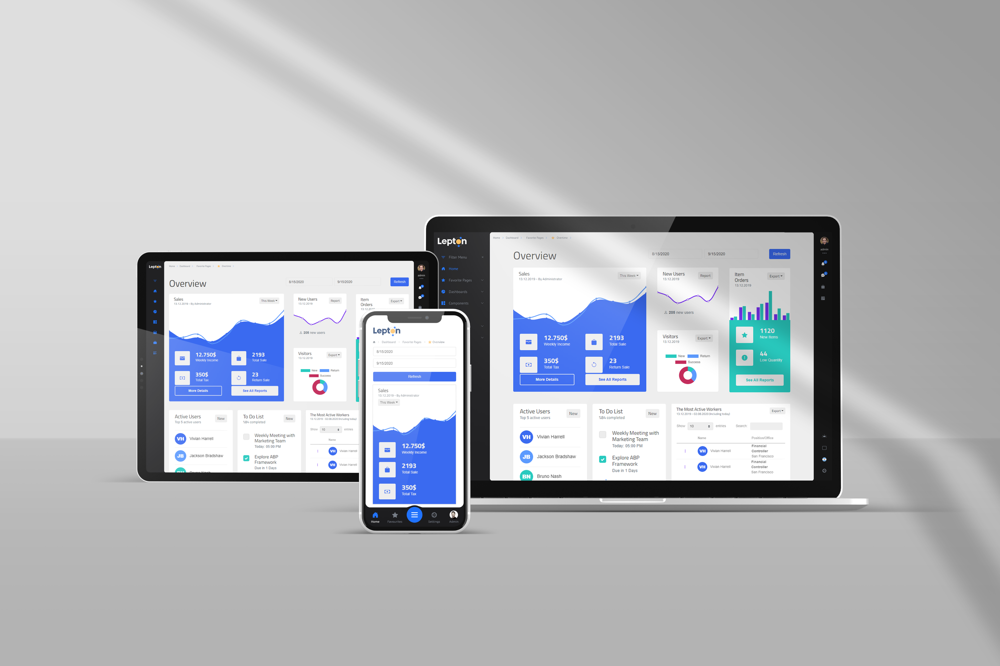
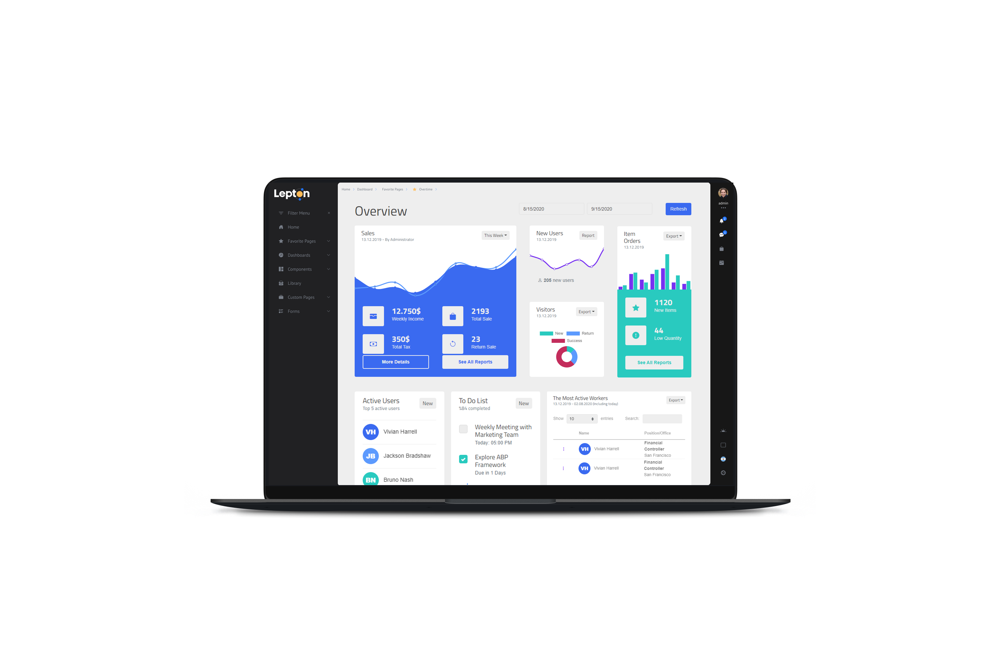
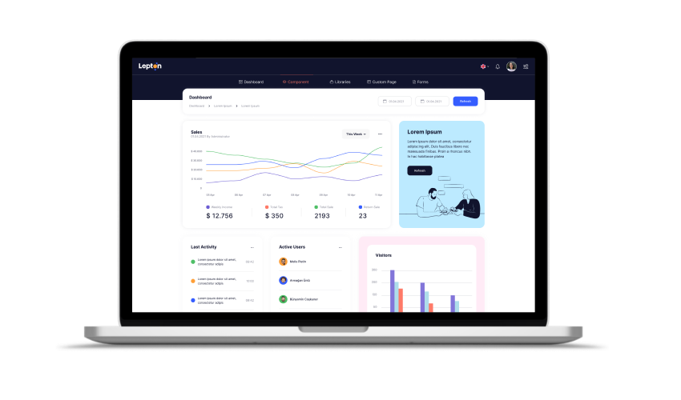

# LEPTON NEXT GENERATION

We are delighted and proud to announce that the next generation of [Lepton Theme](https://leptontheme.com/) which will be referred as `LeptonX` is on the way. The initial version is built upon Bootstrap v4. It is because, when we started working on this project, Bootstrap v5 was still on beta versions. We've decided that it would be a good idea to start with a stable Bootstrap version and also to make it extremely easy for ABP users to switch to the `LeptonX` since ABP packages are already dependant on Bootstrap v4.

## Lite vs Pro

The previous version of Lepton Theme has been only available to Commercial ABP customers and it has never been as a standalone template. With `LeptonX`, we aim at a broader audience. With this goal in mind, `LeptonX` will come in different shapes as follows:
- A template with HTML, VanillaJS, CSS
  - You can just download this like any other template and start developing your application.
- An angular library (npm package)
  - An upgradeable angular package contains layouts, components, directives, and services for you to build any application you'd like. If you choose this option, you'll be able to stay up-to-date with `LeptonX` as we will continue to introduce new features. 
- A standalone Angular template that contains code of the npm package above
  - You can also download an angular template that contains the library above. You can edit it as you see fit, however, it will be harder to integrate new features once they become available.
- Lite versions of the three above
  - We will also publish free versions of everything we've listed above which will contain fewer features than pro versions. The differences will be mentioned in the later sections of this post.
- Free ABP packages for all of the clients available, MVC, Blazor, and Angular that utilizes Lite packages
  - Client-specific packages that employ `LeptonX-Lite` for open source ABP users to easily switch between `ThemeBasic` to `ThemeLeptonX`
- Commercial ABP packages for all of the clients available, MVC, Blazor, and Angular that utilizes Pro packages
  - Client-specific packages that employ, provide and extend all of the features that `LeptonX-Pro` packages have.

As is seen above, `LeptonX` environment contains multiple projects that are designed for different kinds of users. 

## Mobile-First (Pro Only)

When people talk about Responsive Web Applications, they usually refer to a side menu or top menu that shrinks down into a hamburger menu which does not provide a good user experience for mobile users. 

On the other hand, widely used native mobile applications usually employ a tab menu stick to the bottom of the screen. People have become acquainted with this type of experience. With this UX in mind, menus in the `LeptonX` theme switches to the tab menu on mobile resolution as opposed to the hamburger menu. 

** In the Lite version, a hamburger menu will take its place and behave like a standard RWA.

## Theme Builder (Pro Only)

Following the latest trends, `LeptonX` comes with three built-in themes, `dark`, `dim`, `light`.
A theme builder is also provided with the `LeptonX` which you can run with your brand colors and create your own theme.
It is built with CSS variables which enables runtime theme building. Your users will be able to choose colors and change the application to their liking. 

** The only theme that will available to the lite version is the `dim` theme.  

## Side Menu Layout (Lite and Pro)

The following layout will be provided as default for both lite and pro versions. 

## Multiple Layouts (Pro Only)

`LeptonX` is being developed with such an architecture that it will be easy to replace the layout. You will be given many options to choose any layout you prefer.

Take a look at the example below:

You can also develop your own layouts using the built-in components. 

## Alpha Version

Soon, we will release an alpha version of the `LeptonX Lite` package. The ABP Angular package will tag along. Once the packages are released, we would like you to try them out and give us feedback. It will help us improve the `LeptonX` greatly. 