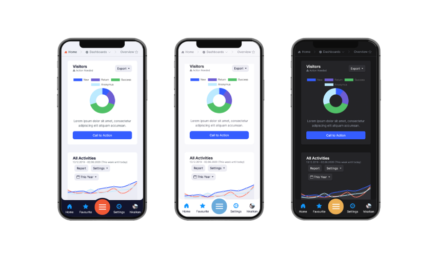
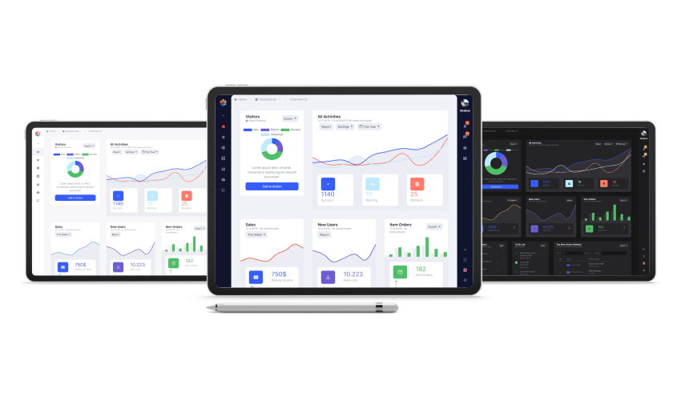
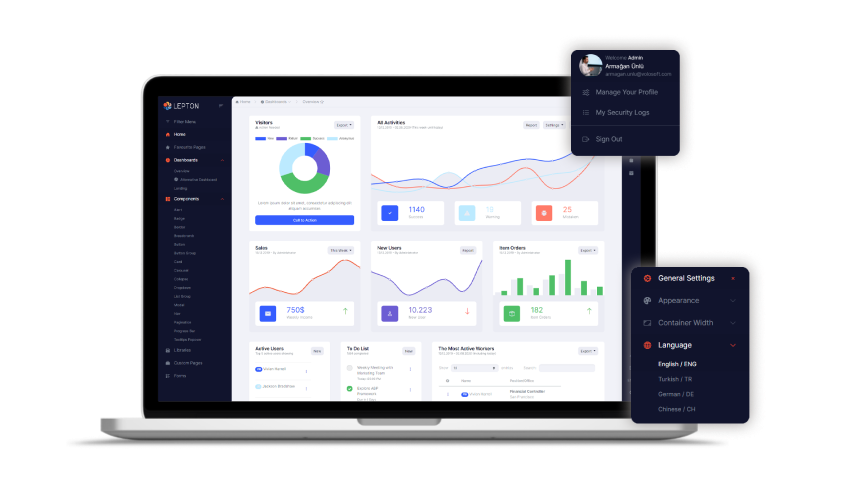
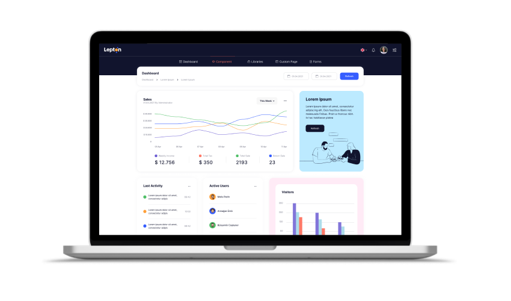

# Introducing the Lepton Theme Next Generation!

We are delighted and proud to announce that the next generation of [Lepton Theme](https://leptontheme.com/) which will be referred to as LeptonX is on the way. 

At Volosoft, we care about developer experience as much as user experience. Thus, LeptonX is following the latest trends for a better user experience and provides highly customizable features that will be easy to use. Our APIs follow a strict guideline to be easy-to-use, intuitive, extendable, and replaceable. In short, we'd like LeptonX to grow into such a platform that developers (not just ABP developers) love to build their applications on top of, and end-users love to interact with. 

The initial version has been built upon Bootstrap v4. Bootstrap v5 has been recently published and the ecosystem has not caught up yet. In addition, ABP packages are already dependent on Bootstrap v4, it will be easy to switch from the [Basic Theme](https://docs.abp.io/en/abp/latest/UI/AspNetCore/Basic-Theme) or from the [Lepton Theme](https://commercial.abp.io/themes) to the LeptonX. 

We believe that the bigger the community is, the better the framework turns out to be. As we have done in our other products, we will release a free-to-use version of LeptonX, a.k.a LeptonX-lite which will contain most of the basic features. With LeptonX-lite, free ABP [application startup template](https://docs.abp.io/en/abp/latest/Startup-Templates/Application)s will come with a production-ready theme, and existing applications will be able to switch from the Basic Theme to the LeptonX-lite with ease.

## Highlights

In this section, I want to highlight some of the LeptonX features.

### Better Mobile UX

When people talk about Responsive Web Applications, they usually refer to a side menu or top menu that shrinks down into a hamburger menu which does not provide a good user experience for mobile users. 

On the other hand, widely used native mobile applications usually employ a tab menu stick to the bottom of the screen. People have become acquainted with this type of experience. With this UX in mind, menus in the `LeptonX` theme switches to the tab menu on the mobile resolution as opposed to the hamburger menu. 

### Theme Build System

Following the latest trends, LeptonX comes with three built-in theme styles; `dark`, `dim`, `light`.
A theme builder system (written in SASS) is provided with the LeptonX which you can run with your brand colors and create your own theme style as well. 

LeptonX is built on top of CSS variables that enable runtime theme building. In the future, we may release a color picker that can create custom themes. Each user can create their own color palettes. 

### Multiple Layouts

LeptonX is being developed with such an architecture that it will be easy to replace the layout. You will be given many options to choose any layout you prefer.

Take a look at the following layouts:

## The LeptonX Ecosystem

The previous version of Lepton Theme has been only available to Commercial ABP customers and it has never been as a standalone (ABP independent) template. With LeptonX, we aim at a broader audience. With this goal in mind, LeptonX can be integrated into any tech stack you'd prefer as well as the ABP Framework. That's why you'll be offered a variety of packages as follows:

- A template with HTML, VanillaJS, CSS (can be used as ABP independent)
  - You can just download this like any other template and start developing your application.
- An angular library (can be used as ABP independent)
  - An upgradeable angular package contains layouts, components, directives, and services for you to build any application you'd like. If you choose this option, you'll be able to stay up-to-date with LeptonX as we will continue to introduce new features. 
- A standalone Angular template that contains code of the npm package above (can be used as ABP independent)
  - You can also download an angular template that contains the library above. You can edit it as you see fit, however, it will be harder to integrate new features once they become available.
- Free ABP packages for all of the clients available, MVC, Blazor, and Angular that utilizes the lite packages
  - Client-specific packages that employ LeptonX-lite for open-source ABP users.
- Commercial ABP packages for all of the clients available, MVC, Blazor, and Angular that utilizes Pro (full version) packages
  - Client-specific packages that employ, provide and extend all of the features that LeptonX-Pro packages have.

As is seen above, the LeptonX ecosystem contains multiple projects that are designed for different kinds of users. 

## The LeptonX-lite

As mentioned above, there will be a free-to-use version of LeptonX. It will contain most of the basic features and components that the pro version has. It will be also a one-line change to upgrade from the lite version to the pro (full) version. Here, some of the differences between the lite and pro versions: 

- The mobile tab navigation bar shown above will be only available to pro. In the lite version, a hamburger menu will take its place.
- The lite version will be released just with the side menu layout although we may release more in the future as our infrastructure makes it easy to develop and replace layouts. 
- Different color options and the ability to change colors during runtime are pro-only features. CSS of the lite version is built with the `dim` colors. 

## Alpha Version

As we have mentioned above, both user and developer experience means a great deal to us. Therefore, we will release an alpha version of the LeptonX-lite package and the free ABP-based Angular package soon to start collecting feedback from our users. Once the packages are released, we would like you to try them out and give us feedback. It will help us improve the LeptonX greatly. We plan to release a stable version later this year. 

To stay up-to-date with LeptonX and be notified once the alpha version is ready, follow our [Twitter account](https://twitter.com/volosoftcompany).