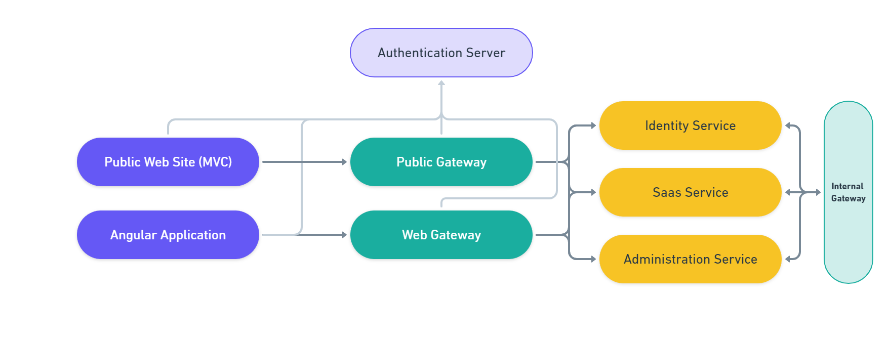

# Introducing the eShopOnAbp Project

We are happy to introduce the **eShopOnAbp** project as an example microservice solution built with the ABP Framework by the core ABP team. This solution demonstrates the strength of ABP Framework and using it in a real-life case. The goal of the project is to create a full-featured cloud-native microservices reference application. The project is inspired by the [eShopOnContainers](https://github.com/dotnet-architecture/eShopOnContainers) project and shows how it can be implemented with the ABP Framework.

> **Project Status**: Currently, the project doesn't have any business logic. We've just brought ABP's pre-built modules (Identity, Tenant Management, IdentityServer, etc) together as a base solution. However, it is fully working and you can now take it as a base solution for your microservice project. From now on, we will build the example application functionalities / business logic on top of it.

## Source Code

The source code is available on [abpframework/eShopOnAbp](https://github.com/abpframework/eShopOnAbp) repository.

## The Big Picture

The project follows micro-service architecture and overall structure is presented below.



## How to Run?

You can either run in Visual Studio, or using [Microsoft Tye](https://github.com/dotnet/tye). Tye is a developer tool that makes developing, testing, and deploying micro-services and distributed applications easier.

 ### Requirements

- .NET 5.0+
- Docker
- Yarn

### Instructions

- Clone the repository ( [eShopOnAbp](https://github.com/abpframework/eShopOnAbp) )

- Install Tye (*follow [these steps](https://github.com/dotnet/tye/blob/main/docs/getting_started.md#installing-tye)*)

- Execute `run-tye.ps1`

- Wait until all applications are up!

  - You can check running application from tye dashboard ([localhost:8000](http://127.0.0.1:8000/))

- After all your backend services are up, start the angular application:

  ```bash
  cd apps/angular
  yarn start
  ```

## What's Next?

We'll work on deployment & CI-CD processes as a next step and build the business logic on. First goal is deploying the entire application on [Kubernetes](https://kubernetes.io/).

## Feedback

Your comments and suggestions is important for us. You can ask your questions or post your feedback under [this discussion entry](https://github.com/abpframework/abp/discussions/XXXX).
