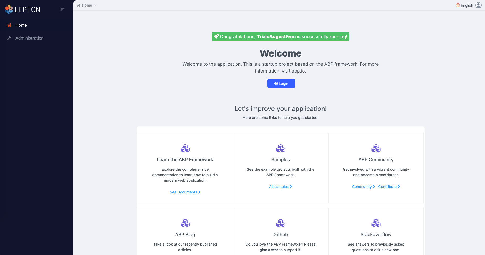
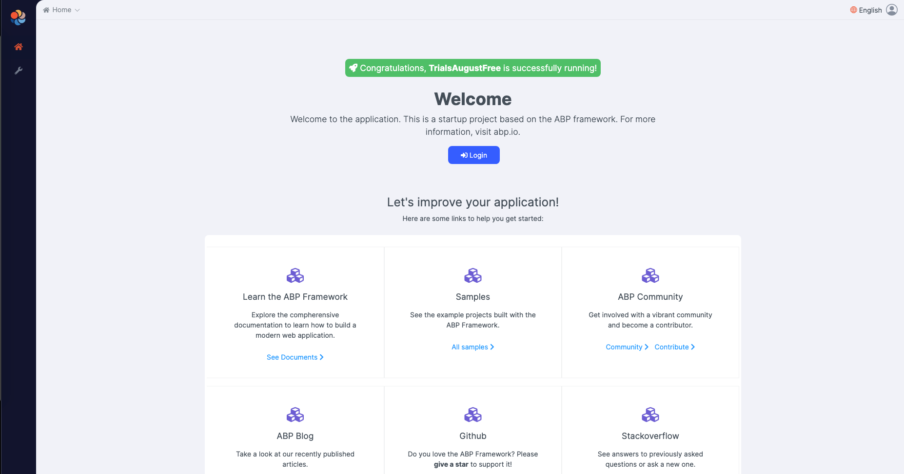

# LeptonX Alpha Release

We are excited to announce that the alpha version of LeptonX has been released! As stated in this [blog post](https://volosoft.com/blog/introducing-the-lepton-theme-next-generation), LeptonX comes in different shapes. For this release, we introduce only ABP-related packages. So, if you are already using the ABP Framework and Angular as the frontend choice, you can integrate these packages into your project with ease. 

As we have announced in the blogpost, open-source ABP users will get to replace `ThemeBasic` with `LeptonX-lite`.

## Open-Source

To add `LeptonX-lite` into your project,

* Install `@abp/ng.theme.lepton-x`

`npm install @abp/ng.theme.lepton-x@preview` or 

`yarn add @abp/ng.theme.lepton-x@preview`

* Then, we need to edit the styles array in `angular.json` to replace the existing style with the new one.

Replace the following style 

```JSON
{
  "input": "node_modules/bootstrap/dist/css/bootstrap.min.css",
  "inject": true,
  "bundleName": "bootstrap-ltr.min"
},
```

with 

```json
"node_modules/@volo/ngx-lepton-x.lite/styles/sidemenu-layout.min.css",
"node_modules/bootstrap-icons/font/bootstrap-icons.css",
```

* Finally, remove `ThemeBasicModule` and import the related modules in `app.module.ts`

```js
import { ThemeLeptonXModule } from '@abp/ng.theme.lepton-x';
import { SideMenuLayoutModule } from '@abp/ng.theme.lepton-x/layouts';

@NgModule({
  imports: [
    // ...

    // do not forget to remove ThemeBasicModule
    //  ThemeBasicModule.forRoot(),
    ThemeLeptonXModule.forRoot(),
    SideMenuLayoutModule.forRoot(),
  ],
  // ...
})
export class AppModule {}
```

Note: If you employ [Resource Owner Password Flow](https://docs.abp.io/en/abp/latest/UI/Angular/Authorization#resource-owner-password-flow) for authorization, you should import the following module as well:

```js
import { AccountLayoutModule } from '@abp/ng.theme.lepton-x/account';

@NgModule({
  // ...
  imports: [
    // ...
    AccountLayoutModule.forRoot(),
    // ...
  ],
  // ...
})
export class AppModule {}
```

To change the logos and brand color of the `LeptonX`, simply add the following CSS to the `styles.scss`

```css
:root {
  --lpx-logo: url('/assets/images/logo.png');
  --lpx-logo-icon: url('/assets/images/logo-icon.png');
  --lpx-brand: #edae53;
}
```

- `--lpx-logo` is used to place the logo in the menu.
- `--lpx-logo-icon` is a square icon used when the menu is collapsed. 
- `--lpx-brand` is a color used throughout the application, especially on active elements. 





## Commercial

To add `LeptonX` into your existing projects, 

* Firstly, install `@volosoft/abp.ng.theme.lepton-x`

`npm install @volosoft/abp.ng.theme.lepton-x@preview` or 

`yarn add @volosoft/abp.ng.theme.lepton-x@preview`

* Then, edit `angular.json` as follows:

Remove the following config from the `styles` array since LeptonX provides bootstrap as embedded in its CSS.

```JSON
{
  "input": "node_modules/bootstrap/dist/css/bootstrap.min.css",
  "inject": true,
  "bundleName": "bootstrap-ltr.min"
},
```

Add the following ones into the `styles` array

```JSON
{
  "input": "node_modules/@volosoft/ngx-lepton-x/styles/themes/dark.css",
  "inject": false,
  "bundleName": "lepton-x.dark"
},
{
  "input": "node_modules/@volosoft/ngx-lepton-x/styles/themes/dim.css",
  "inject": false,
  "bundleName": "lepton-x.dim"
},
{
  "input": "node_modules/@volosoft/ngx-lepton-x/styles/themes/light.css",
  "inject": false,
  "bundleName": "lepton-x.light"
},
"node_modules/@volosoft/ngx-lepton-x/styles/css/sidemenu-layout.min.css",
"node_modules/bootstrap-icons/font/bootstrap-icons.css",
```

Three of them are related to the theming and will be loaded during runtime. That's why they are not injected into the `head` as a style. Hence, the `"inject": false`

The fourth one depends on which layout you want to use. For now, there is only `sidemenu-layout` available. In the future, there will be many layouts to choose from. 

The last one is `bootstrap-icons` which are being used throughout the components. 

* At last, remove `ThemeLeptonModule` and import the following modules in `app.module.ts`

```js
import { ThemeLeptonXModule } from '@volosoft/abp.ng.theme.lepton-x';
import { AbpSideMenuLayoutModule } from '@volosoft/abp.ng.theme.lepton-x/layouts';

@NgModule({
  // ...
  imports: [
    // ...
    // ThemeLeptonModule.forRoot(),
    ThemeLeptonXModule.forRoot(),
    AbpSideMenuLayoutModule.forRoot(), // depends on which layout you choose
    // ...
  ],
  // ...
})
export class AppModule {}
```

Note: If you employ [Resource Owner Password Flow](https://docs.abp.io/en/abp/latest/UI/Angular/Authorization#resource-owner-password-flow) for authorization, you should import the following module as well:

```js
import { AccountLayoutModule } from '@volosoft/abp.ng.theme.lepton-x/account';

@NgModule({
  // ...
  imports: [
    // ...
    AccountLayoutModule.forRoot({
      layout: {
        authLayoutImg: '/assets/images/login-bg.jpg',
      },
    }),
    // ...
  ],
  // ...
})
export class AppModule {}
```

`authLayoutImg`: (Optional) If not given, a default image will be placed on the authentication pages.


* At this point, `LeptonX` theme should be up and running within your application. However, you may need to overwrite some css variables based your needs for every theme available as follows:
  
```scss
:root {
  .lpx-theme-dark {
    --lpx-logo: url('/assets/images/logo/logo-light.svg');
    --lpx-logo-icon: url('/assets/images/logo/logo-light-icon.svg');
    --lpx-brand: #edae53;
  }

  .lpx-theme-dim {
    --lpx-logo: url('/assets/images/logo/logo-light.svg');
    --lpx-logo-icon: url('/assets/images/logo/logo-light-icon.svg');
    --lpx-brand: #f15835;
  }

  .lpx-theme-light {
    --lpx-logo: url('/assets/images/logo/logo-dark.svg');
    --lpx-logo-icon: url('/assets/images/logo/logo-dark-icon.svg');
    --lpx-brand: #69aada;
  }
}
```

When the user selects a theme, the corresponding CSS class is added to the `body`, so you can write specific CSS rules to each theme.

Please, keep in mind that this is an alpha version, and we will continue to work on `LeptonX`. The APIs are bound to change, and breaking changes may be introduced in future versions. 

We would like you to try it out with the latest version of the ABP Framework and give us feedback at lepton{at}volosoft{dot}com and/or https://github.com/volosoft/lepton-theme