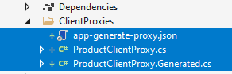
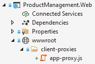
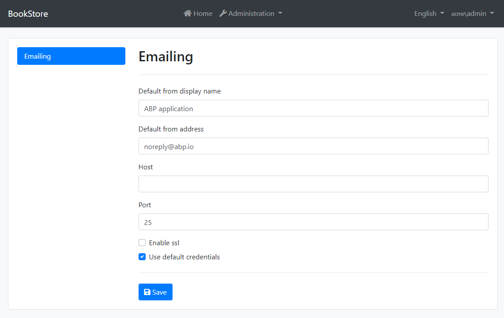
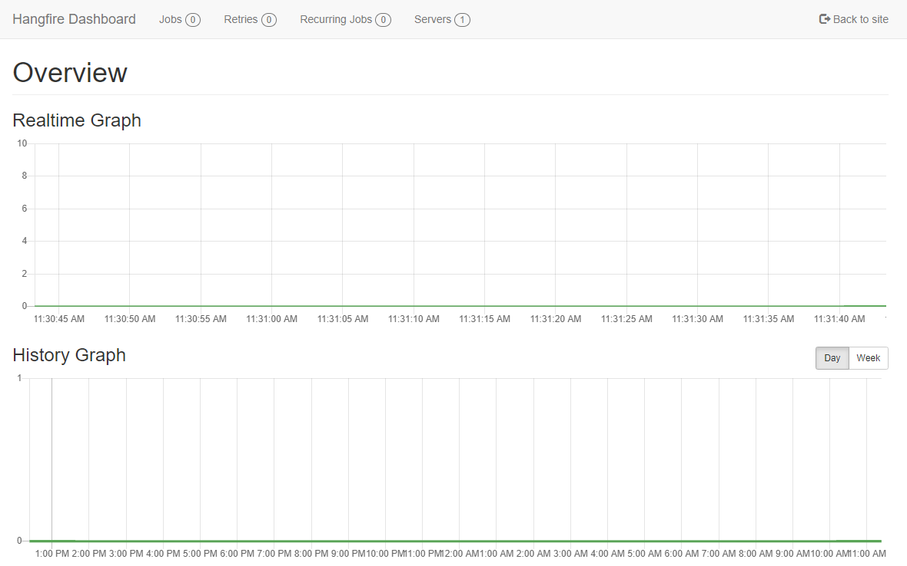
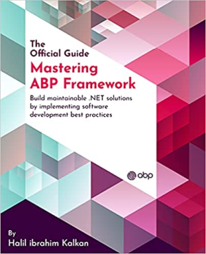

# ABP Platform 5.0 Beta 1 Has Been Released

Today, we are excited to release the [ABP Framework](https://abp.io/) and the [ABP Commercial](https://commercial.abp.io/) version **5.0 Beta 1**. This blog post introduces the new features and important changes in this new version.

> **The planned release date for the [5.0.0 Release Candidate](https://github.com/abpframework/abp/milestone/51) version is November, 2021**.

Please try the beta 1 version and provide feedback for a more stable ABP version 5.0! Thank you all.

## Get Started with the 5.0 Beta 1

follow the steps below to try the version 5.0.0 beta 1 today;

1) **Upgrade** the ABP CLI to the version `5.0.0-beta.1` using a command line terminal:

````bash
dotnet tool update Volo.Abp.Cli -g --version 5.0.0-beta.1
````

**or install** if you haven't installed before:

````bash
dotnet tool install Volo.Abp.Cli -g --version 5.0.0-beta.1
````

2) Create a **new application** with the `--preview` option:

````bash
abp new BookStore --preview
````

See the [ABP CLI documentation](https://docs.abp.io/en/abp/latest/CLI) for all the available options.

> You can also use the *Direct Download* tab on the [Get Started](https://abp.io/get-started) page by selecting the **Preview checkbox**.

### Visual Studio Upgrade

As .NET 6 is a preview version you need to make changes on your current Visual Studio. If you want to run a .NET 6 project on Visual Studio 2019, you need to enable the  `Use Previews of the .NET SDK` option from Visual Studio 2019 options.  See the screenshot:


Alternatively you can download the latest Visual Studio 2022 preview to run/create the .NET 6 projects.  We have tested the ABP solution with the Visual Studio 2022 `17.0.0 Preview 4.1`. Check out https://visualstudio.microsoft.com/vs/preview/ for more information.

### Migration Notes & Breaking Changes

This is a major version and there are some breaking changes and upgrade steps. Here, a list of important breaking changes in this version:

* Upgraded to .NET 6.0-rc.1, so you need to move your solution to .NET 6.0 if you want to use the ABP 5.0.
* `IRepository` doesn't inherit from `IQueryable` anymore. It was already made obsolete in 4.2.
* Removed NGXS and states from the Angular UI.
* Removed gulp dependency from the MVC / Razor Pages UI in favor of `abp install-libs` command of ABP CLI.

Please see the [migration document](https://docs.abp.io/en/abp/5.0/Migration-Guides/Abp-5_0) for all the details. You can also see all [the closed issues and pull request](https://github.com/abpframework/abp/releases/tag/5.0.0-beta.1) on GitHub.

## What's new with Beta 1?

In this section, I will introduce some major features released with beta 1.

### Static (Generated) Client Proxies for C# and JavaScript

Dynamic C# ([see](https://docs.abp.io/en/abp/latest/API/Dynamic-CSharp-API-Clients)) and JavaScript ([see](https://docs.abp.io/en/abp/latest/UI/AspNetCore/Dynamic-JavaScript-Proxies)) client proxy system is one of the most loved features of the ABP Framework. It generates the proxy code on runtime and makes client-to-server calls a breeze. With ABP 5.0, we are providing an alternative approach: You can generate the client proxy code on development-time.

Development-time client proxy generation has a performance advantage since it doesn't need to obtain the HTTP API definition on runtime. It also makes it easier to consume a (micro)service behind an API Gateway. With dynamic proxies, we should return a combined HTTP API definition from the API Gateway and need to add HTTP API layers of the microservices to the gateway. Static proxies removes this requirement. One disadvantage is that you should re-generate the client proxy code whenever you change your API endpoint definition. Yes, software development always has tradeoffs :)

Working with static client proxy generation is simple with the ABP CLI. You first need to run the server application, open a command-line terminal, locate to the root folder of your client application, then run the `generate-proxy` command of the ABP CLI.

#### Creating C# client proxies

C# client proxies are useful to consume APIs from Blazor WebAssembly applications. It is also useful for microservice to microservice HTTP API calls. Notice that the client application need to have a reference to the application service contracts (typically, the `.Application.Contracts` project in your solution) in order to consume the services.

**Example usage:**

````bash
abp generate-proxy -t csharp -u https://localhost:44305
````

`-t` indicates the client type, C# here. `-u` is the URL of the server application. It creates the proxies for the application (the app module) by default. You can specify the module name as `-m <module-name>` if you are building a modular system. The following figure shows the generated files:



Once the proxies are generated, you can inject and use the application service interfaces of these proxies, like `IProductAppService` in this example. Usage is same of the [dynamic C# client proxies](https://docs.abp.io/en/abp/latest/API/Dynamic-CSharp-API-Clients).

#### Creating JavaScript client proxies

JavaScript proxies are useful to consume APIs from MVC / Razor Pages UI. It works on JQuery AJAX API, just like the [dynamic JavaScript proxies](https://docs.abp.io/en/abp/latest/UI/AspNetCore/Dynamic-JavaScript-Proxies).

**Example usage:**

````bash
abp generate-proxy -t js -u https://localhost:44305
````

The following figure shows the generated file:



Then you can consume the server-side APIs from your JavaScript code just like the [dynamic JavaScript proxies](https://docs.abp.io/en/abp/latest/UI/AspNetCore/Dynamic-JavaScript-Proxies).

#### Creating Angular client proxies

Angular developers knows that the generate-proxy command was already available in ABP's previous versions to create client-side proxy services in the Angular UI. The same functionality continues to be available and already [documented here](https://docs.abp.io/en/abp/latest/UI/Angular/Service-Proxies).

**Example usage:**

````bash
abp generate-proxy -t ng -u https://localhost:44305
````

### Transactional Outbox & Inbox for the Distributed Event Bus

This was one of the most awaited features by distributed software developers.

The [transactional outbox pattern](https://microservices.io/patterns/data/transactional-outbox.html) is used to publishing distributed events within the same transaction that manipulates the application database. Distributed events are saved into the database inside the same transaction with your data changes, then sent to the message broker (like RabbitMQ or Kafka) by a separate background worker with a re-try system. In this way, it ensures the consistency between your database state and the published events.

The transactional inbox pattern, on the other hand, saves incoming events into database first, then executes the event handler in a transactional manner and removes the event from the inbox queue in the same transaction. It also ensures that the event is only executed one time by keeping the processed messages for a while and discarding the duplicate events received from the message broker.

Enabling the inbox and outbox patterns requires a few manual steps for your application. We've created a simple [console application example](https://github.com/abpframework/abp/tree/dev/test/DistEvents), but I will also explain all the steps here.

#### Pre-requirements

First of all, you need to have EF Core or MongoDB installed into your solution. It should be already installed if you'd created a solution from the ABP startup template.

#### Install the package

Install the new [Volo.Abp.EventBus.Boxes](https://www.nuget.org/packages/Volo.Abp.EventBus.Boxes) NuGet package to your database layer (to `EntityFrameworkCore` or `MongoDB` project) or to the host application. Open a command-line terminal at the root directory of your database (or host) project and execute the following command:

````csharp
abp add-package Volo.Abp.EventBus.Boxes
````

This will install the package and setup the ABP module dependency.

#### Configure the DbContext

Open your `DbContext` class, implement the `IHasEventInbox` and the `IHasEventOutbox` interfaces. You should end up by adding two `DbSet` properties into your `DbContext` class:

````csharp
public DbSet<IncomingEventRecord> IncomingEvents { get; set; }
public DbSet<OutgoingEventRecord> OutgoingEvents { get; set; }
````

Add the following lines inside the `OnModelCreating` method of your `DbContext` class:

````csharp
builder.ConfigureEventInbox();
builder.ConfigureEventOutbox();
````

It is similar for MongoDB; implement the `IHasEventInbox` and the `IHasEventOutbox` interfaces. There is no `Configure...` method for MongoDB.

Now, we've added inbox/outbox related tables to our database schema. Now, for EF Core, use the standard `Add-Migration` and `Update-Database` commands to apply changes into your database (you can skip this step for MongoDB). If you want to use the command-line terminal, run the following commands in the root directory of the database integration project:

````bash
dotnet ef migrations add "Added_Event_Boxes"
dotnet ef database update
````

#### Configure the distributed event bus options

As the last step, write the following configuration code inside the `ConfigureServices` method of your module class:

````csharp
Configure<AbpDistributedEventBusOptions>(options =>
{
    options.Outboxes.Configure(config =>
    {
        config.UseDbContext<YourDbContext>();
    });
    
    options.Inboxes.Configure(config =>
    {
        config.UseDbContext<YourDbContext>();
    });
});
````

Replace `YourDbContext` with your `DbContext` class.

That's all. You can continue to publishing and consuming events just as before. See the [distributed event bus documentation](https://docs.abp.io/en/abp/latest/Distributed-Event-Bus) if you don't know how to use it.

### Publishing events in transaction

The previous feature (outbox & inbox) solves the transactional event publishing problem for distributed systems. This feature, publishing events in transaction, solves the problem of executing event handlers in the same transaction that the events are published in for non-distributed applications. With 5.0, all events (local or distributed) are handled in the same transaction. If any handler fails, the transaction is rolled back. If you don't want that, you should use try/catch and ignore the exception inside your event handler.

Remember that if you don't install a real distributed event provider (like [RabbitMQ](https://docs.abp.io/en/abp/latest/Distributed-Event-Bus-RabbitMQ-Integration) or [Kafka](https://docs.abp.io/en/abp/latest/Distributed-Event-Bus-Kafka-Integration)), the [distributed events](https://docs.abp.io/en/abp/latest/Distributed-Event-Bus) are actually executed in-process, just like the [local events](https://docs.abp.io/en/abp/latest/Local-Event-Bus). So, with this development, all the events become transactional, even if your system is distributed or not.

No action needed to take. It will just work by default. There is a [deprecation note](https://github.com/abpframework/abp/issues/9897) related to this change (some pre-defined events [will be removed](https://github.com/abpframework/abp/issues/9908) in the next major version since they are not needed anymore)

### Inactivating a user

The [Identity module](https://docs.abp.io/en/abp/latest/Modules/Identity) has a new feature to make a user active or inactive. Inactive users can not login to the system. In this way, you can disable a user account without deleting it. An *Active* checkbox is added to the user create/edit dialog to control it on the UI:


EF Core developers should add a new database migration since this brings a new field to the `AbpUsers` table.

### Overriding email settings per tenant

If you're building a multi-tenant application, it is now possible to override email sending settings per tenant. To make this possible, you should first enable that [feature](https://docs.abp.io/en/abp/latest/Features) to the tenant you want, by clicking the *Actions -> Features* for the tenant.


Enable the feature using the checkbox as shown in the following modal:


Then the tenant admin can open the email settings page under the Administration -> Settings menu (on development environment, logout, switch to the tenant and re-login with the tenant admin):



### Hangfire dashboard permission

ABP allows to use Hangfire as the background job manager when you install the integration package [as documented](https://docs.abp.io/en/abp/5.0/Background-Jobs-Hangfire). Hangfire's dashboard is used to monitor and control the background job queues. Here, a screenshot from the dashboard:



Hangfire's dashboard is not authorized by default, so any user can navigate to the `/hangfire` URL and see/control the jobs. With the ABP version 5.0, we've added a built-in authorization implementation for the Hangfire dashboard. Instead of `app.UseHangfireDashboard();`, you can use the following middleware configuration:

````csharp
app.UseHangfireDashboard("/hangfire", new DashboardOptions
{
    AsyncAuthorization = new[] { new AbpHangfireAuthorizationFilter() }
});
````

In this way, only the authenticated users can see the dashboard. However, we suggest to set a permission name, so only the users with that permission can see the dashboard:

````csharp
app.UseHangfireDashboard("/hangfire", new DashboardOptions
{
    AsyncAuthorization = new[] {
        new AbpHangfireAuthorizationFilter("MyPermissionName")
    }
});     
````

You can define the permission (`MyPermissionName` in this example) using the standard [permission system](https://docs.abp.io/en/abp/5.0/Authorization#permission-system).

### Introducing AbpControllerBase

ABP provides an `AbpController` class that you can inherit your MVC controllers from. It provides some pre-injected services to simplify your controllers. With v5.0, we are adding a second base controller class, `AbpControllerBase`, which is more proper to create API controllers (without view features). It is suggested to inherit from the `AbpControllerBase` class to create API controllers, instead of the `AbpController` class.

**Example:**

````csharp
[Route("api/products")]
public class ProductController : AbpControllerBase
{
    // TODO: ...
}
````

## Ongoing Works & Next Release

We'd published important features and changes with this beta 1 release. However, there are still some major works in development. The most important work is the **Bootstrap 5 upgrade**. ABP 5.0 will work on Bootstrap 5, which is an important change for existing applications. We suggest to prepare for this change from now.

The next release will be 5.0.0-beta.2. It will include the Bootstrap 5 upgrade. We don't plan make another big work for the version 5.0. After the beta.2, we will work on tests, feedbacks and documentation to prepare a stable final release.

## Community News

### ABP was on ASP.NET Community Startup!

It was great for us to be invited to Microsoft's [ASP.NET Community Weekly Standup](https://dotnet.microsoft.com/live/community-standup) show, at September 28. There was a very high attention and that made us very happy. Thanks to the ABP Community and all the watchers :) If you've missed the talk, [you can watch it here](https://www.youtube.com/watch?v=vMWM-_ihjwM).

### Upcoming ABP Book!

I am currently authoring the first official book for the ABP Framework and it is on [pre-sale on Amazon](https://www.amazon.com/Mastering-ABP-Framework-maintainable-implementing-dp-1801079242/dp/1801079242) now.



This books is a complete guide to start working with the ABP Framework, explore the ABP features and concepts. It also contains chapters for DDD, modular application development and multi-tenancy to learn and practically work with the ABP architecture to build maintainable software solutions and create SaaS applications. The book will be based on ABP 5.0 and published in the beginning of 2022. You can [pre-order now](https://www.amazon.com/Mastering-ABP-Framework-maintainable-implementing-dp-1801079242/dp/1801079242)!

### New ABP Community posts

Here, the latest posts added to the [ABP community](https://community.abp.io/):

* [Deploy ABP Framework .NET Core tiered application to docker swarm](https://community.abp.io/articles/deploy-abp-framework-dotnet-core-tiered-app-to-docker-swarm-kcrjbjec)
* [How to override localization strings of depending modules](https://community.abp.io/articles/how-to-override-localization-strings-of-depending-modules-ba1oy03l)
* [Centralized logging for .NET Core ABP microservices application using Seq](https://community.abp.io/articles/centralized-logging-for-.net-core-abp-microservices-app-using-seq-g1xe7e7y)
* [Extend Tenant management and add custom host to your ABP application](https://community.abp.io/articles/extend-tenant-management-and-add-custom-host-to-your-abp-app-lwmi9lr5)

Thanks to the ABP Community for all the contents they have published. You can also post your ABP and .NET related (text or video) contents to the ABP Community.

## Conclusion

The ABP version 5.0 is coming with important changes (like .NET 6 and Bootstrap 5) and features. In this blog post, I summarized the news about that new version. Please try it and provide feedback by opening issues on [the GitHub repository](https://github.com/abpframework/abp). Thank you all!
