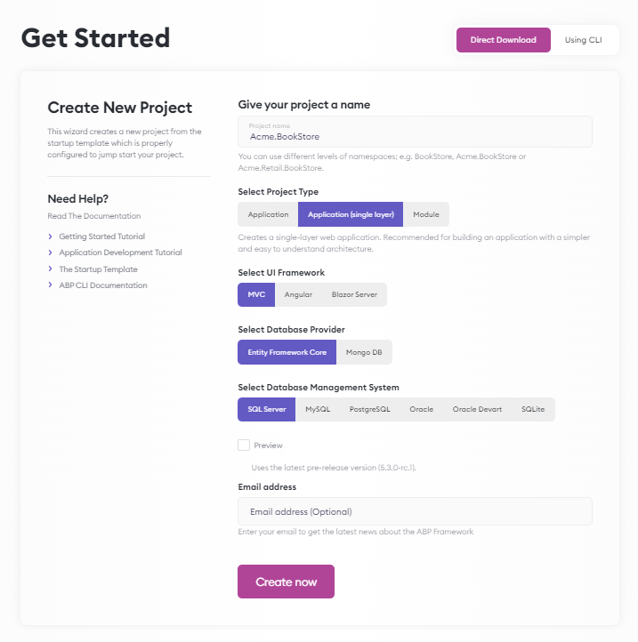
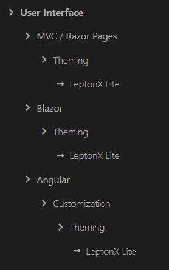
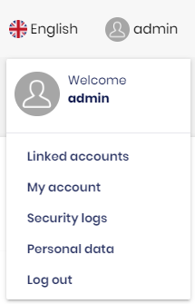
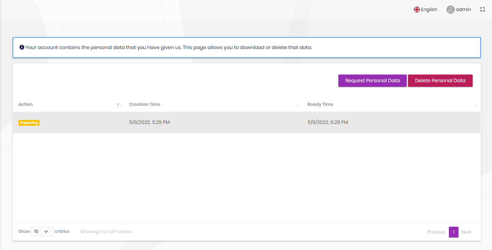
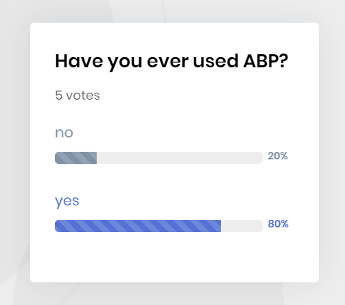
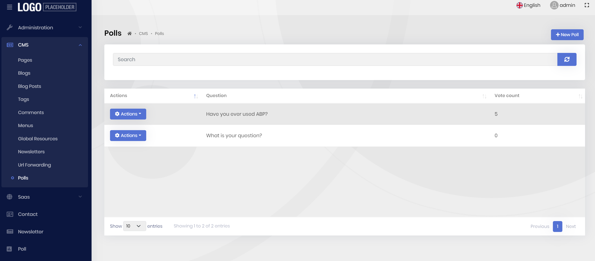
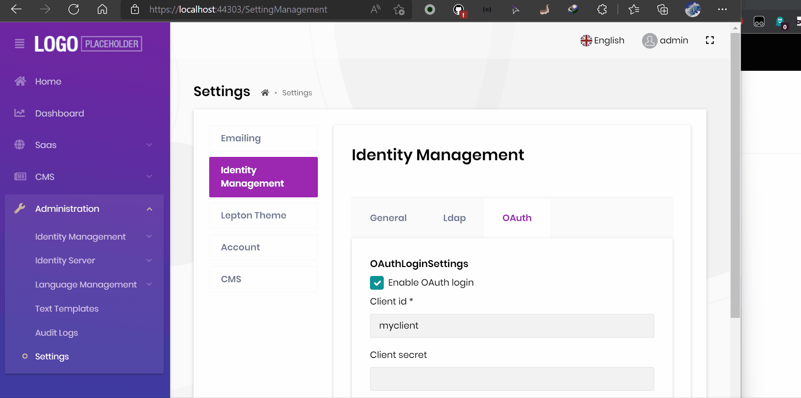
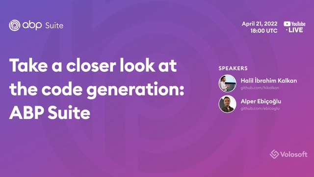
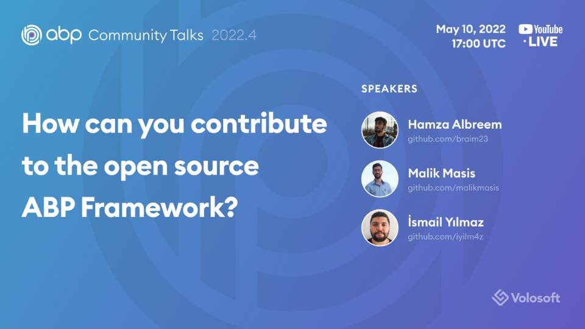

# ABP.IO Platform 5.3 RC Has Been Released

Today, we are happy to release the [ABP Framework](https://abp.io/) and  [ABP Commercial](https://commercial.abp.io/) version **5.3 RC** (Release Candidate). This blog post introduces the new features and important changes in this new version.

> **The planned release date for the [5.3.0 Stable](https://github.com/abpframework/abp/milestone/69) version is May 31, 2022**.

Please try this version and provide feedback for a more stable ABP version 5.3! Thank you all.

## Get Started with the 5.3 RC

Follow the steps below to try version 5.3.0 RC today:

1) **Upgrade** the ABP CLI to version `5.3.0-rc.1` using a command line terminal:

````bash
dotnet tool update Volo.Abp.Cli -g --version 5.3.0-rc.1
````

**or install** it if you haven't before:

````bash
dotnet tool install Volo.Abp.Cli -g --version 5.3.0-rc.1
````

2) Create a **new application** with the `--preview` option:

````bash
abp new BookStore --preview
````

See the [ABP CLI documentation](https://docs.abp.io/en/abp/latest/CLI) for all the available options.

> You can also use the *Direct Download* tab on the [Get Started](https://abp.io/get-started) page by selecting the **Preview checkbox**.

You can use any IDE that supports .NET 6.x, like **[Visual Studio 2022](https://visualstudio.microsoft.com/downloads/)**.

## Migration Notes

There is a change in this version that may effect your applications:

* Upgraded the [AutoMapper](https://github.com/AutoMapper/AutoMapper) library to **v11.0.1**. So, you need to change your project's target SDK that use the **AutoMapper** library (typically your `*.Application` project). You can change it from `netstandard2.0` to `netstandard2.1` or `net6` if needed. You can write to [#12189](https://github.com/abpframework/abp/pull/12189) if you need any help.

## What's New with ABP Framework 5.3?

In this section, I will introduce some major features released with this version. Here is a brief list of titles explained in the next sections:

* Single-layer option added to the [*Get Started*](https://abp.io/get-started) page
* PWA Support for Startup Templates
* Introduced the `Volo.Abp.Gdpr.Abstractions` package
* Batch Publish Events from Outbox to the Event Bus
* Improvements on **eShopOnAbp** Project & E-Book Announcement
* LeptonX Lite Documentations & Project Status & Roadmap
* OpenIddict Module & Keycloack Integration
* Deployment Documentations
* Other News

### Single-layer Option on *Get Started* Page

We've created a new startup template named `app-nolayers` and [announced](https://blog.abp.io/abp/ABP.IO-Platform-5-2-RC-Has-Been-Published) it in the previous version. In this version, we've also added this startup template option to the *Get Started* page.

*You can examine the screenshot below to see how to create an `app-nolayers` template from the ["Get Started"](https://abp.io/get-started) page:*



### PWA Support for Startup Templates

ABP v5.3 application startup template now supports PWA for Blazor WASM & Angular UIs. To create a startup template with the PWA support, you can use the `--pwa` parameter.

Example:

```bash
abp new MyProgressiveWebApp -t app -u blazor --pwa
```

### Introducing the `Volo.Abp.Gdpr.Abstractions` Package

A new `Volo.Abp.Gdpr.Abstractions` package has been added to the framework. This is an abstraction package, so doesn't contain any actual GDPR implementation. It defines some classes and interfaces to put a standard for who want to implement a GDPR module that can run in a modular or microservice system.

At that point, we are introducing the **GDPR Module** for the ABP Commercial customers and this module does the GDPR-related operations on behalf of you, such as *"Download/Delete Personal Data"*. I'll describe the **GDPR Module** later in this blog post. 

> Please see the **GDPR Module** section below to learn more about this module.

### Batch Publish Events from Outbox to the Event Bus

We introduced the "Transactional Outbox & Inbox Patterns" in [**ABP v5.0**](https://blog.abp.io/abp/ABP-IO-Platform-5.0-RC-1-Has-Been-Released), it was one of the most awaited features by several software developers.

We've made some optimizations for the **Batch Event Publishing** in this version, you can examine the related development from [here](https://github.com/abpframework/abp/pull/11243). After the optimization, the results are impressive. It is enabled by default (if you have configured [event outbox](https://docs.abp.io/en/abp/latest/Distributed-Event-Bus#outbox-inbox-for-transactional-events)), so you don't need to any manual configuration.

### Improvements on eShopOnAbp Project & E-Book Announcement

There are some developments on the [eShopOnAbp project](https://github.com/abpframework/eShopOnAbp) made in this version. You can see the brief descriptions of some of the improvements below:

* Local certificates have been created to use while working in Kubernetes and also Helm Charts have been updated. See [#107](https://github.com/abpframework/eShopOnAbp/pull/107).
* The Order Management page has been created. See [#92](https://github.com/abpframework/eShopOnAbp/pull/92).
* Database migration event handlers have been removed and "Distributed Locking" is now used for database migrations. See [#85](https://github.com/abpframework/eShopOnAbp/pull/85) and [#102](https://github.com/abpframework/eShopOnAbp/pull/102).
* Switched from Ocelot to YARP as the gateway. See [#97](https://github.com/abpframework/eShopOnAbp/pull/97).

We have exciting news to share with the community, we're working on an "ABP Microservice Development" e-book. In this book, we're using the eShopOnAbp project as a reference microservice solution and we're trying to explain our experiences during the microservice application development process through this project.

We're planning to create this book in nine chapters and make it available after the third chapter is written. After that, you will be able to download this free e-book from the [abp.io](https://abp.io/) website.

### LeptonX Lite Documentations & Project Status & Roadmap

It is finally here, we've released the **1.0.0-beta.1** version for the **LeptonX Lite**.



Lepton X Lite documents have been written for the three UI types within this version. You can see the related documentation from the screenshot above. You can follow these documents and try the new **LeptonX Lite Theme**.

We don't suggest using the **beta.1** version on production, we highly demand you to test **LeptonX Lite** and provide feedback to us. It's really important for us to be able to release a more stable version. Thanks in advance.

For the following versions (beta.2 and RC versions), we will focus on:

* Fixing the reported bugs from the community
* Providing documentations as much as possible
* Adding new custom pages to the demo

### OpenIddict Module & Keycloack Integration

We have [announced the plan of replacing the IdentityServer](https://github.com/abpframework/abp/issues/11989). ABP currently uses **IdentityServer4** to add **OAuth** features as built-in on the server-side. However, since *IdentityServer4's support ends at the end of the year 2022*. Its replacement is Duende IdentityServer, which is not a free software anymore. (see [more](https://blog.duendesoftware.com/posts/20220111_fair_trade/))

Therefore, we've decided to completely drop the **IdentityServer4** from the ABP platform and implement the [OpenIddict](https://github.com/openiddict/openiddict-core) and install onto the startup templates. 

We've implemented both open source and commercial OpenIddict modules, we plan to remove Identity Server and replace it with OpenIddict for template projects in **ABP v5.4**. Please check [#12084](https://github.com/abpframework/abp/pull/12084) to see the development made on the open-source side.

We're creating the documentation for the OpenIddict Module, if you want to have general knowledge about this module, you can check the documentation from [here](https://github.com/abpframework/abp/blob/dev/docs/en/Modules/OpenIddict.md). Currently, this is a draft documentation but it gives overall knowledge about the OpenIddict Module, we'll complete this documentation in ABP v5.4 and you'll be able to read it completely.

Currently, we are also working on Keycloak integration possibilities in parallel to the OpenIddict integration research and we've prepared some samples that you can examine. You can see [#154](https://github.com/abpframework/abp-samples/pull/154) and [#158](https://github.com/abpframework/abp-samples/pull/158).

### Deployment Documentations

Deploying an ABP-based application is not so different than deploying any .NET or ASP.NET Core application. You can deploy it to a cloud provider (e.g. Azure, AWS, Google Could) or on-premise server, IIS or any other web server. However, we wanted to prepare a "Deployment Guide" to mention the important points and considerations.


In the [Deploying to a Clustered Environment](https://docs.abp.io/en/abp/5.3/Deployment/Clustered-Environment) documentation, we've documented the topics that you should consider when you are developing your application to a clustered environment and explained how you can deal with these topics in your ABP-based application. 

### Other News

* Global Features were only accessible from the C# code. From this version and on, Global Features can be also provided from application configurations. See [#12043](https://github.com/abpframework/abp/pull/12043).
* Getting the user's detailed information (name, surname and phone number) from external login. See [#12085](https://github.com/abpframework/abp/pull/12085).
* Date Pipes for Angular. See [#11909](https://github.com/abpframework/abp/issues/11909).

If you want to see more details, you can check [the release on GitHub](https://github.com/abpframework/abp/releases/tag/5.3.0-rc.1), which contains a list of all the issues and pull requests closed with this version.

## What's New with ABP Commercial 5.3?

### GDPR Module

> **GDPR (General Data Protection Regulation)** is a regulation in EU law on data protection and known as the toughest privacy and security law in the world. GDPR applies to any organization operating within the EU, as well as any organizations outside of the EU which offer goods or services to customers or businesses in the EU.

With this version, we are introducing the new **GDPR Module**. This was one of the most awaited features, so we've prioritized it and implemented it in this version.

The GDPR Module is pre-installed in the [startup templates](https://docs.abp.io/en/commercial/5.3/startup-templates/index) for MVC. So, no need to manually install it. When you create a new startup template, you can directly use this module. We'll also implement this module for the other UI types as soon as possible and also add extra functionality such as "Cookie Consent" and more. 

Currently, there are two main functions of this module and they are "Download Personal Data" and "Delete Personal Data".



There is a "Personal Data" section in the user menu as in the screenshot above and when you click on this section, you'll be redirected to the "Personal Data" page. On that page, you can either request to "Download Personal Data" or "Delete Personal Data". 



After you've requested to download "Personal Data", you need to wait for 1 hour by default (you can configure the related option). Because the GDPR module is developed by considering the distributed systems and therefore a specific time should be passed to ensure all the published events are handled and all personal data is collected.

### CMS Kit Pro - Polling Feature

We've added a **Polling** feature to the **CMS Kit Pro** module. This feature allows you to use a questionnaire/voting system in your application easily. You can create a question, define some options for it and the poll will be created for you. You can see the example poll in the screenshot below:



Also, there is an admin side of the Polling Feature. You can easily manage your polls in your admin (back-office) project. You can create, update, delete and show the results of the poll on the Polls page:



### OAuth Resource Owner Password as External Login Provider

> The Resource Owner Password flow allows for the exchanging of the username and password of a user for an access token. When using the resource owner password credentials grant, the user provides the credentials (username and password) directly to the application.

Now, you can login by entering a username and password from an OAuth server.

Example: Use OAuth external login provider with Keycloak:



### Suite New Features & Enhancements

In this version, there are some enhancements and new features in **Suite** and they are listed briefly below:

* It's now possible to create an **app-nolayers (Application - single layer)** template via Suite and also code-generation is supported for the **app-nolayers** template with this version.
* Suite now allows users to see and download its logs.
* Suite now allows generating code via CLI. If you have a JSON file that contains code blocks, like entity configurations, you can use the `abp suite generate` command to generate CRUD pages based on it.

Example:

```bash
abp suite generate -e C:\Users\.suite\entities\Country.json -s C:\Users\my-proj\SuiteProj\SuiteProj.sln
```

### Suite Webinar: Take a closer look at the code generation



We've organized a webinar for Suite and in this webinar, we've talked about ABP Suite's capabilities, important features and more...

You can watch the event from [here](https://www.youtube.com/watch?v=RFArBh60RSA&t=3s), if you haven't watched it yet.

### Docker Compose Configurations for Single Layer Startup Template

Dockerfiles, docker-compose files and build script files have been added to the Single Layer Startup Template (app-nolayers) with this version.

And this way, applications created with this template now can be deployed more easily.

### Microservice Solution Enhancements

There are some enhancements made in the Microservice Solution. You can see the list of these enhancements:

* Initial migration on the template has been updated with the small improvement that was made in the **Language Management** module.
* Database migration event handlers have been removed and "Distributed Locking" is now used for the database migrations.

### PWA Support for the Application Pro Template

Application Pro template also supports the PWA for Blazor WASM & Angular UIS. To create a startup template with the PWA support, you can use the `--pwa` parameter.
Example:

```bash
abp new MyProgressiveWebApp -t app-pro -u blazor --pwa
```

## Community News

### New ABP Community Posts

* [Anto Subash](https://twitter.com/antosubash) created a series named ["Microservice with ABP"](https://blog.antosubash.com/posts/abp-microservice-series) and shared a couple of video posts about the ABP Microservice solution.
* [Francisco Kadzi](https://github.com/CiscoNinja) has created his first ABP Community article that shows how to ["Customize ABP Angular Application UI with AdminLTE"](https://community.abp.io/posts/customize-abp-angular-application-ui-with-adminlte.-7qu1m67s).
* [Jack Fistelmann](https://github.com/nebula2) has created an article to introduce a helpful project extension to speed up development on Visual Studio. You can read the article [here](https://community.abp.io/posts/using-switch-startup-project-extension-for-visual-studio-52yyw27v).
* [Jack Fistelmann](https://github.com/nebula2) has also created an article to show how you can generate PDF files with the `Sycyber.Core` package in ABP-based applications. You can read it [here](https://community.abp.io/posts/generate-pdfs-in-an-abp-framework-project-using-scryber.core-x9yh1vfa).
* [Halil Ibrahim Kalkan](https://twitter.com/hibrahimkalkan) has created an article to show ["Dealing with Multiple Implementations of a Service in ASP.NET Core & ABP Dependency Injection"](https://community.abp.io/posts/dealing-with-multiple-implementations-of-a-service-in-asp.net-core-abp-dependency-injection-ysfp4ho2) with examples.
* [Manoj Kumar](https://community.abp.io/members/manojkumar.t@shloklabs.com) submitted a new article about how to use "ABP authentication in a Flutter application". It was a frequently asked topic, which you can read [here](https://community.abp.io/posts/flutter-web-authentication-from-abp-mp6l2ehx).
* [Engincan Veske](https://twitter.com/EngincanVeske) created a new Community Article to show "Concurrency Check/Control in ABP". You can read it [here](https://community.abp.io/posts/handle-concurrency-with-ef-core-in-an-abp-framework-project-with-asp.net-core-mvc-jlkc3w8f).

### ABP Community Talks 2022.4: How can you contribute to the open source ABP Framework? (May 10, 2022 - 17:00 UTC)



We've [asked you to pick the topic of the next Community Talks](https://twitter.com/abpframework/status/1514567683072745474?s=20&t=rJfHrB3DYDNsk2EXS8zBBQ) and you've chosen the "How to contribute to open source ABP Framework?" for the next talk topic. So, in this Community Talk, we will be talking about "How to contribute to ABP Framework" with one of the top contributors of the ABP Framework, [Ismail Yılmaz](https://github.com/iyilm4z). The event will be on **May 10, 2022, at 17:00 (UTC)** on YouTube.

> You can register for the event from [here](https://kommunity.com/volosoft/events/abp-community-talks-20224-how-to-contribute-to-the-open-source-abp-framework-d9b50664), if you haven't registered yet.

You can also [subscribe to the Volosoft channel](https://www.youtube.com/channel/UCO3XKlpvq8CA5MQNVS6b3dQ) to be informed about future ABP events and videos.

### Discord Server

We've created an official ABP Discord server so the ABP Community can interact with each other and created a blog-post to introduce it. You can read the [ABP Discord Server announcement post](https://blog.abp.io/abp/Official-ABP-Discord-Server-is-Here) to learn more about the ABP Discord Server. 

Thanks to the ABP Community, **700+** people joined our Discord Server so far and it grows every day.

You can join our Discord Server from [here](https://discord.gg/abp), if you haven't yet.