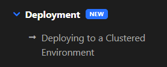

# ABP.IO Platform 5.3 RC Has Been Released

Today, we are happy to release the [ABP Framework](https://abp.io/) and  [ABP Commercial](https://commercial.abp.io/) version **5.3 RC** (Release Candidate). This blog post introduces the new features and important changes in this new version.

> **The planned release date for the [5.3.0 Stable](https://github.com/abpframework/abp/milestone/69) version is May 31, 2022**.

Please try this version and provide feedback for a more stable ABP version 5.3! Thank you all.

## Get Started with the 5.3 RC

Follow the steps below to try the version 5.3.0 RC today:

1) **Upgrade** the ABP CLI to version `5.3.0-rc.1` using a command line terminal:

````bash
dotnet tool update Volo.Abp.Cli -g --version 5.3.0-rc.1
````

**or install** it if you haven't before:

````bash
dotnet tool install Volo.Abp.Cli -g --version 5.3.0-rc.1
````

2) Create a **new application** with the `--preview` option:

````bash
abp new BookStore --preview
````

See the [ABP CLI documentation](https://docs.abp.io/en/abp/latest/CLI) for all the available options.

> You can also use the *Direct Download* tab on the [Get Started](https://abp.io/get-started) page by selecting the **Preview checkbox**.

You can use any IDE that supports .NET 6.x, like **[Visual Studio 2022](https://visualstudio.microsoft.com/downloads/)**.

## Migration Notes & Breaking Changes

There is only one breaking changes in this version upgrade and it's explained below.

* Upgraded the [AutoMapper](https://github.com/AutoMapper/AutoMapper) library to **v11.0.1**. So, you need to upgrade your projects that uses **AutoMapper** library (probably your `*.Application` project) to **netstandard2.1** or **net6** if it's **netstandard2.0**. See [#12189](https://github.com/abpframework/abp/pull/12189).

## What's New with ABP Framework 5.3?

In this section, I will introduce some major features released with this version. Here, a brief list of titles explained in the next sections:

* Single-layer option added to the [*Get Started*](https://abp.io/get-started) page
* PWA Support for Blazor WASM & Angular UIs
* Introduce the `Volo.Abp.Gdpr.Abstractions` package
* Batch Publish Events from Outbox to the Event Bus
* Improvements on **eShopOnAbp** project
* LeptonX Lite Documentations & Project Status & Roadmap
* OpenIddict Module
* Deployment Documentations
* Other news...

### Single-layer Option on *Get Started* Page

We've created a new startup template named `app-nolayers` and [announced](https://blog.abp.io/abp/ABP.IO-Platform-5-2-RC-Has-Been-Published) it in the previous version. In this version, we've added this startup template option to the *Get Started* page.

*You can examine the screenshot below to see how to create an `app-nolayers` template from the ["Get Started"](https://abp.io/get-started) page.*


### PWA Support for Blazor WASM & Angular UIs

With v5.3 ABP supports PWA for Blazor WASM & Angular UIs. To create a startup template with the PWA support, you can use the `--pwa` parameter.
Example:

```bash
abp new MyProgressiveWebApp -u blazor --pwa
```

### Introduce the `Volo.Abp.Gdpr.Abstractions` package

A new `Volo.Abp.Gdpr.Abstractions` package is added to the framework. 

Anyone can use this package to use the pre-defined ETOs and implement GDPR-related operations for their own applications. 

In that point, we are introducing the **GDPR Module** for the ABP Commercial customers and this module does the GDPR-related operations on behalf of you, such as *"Download/Delete Personal Data"*. I'll describe the **GDPR Module** later in this blog post.

### Batch Publish Events from Outbox to the Event Bus

We've introduced the "Transactional Outbox & Inbox Patterns" in [**v5.0**](https://blog.abp.io/abp/ABP-IO-Platform-5.0-RC-1-Has-Been-Released), it was one of the most awaited features by distributed software developers.

We've made some optimizations for the **Batch Event Publishing** in this version, you can examine the related development from [here](https://github.com/abpframework/abp/pull/11243). After the optimization, the results are impressive.

|   | Before | After |
|---|---|---|
| **RabbitMQ** | 50080ms | 547ms  |
| **Kafka** | 15303ms | 475ms |
| **Azure (Remote Service)** | 116157ms | 1534ms |
| **Rebus (RabbitMQ transport)** | 26094ms | 560ms |

*You can see the optimization results above for "Batch Publishing (1000 Events)"*

<!-- TODO: list the enhancements -->
### Improvements on eShopOnAbp project

### LeptonX Lite Documentations & Project Status & Roadmap

It is finally here, we've released the **1.0.0-beta.1** version for the **LeptonX Lite**.


Lepton X Lite documents have been written for the three UI types within this version. You can see the related documentation from the screenshot above. You can follow these documentations and try the new **LeptonX Lite Theme**.

We don't suggest using the **beta.1** version on production but we highly demand you to test the **LeptonX Lite** and provide feedback to us. It's really important for us to be able to release a more stable version. Thanks in advance.

For the following versions (beta.2 and RC versions), we will focus on;

* Fixing the reported bugs from the community
* Providing documentations as much as possible
* Adding new custom pages to demo

<!-- TODO: mention the status of the module? -->
### OpenIddict Module

### Deployment Documentations

Deploying an ABP based application is not so different than deploying any .NET or ASP.NET Core application. You can deploy it to a cloud provider (e.g. Azure, AWS, Google Could) or on-premise server, IIS or any other web server. However, we wanted to prepare a "Deployment Guide" to mention the important points and considerations.



We've created two new deployment documentations, you can find them under the ["Deployment"](https://docs.abp.io/en/abp/5.3/Deployment/Index) section of our documentation website.

In the [Deploying to a Clustered Environment](https://docs.abp.io/en/abp/5.3/Deployment/Clustered-Environment) documentation, we've documented the topics that you should consider when you are developing your application to a clustered environment and explains how you can deal with these topics in your ABP based application. 

### Other News

* Upgraded the [AutoMapper](https://github.com/AutoMapper/AutoMapper) library to **v11.0.1**. See [#12189](https://github.com/abpframework/abp/pull/12189).
* Global Features was only accessible from C# code. From this version Global Features can be provided from application configurations. See [#12043](https://github.com/abpframework/abp/pull/12043).
* Get the user's detailed informations (name, surname and phone number) from external login. See [#12085](https://github.com/abpframework/abp/pull/12085).
* Date Pipes for Angular. See [#11909](https://github.com/abpframework/abp/issues/11909).

If you want to see more details, you can check [the release on GitHub](https://github.com/abpframework/abp/releases/tag/5.3.0-rc.1), that contains a list of all issues and pull requests closed with this version.

## Community News

### New ABP Community Posts

* [Anto Subash](https://twitter.com/antosubash) created a series named ["Microservice with ABP"](https://blog.antosubash.com/posts/abp-microservice-series) and shared couple of video posts about the ABP Microservice solution.
* [Francisco Kadzi](https://github.com/CiscoNinja) has created his first ABP Community article that shows how to ["Customize ABP Angular Application UI with AdminLTE"](https://community.abp.io/posts/customize-abp-angular-application-ui-with-adminlte.-7qu1m67s).
* [Halil Ibrahim Kalkan](https://twitter.com/hibrahimkalkan) has created an article to show how to ["Dealing with Multiple Implementations of a Service in ASP.NET Core & ABP Dependency Injection"](https://community.abp.io/posts/dealing-with-multiple-implementations-of-a-service-in-asp.net-core-abp-dependency-injection-ysfp4ho2) with examples.
* Manoj Kumar submitted a new article about how to use "ABP authentication in a Flutter application". It was a frequently asked topic, which you can read [here](https://community.abp.io/posts/flutter-web-authentication-from-abp-mp6l2ehx).
* [Engincan Veske](https://twitter.com/EngincanVeske) created a new Community Article to show "Concurrency Check/Control in ABP". You can read from [here](https://community.abp.io/posts/handle-concurrency-with-ef-core-in-an-abp-framework-project-with-asp.net-core-mvc-jlkc3w8f).

### ABP Community Talks 2022.4 - "How can you contribute to the open source ABP Framework?" (May 10, 2022 - 17:00 UTC)


We've [asked you to pick the topic of the next Community Talks](https://twitter.com/abpframework/status/1514567683072745474?s=20&t=rJfHrB3DYDNsk2EXS8zBBQ) and you've chosen the "How to contribute to open source ABP Framework?" for the next talk topic. So, in this Community Talk, we will be talking about "How to contribute to ABP Framework" with one of the top contributors [Ismail Yılmaz](https://github.com/iyilm4z). The event will be on **May 10, 2022, at 17:00 (UTC)** on YouTube.

> You can register for the event from [here](https://kommunity.com/volosoft/events/abp-community-talks-20224-how-to-contribute-to-the-open-source-abp-framework-d9b50664), if you haven't registered yet.

You can also [subscribe to the Volosoft channel](https://www.youtube.com/channel/UCO3XKlpvq8CA5MQNVS6b3dQ) to inform about further ABP events and videos.

### Discord Server

We've created an official ABP Discord server so the ABP Community can interact with each other. 

Thanks to the ABP Community, **700+** people joined our Discord Server so far and it grows every day.

> You can read the [ABP Discord Server announcement post](https://blog.abp.io/abp/Official-ABP-Discord-Server-is-Here) to learn more about ABP Discord Server.

You can join our Discord Server from [here](https://discord.gg/abp), if you haven't yet.