# ABP.IO Platform 6.0 RC Has Been Released

Today, we are happy to release the [ABP Framework](https://abp.io/) and  [ABP Commercial](https://commercial.abp.io/) version **6.0 RC** (release candidate). This blog post introduces the new features and important changes in this new version.

> **The planned release date for the [6.0.0 Stable](https://github.com/abpframework/abp/milestone/71) version is September 06, 2022**.

Try this version and provide feedback for the stable ABP v6.0! Thank you to all.

## Get Started with the 6.0 RC

Follow the steps below to try version 6.0.0 RC today:

1) **Upgrade** the ABP CLI to version `6.0.0-rc.1` using a command line terminal:

````bash
dotnet tool update Volo.Abp.Cli -g --version 6.0.0-rc.1
````

**or install** it if you haven't before:

````bash
dotnet tool install Volo.Abp.Cli -g --version 6.0.0-rc.1
````

2) Create a **new application** with the `--preview` option:

````bash
abp new BookStore --preview
````

See the [ABP CLI documentation](https://docs.abp.io/en/abp/latest/CLI) for all the available options.

> You can also use the *Direct Download* tab on the [Get Started](https://abp.io/get-started) page by selecting the **Preview checkbox**.

You can use any IDE that supports .NET 6.x, like **[Visual Studio 2022](https://visualstudio.microsoft.com/downloads/)**.

## Migration Guides

There are breaking changes in this version that may affect your application. 
Please see the following migration documents, if you are upgrading from v5.3.0:

* [ABP Framework 5.3 to 6.0 Migration Guide](https://docs.abp.io/en/abp/6.0/Migration-Guides/Abp-6_0) 
* [ABP Commercial 5.3 to 6.0 Migration Guide](https://docs.abp.io/en/commercial/6.0/migration-guides/v6_0)

## What's New with ABP Framework 6.0?

In this section, I will introduce some major features released in this version. Here is a brief list of titles explained in the next sections:

* **LeptonX Lite** is now the **default theme** for startup templates.
* Optional PWA support is added to [*Get Started*](https://abp.io/get-started) page.
* Introducing the **OpenIddict Module** and switching to OpenIddict for the startup templates.
* New **.NET MAUI** Startup Template.
* Introducing the `ITransientCachedServiceProvider` interface.
* Introducing the dynamic components for Blazor UI.
* Improvements on ABP CLI.
* Introducing the `Volo.Abp.RemoteServices` package.
* Create/Update user accounts for external logins.
* Sending test email in the setting page for MVC and Blazor user interfaces.
* Improvements on the **eShopOnAbp** project.
* Other news...

### LeptonX Lite Theme on Startup Templates

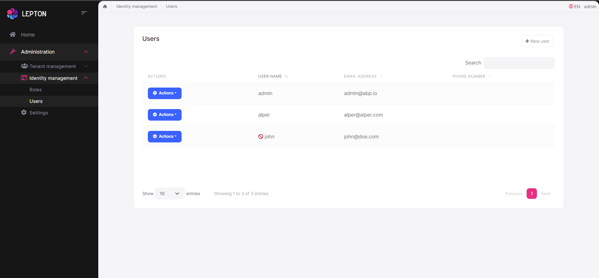

With this version, startup templates (`app` and `app-nolayers` templates) use the **LeptonX Lite** as the default theme. However, it's still possible to create a project with **Basic Theme** either using the **ABP CLI** or downloading the project via [*Get Started*](https://abp.io/get-started) page on the [abp.io](https://abp.io/) website.

#### via ABP CLI

To create a new project with **Basic Theme**, you can use the `--theme` option as below:

```bash
abp new Acme.BookStore --theme basic --preview
```

#### via Get Started page

Also, you can create a new project with **LeptonX Lite** or **Basic Theme** on *Get Started* page.

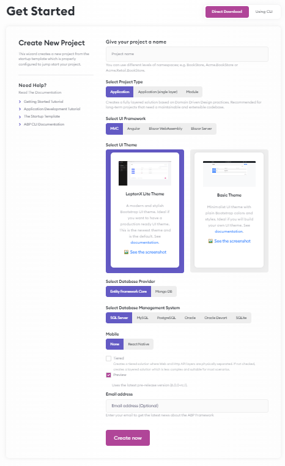

> The "Preview" checkbox should be checked to be able to see the theme selection section on the *Get Started* page.


### Optional PWA Support is Added to the Get Started Page

We've introduced the PWA (Progressive Web Application) support for the startup templates for Angular & Blazor WASM UIs in **v5.3**. In this version, we also added this PWA support to the [*Get Started*](https://abp.io/get-started) page on the [abp.io](https://abp.io/) website.

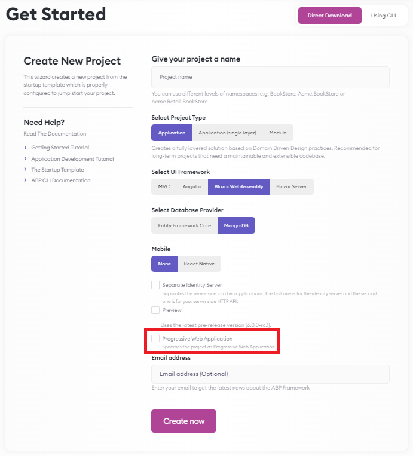

If you check the "Progressive Web Application" checkbox while creating an application, the all required configurations will be done for you and you will get the benefit of PWA features in your application.


### Introducing the **OpenIddict Module** and Switching to OpenIddict in the Startup Templates

We already [announced the plan of replacing the IdentityServer with OpenIddict](https://github.com/abpframework/abp/issues/11989). 

Therefore, we have created the `OpenIddict` module in this version and switched to **OpenIddict** in the startup templates. The ABP Framework uses this module to add **OAuth** features to the applications. We created documentation for the **OpenIddict Module**.

- You can see the following document to **learn about the OpenIddict Module**:
  [https://docs.abp.io/en/abp/6.0/Modules/OpenIddict](https://docs.abp.io/en/abp/6.0/Modules/OpenIddict)
- You can check out the following migration guide to learn **how to migrate to OpenIddict**:
  [https://docs.abp.io/en/abp/6.0/Migration-Guides/IdentityServer_To_OpenIddict](https://docs.abp.io/en/abp/6.0/Migration-Guides/IdentityServer_To_OpenIddict)


> We will continue to ship Identity Server packages for a while but in the long term, you may need to replace it, because Identity Server support ends at the end of 2022. Please see the [announcement]((https://github.com/abpframework/abp/issues/11989)) for more info.


### New .NET MAUI Startup Template

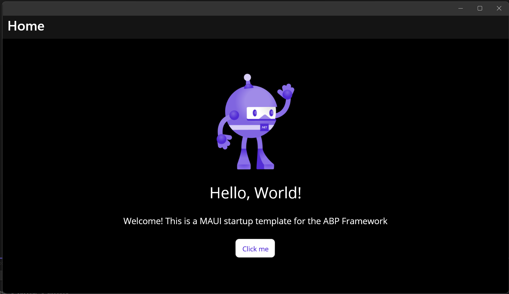

ABP Framework provides .NET MAUI startup templates with **v6.0.0**. You can create a new .NET MAUI project with the command below:

```bash
abp new Acme.BookStore -t maui
```


### Introducing the `ITransientCachedServiceProvider`

`ICachedServiceProvider` interface is used to resolve the cached services within a new scope. We created a new interface to resolve cached services **without creating scopes**. It's called `ITransientCachedServiceProvider`. The difference between `ICachedServiceProvider` and `ITransientCachedServiceProvider` is; `ITransientCachedServiceProvider` is transient. Check out [this issue](https://github.com/abpframework/abp/issues/12918) for more information.


### Introducing the dynamic layout components for Blazor UI

ABP Framework provides different ways of customizing the UI and one of them is to use [Layout Hooks](https://docs.abp.io/en/abp/latest/UI/AspNetCore/Layout-Hooks) in MVC. The **Layout Hook System** allows you to add code to some specific parts of the layout and all layouts of the themes provided by the ABP Framework implement these hooks.

However, Blazor UI doesn't have such a system yet and we are planning to implement [Layout Hooks for the Blazor UI](https://github.com/abpframework/abp/issues/6261) in version 7.0.

We are introducing the dynamic layout components for the Blazor UI to be able to add components to the Blazor layouts.

You can configure the `AbpDynamicLayoutComponentOptions` to render your components in the layout, as below:

```csharp
Configure<AbpDynamicLayoutComponentOptions>(options =>
{
    options.Components.Add(typeof(MyBlazorComponent), null);
});
```


### Improvements in ABP CLI

There are some enhancements in [ABP CLI](https://docs.abp.io/en/abp/6.0/CLI). You can see the brief list of some of these improvements below:

* You can list all available templates by using the `abp list-templates` command with v6.0. See [#13083](https://github.com/abpframework/abp/pull/13083).
* You can select the theme when creating a new project by specifying the `--theme` option. You can see the *LeptonX Lite Theme on the Startup Templates* section above for an example.
* `abp update` command has been updating the version of the main application until now. With v6.0.0, this command updates all package versions **inside all solutions in the sub-folders**. Checkout the issue [#12735](https://github.com/abpframework/abp/pull/12738) for more information.


### Introducing the `Volo.Abp.RemoteService` Package

A new `Volo.Abp.RemoteService` package has been added to the framework. Some of the classes that are related to the remote service configurations such as `AbpRemoteServiceOptions` class moved from `Volo.Abp.Http.Client` to this package. In this way, it became more reusable for further usages.


### Create/Update User Accounts For External Logins

If a user authenticates from an external provider like `Keycloak`, the user is being redirected to this external provider, and comes back to the main application. In this process, the user's data is not being saved in the main application's database. With this version, ABP saves the user information and lists in the users page. And this fixes permission management, user information mismatches and other issues. For more info, see [the related issue](https://github.com/abpframework/abp/issues/12203).


### Sending test email in the setting page for MVC and Blazor UIs

"Sending Test Email" feature is added to the [Setting Management](https://docs.abp.io/en/abp/6.0/Modules/Setting-Management) module, which allows checking the email settings are configured properly and sending emails successfully to the target email address. 

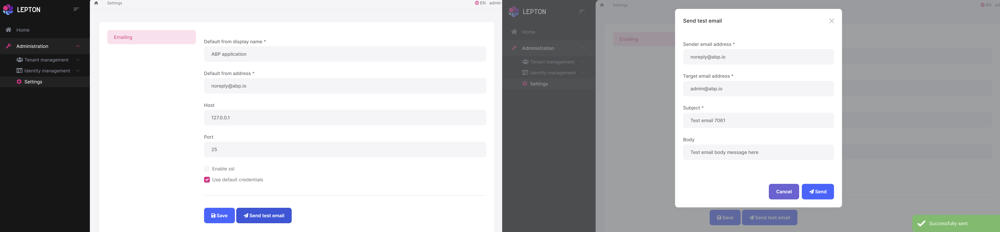

After configuring the email settings such as the target email address, you can click the "Send" button to send a test email to see if everything went well. 

> Note that this feature will be implemented for the Angular UI in the stable v6.0.


### Improvements on eShopOnAbp Project

The following improvements have been made on [eShopOnAbp project](https://github.com/abpframework/eShopOnAbp) with this version:

* Some improvements have been made on the Admin Application for Order Management for Angular UI. See [#110](https://github.com/abpframework/eShopOnAbp/pull/110).
* `SignalR` error on Kubernetes & Docker Compose has been fixed. See [#113](https://github.com/abpframework/eShopOnAbp/pull/113).
* eShopOnAbp project has been deployed to Azure Kubernetes Service. See [#114](https://github.com/abpframework/eShopOnAbp/pull/114). The live demo can be seen from [eshoponabp.com](https://eshoponabp.com/).
* Configurations have been made for some services on the `docker-compose.yml` file. See [#112](https://github.com/abpframework/eShopOnAbp/pull/112).
* Gateway Redirect Loop problem on Kubernetes has been fixed. See [the commit](https://github.com/abpframework/eShopOnAbp/commit/6413ef15c91cd8a5309050b63bb4dbca23587607).


### Other News 

* Autofac library has been upgraded to **v6.4.0**. Please see [#12816](https://github.com/abpframework/abp/pull/12816) for more info.
* Performance Improvements have been made in the **Settings Module** and tabs on the *Settings* page are lazy loading now.
* Some improvements have been made in the CMS Kit Module. You can see the improvements from [here](https://github.com/abpframework/abp/issues/11965).

If you want to see more details, you can check [the release on GitHub](https://github.com/abpframework/abp/releases/tag/6.0.0-rc.1), which contains a list of all the issues and pull requests closed in this version.


## What's New with ABP Commercial 6.0?


### LeptonX Theme is the Default Theme

With this version, the startup templates (`app-pro`, `app-nolayers-pro` and `microservice-pro` templates) use the **LeptonX Theme** as the default theme. However, it's still possible to create a new project with **Lepton Theme** or **Basic Theme**, either using the **ABP CLI** or **ABP Suite**.

#### via ABP CLI

To create a new project with **Lepton Theme** or **Basic Theme**, you can use the `--theme` option as below. For "Basic Theme" specify the theme name as `--theme basic`.

```bash
abp new Acme.BookStore --theme lepton --preview
```


#### via ABP Suite

Also, you can create a new project with **Lepton Theme** or **Basic Theme** from ABP Suite.

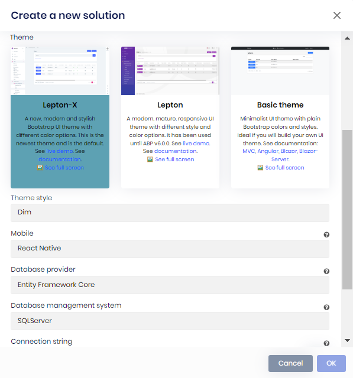

### Switching to OpenIddict in the Startup Templates

We have also switched to the **OpenIddict** for the startup templates for ABP Commercial as explained above.


### New .NET MAUI Mobile 

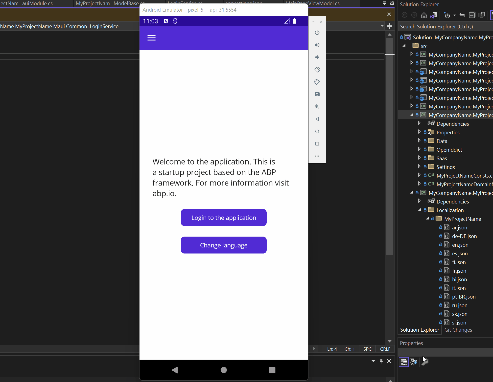

ABP Commercial has been providing a [React Native](https://docs.abp.io/en/commercial/latest/getting-started-react-native) mobile app since with the very early versions. Alternative to this application, we created a new .NET MAUI mobile app. To create a new `app-pro` ABP project with the .NET MAUI mobile app, you can use the command below:

```bash
abp new Acme.BookStore -t app-pro --mobile maui
```

>  Note that, when Microsoft supports `WebAuthenticator` on Windows, we'll also support it to work on Windows OS.


### GDPR: Cookie Consent

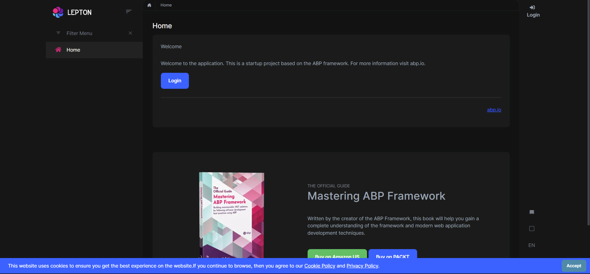

With this version, the **Cookie Consent** feature has been added to the **GDPR** module. It's enabled by default for the new startup templates. There are two pages in the templates: "Cookie Policy" page and "Privacy Policy" page. 

If you want to disable/hide the "Cookie Consent", you can simply open the startup project module class and set the `IsEnabled` property as **false** for the **AddAbpCookieConsent** method as below:

```csharp
context.Services.AddAbpCookieConsent(options =>
{
    options.IsEnabled = false; //disabled    
    options.CookiePolicyUrl = "/CookiePolicy";
    options.PrivacyPolicyUrl = "/PrivacyPolicy";
});
```

> These pages are used to build up the cookie consent text and you can change the content or url of these pages by your needs.

If you want to use the Cookie Consent feature of the GDPR module in your existing project, please see the [GDPR Module](https://docs.abp.io/en/commercial/6.0/modules/gdpr) documentation for configurations.

### Improvements/Developments on CMS Kit Poll

Some improvements have been made on the Poll System of CMS Kit module as listed below:

* The Widget rendering and Admin side for the Blazor UI improvements.
* A Widget can be picked from the editor as seen in the image below.

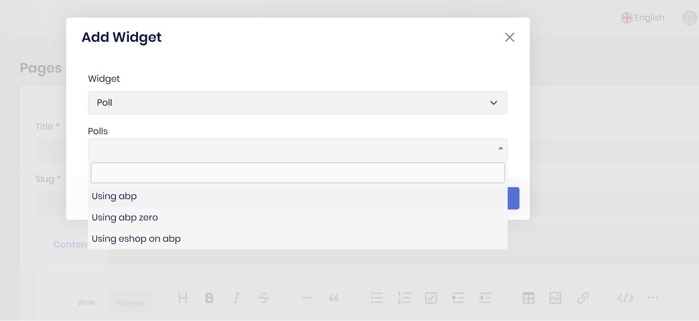


### Blazor UI for the Chat Module

Chat Module is now also available for the Blazor UI after the MVC and Angular UIs. You can read the [Chat Module](https://docs.abp.io/en/commercial/6.0/modules/chat) documentation to get the overall knowledge about the module and add to your application.

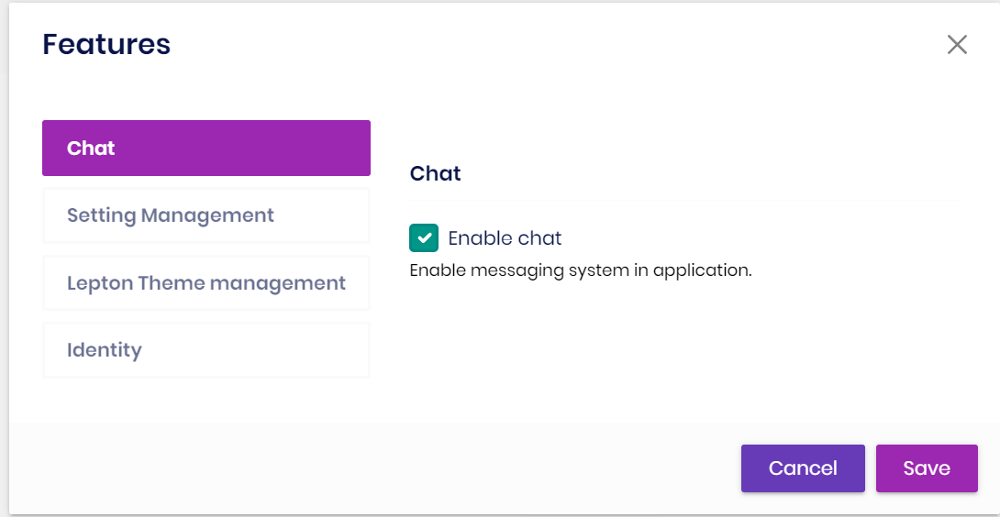
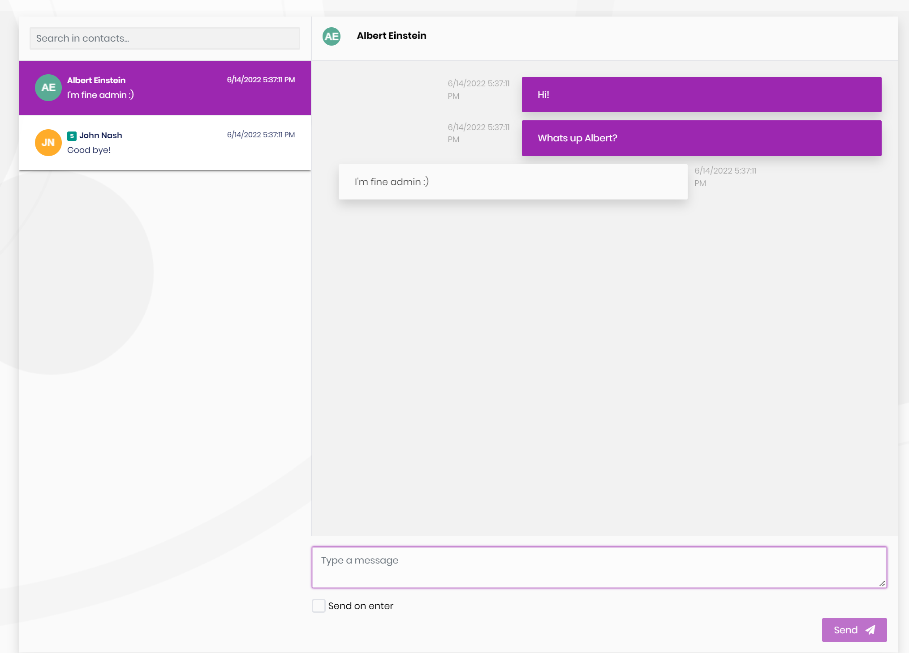


### Blazor Admin UI for CMS Kit Module

All admin side **CMS Kit** and **CMS Kit Pro** features have been implemented for the Blazor UI. Blazor UI will only be available to ABP Commercial customers.

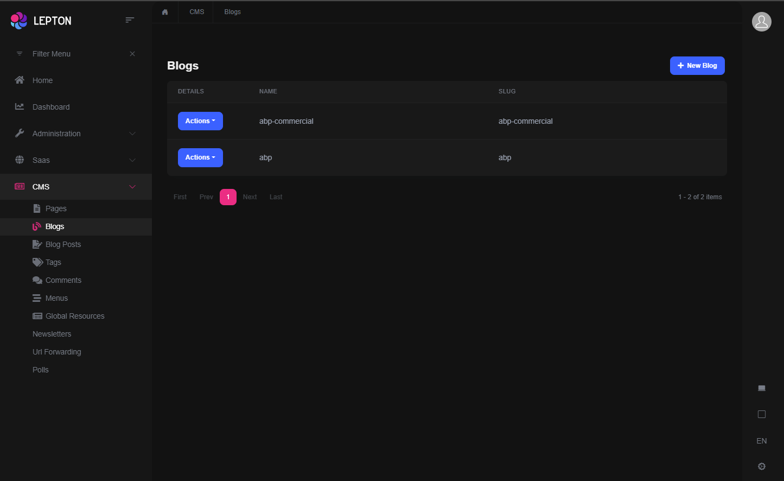

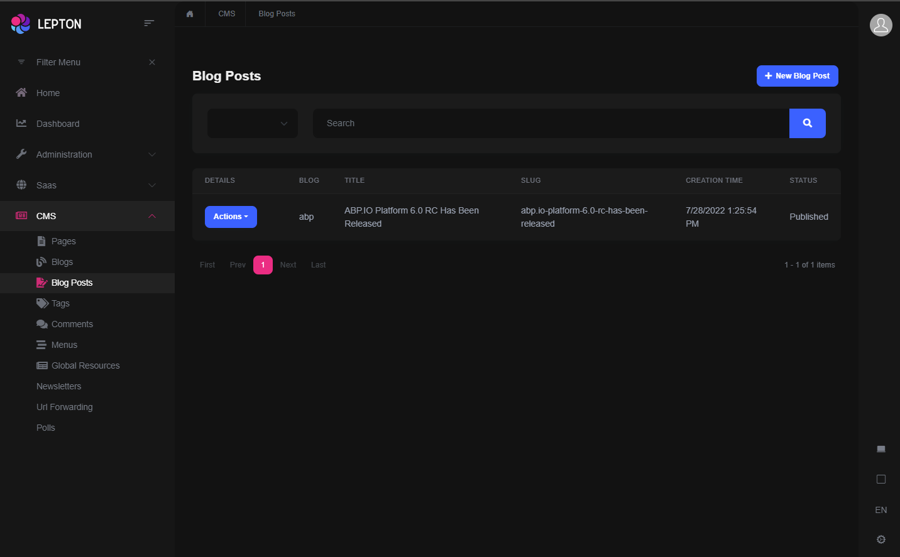


### Suite: Excel Export

With v6.0, now it's possible to export the records as Excel for Blazor & MVC UIs. Angular UI is still in-progress, and we will implement it with the stable v6.0 release. Check the "Excel export" checkbox to add this feature.

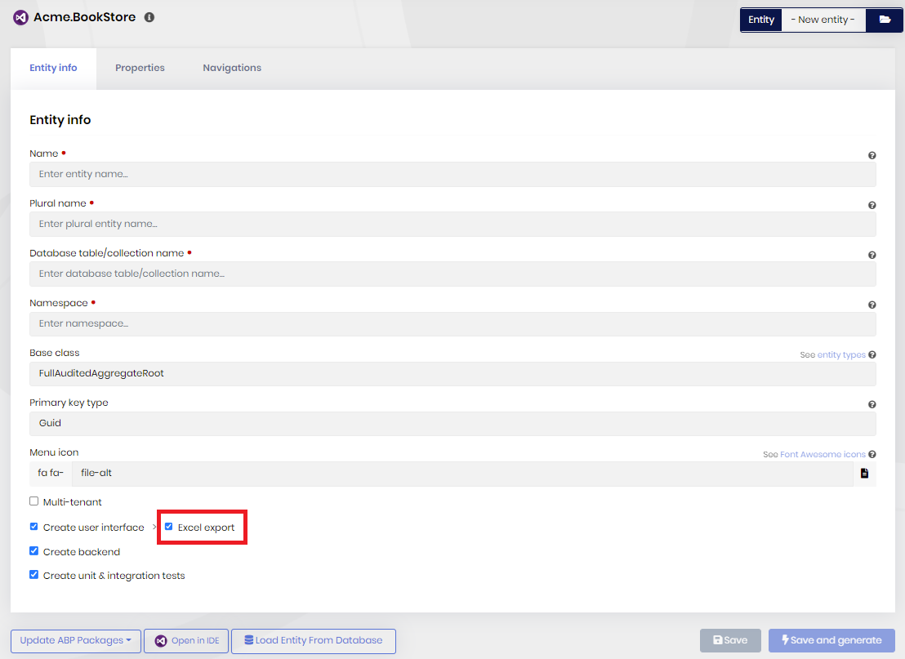


A new Excel Export button is being located at the top of the generated page as seen below:

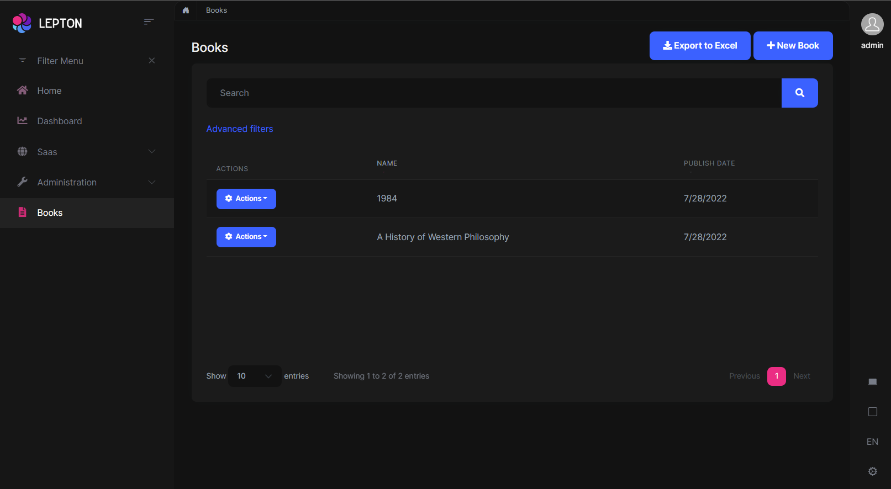

Then, you can download the records as `.xlsx` format by clicking the "Excel Export" button. Note that the exported Excel list is the filtered list. 


### ABP Suite: Optional PWA Support

With this version, it's possible to add the [PWA (Progressive Web App)](https://web.dev/progressive-web-apps/?gclid=Cj0KCQjwxIOXBhCrARIsAL1QFCY0IB-W5k-lsXmRCbm00sl4nyBIYynAX3IdJkjyizyNUjuCE8zeu24aApxtEALw_wcB) support for Blazor & Angular UIs while creating the application via Suite. 

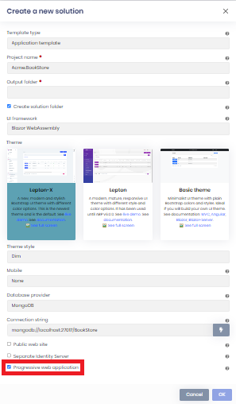

You just need to check the "Progressive web application" checkbox, when creating a new application. Then, ABP Suite will add the PWA support to your application. When you publish your application, you get the full benefits of PWA features such as offline support.


### Other News

#### Explainer Videos

We are creating explainer videos for the ABP Commercial Modules to provide an overview. Within this milestone, we've created four new explainer videos:

* [Audit Logging Module](https://www.youtube.com/watch?v=NzSuFBpqfsc)
* [Identity Module](https://www.youtube.com/watch?v=W87jA_GBE54)
* [SaaS Module](https://www.youtube.com/watch?v=xXlaaXP6qqQ)
* [Forms Module](https://www.youtube.com/watch?v=MousWEPfrA8)

You can subscribe to [Volosoft's YouTube channel](https://www.youtube.com/channel/UCO3XKlpvq8CA5MQNVS6b3dQ) to be informed about the future ABP events and videos.


### Trial License is now available!

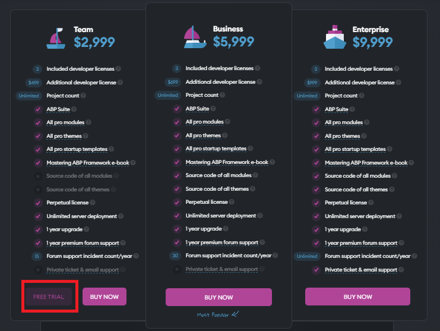

If you are considering purchasing a new ABP Commercial license, and you want to see ABP in action then, check out https://commercial.abp.io/pricing and click FREE TRIAL button.


## Community News

### New ABP Community Posts

* [Alper Ebicoglu](https://twitter.com/alperebicoglu) has created a new community article to give a full overview of .NET MAUI. You can read it [here](https://community.abp.io/posts/all-about-.net-maui-gb4gkdg5).
* [Anto Subash](https://twitter.com/antosubash) has created a new video content to show "State Management in Blazor with Fluxor". You can read it [here](https://community.abp.io/posts/blazor-state-management-with-fluxor-raskpv19).
* [Learn ABP Framework](https://community.abp.io/members/learnabp) has also created a new video content to show "How to install LeptonX Lite Theme for ABP Framework 5.3 MVC UI". You can read it [here](https://community.abp.io/posts/how-to-install-leptonx-lite-theme-on-abp-framework-5.3-mvc-ui-epzng137).
* [Kirti Kulkarni](https://twitter.com/kirtimkulkarni) has created three new community articles. You can use the links below to read the articles:
    * [Integrating the file management module with ABP Commercial application](https://community.abp.io/posts/integrating-the-file-management-module-with-abp-commercial-application-qd6v4dsr)
    * [Work with PDF's in ABP Commercial Project using PDFTron](https://community.abp.io/posts/work-with-pdfs-in-abp-commercial-project-using-pdftron-tjw0hlgu)
    * [Create a custom login page in ABP Commercial Angular app](https://community.abp.io/posts/create-a-custom-login-page-in-abp-commercial-angular-app-r2huidx7)
* [Don Boutwell](https://community.abp.io/members/dboutwell) has created his first ABP Community article. You can read it from [here](https://community.abp.io/posts/password-required-redis-with-abp-framework-and-docker-94old5rm).


### Volosoft Has Attended the DNF Summit 2022

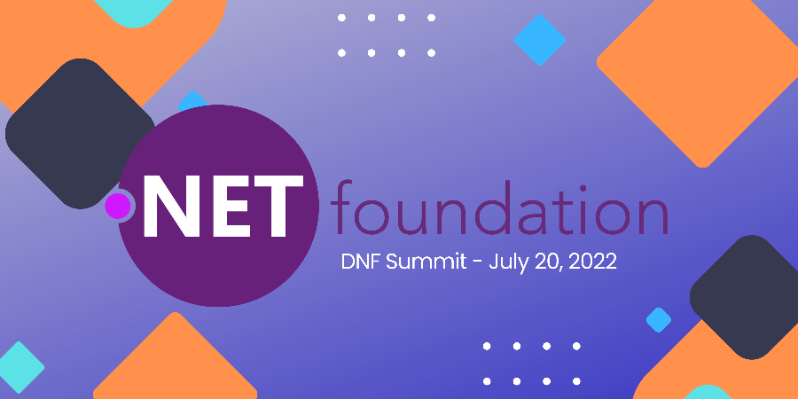

Core team members of ABP Framework, [Halil Ibrahim Kalkan](https://twitter.com/hibrahimkalkan) and [Alper Ebicoglu](https://twitter.com/alperebicoglu) have attended the [DNF Summit](https://t.co/ngWnBLiAn5) on the 20th of July.  Halil Ibrahim Kalkan talked about the creation of the ABP Framework and Alper Ebicoglu showed how easy to create a project with ABP Framework within 15 minutes. 

Watch DNF Summit session 👉 https://www.youtube.com/embed/VL0ewZ-0ruo

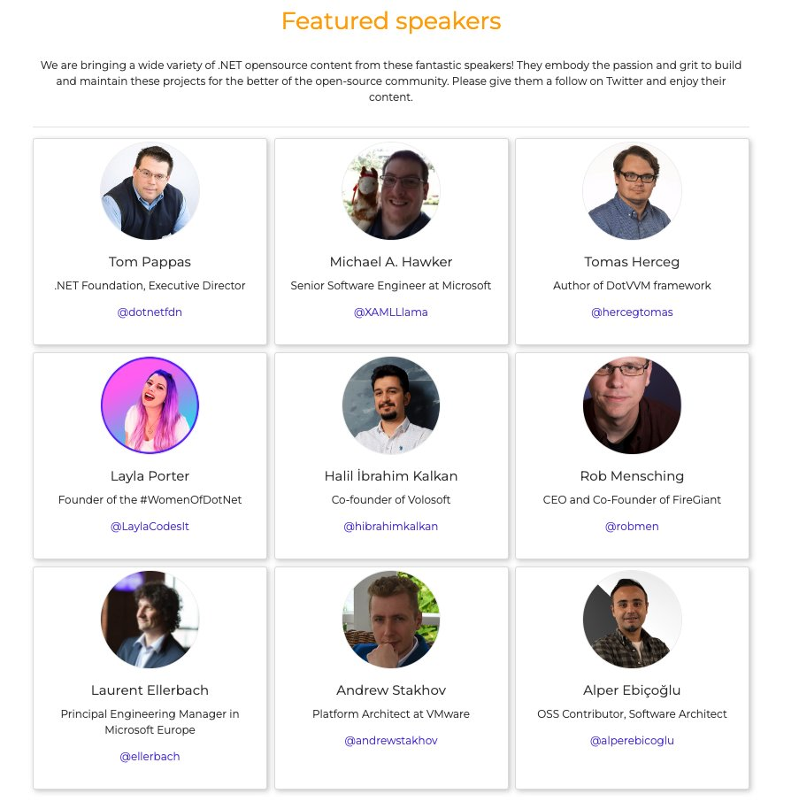


## Conclusion 

This version comes with some features and enhancements to the existing features. You can see the [Road Map](https://docs.abp.io/en/abp/6.0/Road-Map) documentation to learn about the release schedule and planned features for the next releases. The planned release date for the [6.0.0 Stable](https://github.com/abpframework/abp/milestone/71) version is September 06, 2022. Please try the ABP v6.0 RC and provide feedback to us. 

Thanks for being a part of this community!