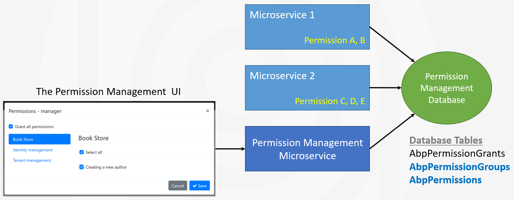
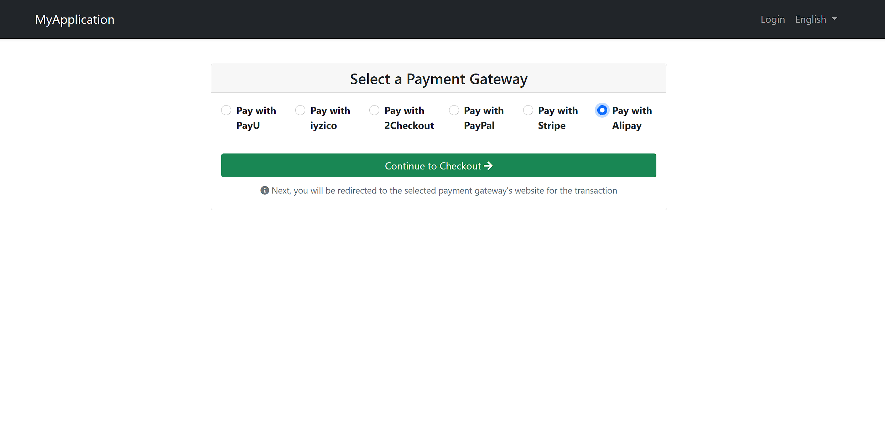
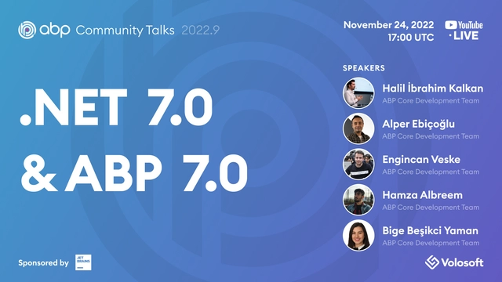

# ABP.IO Platform 7.0 RC Has Been Released

Today, we are happy to release the [ABP Framework](https://abp.io/) and [ABP Commercial](https://commercial.abp.io/) version **7.0 RC** (Release Candidate). This blog post introduces the new features and important changes in this new version.

Try this version and provide feedback for a more stable version of ABP v7.0! Thanks to all of you.

## Get Started with the 7.0 RC

Follow the steps below to try version 7.0.0 RC today:

1) **Upgrade** the ABP CLI to version `7.0.0-rc.2` using a command line terminal:

````bash
dotnet tool update Volo.Abp.Cli -g --version 7.0.0-rc.2
````

**or install** it if you haven't before:

````bash
dotnet tool install Volo.Abp.Cli -g --version 7.0.0-rc.2
````

2) Create a **new application** with the `--preview` option:

````bash
abp new BookStore --preview
````

See the [ABP CLI documentation](https://docs.abp.io/en/abp/latest/CLI) for all the available options.

> You can also use the [Get Started](https://abp.io/get-started) page to generate a CLI command for creating a new application.

You can use any IDE that supports .NET 7.x, like [Visual Studio 2022](https://visualstudio.microsoft.com/downloads/).

## Migration Guides

There are breaking changes in this version that may affect your application. 
Please see the following migration documents, if you are upgrading from v6.x:

* [ABP Framework 6.x to 7.0 Migration Guide](https://docs.abp.io/en/abp/7.0/Migration-Guides/Abp-7_0)
* [ABP Commercial 6.x to 7.0 Migration Guide](https://docs.abp.io/en/commercial/7.0/migration-guides/v7_0)

## What's New with ABP Framework 7.0?

In this section, I will introduce some major features released in this version. Here is a brief list of titles explained in the next sections:

* Upgraded to .NET 7.0
* Upgraded to OpenIddict 4.0
* Dapr Integration
* Integration Services
* Dynamic Permissions and Features
* External Localization Infrastructure
* Distributed Entity Cache Service
* Layout Hooks for the Blazor UI
* Improvements on the eShopOnAbp project

### Upgraded to .NET 7.0

We've upgraded the ABP Framework to .NET 7.0, so you need to move your solutions to .NET 7.0 if you want to use ABP 7.0.

> You can check the [Migrate from ASP.NET Core 6.0 to 7.0](https://learn.microsoft.com/en-us/aspnet/core/migration/60-70?view=aspnetcore-7.0) documentation. Also, there is an ABP Community article that shows how to upgrade an existing project to .NET 7.0. You can check it from 👉 [here](https://community.abp.io/posts/upgrade-your-existing-projects-to-.net7-nmx6vm9m).

### Upgraded to OpenIddict 4.0

OpenIddict 4.0 preview has been released on June 22. So, we decided to upgrade the OpenIddict packages to 4.0-preview in ABP 7.0.

Once the final release of OpenIddict 4.0 is published, we will immediately upgrade it to the stable version and we plan to make ABP 7.0 final use the stable version of OpenIddict 4.0.

> You can read the "[OpenIddict 4.0 preview1 is out](https://kevinchalet.com/2022/06/22/openiddict-4-0-preview1-is-out/)" post to learn what's new with OpenIddict 4.0.

### Dapr Integration

[Dapr (Distributed Application Runtime)](https://dapr.io/) provides APIs that simplify microservice connectivity.

ABP and Dapr have some intersecting features like service-to-service communication, distributed message bus and distributed locking. However, the purposes of ABP and Dapr are different. ABP's goal is to provide an end-to-end developer experience with an opinionated architecture. On the other hand, Dapr's purpose is to provide a runtime to decouple common microservice communication patterns from your application logic.

ABP 7.0 offers some packages to provide better integration with Dapper. I will cover some important integration notes below but if you want to get a full overview of ABP Dapr Integration please see the [ABP Dapr Integration documentation](https://docs.abp.io/en/abp/7.0/Dapr/Index).

#### Distributed Event Bus Integration

ABP's [Distributed Event Bus System](https://docs.abp.io/en/abp/7.0/Distributed-Event-Bus) provides a convenient abstraction to allow applications to communicate asynchronously via events. 

The new [Volo.Abp.EventBus.Dapr](https://www.nuget.org/packages/Volo.Abp.EventBus.Dapr) and [Volo.Abp.AspNetCore.Mvc.Dapr.EventBus](https://www.nuget.org/packages/Volo.Abp.AspNetCore.Mvc.Dapr.EventBus) packages make it possible to use the Dapr infrastructure with the ABP's standard distributed event bus abstractions. The **Volo.Abp.EventBus.Dapr** package is used to publish events and the **Volo.Abp.AspNetCore.Mvc.Dapr.EventBus** package is used to subscribe to events.

> See [the documentation](https://docs.abp.io/en/abp/7.0/Dapr/Index#distributed-event-bus-integration) to learn more.

#### C# API Client Proxies Integration

ABP can [dynamically](https://docs.abp.io/en/abp/7.0/API/Dynamic-CSharp-API-Clients) or [statically](https://docs.abp.io/en/abp/7.0/API/Static-CSharp-API-Clients) generate proxy classes to invoke your HTTP APIs from a Dotnet client application. 

The [Volo.Abp.Http.Client.Dapr](https://www.nuget.org/packages/Volo.Abp.Http.Client.Dapr) package configures the client-side proxy system, so it uses Dapr's service invocation building block for the communication between your applications.

> See [the documentation](https://docs.abp.io/en/abp/7.0/Dapr/Index#c-api-client-proxies-integration) to learn more.

#### Distributed Lock

ABP provides a [Distributed Locking](https://docs.abp.io/en/abp/7.0/Distributed-Locking) abstraction to control access to a resource that's shared by multiple applications. Dapr also has a [distributed lock building block](https://docs.dapr.io/developing-applications/building-blocks/distributed-lock/). 

The [Volo.Abp.DistributedLocking.Dapr](https://www.nuget.org/packages/Volo.Abp.DistributedLocking.Dapr) package makes ABP use Dapr's distributed locking system.

> See [the documentation](https://docs.abp.io/en/abp/7.0/Dapr/Index#distributed-lock) to learn more.

### Integration Services

Integration services [was an idea](https://github.com/abpframework/abp/issues/12470) to distinguish the application services that are built for inter-module (or inter-microservice) communication from the application services that are intended to be consumed from a user interface or a client application.

With ABP 7.0, now it is possible to mark an application service as an integration service using the `[IntegrationService]` attribute (that is defined in the `Volo.Abp.Application.Services` namespace). Example:

````csharp
[IntegrationService]
public class ProductAppService : ApplicationService, IProductAppService
{
    // ...
}
````

If your application service has an interface, like `IProductService`, you can use it on the service interface:

````csharp
[IntegrationService]
public interface IProductAppService : IApplicationService
{
    // ...
}
````

When you do that ABP takes the following actions by conventions:

* If you use the [Auto API Controllers](https://docs.abp.io/en/abp/latest/API/Auto-API-Controllers) feature, the URL prefix will be `/integration-api/` instead of `/api/`. In this way, for example, you can prevent REST API calls to your integration services out of your API Gateway, in a microservice system, and don't authorize these services.  You can also filter integration services (or non-integration services) while creating Auto API Controllers, using the `ApplicationServiceTypes` option of the `ConventionalControllerSetting` object.
* Calls made to integration services are not audit logged by default, because they are intended to be used by other services. You can set `IsEnabledForIntegrationServices` to `true` in `AbpAuditingOptions` [options class](https://docs.abp.io/en/abp/latest/Options) to enable audit logging for the integration services too.

### Dynamic Permissions and Features

In ABP Framework, [permissions](https://docs.abp.io/en/abp/latest/Authorization) and [features](https://docs.abp.io/en/abp/latest/Features) are defined in the codebase of your application. Because of that design, it was hard to define permissions (and features) in different microservices and centrally manage all the permissions (and features) in a single admin application. To make that possible, we were adding project references for all the microservices' service contract packages from a single microservice, so it can know all the permissions (and features) and manage them. As a result, that permission manager microservice needs to be re-deployed whenever a microservice's permissions change.

With ABP 7.0, we've introduced the [dynamic permissions](https://github.com/abpframework/abp/pull/13644) and [dynamic features](https://github.com/abpframework/abp/pull/13881) systems. See the following figure:



Here, Microservice 1 defines the permissions A and B, Microservice 2 defines the permissions C, D, E. The Permission Management microservice is used by the permission management UI and manages all the permissions of a user in the application.

Basically, in the solution with ABP 7.0, all microservices serialize their own permission definitions and write them into a shared database on their application startup (with a highly optimized algorithm). On the other hand, the permission management service can dynamically get these permission definitions from the database (it is also highly optimized to reduce database usage) and allow the UI to show and manage them for a user or role.

We will update the authorization and features documentation in next days to state the configuration, while it mostly works automatically.

> If you want to know why we made all these decisions and what problems we've solved, you can watch Halil İbrahim Kalkan's "[Authorization in a Distributed / Microservice System](https://www.youtube.com/watch?v=DVqvRZ0w-7g)" talk in .NET Conf 2022.

### External Localization Infrastructure

Localization was another problem in a microservice system, when each microservice try to define its own localization texts and you build a unified UI application.

The PR [#13845](https://github.com/abpframework/abp/pull/13845) described what's done in details. Basically, you need to implement `IExternalLocalizationStore ` to get localizations of other services. However, since the open-source ABP Framework doesn't provide a module for dynamic localization, we haven't implemented that out of the box. We may implement it for open-source if we get a considerable request from the community (you can upvote [#13953](https://github.com/abpframework/abp/issues/13953)).

We've implemented the external localization system in ABP Commercial's [Language Management module](https://commercial.abp.io/modules/Volo.LanguageManagement) and also applied it in the [microservice startup template](https://commercial.abp.io/startup-templates/microservice). See the ABP Commercial part of this blog post to know more.

### Distributed Entity Cache Service

ABP introduces a distributed entity cache service with v7.0. 

Assume that you have a `Product` entity (an [aggregate root](https://docs.abp.io/en/abp/latest/Entities) actually):

````csharp
public class Product : AggregateRoot<Guid>
{
    public string Name { get; set; }
    public string Description { get; set; }
    public float Price { get; set; }
    public int StockCount { get; set; }
}
````

And you want to use caching for faster access to the products. You first should configure the [dependency injection](https://docs.abp.io/en/abp/latest/Dependency-Injection) to register the `IEntityCache` service, in the `ConfigureServices` method of your [module class](https://docs.abp.io/en/abp/latest/Module-Development-Basics):

````csharp
context.Services.AddEntityCache<Product, Guid>();
````

Now, you can inject the `IEntityCache<Product, Guid>` service whenever you need:

````csharp
public class ProductAppService : ApplicationService
{
    private readonly IEntityCache<Product, Guid> _productCache;

    public ProductAppService(IEntityCache<Product, Guid> productCache)
    {
        _productCache = productCache;
    }

    public async Task<ProductDto> GetAsync(Guid id)
    {
        var product = await _productCache.GetAsync(id);
        return ObjectMapper.Map<Product, ProductDto>(product);
    }
}
````

*In this example, I assume that the [object mapping](https://docs.abp.io/en/abp/latest/Object-To-Object-Mapping) is configured to map from `Product` to `ProductDto`.*

Here, We've directly cached the `Product` objects. In that case, the `Product` class must be serializable (because it is serialized to JSON when saving in the [distributed cache](https://docs.abp.io/en/abp/latest/Caching)). That may not be possible in some scenarios and you may want to use another class to store the cache data. For example, we may want to use the `ProductDto` class instead of the `Product` class for the cache object. In this case, change the dependency injection configuration as below:

````csharp
context.Services.AddEntityCache<Product, ProductDto, Guid>();
````

Then inject the `IEntityCache<ProductDto, Guid>` service instead of the `IEntityCache<Product, Guid>` service.

You can configure the cache duration by passing a `DistributedCacheEntryOptions` object to the `AddEntityCache` method:

````csharp
context.Services.AddEntityCache<Product, ProductDto, Guid>(
    new DistributedCacheEntryOptions
    {
        SlidingExpiration = TimeSpan.FromMinutes(30)
    }
);
````

Default cache duration is 2 minutes with the `AbsoluteExpirationRelativeToNow` configuration.

> Check [this PR](https://github.com/abpframework/abp/pull/14055) to see the implementation and additional notes.

### Layout Hooks for Blazor UI

The **Layout Hook System** allows you to add code to some specific parts of the layout and all layouts of the themes provided by the ABP Framework implement these hooks. 

This system was already implemented for MVC UI but not for Blazor UI. We announced in the previous blog post ([ABP 6.0 Release Candidate blog post](https://blog.abp.io/abp/ABP.IO-Platform-6.0-RC-Has-Been-Published)) that we were planning to implement it in version 7.0. And now, we are introducing the Layout Hook System for Blazor UI as planned within this version. 

> You can read the [Blazor UI: Layout Hooks](https://docs.abp.io/en/abp/7.0/UI/Blazor/Layout-Hooks) documentation if you want to use the Layout Hooks in your Blazor application and see the required configurations.

### Improvements on eShopOnAbp

The following improvements have been made on the [eShopOnAbp project](https://github.com/abpframework/eShopOnAbp) within this version:

* We've integrated [Keycloak](https://www.keycloak.org/) (an open-source identity and access management system) as the authentication server instead of the built-in authentication server (that was based on IdentityServer). See [#12021](https://github.com/abpframework/abp/issues/12021) for more information.
* The product detail page now uses CMS Kit's [Rating](https://docs.abp.io/en/abp/latest/Modules/Cms-Kit/Ratings) and [Comment](https://docs.abp.io/en/abp/latest/Modules/Cms-Kit/Comments) features. See [#11429](https://github.com/abpframework/abp/issues/11429) for more info.

### Other News

* ABP 7.0 introduces the `AbpDistributedLockOptions` for the main options class to configure the distributed locking. You can specify any name as the lock prefix by configuring the `AbpDistributedLockOptions`. See the [documentation](https://docs.abp.io/en/abp/7.0/Distributed-Locking#abpdistributedlockoptions) for more.

## What's New with ABP Commercial 7.0?

We've also worked on [ABP Commercial](https://commercial.abp.io/) to align the features and changes made in the ABP Framework. The following sections introduce a few new features coming with ABP Commercial 7.0.

### Microservice Solution Architectural Improvements

We've worked on the [microservice startup solution](https://commercial.abp.io/startup-templates/microservice) to make it proper for more advanced scenarios and better service independencies. As a result, all the services are made independently deployable and flexible to define its own permissions, features and localization texts.

For the permissions and features part, we've applied ABP's new dynamic permission and feature systems that are explained above. For the localization texts, we'd implemented ABP's new external localization infrastructure (that was also explained above) in the [Language Management Module](https://commercial.abp.io/modules/Volo.LanguageManagement).

If you want to build a new microservice solution with ABP 7.0, all these are pre-configured for you. Just create a new solution and focus on your own business code! You can also migrate your existing microservice solutions to take advantage of these new enhancements. You can follow [this guide](https://docs.abp.io/en/abp/latest/Migration-Guides/Upgrading-Startup-Template) as a good way to see the changes you need to apply in your solutions.

### Set the Tenant Admin's Password from Host


ABP Commercial's [SaaS module](https://commercial.abp.io/modules/Volo.Saas) now allows setting the tenant admin's password from the host side. You can set a new password to any tenant admin's password from the Tenants page if you are a host user of the system.

### WeChat and Alipay Integrations for the Payment Module



In this version, WeChat Pay and Alipay gateways have been added to the payment module. You can read the [Payment Module documentation](https://docs.abp.io/en/commercial/7.0/modules/payment#alipayoptions) for configurations and more information.

### Others

* [CMS Kit (Pro) Module](https://commercial.abp.io/modules/Volo.CmsKit.Pro): Contact Feature allows multiple (named) contact forms with this version. Now, you can add different contact forms on different pages (with different settings).
* [Saas Module](https://commercial.abp.io/modules/Volo.Saas): Allows host users to test the connection string of a tenant database on the UI.
* [Chat Module](https://commercial.abp.io/modules/Volo.Chat): Introduces permission for searching other users.


## Community News

### New ABP Community Posts

* [gdlcf88](https://github.com/gdlcf88) has created two new community articles:
    * [Use Stepping To Perform Atomic Multi-Step Operations](https://community.abp.io/posts/use-stepping-to-perform-atomic-multistep-operations-4kqu8ewp)
    * [Notice and Solve ABP Distributed Events Disordering](https://community.abp.io/posts/notice-and-solve-abp-distributed-events-disordering-yi9vq3p4)
* [GDUnit](https://community.abp.io/members/GDUnit) has created his first ABP community article that shows multi-tenant subdomain resolution in Blazor applications. You can read it 👉 [here](https://community.abp.io/posts/abp-blazor-multitenant-subdomain-resolution-c1x4un8x).
* [EngincanV](https://twitter.com/EngincanVeske) has created two new community articles: 
    * [Testing in ABP Framework (with examples)](https://community.abp.io/posts/testing-in-abp-framework-with-examples-3w29v6ce)
    * [What's new with .NET 7?](https://community.abp.io/posts/whats-new-with-.net-7-tlq2g43w)
* [Alper Ebicoglu](https://twitter.com/alperebicoglu) has created a new community article to show "How to upgrade an existing project to .NET7". You can read it 👉 [here](https://community.abp.io/posts/upgrade-your-existing-projects-to-.net7-nmx6vm9m).
* [Kirti Kulkarni](https://community.abp.io/members/kirtik) has created a new community article to show "How to integrate and enable the Chat Module in an ABP Commercial application". You can read it 👉 [here](https://community.abp.io/posts/integrating-and-enabling-the-chat-module-in-abp-commercial-vsci3ov2).
* [maliming](https://github.com/maliming) has created a new community article to show "how to add custom grant type in OpenIddict". You can read it 👉 [here](https://community.abp.io/posts/how-to-add-a-custom-grant-type-in-openiddict.-6v0df94z).

We thank you all. We thank all the authors for contributing to the [ABP Community platform](https://community.abp.io/).

### We were in the .NET Conf 2022


Microsoft has released .NET 7.0 and celebrated it with a 3-days international online conference. Halil İbrahim Kalkan, the lead developer of ABP Framework attended [.NET Conf 2022](https://www.dotnetconf.net/) on November 10, 2022. His topic was "Authorization in a Distributed / Microservice System". In this talk, he talked about permission-based authorization systems and their challenges in a distributed system. Then, gave solutions that are implemented in the open source ABP Framework.

You can watch his speech from 👉 [here](https://www.youtube.com/watch?v=DVqvRZ0w-7g).

### Community Talks 2022.9: .NET 7.0 & ABP 7.0



In this episode of ABP Community Talks, 2022.9; we'll talk about .NET 7.0 and ABP 7.0 with the ABP Core Team. We will dive into the features that came with .NET 7.0, how they are implemented in ABP 7.0, and the highlights in the .NET Conf 2022 with [Halil İbrahim Kalkan](https://github.com/hikalkan), [Alper Ebicoglu](https://github.com/ebicoglu), [Engincan Veske](https://github.com/EngincanV), [Hamza Albreem](https://github.com/braim23) and [Bige Besikci Yaman](https://github.com/bigebesikci). 

> Register to listen and ask your questions now 👉 https://kommunity.com/volosoft/events/abp-community-20229-net-70-abp-70-f9e8fb72 .

## Conclusion 

This version comes with some new features and a lot of enhancements to the existing features. You can see the [Road Map](https://docs.abp.io/en/abp/7.0/Road-Map) documentation to learn about the release schedule and planned features for the next releases. Please try the ABP v7.0 RC and provide feedback to help us release a more stable version.

Thanks for being a part of this community!
